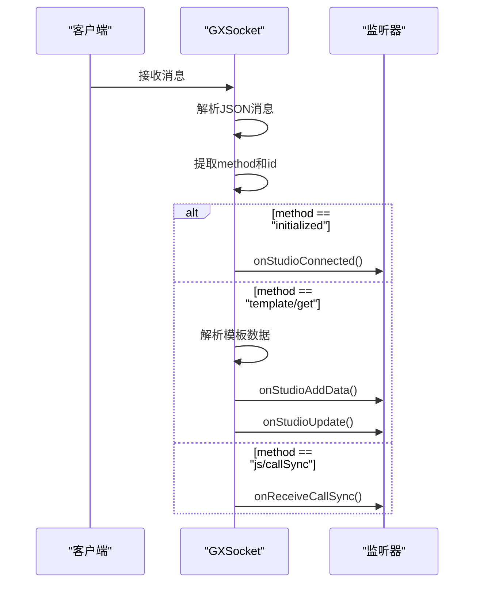
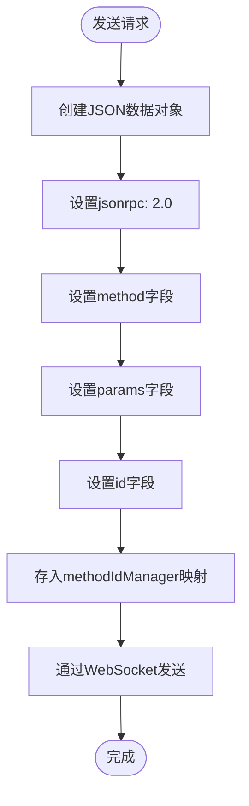
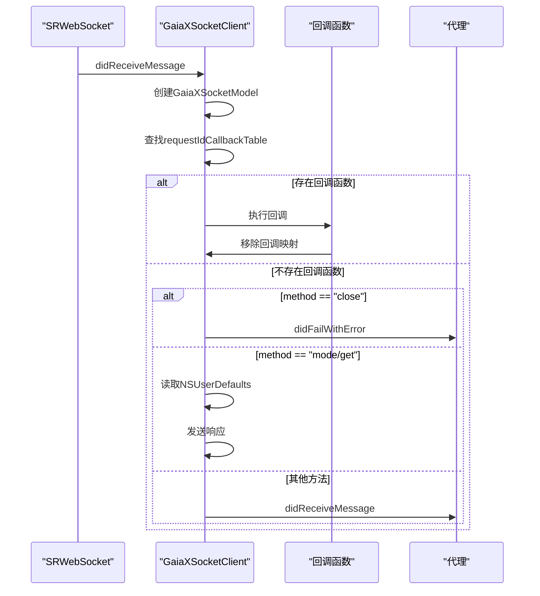
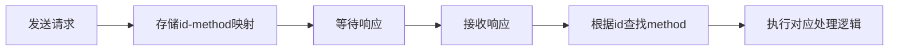
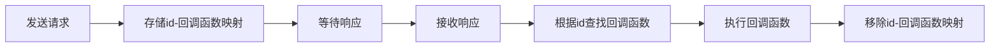
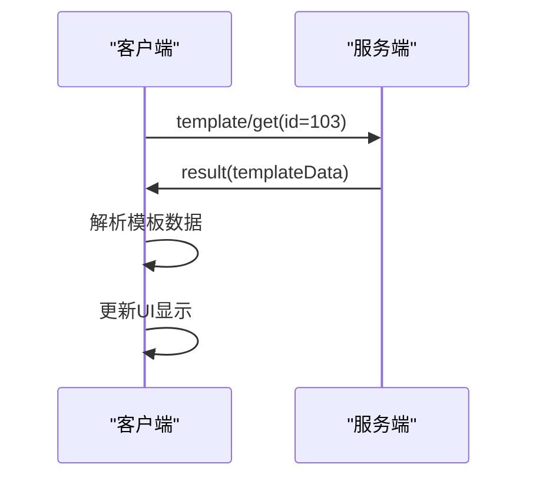
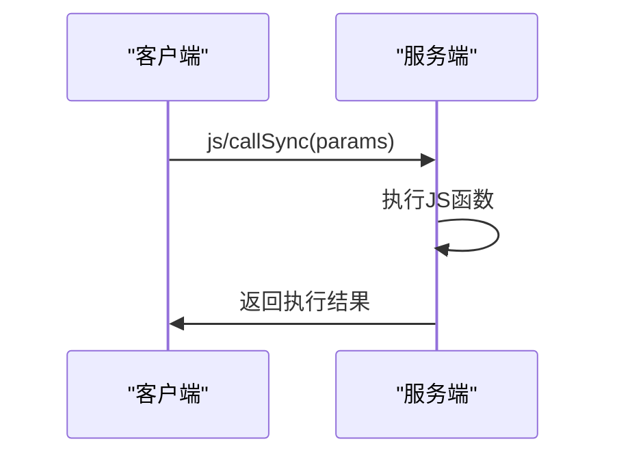
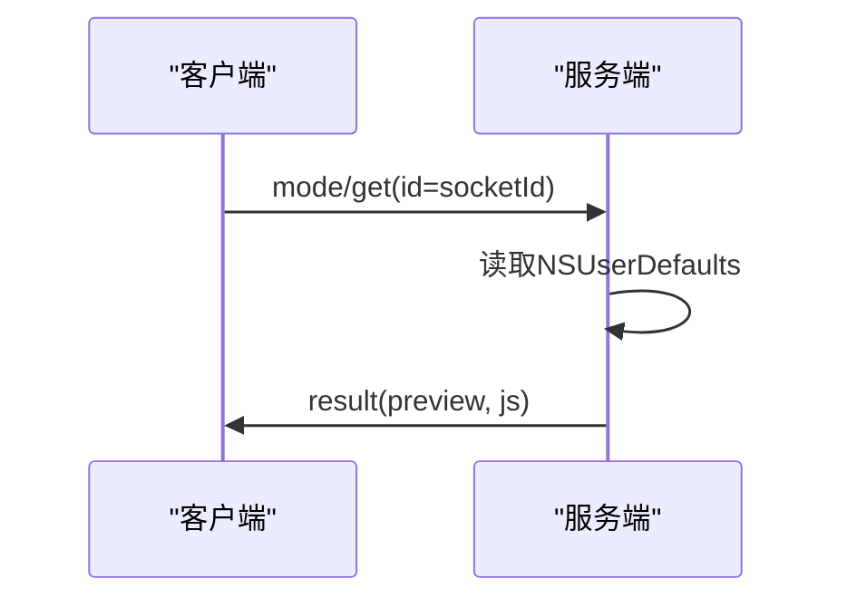
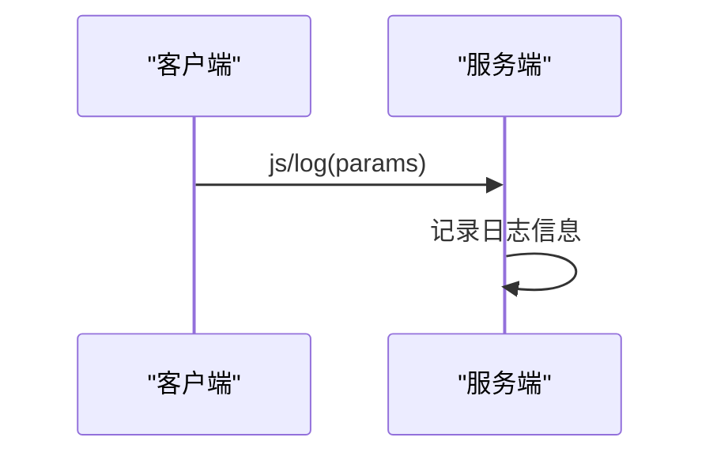

# 协议实现

<cite>
**本文档中引用的文件**  
- [GXSocket.kt](file://GaiaXAndroidClientToStudio/src/main/java/com/alibaba/gaiax/studio/GXSocket.kt)
- [GXSocketKey.kt](file://GaiaXAndroidClientToStudio/src/main/java/com/alibaba/gaiax/studio/GXSocketKey.kt)
- [GaiaXSocketClient.m](file://GaiaXSocketiOS/GaiaXSocket/GaiaXSocketClient.m)
- [GaiaXSocketJsonRpcDefine.h](file://GaiaXSocketiOS/GaiaXSocket/GaiaXSocketJsonRpcDefine.h)
- [GaiaXSocketModel.h](file://GaiaXSocketiOS/GaiaXSocket/GaiaXSocketModel.h)
- [GaiaXSocketModel.m](file://GaiaXSocketiOS/GaiaXSocket/GaiaXSocketModel.m)
- [GaiaXSocketManager.h](file://GaiaXSocketiOS/GaiaXSocket/GaiaXSocketManager.h)
- [GaiaXSocketManager.m](file://GaiaXSocketiOS/GaiaXSocket/GaiaXSocketManager.m)
</cite>

## 目录
1. [引言](#引言)
2. [协议消息格式](#协议消息格式)
3. [Android端协议实现](#android端协议实现)
4. [iOS端协议实现](#ios端协议实现)
5. [请求-响应关系管理](#请求-响应关系管理)
6. [核心交互流程](#核心交互流程)
7. [错误处理机制](#错误处理机制)
8. [协议扩展性设计](#协议扩展性设计)

## 引言
GaiaX开发工具通过基于JSON-RPC 2.0的通信协议，实现了Android和iOS平台与开发工具之间的实时通信。该协议支持模板数据获取、JS方法调用、预览模式切换和日志上报等关键功能，为开发者提供了高效的开发调试体验。

## 协议消息格式
GaiaX通信协议基于JSON-RPC 2.0标准，消息体包含以下核心字段：
- **jsonrpc**: 协议版本标识，固定为"2.0"
- **method**: 方法名称，标识请求的操作类型
- **params**: 参数对象，包含方法调用所需的数据
- **id**: 请求标识符，用于匹配请求与响应
- **result**: 响应结果，包含方法执行的返回数据
- **error**: 错误信息，当请求执行失败时包含错误详情

**Section sources**
- [GXSocketKey.kt](file://GaiaXAndroidClientToStudio/src/main/java/com/alibaba/gaiax/studio/GXSocketKey.kt#L9-L12)
- [GaiaXSocketJsonRpcDefine.h](file://GaiaXSocketiOS/GaiaXSocket/GaiaXSocketJsonRpcDefine.h#L18-L31)

## Android端协议实现
Android端通过GXSocket类实现通信协议，该类实现了SocketListener接口，负责处理WebSocket连接和消息收发。

### 消息接收处理
GXSocket.onMessage()方法负责解析接收到的消息，根据method字段分发到不同的处理逻辑：
- **initialized**: 当接收到此消息时，通知监听器开发工具已连接
- **template/get**: 处理模板数据获取请求，解析result字段并更新UI
- **js/callSync**: 处理同步JS方法调用，将参数传递给接收器
- **js/callAsync**: 处理异步JS方法调用，将参数传递给接收器
- **mode/get**: 处理模式获取请求，返回当前预览和JS调试模式



**Diagram sources**
- [GXSocket.kt](file://GaiaXAndroidClientToStudio/src/main/java/com/alibaba/gaiax/studio/GXSocket.kt#L134-L178)

**Section sources**
- [GXSocket.kt](file://GaiaXAndroidClientToStudio/src/main/java/com/alibaba/gaiax/studio/GXSocket.kt#L123-L181)

### 消息发送实现
客户端通过sendMessage()方法发送请求消息，该方法会将请求的method和id存入methodIdManager映射表，以便后续响应处理。



**Diagram sources**
- [GXSocket.kt](file://GaiaXAndroidClientToStudio/src/main/java/com/alibaba/gaiax/studio/GXSocket.kt#L373-L379)

**Section sources**
- [GXSocket.kt](file://GaiaXAndroidClientToStudio/src/main/java/com/alibaba/gaiax/studio/GXSocket.kt#L195-L234)

## iOS端协议实现
iOS端通过GaiaXSocketClient类实现通信协议，该类封装了SRWebSocket连接，提供了请求、响应和通知的发送功能。

### 消息接收处理
GaiaXSocketClient通过SRWebSocketDelegate协议接收消息，didReceiveMessage方法负责处理接收到的数据：



**Diagram sources**
- [GaiaXSocketClient.m](file://GaiaXSocketiOS/GaiaXSocket/GaiaXSocketClient.m#L213-L254)

**Section sources**
- [GaiaXSocketClient.m](file://GaiaXSocketiOS/GaiaXSocket/GaiaXSocketClient.m#L213-L254)

### 消息发送实现
iOS端提供了三种消息发送方法：
- **sendRequest**: 发送请求消息，需要提供回调函数处理响应
- **sendResponse**: 发送响应消息，回复请求方
- **sendeNotification**: 发送通知消息，无需响应

```mermaid
classDiagram
class GaiaXSocketClient {
+url : NSString
+isConnect : BOOL
+socketStatus : GaiaXSocketStatus
+delegate : id<GaiaXSocketClientDelegate>
+webScoket : SRWebSocket
+requestIdCallbackTable : NSMapTable
+connectServer()
+reConnectServer()
+disConnectServer()
+sendRequest(callback)
+sendResponse()
+sendeNotification()
}
class GaiaXSocketModel {
+messageId : NSNumber
+jsonRPCVersion : NSString
+method : NSString
+params : NSDictionary
+error : id
+result : id
+initWithMessageString()
+requestWithMethod()
+responseWithMessageId()
+notificationWithMethod()
+stringifyModel()
}
class GaiaXSocketCallback {
<<block>>
(GaiaXSocketModel *model)
}
GaiaXSocketClient --> GaiaXSocketModel : "使用"
GaiaXSocketClient --> GaiaXSocketCallback : "持有"
GaiaXSocketClient --> SRWebSocket : "代理"
```

**Diagram sources**
- [GaiaXSocketClient.h](file://GaiaXSocketiOS/GaiaXSocket/GaiaXSocketClient.h#L41-L66)
- [GaiaXSocketModel.h](file://GaiaXSocketiOS/GaiaXSocket/GaiaXSocketModel.h#L1-L48)

**Section sources**
- [GaiaXSocketClient.m](file://GaiaXSocketiOS/GaiaXSocket/GaiaXSocketClient.m#L148-L174)

## 请求-响应关系管理
协议通过ID映射机制维护请求-响应的对应关系，确保异步通信的正确性。

### Android端实现
Android端使用ConcurrentHashMap<Int, String>类型的methodIdManager映射表，在发送请求时存储id与method的对应关系，在接收响应时根据id查找对应的method。



**Diagram sources**
- [GXSocket.kt](file://GaiaXAndroidClientToStudio/src/main/java/com/alibaba/gaiax/studio/GXSocket.kt#L43-L44)
- [GXSocket.kt](file://GaiaXAndroidClientToStudio/src/main/java/com/alibaba/gaiax/studio/GXSocket.kt#L375-L376)

**Section sources**
- [GXSocket.kt](file://GaiaXAndroidClientToStudio/src/main/java/com/alibaba/gaiax/studio/GXSocket.kt#L43-L44)

### iOS端实现
iOS端使用NSMapTable<NSNumber *, GaiaXSocketCallback>类型的requestIdCallbackTable映射表，在发送请求时存储id与回调函数的对应关系，在接收响应时根据id查找并执行对应的回调函数。



**Diagram sources**
- [GaiaXSocketClient.m](file://GaiaXSocketiOS/GaiaXSocket/GaiaXSocketClient.m#L32-L32)
- [GaiaXSocketClient.m](file://GaiaXSocketiOS/GaiaXSocket/GaiaXSocketClient.m#L170-L172)

**Section sources**
- [GaiaXSocketClient.m](file://GaiaXSocketiOS/GaiaXSocket/GaiaXSocketClient.m#L32-L32)

## 核心交互流程
### 模板数据获取流程
客户端通过发送template/get请求获取模板数据，服务端返回包含模板内容的响应。



**Section sources**
- [GXSocket.kt](file://GaiaXAndroidClientToStudio/src/main/java/com/alibaba/gaiax/studio/GXSocket.kt#L260-L272)

### JS方法调用流程
客户端通过js/callSync、js/callAsync等方法调用JS函数，服务端执行相应逻辑并返回结果。



**Section sources**
- [GXSocket.kt](file://GaiaXAndroidClientToStudio/src/main/java/com/alibaba/gaiax/studio/GXSocket.kt#L157-L160)

### 预览模式切换流程
客户端通过sendMsgForChangeMode方法切换预览模式，服务端根据当前设置返回相应的模式信息。



**Section sources**
- [GXSocket.kt](file://GaiaXAndroidClientToStudio/src/main/java/com/alibaba/gaiax/studio/GXSocket.kt#L381-L434)

### 日志上报流程
客户端通过sendJSLogMsg方法上报JS执行日志，便于开发调试。



## 错误处理机制
协议实现了完善的错误处理机制，包括：
- WebSocket连接失败处理
- 网络状态变化重连机制
- 消息解析错误处理
- 请求超时处理

Android端通过onConnectFailed和onSendDataError回调通知连接和发送错误，iOS端通过didFailWithError代理方法通知错误信息。

**Section sources**
- [GXSocket.kt](file://GaiaXAndroidClientToStudio/src/main/java/com/alibaba/gaiax/studio/GXSocket.kt#L104-L107)
- [GaiaXSocketClient.m](file://GaiaXSocketiOS/GaiaXSocket/GaiaXSocketClient.m#L195-L210)

## 协议扩展性设计
协议设计具有良好的扩展性，主要体现在：
- 基于JSON-RPC 2.0标准，易于扩展新方法
- 使用id字段标识请求，支持并发请求处理
- 参数使用通用的JSON对象，可灵活传递各种数据类型
- 支持请求、响应和通知三种消息类型，满足不同场景需求

通过注册GaiaXSocketProtocol协议，可以方便地扩展新的消息处理逻辑，满足未来功能扩展的需求。

**Section sources**
- [GaiaXSocketManager.h](file://GaiaXSocketiOS/GaiaXSocket/GaiaXSocketManager.h#L1-L46)
- [GaiaXSocketManager.m](file://GaiaXSocketiOS/GaiaXSocket/GaiaXSocketManager.m#L94-L134)