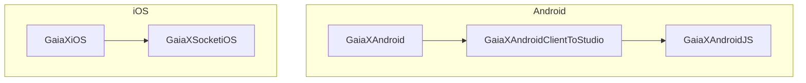
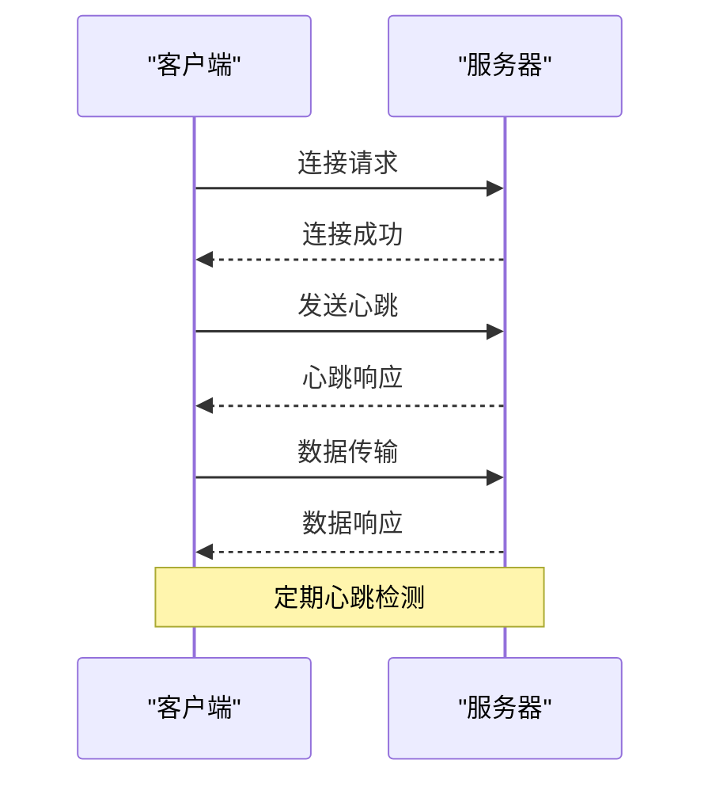
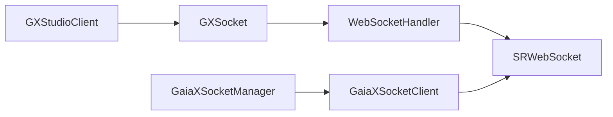

# 开发工具通信架构

<cite>
**本文档引用的文件**
- [GXStudioClient.kt](file://GaiaXAndroidClientToStudio/src/main/java/com/alibaba/gaiax/studio/GXStudioClient.kt)
- [GXSocket.kt](file://GaiaXAndroidClientToStudio/src/main/java/com/alibaba/gaiax/studio/GXSocket.kt)
- [GaiaXSocketManager.h](file://GaiaXSocketiOS/GaiaXSocket/GaiaXSocketManager.h)
- [GaiaXSocketClient.h](file://GaiaXSocketiOS/GaiaXSocket/GaiaXSocketClient.h)
- [GaiaXSocketClient.m](file://GaiaXSocketiOS/GaiaXSocket/GaiaXSocketClient.m)
- [GaiaXSocketManager.m](file://GaiaXSocketiOS/GaiaXSocket/GaiaXSocketManager.m)
- [WebSocketHandler.java](file://GaiaXAndroidClientToStudio/src/main/java/com/alibaba/gaiax/studio/third/socket/websocket/WebSocketHandler.java)
- [WebSocketSetting.java](file://GaiaXAndroidClientToStudio/src/main/java/com/alibaba/gaiax/studio/third/socket/websocket/WebSocketSetting.java)
</cite>

## 目录
1. [引言](#引言)
2. [项目结构](#项目结构)
3. [核心组件](#核心组件)
4. [架构概述](#架构概述)
5. [详细组件分析](#详细组件分析)
6. [依赖分析](#依赖分析)
7. [性能考虑](#性能考虑)
8. [故障排除指南](#故障排除指南)
9. [结论](#结论)

## 引言
GaiaX开发工具通信架构旨在实现GXStudioClient与可视化开发工具之间的高效、稳定连接。该架构支持Android和iOS平台，通过WebSocket协议进行实时通信，确保开发过程中的数据同步和调试功能。本文档详细介绍了Android端基于WebSocket的通信实现和iOS端的对应机制，包括连接建立、心跳检测、断线重连等核心功能。

## 项目结构
GaiaX项目结构清晰，分为多个模块，每个模块负责不同的功能。主要模块包括GaiaXAndroid、GaiaXiOS、GaiaXSocketiOS等。这些模块通过明确的接口和协议进行交互，确保跨平台一致性。



**图表来源**
- [GaiaXAndroidClientToStudio](file://GaiaXAndroidClientToStudio)
- [GaiaXSocketiOS](file://GaiaXSocketiOS)

**章节来源**
- [GaiaXAndroidClientToStudio](file://GaiaXAndroidClientToStudio)
- [GaiaXSocketiOS](file://GaiaXSocketiOS)

## 核心组件
### GXStudioClient
GXStudioClient是Android端的核心组件，负责与GaiaX Studio建立连接并处理通信。它提供了初始化、连接、数据传输和关闭等方法。

**章节来源**
- [GXStudioClient.kt](file://GaiaXAndroidClientToStudio/src/main/java/com/alibaba/gaiax/studio/GXStudioClient.kt)

### GXSocket
GXSocket是Android端的WebSocket管理器，负责管理Socket连接的生命周期。它处理连接建立、断开、心跳检测和数据传输等任务。

**章节来源**
- [GXSocket.kt](file://GaiaXAndroidClientToStudio/src/main/java/com/alibaba/gaiax/studio/GXSocket.kt)

### GaiaXSocketManager
GaiaXSocketManager是iOS端的Socket管理器，负责管理Socket连接的生命周期。它通过GaiaXSocketClient与服务器进行通信。

**章节来源**
- [GaiaXSocketManager.h](file://GaiaXSocketiOS/GaiaXSocket/GaiaXSocketManager.h)
- [GaiaXSocketManager.m](file://GaiaXSocketiOS/GaiaXSocket/GaiaXSocketManager.m)

### GaiaXSocketClient
GaiaXSocketClient是iOS端的Socket客户端，负责与服务器建立连接并处理通信。它实现了SRWebSocketDelegate协议，处理连接状态变化和数据接收。

**章节来源**
- [GaiaXSocketClient.h](file://GaiaXSocketiOS/GaiaXSocket/GaiaXSocketClient.h)
- [GaiaXSocketClient.m](file://GaiaXSocketiOS/GaiaXSocket/GaiaXSocketClient.m)

## 架构概述
GaiaX开发工具通信架构采用客户端-服务器模式，通过WebSocket协议进行实时通信。Android端使用`GXSocket`类管理连接，iOS端使用`GaiaXSocketClient`类管理连接。连接建立后，客户端定期发送心跳包以保持连接活跃，并在断线时自动重连。



**图表来源**
- [GXSocket.kt](file://GaiaXAndroidClientToStudio/src/main/java/com/alibaba/gaiax/studio/GXSocket.kt)
- [GaiaXSocketClient.m](file://GaiaXSocketiOS/GaiaXSocket/GaiaXSocketClient.m)

## 详细组件分析
### Android端通信实现
#### 连接建立
Android端通过`GXSocket`类的`connectToServer`方法建立连接。该方法初始化WebSocket并设置连接参数，如连接超时时间和心跳间隔。

```kotlin
fun connectToServer(address: String?) {
    serverAddress = address
    if (serverAddress == null || serverAddress?.isEmpty() == true) {
        gxSocketIsConnected = false
        return
    }
    gxSocketIsConnected = true

    // 初始化WebSocket
    webSocketSetting = WebSocketSetting()
    webSocketSetting?.connectUrl = serverAddress // 必填
    // 设置连接超时时间
    webSocketSetting?.connectTimeout = 15 * 1000
    // 设置心跳间隔时间
    webSocketSetting?.connectionLostTimeout = 0
    // 设置断开后的重连次数
    webSocketSetting?.reconnectFrequency = 1
    // 网络状态变化后是否重连
    webSocketSetting?.setReconnectWithNetworkChanged(true)

    // 注册网络监听广播
    WebSocketHandler.registerNetworkChangedReceiver(GXStudioClient.instance.applicationContext)
    webSocketManager = WebSocketHandler.initGeneralWebSocket(SOCKET_KEY, webSocketSetting)
    webSocketManager?.addListener(this)
}
```

**章节来源**
- [GXSocket.kt](file://GaiaXAndroidClientToStudio/src/main/java/com/alibaba/gaiax/studio/GXSocket.kt#L70-L96)

#### 心跳检测
Android端通过`WebSocketSetting`类的`connectionLostTimeout`属性设置心跳间隔时间。客户端定期发送心跳包以保持连接活跃。

**章节来源**
- [WebSocketSetting.java](file://GaiaXAndroidClientToStudio/src/main/java/com/alibaba/gaiax/studio/third/socket/websocket/WebSocketSetting.java)

#### 断线重连
Android端通过`WebSocketSetting`类的`reconnectFrequency`属性设置断开后的重连次数。当网络状态发生变化时，客户端会自动尝试重新连接。

**章节来源**
- [WebSocketSetting.java](file://GaiaXAndroidClientToStudio/src/main/java/com/alibaba/gaiax/studio/third/socket/websocket/WebSocketSetting.java)

### iOS端通信实现
#### 连接建立
iOS端通过`GaiaXSocketClient`类的`connectServer`方法建立连接。该方法初始化SRWebSocket并设置连接参数。

```objective-c
- (void)connectServer {
    if ([self isConnect]) {
        return;
    }
    
    NSURL *url = [NSURL URLWithString:self.url];
    self.webScoket = [[SRWebSocket alloc] initWithURL:url];
    [self.webScoket setDelegateDispatchQueue:self.processingQueue];
    self.webScoket.delegate = self;
    [self.webScoket open];
}
```

**章节来源**
- [GaiaXSocketClient.m](file://GaiaXSocketiOS/GaiaXSocket/GaiaXSocketClient.m#L62-L72)

#### 心跳检测
iOS端通过`NSTimer`定期发送心跳包以保持连接活跃。心跳检测通过`networkStartCheck`方法实现。

```objective-c
- (void)networkStartCheck {
    if([GaiaXSocketUtils isNetworkReachable]){
        return;
    }
    
    [self disConnectServer:NO];
    
    [self reConnectServer];
}
```

**章节来源**
- [GaiaXSocketClient.m](file://GaiaXSocketiOS/GaiaXSocket/GaiaXSocketClient.m#L137-L145)

#### 断线重连
iOS端通过`reConnectServer`方法实现断线重连。当网络不可达时，客户端会自动尝试重新连接。

```objective-c
- (void)reConnectServer {
    dispatch_after(dispatch_time(DISPATCH_TIME_NOW, (int64_t)(0 * NSEC_PER_SEC)), dispatch_get_main_queue(), ^{
        if ([self.reConnectTimer isValid]) {
            [self.reConnectTimer invalidate];
            self.reConnectTimer = nil;
        }
        self.reConnectTimer = [NSTimer scheduledTimerWithTimeInterval:2 target:self selector:@selector(doReConnectServer) userInfo:nil repeats:YES];
    });
}
```

**章节来源**
- [GaiaXSocketClient.m](file://GaiaXSocketiOS/GaiaXSocket/GaiaXSocketClient.m#L74-L82)

## 依赖分析
GaiaX开发工具通信架构依赖于多个第三方库，如`WebSocketHandler`和`SRWebSocket`。这些库提供了WebSocket连接管理和网络状态监听功能。



**图表来源**
- [GXSocket.kt](file://GaiaXAndroidClientToStudio/src/main/java/com/alibaba/gaiax/studio/GXSocket.kt)
- [GaiaXSocketClient.m](file://GaiaXSocketiOS/GaiaXSocket/GaiaXSocketClient.m)

**章节来源**
- [WebSocketHandler.java](file://GaiaXAndroidClientToStudio/src/main/java/com/alibaba/gaiax/studio/third/socket/websocket/WebSocketHandler.java)
- [SRWebSocket](file://GaiaXSocketiOS/GaiaXSocket/GaiaXSocketClient.m)

## 性能考虑
为了确保通信的高效性和稳定性，GaiaX开发工具通信架构采取了多种性能优化措施：
- **连接超时**：设置合理的连接超时时间，避免长时间等待。
- **心跳检测**：定期发送心跳包，及时发现并处理断线情况。
- **断线重连**：自动重连机制，确保连接的持续性。
- **数据压缩**：对传输的数据进行压缩，减少网络带宽占用。

## 故障排除指南
### 常见连接问题
- **超时**：检查网络连接是否稳定，确保服务器地址正确。
- **网络中断**：确保设备网络连接正常，避免使用代理或防火墙。
- **认证失败**：检查认证信息是否正确，确保服务器支持当前认证方式。

### 解决方案
- **超时**：增加连接超时时间，确保网络环境稳定。
- **网络中断**：使用心跳检测和断线重连机制，确保连接的持续性。
- **认证失败**：检查认证信息，确保服务器配置正确。

**章节来源**
- [GXSocket.kt](file://GaiaXAndroidClientToStudio/src/main/java/com/alibaba/gaiax/studio/GXSocket.kt)
- [GaiaXSocketClient.m](file://GaiaXSocketiOS/GaiaXSocket/GaiaXSocketClient.m)

## 结论
GaiaX开发工具通信架构通过WebSocket协议实现了Android和iOS平台的高效、稳定连接。该架构支持连接建立、心跳检测、断线重连等核心功能，确保开发过程中的数据同步和调试功能。通过合理的性能优化和故障排除措施，确保了通信的高效性和稳定性。