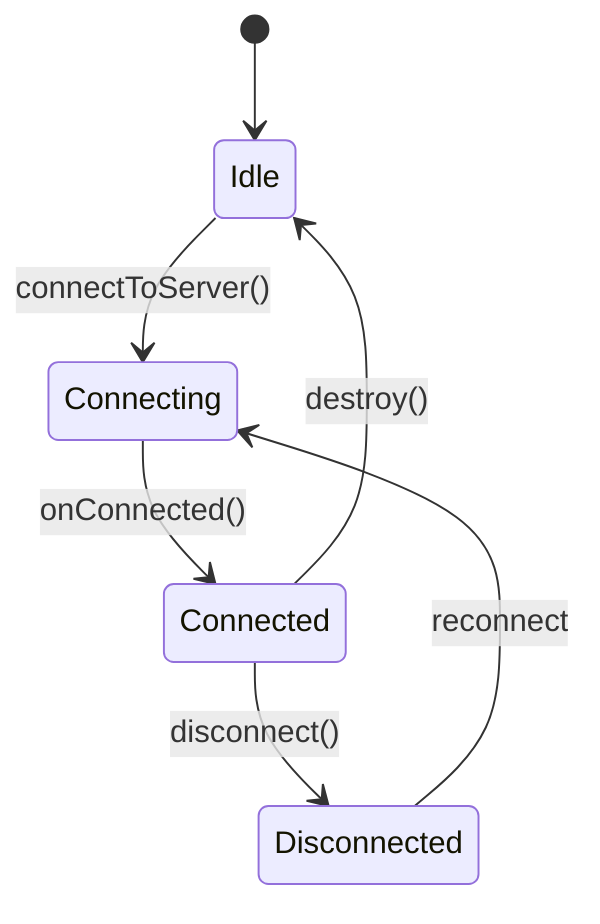
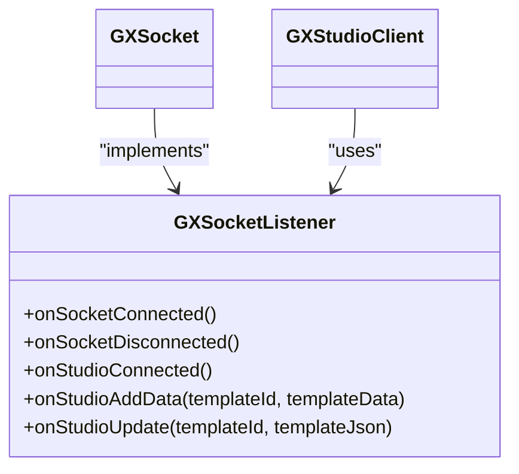
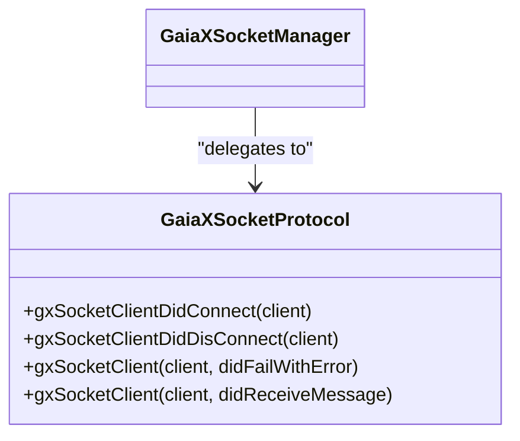
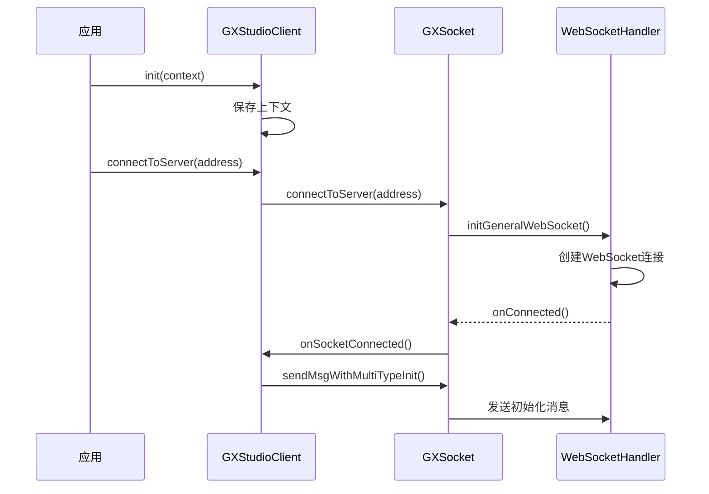
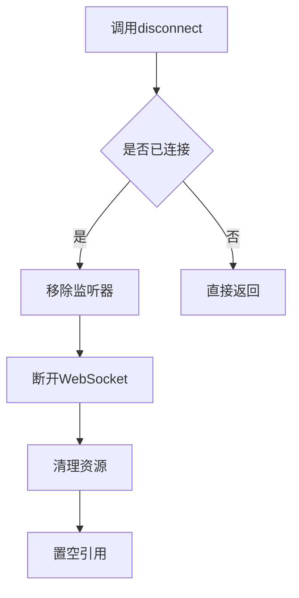

# 连接管理

<cite>
**本文档中引用的文件**  
- [GXStudioClient.kt](file://GaiaXAndroidClientToStudio/src/main/java/com/alibaba/gaiax/studio/GXStudioClient.kt)
- [GXSocket.kt](file://GaiaXAndroidClientToStudio/src/main/java/com/alibaba/gaiax/studio/GXSocket.kt)
- [GaiaXSocketManager.h](file://GaiaXSocketiOS/GaiaXSocket/GaiaXSocketManager.h)
- [GaiaXSocketManager.m](file://GaiaXSocketiOS/GaiaXSocket/GaiaXSocketManager.m)
</cite>

## 目录
1. [简介](#简介)
2. [项目结构](#项目结构)
3. [核心组件](#核心组件)
4. [连接生命周期管理](#连接生命周期管理)
5. [连接状态监听机制](#连接状态监听机制)
6. [连接配置参数](#连接配置参数)
7. [连接建立与初始化流程](#连接建立与初始化流程)
8. [断线重连与心跳机制](#断线重连与心跳机制)
9. [连接关闭与资源释放](#连接关闭与资源释放)
10. [跨平台连接一致性设计](#跨平台连接一致性设计)
11. [常见连接问题处理](#常见连接问题处理)

## 简介
GaiaX开发工具通过WebSocket实现与GaiaX Studio的实时通信，支持Android与iOS双平台的连接管理。本文档详细阐述了Android端的GXStudioClient与GXSocket，以及iOS端的GaiaXSocketManager在连接管理方面的实现机制，涵盖连接初始化、建立、断线重连、心跳检测、状态监听、配置参数、连接关闭等完整生命周期，并说明跨平台的一致性设计与常见问题处理方案。

## 项目结构
GaiaX的连接管理功能分布在多个模块中，Android端主要位于`GaiaXAndroidClientToStudio`模块，iOS端位于`GaiaXSocketiOS`模块。Android使用Kotlin实现，依赖第三方WebSocket库进行封装；iOS使用Objective-C实现，基于原生Socket封装。

```mermaid
graph TB
subgraph "Android"
A[GaiaXAndroidClientToStudio]
A --> B[GXStudioClient.kt]
A --> C[GXSocket.kt]
C --> D[third/socket]
end
subgraph "iOS"
E[GaiaXSocketiOS]
E --> F[GaiaXSocketManager.h/m]
E --> G[GaiaXSocketClient.h/m]
end
B < --> F
```

**Diagram sources**
- [GXStudioClient.kt](file://GaiaXAndroidClientToStudio/src/main/java/com/alibaba/gaiax/studio/GXStudioClient.kt)
- [GaiaXSocketManager.h](file://GaiaXSocketiOS/GaiaXSocket/GaiaXSocketManager.h)

## 核心组件
GaiaX连接管理的核心组件包括：
- **GXStudioClient**（Android）：对外暴露的连接管理入口，封装连接逻辑。
- **GXSocket**（Android）：实际的WebSocket通信层，处理连接、消息收发与状态回调。
- **GaiaXSocketManager**（iOS）：单例管理器，负责连接的创建、销毁与监听注册。
- **GaiaXSocketClient**（iOS）：底层Socket客户端，执行具体连接操作。

**Section sources**
- [GXStudioClient.kt](file://GaiaXAndroidClientToStudio/src/main/java/com/alibaba/gaiax/studio/GXStudioClient.kt)
- [GXSocket.kt](file://GaiaXAndroidClientToStudio/src/main/java/com/alibaba/gaiax/studio/GXSocket.kt)
- [GaiaXSocketManager.h](file://GaiaXSocketiOS/GaiaXSocket/GaiaXSocketManager.h)

## 连接生命周期管理
GaiaX的连接生命周期包括初始化、连接建立、保持、断线重连和关闭五个阶段。Android与iOS平台在设计上保持一致，均采用客户端主动连接、服务端响应的模式。



**Diagram sources**
- [GXSocket.kt](file://GaiaXAndroidClientToStudio/src/main/java/com/alibaba/gaiax/studio/GXSocket.kt#L70-L96)
- [GaiaXSocketManager.m](file://GaiaXSocketiOS/GaiaXSocket/GaiaXSocketManager.m#L49-L56)

## 连接状态监听机制
GaiaX通过监听器模式通知上层连接状态变化。Android端通过`GXSocketListener`接口，iOS端通过`GaiaXSocketProtocol`协议实现。

### Android端GXSocketListener


**Diagram sources**
- [GXSocket.kt](file://GaiaXAndroidClientToStudio/src/main/java/com/alibaba/gaiax/studio/GXSocket.kt#L19-L25)

### iOS端GaiaXSocketProtocol
iOS通过`GaiaXSocketProtocol`协议定义回调方法，由`GaiaXSocketManager`统一分发。



**Diagram sources**
- [GaiaXSocketManager.m](file://GaiaXSocketiOS/GaiaXSocket/GaiaXSocketManager.m#L96-L132)

## 连接配置参数
Android端通过`WebSocketSetting`类配置连接参数，iOS端在`GaiaXSocketClient`中进行配置。

| 参数 | Android (WebSocketSetting) | 作用 |
|------|---------------------------|------|
| connectTimeout | connectTimeout = 15 * 1000 | 连接超时时间，单位毫秒 |
| reconnectFrequency | reconnectFrequency = 1 | 断开后重连次数 |
| connectionLostTimeout | connectionLostTimeout = 0 | 心跳超时时间，0表示不启用 |
| setReconnectWithNetworkChanged | setReconnectWithNetworkChanged(true) | 网络变化时是否自动重连 |

**Section sources**
- [GXSocket.kt](file://GaiaXAndroidClientToStudio/src/main/java/com/alibaba/gaiax/studio/GXSocket.kt#L83-L90)

## 连接建立与初始化流程
连接建立通过`GXStudioClient.init()`和`connectToServer()`完成，流程如下：



**Diagram sources**
- [GXStudioClient.kt](file://GaiaXAndroidClientToStudio/src/main/java/com/alibaba/gaiax/studio/GXStudioClient.kt#L79-L203)
- [GXSocket.kt](file://GaiaXAndroidClientToStudio/src/main/java/com/alibaba/gaiax/studio/GXSocket.kt#L70-L102)

## 断线重连与心跳机制
Android端通过`WebSocketHandler`自动处理断线重连，当网络变化或连接失败时，根据`reconnectFrequency`配置进行重试。iOS端由`GaiaXSocketManager`在`socketClientDidDisConnect:`中触发重连逻辑。

心跳机制由底层WebSocket库自动处理，Android通过`connectionLostTimeout`配置心跳间隔，iOS由`GaiaXSocketClient`内部实现。

**Section sources**
- [GXSocket.kt](file://GaiaXAndroidClientToStudio/src/main/java/com/alibaba/gaiax/studio/GXSocket.kt#L85-L90)
- [GaiaXSocketManager.m](file://GaiaXSocketiOS/GaiaXSocket/GaiaXSocketManager.m#L108-L113)

## 连接关闭与资源释放
连接关闭通过`disconnectToServer()`或`disconnect`方法触发，释放所有资源。



**Diagram sources**
- [GXSocket.kt](file://GaiaXAndroidClientToStudio/src/main/java/com/alibaba/gaiax/studio/GXSocket.kt#L62-L68)
- [GaiaXSocketManager.m](file://GaiaXSocketiOS/GaiaXSocket/GaiaXSocketManager.m#L59-L61)

## 跨平台连接一致性设计
GaiaX在Android与iOS平台采用相似的连接管理架构：
- 均采用单例或全局实例管理连接
- 均提供初始化、连接、断开、监听等核心接口
- 消息格式统一使用JSON-RPC协议
- 连接状态回调机制相似
- 支持网络变化自动重连

这种设计保证了开发工具在双平台上的行为一致性，降低了维护成本。

**Section sources**
- [GXStudioClient.kt](file://GaiaXAndroidClientToStudio/src/main/java/com/alibaba/gaiax/studio/GXStudioClient.kt)
- [GaiaXSocketManager.h](file://GaiaXSocketiOS/GaiaXSocket/GaiaXSocketManager.h)

## 常见连接问题处理
### VPN冲突处理
Android端在连接前检测VPN状态，若已连接则提示用户断开：

```kotlin
private fun isConnectVpn(context: Context): Boolean {
    val cm = context.getSystemService(Context.CONNECTIVITY_SERVICE) as ConnectivityManager
    val networks = cm.allNetworkInfo
    for (network in networks) {
        if (network.type == ConnectivityManager.TYPE_VPN && network.isConnected) {
            return true
        }
    }
    return false
}
```

**Section sources**
- [GXStudioClient.kt](file://GaiaXAndroidClientToStudio/src/main/java/com/alibaba/gaiax/studio/GXStudioClient.kt#L165-L175)

### 连接地址变更处理
当连接地址变更时，先断开旧连接，再建立新连接：

```kotlin
if (tmpAddress != null && tmpAddress != address) {
    isWaitDisconnectMsgThenConnectGaiaStudio = true
    socketHelper?.disconnectToServer()
} else {
    toConnectGaiaStudio()
}
```

**Section sources**
- [GXStudioClient.kt](file://GaiaXAndroidClientToStudio/src/main/java/com/alibaba/gaiax/studio/GXStudioClient.kt#L186-L193)