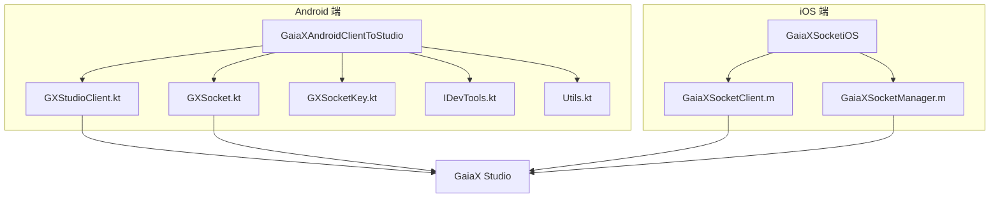
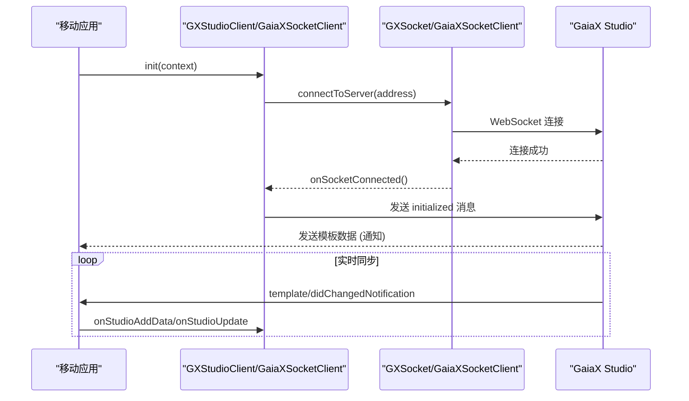
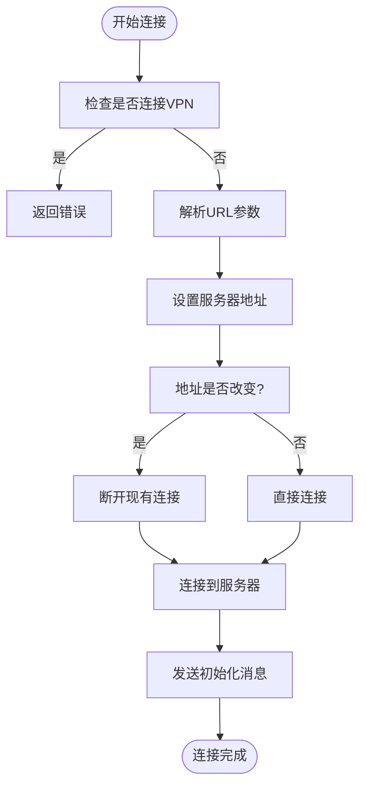
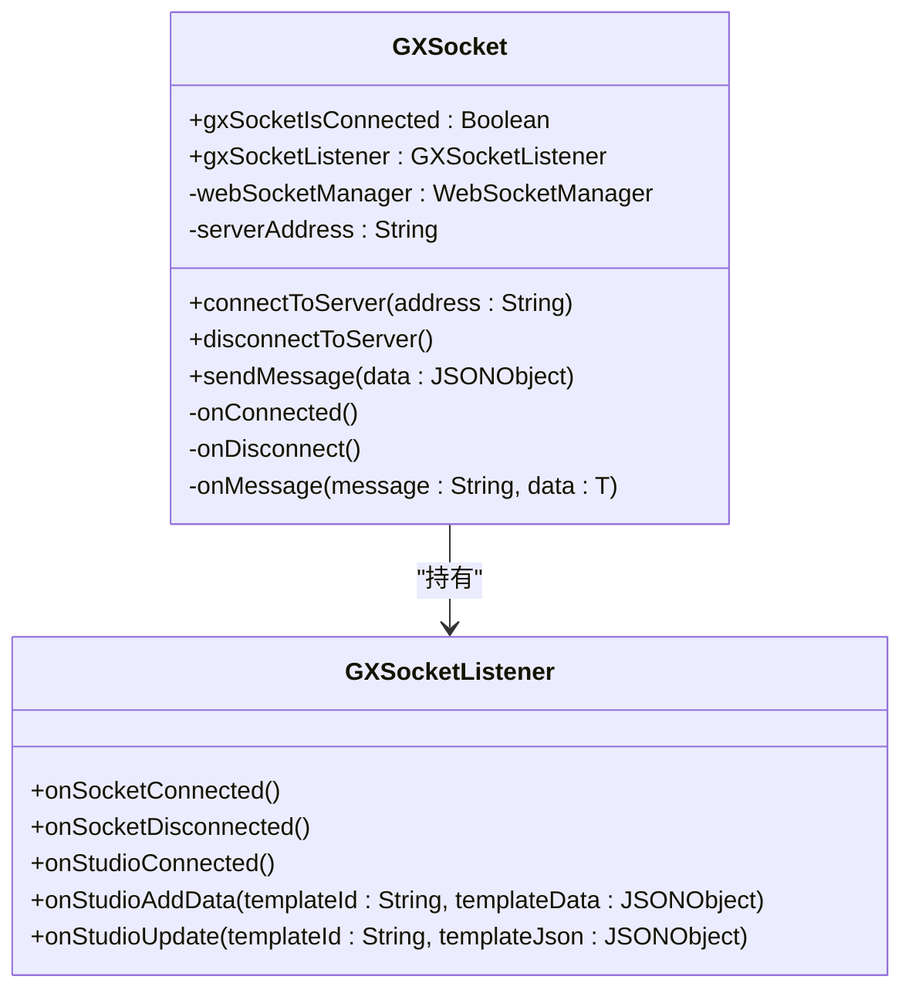
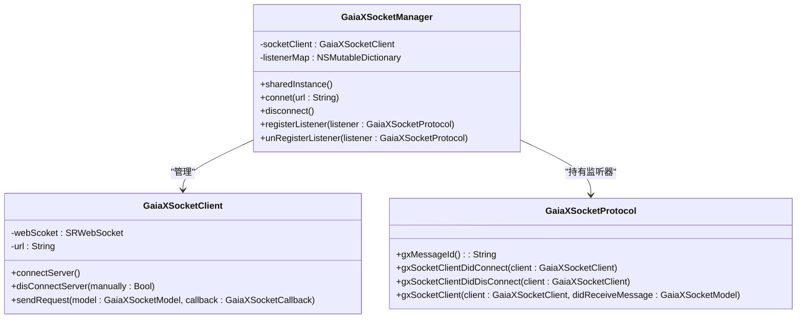
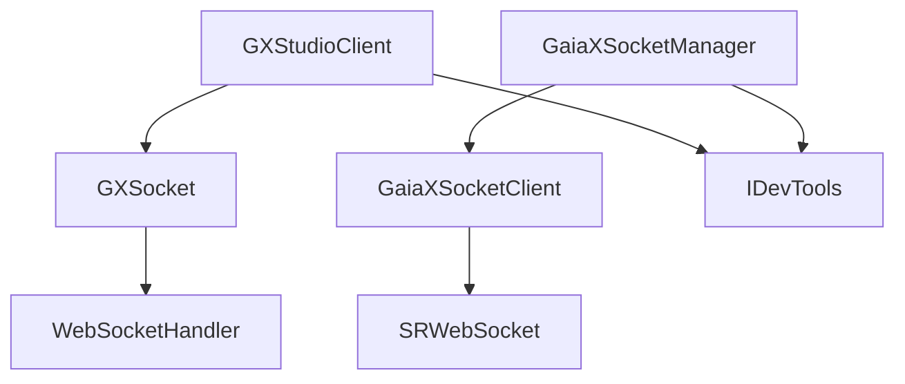

# 开发工具集成

<cite>
**本文档引用的文件**  
- [GXStudioClient.kt](file://GaiaXAndroidClientToStudio/src/main/java/com/alibaba/gaiax/studio/GXStudioClient.kt)
- [GXSocket.kt](file://GaiaXAndroidClientToStudio/src/main/java/com/alibaba/gaiax/studio/GXSocket.kt)
- [GXSocketKey.kt](file://GaiaXAndroidClientToStudio/src/main/java/com/alibaba/gaiax/studio/GXSocketKey.kt)
- [IDevTools.kt](file://GaiaXAndroidClientToStudio/src/main/java/com/alibaba/gaiax/studio/IDevTools.kt)
- [Utils.kt](file://GaiaXAndroidClientToStudio/src/main/java/com/alibaba/gaiax/studio/Utils.kt)
- [GaiaXSocketClient.m](file://GaiaXSocketiOS/GaiaXSocket/GaiaXSocketClient.m)
- [GaiaXSocketManager.m](file://GaiaXSocketiOS/GaiaXSocket/GaiaXSocketManager.m)
</cite>

## 目录
1. [简介](#简介)
2. [项目结构](#项目结构)
3. [核心组件](#核心组件)
4. [架构概览](#架构概览)
5. [详细组件分析](#详细组件分析)
6. [依赖分析](#依赖分析)
7. [性能考虑](#性能考虑)
8. [故障排除指南](#故障排除指南)
9. [结论](#结论)

## 简介
本文档详细介绍了 GaiaX 开发工具集成机制，重点阐述 GXStudioClient 如何实现与可视化开发工具的连接。深入解析了基于 WebSocket 的 Socket 通信协议设计，涵盖连接建立、消息格式定义及实时同步机制。文档详细说明了 Android 端 GXSocket 的实现原理以及 iOS 端的对应实现方案。为初学者提供了开发工具的连接与使用方法，并为高级开发者展示了自定义调试功能的扩展方式。通过实际代码库示例，说明了实时预览、热更新和远程调试的具体实现。同时，解释了开发工具集成与核心框架的交互方式，以及如何保障通信的安全性与稳定性，并提供了解决连接超时、消息丢失等常见问题的网络优化建议。

## 项目结构
GaiaX 开发工具集成主要由 Android 和 iOS 两端的独立模块构成。Android 端的核心功能位于 `GaiaXAndroidClientToStudio` 模块中，包含 `GXStudioClient` 和 `GXSocket` 等关键类。iOS 端的核心功能位于 `GaiaXSocketiOS` 模块中，主要由 `GaiaXSocketClient` 和 `GaiaXSocketManager` 组成。两个平台均遵循相似的通信协议，通过 WebSocket 与 GaiaX Studio 开发工具进行双向通信。

**图示来源**
- [GXStudioClient.kt](file://GaiaXAndroidClientToStudio/src/main/java/com/alibaba/gaiax/studio/GXStudioClient.kt)
- [GXSocket.kt](file://GaiaXAndroidClientToStudio/src/main/java/com/alibaba/gaiax/studio/GXSocket.kt)
- [GaiaXSocketClient.m](file://GaiaXSocketiOS/GaiaXSocket/GaiaXSocketClient.m)
- [GaiaXSocketManager.m](file://GaiaXSocketiOS/GaiaXSocket/GaiaXSocketManager.m)

## 核心组件
核心组件包括 `GXStudioClient`（Android）和 `GaiaXSocketClient`（iOS），它们是应用与 GaiaX Studio 通信的入口。`GXSocket` 类封装了 Android 端的 WebSocket 通信逻辑，而 `GaiaXSocketManager` 则负责管理 iOS 端的连接和消息分发。`IDevTools` 接口定义了调试工具的状态获取和视图更新方法，是实现自定义调试功能的关键。

**组件来源**
- [GXStudioClient.kt](file://GaiaXAndroidClientToStudio/src/main/java/com/alibaba/gaiax/studio/GXStudioClient.kt#L18-L282)
- [GXSocket.kt](file://GaiaXAndroidClientToStudio/src/main/java/com/alibaba/gaiax/studio/GXSocket.kt#L17-L442)
- [GaiaXSocketClient.m](file://GaiaXSocketiOS/GaiaXSocket/GaiaXSocketClient.m#L36-L282)
- [GaiaXSocketManager.m](file://GaiaXSocketiOS/GaiaXSocket/GaiaXSocketManager.m#L27-L135)

## 架构概览
开发工具集成采用客户端-服务器（C/S）架构。移动应用作为客户端，通过 WebSocket 协议主动连接运行在开发机上的 GaiaX Studio 服务端。通信基于 JSON-RPC 2.0 协议，定义了清晰的请求、响应和通知消息格式。Android 和 iOS 客户端分别实现了平台特定的 WebSocket 封装，但共享相同的高层通信逻辑和消息协议。

**图示来源**
- [GXStudioClient.kt](file://GaiaXAndroidClientToStudio/src/main/java/com/alibaba/gaiax/studio/GXStudioClient.kt#L79-L268)
- [GXSocket.kt](file://GaiaXAndroidClientToStudio/src/main/java/com/alibaba/gaiax/studio/GXSocket.kt#L70-L119)
- [GaiaXSocketClient.m](file://GaiaXSocketiOS/GaiaXSocket/GaiaXSocketClient.m#L62-L72)

## 详细组件分析

### GXStudioClient 分析
`GXStudioClient` 是 Android 端的高层封装，为应用开发者提供了简洁的 API。它负责初始化、连接管理、消息发送和接收回调。

#### 连接与初始化
`GXStudioClient` 提供了 `autoConnect` 和 `manualConnect` 方法来建立与 Studio 的连接。连接成功后，会通过 `sendMsgWithMultiTypeInit()` 发送初始化消息，其中包含了设备信息和平台标识。

**图示来源**
- [GXStudioClient.kt](file://GaiaXAndroidClientToStudio/src/main/java/com/alibaba/gaiax/studio/GXStudioClient.kt#L91-L203)

#### 消息处理与回调
`GXStudioClient` 内部持有 `GXSocket` 实例，并通过 `gxSocketListener` 监听底层连接状态。当收到 Studio 发来的模板更新通知时，会通过 `IFastPreviewListener` 回调通知上层应用进行 UI 更新。

**组件来源**
- [GXStudioClient.kt](file://GaiaXAndroidClientToStudio/src/main/java/com/alibaba/gaiax/studio/GXStudioClient.kt#L45-L77)

### GXSocket 分析
`GXSocket` 是 Android 端 WebSocket 通信的核心实现，封装了第三方库 `WebSocketHandler`。

#### WebSocket 连接管理
`GXSocket` 使用 `WebSocketHandler` 库来管理 WebSocket 连接。在 `connectToServer` 方法中，配置了连接超时、心跳和重连策略，并注册了网络状态变化监听器以实现断网重连。

**图示来源**
- [GXSocket.kt](file://GaiaXAndroidClientToStudio/src/main/java/com/alibaba/gaiax/studio/GXSocket.kt#L17-L119)

#### 消息格式与协议
通信基于 JSON-RPC 2.0 协议。`GXSocket` 在 `onMessage` 方法中解析收到的 JSON 消息，并根据 `method` 字段分发到不同的处理逻辑。例如，收到 `"initialized"` 方法表示连接成功，收到 `"template/didChangedNotification"` 则表示模板已更新。

**组件来源**
- [GXSocket.kt](file://GaiaXAndroidClientToStudio/src/main/java/com/alibaba/gaiax/studio/GXSocket.kt#L123-L180)
- [GXSocketKey.kt](file://GaiaXAndroidClientToStudio/src/main/java/com/alibaba/gaiax/studio/GXSocketKey.kt)

### iOS 端实现分析
iOS 端的实现与 Android 端在逻辑上高度对称。

#### GaiaXSocketClient
`GaiaXSocketClient` 是 iOS 端的 WebSocket 客户端，使用 `SRWebSocket` 库。它实现了 `SRWebSocketDelegate` 来处理连接、断开和消息接收事件。`sendRequest:callback:` 方法用于发送请求并注册回调，而 `sendeNotification:` 用于发送无需响应的通知。

**组件来源**
- [GaiaXSocketClient.m](file://GaiaXSocketiOS/GaiaXSocket/GaiaXSocketClient.m#L36-L282)

#### GaiaXSocketManager
`GaiaXSocketManager` 是一个单例，负责管理 `GaiaXSocketClient` 实例和消息监听器。它通过 `listenerMap` 存储实现了 `GaiaXSocketProtocol` 协议的监听器对象，当收到消息时，会遍历所有监听器并分发消息。

**图示来源**
- [GaiaXSocketManager.m](file://GaiaXSocketiOS/GaiaXSocket/GaiaXSocketManager.m#L27-L135)
- [GaiaXSocketClient.m](file://GaiaXSocketiOS/GaiaXSocket/GaiaXSocketClient.m)

## 依赖分析
开发工具集成模块主要依赖于平台原生的网络库和第三方 WebSocket 库。Android 端依赖 `WebSocketHandler` 库，iOS 端依赖 `SRWebSocket` 库。`GXStudioClient` 依赖 `GXSocket`，而 `GXSocket` 又依赖这些底层网络库。`IDevTools` 接口作为抽象层，解耦了通信模块与具体的调试工具 UI 实现。

**图示来源**
- [GXStudioClient.kt](file://GaiaXAndroidClientToStudio/src/main/java/com/alibaba/gaiax/studio/GXStudioClient.kt#L39)
- [GXSocket.kt](file://GaiaXAndroidClientToStudio/src/main/java/com/alibaba/gaiax/studio/GXSocket.kt#L37)
- [GaiaXSocketManager.m](file://GaiaXSocketiOS/GaiaXSocket/GaiaXSocketManager.m#L42)
- [GaiaXSocketClient.m](file://GaiaXSocketiOS/GaiaXSocket/GaiaXSocketClient.m#L23)

## 性能考虑
为了保证实时预览的流畅性，通信协议设计上进行了优化。例如，使用 `template/didChangedNotification` 通知来实现增量更新，避免了全量数据传输。在 Android 端，`GXSocket` 使用 `Handler` 将 UI 更新操作延迟 200ms 执行，以防止短时间内频繁更新导致的界面卡顿。iOS 端也通过 `dispatch_async` 确保消息处理在主线程安全执行。

## 故障排除指南
常见问题及解决方案：

- **连接超时**: 检查设备与开发机是否在同一局域网，确认防火墙未阻止相应端口。
- **消息丢失**: 检查网络连接稳定性，确认 `GXSocket` 的重连机制是否正常工作。
- **无法实时预览**: 确认 `IFastPreviewListener` 已正确设置，并检查 Studio 端是否正常发送更新通知。
- **VPN 干扰**: 如代码所示，`isConnectVpn` 方法会检测并阻止在 VPN 环境下连接，需断开 VPN 后重试。

**组件来源**
- [GXStudioClient.kt](file://GaiaXAndroidClientToStudio/src/main/java/com/alibaba/gaiax/studio/GXStudioClient.kt#L165-L175)
- [GXSocket.kt](file://GaiaXAndroidClientToStudio/src/main/java/com/alibaba/gaiax/studio/GXSocket.kt#L86-L90)

## 结论
GaiaX 开发工具集成通过精心设计的 WebSocket 通信协议，实现了跨平台的高效、稳定连接。Android 和 iOS 两端的实现虽然技术栈不同，但都遵循了统一的高层架构和消息规范，确保了功能的一致性。该集成方案为开发者提供了强大的实时预览、热更新和远程调试能力，极大地提升了开发效率。通过 `IDevTools` 等接口，也为未来的功能扩展提供了良好的基础。