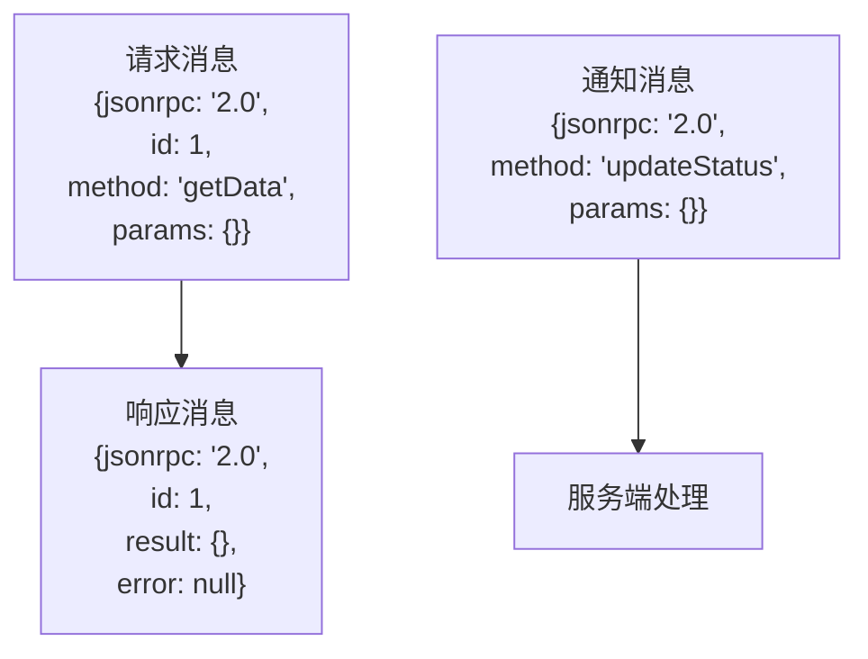
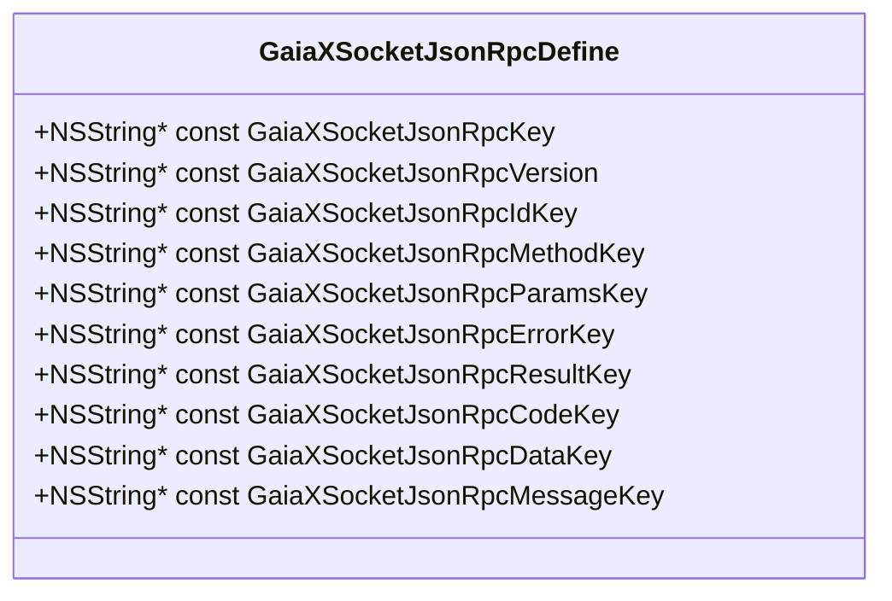
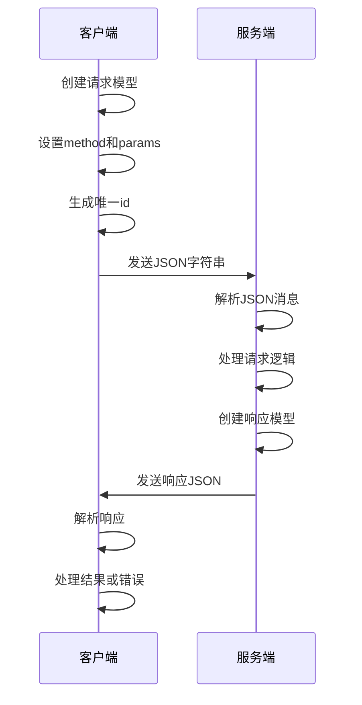

# 消息协议规范

<cite>
**Referenced Files in This Document**   
- [GaiaXSocketJsonRpcDefine.h](file://GaiaXSocketiOS/GaiaXSocket/GaiaXSocketJsonRpcDefine.h)
- [GaiaXSocketJsonRpcDefine.m](file://GaiaXSocketiOS/GaiaXSocket/GaiaXSocketJsonRpcDefine.m)
- [GaiaXSocketModel.h](file://GaiaXSocketiOS/GaiaXSocket/GaiaXSocketModel.h)
- [GaiaXSocketModel.m](file://GaiaXSocketiOS/GaiaXSocket/GaiaXSocketModel.m)
</cite>

## 目录
1. [引言](#引言)
2. [协议基础](#协议基础)
3. [消息类型详解](#消息类型详解)
4. [协议常量与枚举](#协议常量与枚举)
5. [消息格式示例](#消息格式示例)
6. [请求-响应交互流程](#请求-响应交互流程)
7. [协议扩展机制](#协议扩展机制)
8. [跨平台一致性](#跨平台一致性)
9. [性能与可靠性](#性能与可靠性)

## 引言
GaiaX消息协议是基于JSON-RPC 2.0标准构建的通信规范，旨在为不同平台间的组件提供高效、可靠的消息传递机制。该协议定义了统一的消息格式和交互模式，确保了系统在复杂环境下的稳定运行。

## 协议基础
GaiaX消息协议严格遵循JSON-RPC 2.0规范，采用JSON作为数据交换格式。协议的核心是通过定义标准化的消息结构来实现客户端与服务端之间的通信。每个消息都必须包含`jsonrpc`字段，其值固定为`"2.0"`，用于标识协议版本。

**Section sources**
- [GaiaXSocketJsonRpcDefine.m](file://GaiaXSocketiOS/GaiaXSocket/GaiaXSocketJsonRpcDefine.m#L18)

## 消息类型详解
协议定义了三种主要的消息类型：请求、响应和通知。每种类型都有其特定的结构和用途。

### 请求消息
请求消息由客户端发送至服务端，用于调用特定方法。必须包含`method`字段表示方法名，`params`字段包含调用参数，以及`id`字段用于匹配响应。

### 响应消息
响应消息是服务端对请求的回复，包含`result`字段（调用成功时）或`error`字段（调用失败时），以及与请求匹配的`id`字段。

### 通知消息
通知消息类似于请求，但不需要响应。因此不包含`id`字段，适用于单向通信场景。



**Diagram sources**
- [GaiaXSocketModel.h](file://GaiaXSocketiOS/GaiaXSocket/GaiaXSocketModel.h#L21-L28)
- [GaiaXSocketModel.m](file://GaiaXSocketiOS/GaiaXSocket/GaiaXSocketModel.m#L80-L87)

**Section sources**
- [GaiaXSocketModel.h](file://GaiaXSocketiOS/GaiaXSocket/GaiaXSocketModel.h#L19-L48)

## 协议常量与枚举
在iOS端的实现中，通过`GaiaXSocketJsonRpcDefine.h`头文件定义了所有协议相关的常量。这些常量确保了代码中对协议字段的引用一致性。



**Diagram sources**
- [GaiaXSocketJsonRpcDefine.h](file://GaiaXSocketiOS/GaiaXSocket/GaiaXSocketJsonRpcDefine.h#L18-L30)
- [GaiaXSocketJsonRpcDefine.m](file://GaiaXSocketiOS/GaiaXSocket/GaiaXSocketJsonRpcDefine.m#L17-L29)

**Section sources**
- [GaiaXSocketJsonRpcDefine.h](file://GaiaXSocketiOS/GaiaXSocket/GaiaXSocketJsonRpcDefine.h#L15-L30)

## 消息格式示例
以下展示了各种消息类型的完整格式示例：

### 请求示例
```json
{
  "jsonrpc": "2.0",
  "id": 1,
  "method": "getUserInfo",
  "params": {
    "userId": "12345"
  }
}
```

### 成功响应示例
```json
{
  "jsonrpc": "2.0",
  "id": 1,
  "result": {
    "name": "张三",
    "age": 30
  },
  "error": null
}
```

### 错误响应示例
```json
{
  "jsonrpc": "2.0",
  "id": 1,
  "result": null,
  "error": {
    "code": -32601,
    "message": "方法未找到",
    "data": "getUserInfo"
  }
}
```

### 通知示例
```json
{
  "jsonrpc": "2.0",
  "method": "systemStatusUpdate",
  "params": {
    "status": "online"
  }
}
```

**Section sources**
- [GaiaXSocketModel.m](file://GaiaXSocketiOS/GaiaXSocket/GaiaXSocketModel.m#L51-L77)

## 请求-响应交互流程
完整的请求-响应交互流程包括消息创建、序列化、传输、反序列化和处理等步骤。



**Diagram sources**
- [GaiaXSocketModel.m](file://GaiaXSocketiOS/GaiaXSocket/GaiaXSocketModel.m#L21-L48)
- [GaiaXSocketModel.m](file://GaiaXSocketiOS/GaiaXSocket/GaiaXSocketModel.m#L90-L105)

**Section sources**
- [GaiaXSocketModel.m](file://GaiaXSocketiOS/GaiaXSocket/GaiaXSocketModel.m#L80-L114)

## 协议扩展机制
协议支持通过自定义方法名和参数结构进行功能扩展。建议采用命名空间式的命名规范，如`namespace.methodName`，以避免方法名冲突。

对于复杂参数，推荐使用字典结构，并定义清晰的键名和数据类型。扩展时应确保向后兼容性，避免破坏现有功能。

**Section sources**
- [GaiaXSocketModel.h](file://GaiaXSocketiOS/GaiaXSocket/GaiaXSocketModel.h#L32-L42)

## 跨平台一致性
为确保跨平台消息格式的一致性，所有平台都应遵循相同的协议规范。通过定义统一的常量和数据模型，可以有效避免因平台差异导致的通信问题。

在实现上，建议各平台使用类似的类或结构体来表示消息，确保字段名称、类型和含义完全一致。

**Section sources**
- [GaiaXSocketModel.h](file://GaiaXSocketiOS/GaiaXSocket/GaiaXSocketModel.h#L21-L28)

## 性能与可靠性
协议设计充分考虑了性能和可靠性因素。通过使用轻量级的JSON格式和高效的序列化/反序列化机制，确保了消息传递的快速性。

为提高可靠性，协议内置了错误处理机制，允许服务端返回详细的错误信息。同时，通过消息ID的匹配，确保了请求与响应的正确对应。

**Section sources**
- [GaiaXSocketModel.m](file://GaiaXSocketiOS/GaiaXSocket/GaiaXSocketModel.m#L17)
- [GaiaXSocketModel.m](file://GaiaXSocketiOS/GaiaXSocket/GaiaXSocketModel.m#L51-L77)