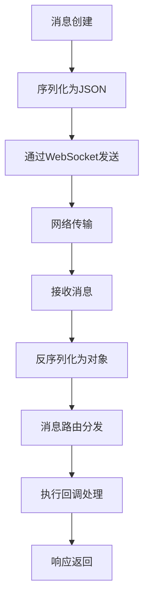
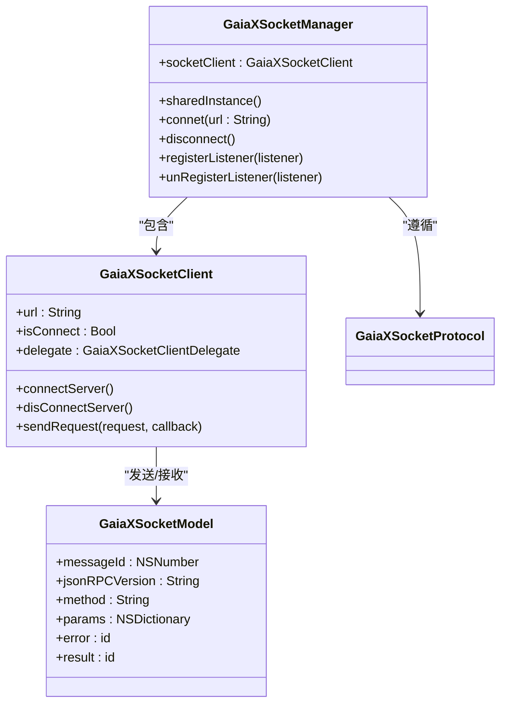
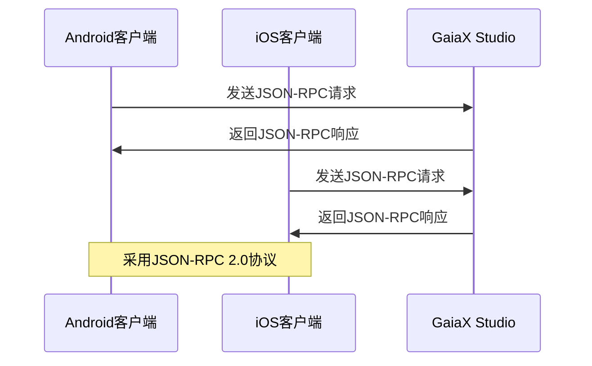

# 消息处理流程

<cite>
**本文档引用的文件**
- [GXSocket.kt](file://GaiaXAndroidClientToStudio/src/main/java/com/alibaba/gaiax/studio/GXSocket.kt)
- [GXStudioClient.kt](file://GaiaXAndroidClientToStudio/src/main/java/com/alibaba/gaiax/studio/GXStudioClient.kt)
- [GaiaXSocketManager.h](file://GaiaXSocketiOS/GaiaXSocket/GaiaXSocketManager.h)
- [GaiaXSocketManager.m](file://GaiaXSocketiOS/GaiaXSocket/GaiaXSocketManager.m)
- [GaiaXSocketClient.h](file://GaiaXSocketiOS/GaiaXSocket/GaiaXSocketClient.h)
- [GaiaXSocketModel.h](file://GaiaXSocketiOS/GaiaXSocket/GaiaXSocketModel.h)
- [GaiaXSocketProtocol.h](file://GaiaXSocketiOS/GaiaXSocket/GaiaXSocketProtocol.h)
</cite>

## 目录
1. [简介](#简介)
2. [消息生命周期概述](#消息生命周期概述)
3. [Android端消息处理机制](#android端消息处理机制)
4. [iOS端消息队列与调度](#ios端消息队列与调度)
5. [消息序列化与反序列化](#消息序列化与反序列化)
6. [消息分发与路由机制](#消息分发与路由机制)
7. [基础使用示例](#基础使用示例)
8. [高级特性与性能优化](#高级特性与性能优化)
9. [结论](#结论)

## 简介
GaiaX框架通过WebSocket实现跨平台的实时消息通信，支持Android和iOS双端的消息收发。本系统采用JSON-RPC 2.0协议规范，实现了从消息发送、传输、接收、解析到分发的完整生命周期管理。消息系统主要用于GaiaX Studio与移动设备之间的模板数据同步、调试指令传输和实时预览功能。

**本节内容未分析具体源文件**

## 消息生命周期概述
GaiaX消息从发送到接收的完整生命周期包括：消息创建 → 序列化 → WebSocket传输 → 接收 → 反序列化 → 路由分发 → 回调执行。整个流程确保了消息的有序性、原子性和可靠性。系统通过消息ID管理机制保证请求与响应的正确匹配，并采用异步处理策略提升系统响应性能。

**图示来源**
- [GXSocket.kt](file://GaiaXAndroidClientToStudio/src/main/java/com/alibaba/gaiax/studio/GXSocket.kt#L17-L440)
- [GaiaXSocketManager.h](file://GaiaXSocketiOS/GaiaXSocket/GaiaXSocketManager.h#L21-L47)

## Android端消息处理机制
Android端通过GXSocket.kt实现WebSocket通信，采用Kotlin语言编写，继承自SocketListener接口。系统使用ConcurrentHashMap管理消息ID与方法名的映射关系，确保多线程环境下的线程安全。消息处理采用主线程Handler机制，通过uiHandler.postDelayed实现200ms的更新延迟，避免频繁UI刷新。

消息发送时，系统会自动将Kotlin对象序列化为JSONObject，并通过WebSocketHandler发送。接收消息时，首先解析JSON字符串，然后根据method字段或ID字段确定消息类型，最后分发到相应的处理逻辑。对于模板数据更新，系统会解析index.json、index.css等文件内容并重组为统一的数据结构。

**本节内容来源**
- [GXSocket.kt](file://GaiaXAndroidClientToStudio/src/main/java/com/alibaba/gaiax/studio/GXSocket.kt#L17-L440)
- [GXStudioClient.kt](file://GaiaXAndroidClientToStudio/src/main/java/com/alibaba/gaiax/studio/GXStudioClient.kt#L17-L281)

## iOS端消息队列与调度
iOS端通过GaiaXSocketManager实现消息队列管理和异步处理。系统采用单例模式，通过sharedInstance保证全局唯一实例。消息队列基于NSMutableDictionary实现，以gxMessageId为键存储监听器对象，支持动态注册和注销。

线程调度方面，系统采用GCD（Grand Central Dispatch）实现线程安全，通过dispatch_once_t保证单例初始化的原子性。消息分发时，系统遍历listenerMap中的所有监听器，并调用相应的回调方法。网络状态变化时，系统会自动重连，并通过NSUserDefaults持久化存储连接URL。

**图示来源**
- [GaiaXSocketManager.h](file://GaiaXSocketiOS/GaiaXSocket/GaiaXSocketManager.h#L21-L47)
- [GaiaXSocketManager.m](file://GaiaXSocketiOS/GaiaXSocket/GaiaXSocketManager.m#L27-L135)
- [GaiaXSocketClient.h](file://GaiaXSocketiOS/GaiaXSocket/GaiaXSocketClient.h#L30-L67)

**本节内容来源**
- [GaiaXSocketManager.h](file://GaiaXSocketiOS/GaiaXSocket/GaiaXSocketManager.h#L21-L47)
- [GaiaXSocketManager.m](file://GaiaXSocketiOS/GaiaXSocket/GaiaXSocketManager.m#L27-L135)

## 消息序列化与反序列化
消息序列化采用JSON格式，遵循JSON-RPC 2.0规范。每个消息包含jsonrpc、method、params、id和result/error等字段。Android端使用Fastjson库进行JSON解析，通过JSONObject.parseObject和toJSONString方法实现对象与字符串的转换。

iOS端通过GaiaXSocketModel类封装消息结构，提供initWithMessageString方法从JSON字符串初始化对象，以及stringifyModel方法将对象转换为JSON字符串。序列化时，系统会自动处理NSNumber、NSString、NSDictionary等Foundation类型的数据转换。

消息ID管理机制确保了请求与响应的正确匹配。Android端使用ConcurrentHashMap<Int, String>存储ID与方法名的映射，当收到响应消息时，可通过ID查找对应的方法名进行分发。

**图示来源**
- [GXSocket.kt](file://GaiaXAndroidClientToStudio/src/main/java/com/alibaba/gaiax/studio/GXSocket.kt#L373-L379)
- [GaiaXSocketModel.h](file://GaiaXSocketiOS/GaiaXSocket/GaiaXSocketModel.h#L19-L48)

**本节内容来源**
- [GXSocket.kt](file://GaiaXAndroidClientToStudio/src/main/java/com/alibaba/gaiax/studio/GXSocket.kt#L17-L440)
- [GaiaXSocketModel.h](file://GaiaXSocketiOS/GaiaXSocket/GaiaXSocketModel.h#L19-L48)

## 消息分发与路由机制
消息分发机制基于method名称进行路由，Android端通过when语句匹配不同的method值，如"initialized"、"template/get"、"js/callSync"等。每个method对应特定的处理逻辑，如onStudioConnected、obtainResultFromGetTemplate等。

iOS端采用协议代理模式，通过GaiaXSocketProtocol协议定义消息接收接口。监听器需要实现gxSocketClient:didReceiveMessage:方法，系统会将接收到的消息分发给所有注册的监听器。消息ID通过gxMessageId方法获取，用于唯一标识监听器。

回调函数管理方面，Android端使用ISocketReceiver接口定义四种回调方法：onReceiveCallSync、onReceiveCallAsync、onReceiveCallPromise和onReceiveCallGetLibrary。系统通过setSocketReceiver方法设置接收器，确保消息能够正确路由到业务逻辑层。

**本节内容来源**
- [GXSocket.kt](file://GaiaXAndroidClientToStudio/src/main/java/com/alibaba/gaiax/studio/GXSocket.kt#L123-L180)
- [GXStudioClient.kt](file://GaiaXAndroidClientToStudio/src/main/java/com/alibaba/gaiax/studio/GXStudioClient.kt#L25-L33)
- [GaiaXSocketProtocol.h](file://GaiaXSocketiOS/GaiaXSocket/GaiaXSocketProtocol.h#L22-L39)

## 基础使用示例
初学者可以通过以下步骤实现消息收发：

1. **注册消息监听器**：
   - Android：实现GXSocketListener接口，重写onStudioConnected、onStudioAddData等方法
   - iOS：实现GaiaXSocketProtocol协议，实现gxSocketClient:didReceiveMessage:方法

2. **建立连接**：
   - Android：调用connectToServer(address)方法连接指定地址
   - iOS：调用connet:(NSString *)url方法建立连接

3. **发送请求**：
   - 创建JSONObject对象，设置jsonrpc、method、params和id字段
   - 调用sendMessage(data)方法发送消息

4. **处理响应**：
   - 在监听器回调方法中处理接收到的消息
   - 根据method字段执行相应的业务逻辑

**本节内容来源**
- [GXSocket.kt](file://GaiaXAndroidClientToStudio/src/main/java/com/alibaba/gaiax/studio/GXSocket.kt#L69-L96)
- [GaiaXSocketManager.h](file://GaiaXSocketiOS/GaiaXSocket/GaiaXSocketManager.h#L30-L32)

## 高级特性与性能优化
为保证消息的有序性和原子性，系统采用以下策略：

1. **消息队列管理**：iOS端使用NSMutableDictionary作为线程安全的消息队列，Android端使用ConcurrentHashMap管理消息ID映射。

2. **异步处理**：Android端通过Handler机制将UI更新操作延迟200ms执行，避免频繁刷新；iOS端使用GCD实现异步回调。

3. **连接管理**：支持断线重连，Android端设置reconnectFrequency=1，iOS端通过reConnectServer方法实现重连。

4. **内存优化**：采用对象池模式，复用WebSocket连接；及时清理不再使用的监听器，避免内存泄漏。

5. **高并发优化**：在高并发场景下，系统通过消息ID精确匹配请求与响应，避免消息错乱；同时限制并发请求数量，防止服务过载。

6. **错误处理**：提供完善的错误回调机制，包括onConnectFailed、didFailWithError等，便于调试和问题定位。

**本节内容来源**
- [GXSocket.kt](file://GaiaXAndroidClientToStudio/src/main/java/com/alibaba/gaiax/studio/GXSocket.kt#L86-L90)
- [GaiaXSocketManager.m](file://GaiaXSocketiOS/GaiaXSocket/GaiaXSocketManager.m#L27-L135)
- [GXStudioClient.kt](file://GaiaXAndroidClientToStudio/src/main/java/com/alibaba/gaiax/studio/GXStudioClient.kt#L45-L77)

## 结论
GaiaX消息处理系统通过WebSocket实现了跨平台的高效通信，采用JSON-RPC 2.0协议确保了消息格式的标准化。Android和iOS双端在保持接口一致性的同时，充分利用各自平台特性实现了高性能的消息处理。系统通过完善的序列化机制、精确的路由分发和健壮的错误处理，为开发者提供了稳定可靠的消息通信能力。对于初学者，系统提供了简洁的API接口；对于高级开发者，则开放了底层控制能力，满足不同层次的开发需求。

**本节内容未分析具体源文件**