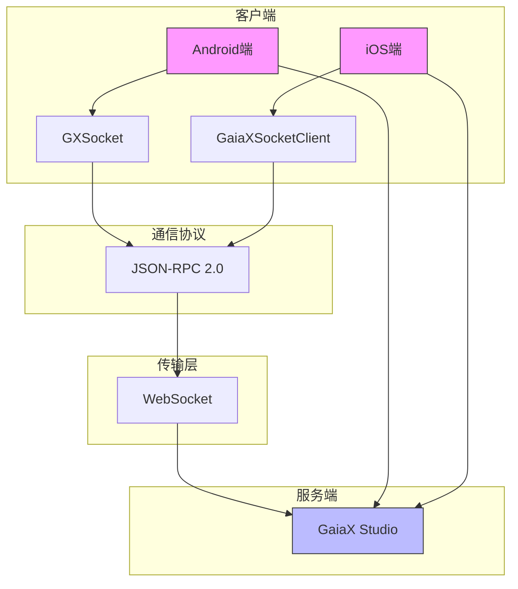
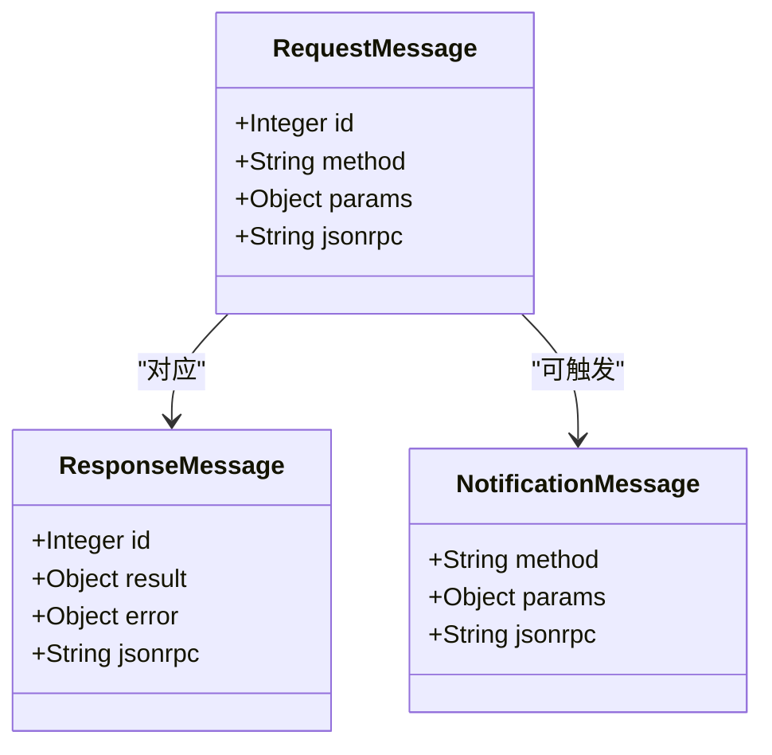
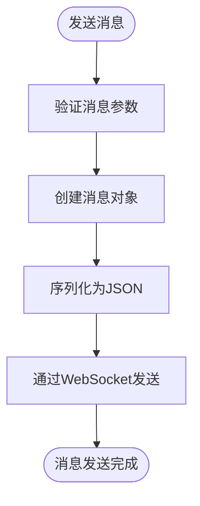
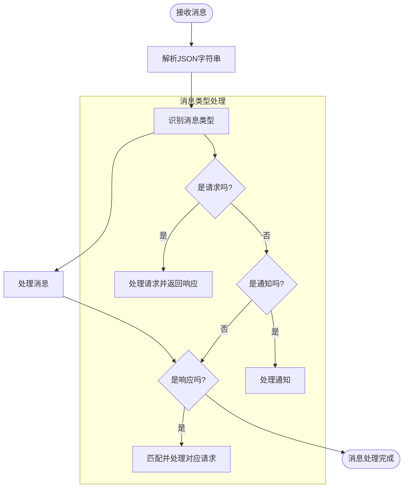
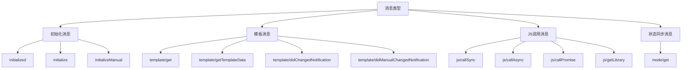
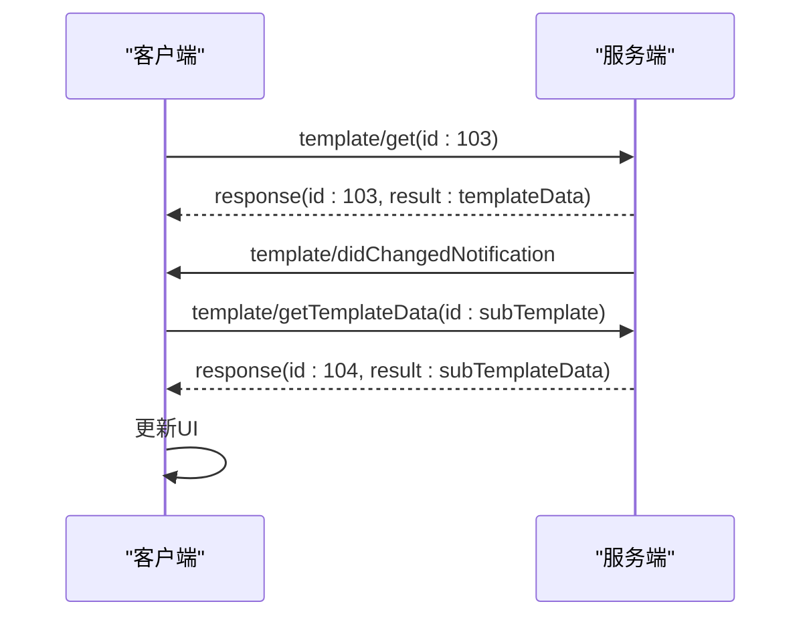
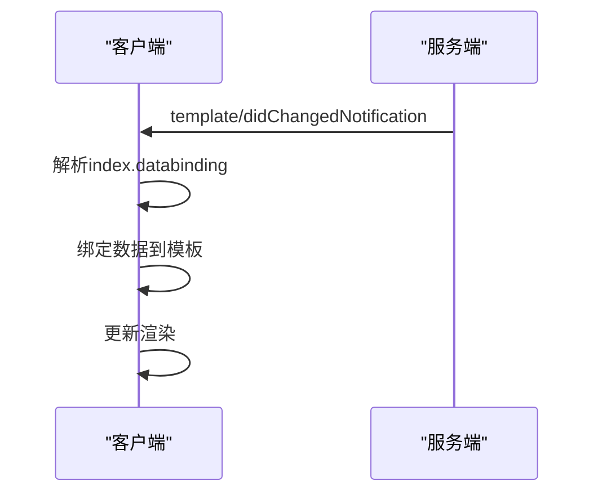
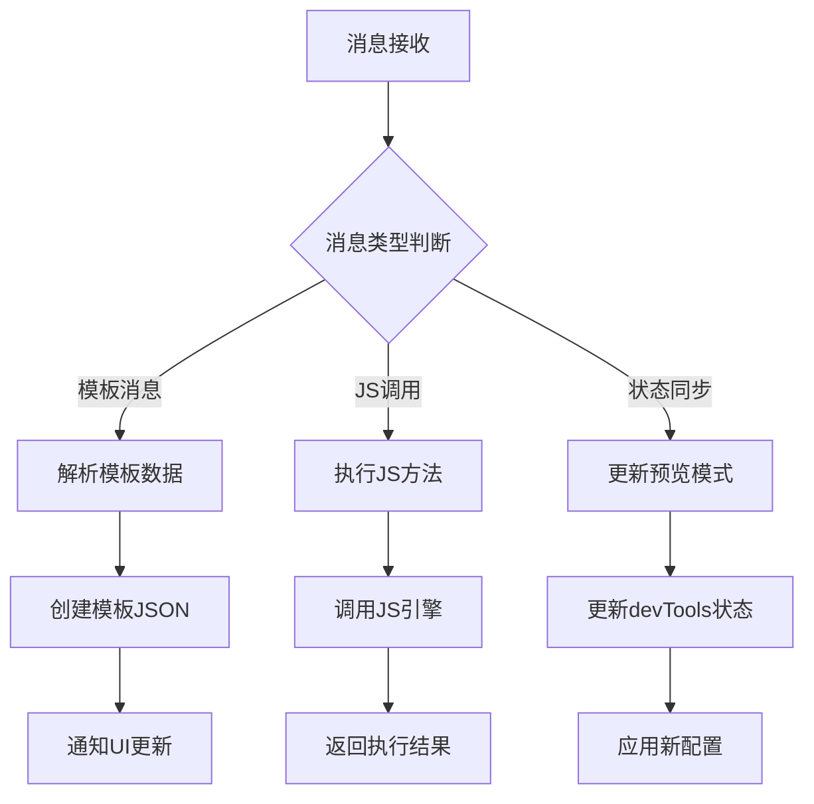
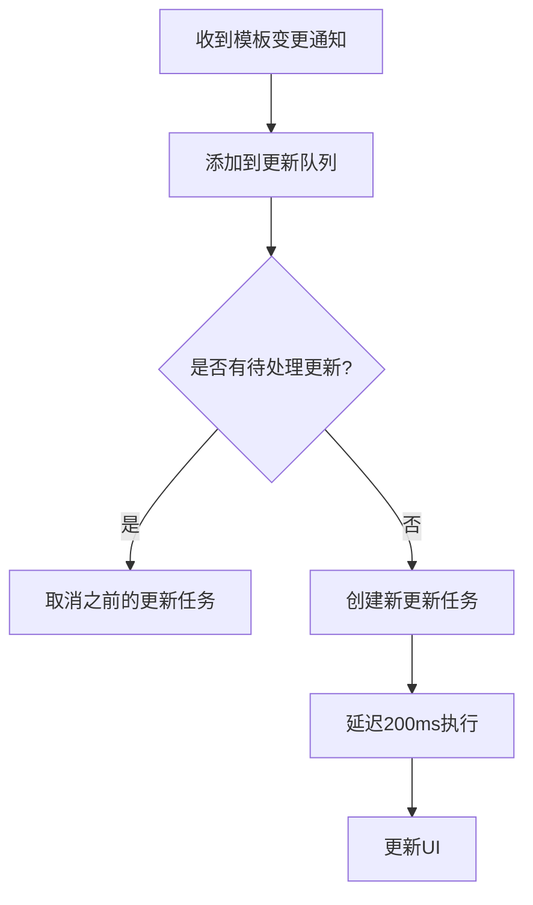

# 消息系统与数据同步

<cite>
**本文档引用的文件**   
- [GXSocket.kt](file://GaiaXAndroidClientToStudio/src/main/java/com/alibaba/gaiax/studio/GXSocket.kt)
- [GXSocketKey.kt](file://GaiaXAndroidClientToStudio/src/main/java/com/alibaba/gaiax/studio/GXSocketKey.kt)
- [GaiaXSocketModel.h](file://GaiaXSocketiOS/GaiaXSocket/GaiaXSocketModel.h)
- [GaiaXSocketModel.m](file://GaiaXSocketiOS/GaiaXSocket/GaiaXSocketModel.m)
- [GaiaXSocketJsonRpcDefine.h](file://GaiaXSocketiOS/GaiaXSocket/GaiaXSocketJsonRpcDefine.h)
- [GaiaXSocketJsonRpcDefine.m](file://GaiaXSocketiOS/GaiaXSocket/GaiaXSocketJsonRpcDefine.m)
</cite>

## 目录
1. [简介](#简介)
2. [消息系统架构](#消息系统架构)
3. [JSON-RPC协议详解](#json-rpc协议详解)
4. [消息格式设计](#消息格式设计)
5. [消息序列化与反序列化](#消息序列化与反序列化)
6. [消息收发机制](#消息收发机制)
7. [消息类型与应用场景](#消息类型与应用场景)
8. [消息系统与核心框架交互](#消息系统与核心框架交互)
9. [可靠性保障策略](#可靠性保障策略)
10. [常见问题与解决方案](#常见问题与解决方案)

## 简介
GaiaX开发工具的消息系统基于JSON-RPC 2.0协议构建，实现了Android与iOS平台间的实时数据同步。该系统通过WebSocket连接，支持模板更新、数据绑定和状态同步等核心功能，为开发者提供了高效、可靠的开发调试体验。

## 消息系统架构

**图示来源**
- [GXSocket.kt](file://GaiaXAndroidClientToStudio/src/main/java/com/alibaba/gaiax/studio/GXSocket.kt)
- [GaiaXSocketModel.h](file://GaiaXSocketiOS/GaiaXSocket/GaiaXSocketModel.h)
- [GaiaXSocketModel.m](file://GaiaXSocketiOS/GaiaXSocket/GaiaXSocketModel.m)

## JSON-RPC协议详解
GaiaX消息系统采用JSON-RPC 2.0协议作为通信标准，该协议定义了统一的消息格式和交互模式。系统通过`GXSocketKey`类中的常量定义了协议的基本信息：

- 协议名称：`GAIA_STUDIO_SOCKET_PROTOCOL_NAME = "jsonrpc"`
- 协议版本：`GAIA_STUDIO_SOCKET_PROTOCOL_VERSION = "2.0"`

iOS端通过`GaiaXSocketJsonRpcDefine`头文件定义了JSON-RPC的关键字段常量，包括：
- `GaiaXSocketJsonRpcKey`：协议标识键
- `GaiaXSocketJsonRpcVersion`：协议版本号
- `GaiaXSocketJsonRpcIdKey`：消息ID键
- `GaiaXSocketJsonRpcMethodKey`：方法名键
- `GaiaXSocketJsonRpcParamsKey`：参数键
- `GaiaXSocketJsonRpcResultKey`：结果键
- `GaiaXSocketJsonRpcErrorKey`：错误键

**本节来源**
- [GXSocketKey.kt](file://GaiaXAndroidClientToStudio/src/main/java/com/alibaba/gaiax/studio/GXSocketKey.kt)
- [GaiaXSocketJsonRpcDefine.h](file://GaiaXSocketiOS/GaiaXSocket/GaiaXSocketJsonRpcDefine.h)
- [GaiaXSocketJsonRpcDefine.m](file://GaiaXSocketiOS/GaiaXSocket/GaiaXSocketJsonRpcDefine.m)

## 消息格式设计
消息系统定义了三种基本消息类型：请求、响应和通知。每种消息都包含标准的JSON-RPC字段。

### 消息字段定义
| 字段 | 类型 | 说明 |
|------|------|------|
| jsonrpc | String | 协议版本，固定为"2.0" |
| id | Integer | 消息ID，用于匹配请求与响应 |
| method | String | 方法名称，标识操作类型 |
| params | Object | 参数对象，包含方法调用所需数据 |
| result | Object | 响应结果，仅响应消息包含 |
| error | Object | 错误信息，仅错误响应包含 |

### 消息类型

**图示来源**
- [GaiaXSocketModel.h](file://GaiaXSocketiOS/GaiaXSocket/GaiaXSocketModel.h)
- [GaiaXSocketModel.m](file://GaiaXSocketiOS/GaiaXSocket/GaiaXSocketModel.m)

## 消息序列化与反序列化
消息系统在Android和iOS平台上分别实现了消息的序列化与反序列化功能。

### Android端实现
Android端使用`GXSocket`类处理消息的序列化与反序列化。通过`JSONObject`类构建和解析JSON消息，关键方法包括：
- `sendMessage(data: JSONObject)`：发送消息
- `onMessage(message: String?, data: T)`：接收并处理消息
- `createTemplateData(templateData: JSONObject)`：创建模板数据

消息ID通过`methodIdManager`映射表管理，确保请求与响应的正确匹配。

### iOS端实现
iOS端通过`GaiaXSocketModel`类实现消息的序列化与反序列化：
- `initWithMessageString:`：从JSON字符串初始化消息对象
- `stringifyModel`：将消息对象序列化为JSON字符串
- `requestWithMethod:params:`：创建请求消息
- `responseWithMessageId:result:`：创建成功响应
- `responseWithMessageId:error:`：创建错误响应
- `notificationWithMethod:params:`：创建通知消息

**本节来源**
- [GXSocket.kt](file://GaiaXAndroidClientToStudio/src/main/java/com/alibaba/gaiax/studio/GXSocket.kt)
- [GaiaXSocketModel.h](file://GaiaXSocketiOS/GaiaXSocket/GaiaXSocketModel.h)
- [GaiaXSocketModel.m](file://GaiaXSocketiOS/GaiaXSocket/GaiaXSocketModel.m)

## 消息收发机制
消息系统提供了完整的消息收发机制，支持同步和异步通信模式。

### 消息发送流程

### 消息接收流程

**本节来源**
- [GXSocket.kt](file://GaiaXAndroidClientToStudio/src/main/java/com/alibaba/gaiax/studio/GXSocket.kt)
- [GaiaXSocketModel.m](file://GaiaXSocketiOS/GaiaXSocket/GaiaXSocketModel.m)

## 消息类型与应用场景
消息系统支持多种消息类型，每种类型对应特定的应用场景。

### 核心消息类型

### 典型应用场景
#### 模板更新流程

#### 数据绑定流程

**本节来源**
- [GXSocket.kt](file://GaiaXAndroidClientToStudio/src/main/java/com/alibaba/gaiax/studio/GXSocket.kt)

## 消息系统与核心框架交互
消息系统与GaiaX核心框架紧密集成，实现了数据的实时同步。

### 交互流程

### 核心交互点
- `onStudioAddData`：添加模板数据
- `onStudioUpdate`：更新模板
- `onReceiveCallSync`：接收同步JS调用
- `onReceiveCallAsync`：接收异步JS调用
- `onReceiveCallPromise`：接收Promise调用

**本节来源**
- [GXSocket.kt](file://GaiaXAndroidClientToStudio/src/main/java/com/alibaba/gaiax/studio/GXSocket.kt)

## 可靠性保障策略
消息系统实现了多种可靠性保障机制，确保数据同步的稳定性和一致性。

### 消息确认机制
系统采用消息ID匹配机制，确保请求与响应的正确对应。Android端通过`methodIdManager`映射表维护请求ID与方法名的对应关系。

### 子模板加载管理
系统通过`subTemplateCount`计数器管理子模板的加载过程：
- 加载主模板时，递增计数器并发送子模板请求
- 每收到一个子模板响应，递减计数器
- 当计数器归零时，触发最终的更新通知

### 延迟更新机制
为避免频繁更新，系统采用200ms的延迟更新策略：

**本节来源**
- [GXSocket.kt](file://GaiaXAndroidClientToStudio/src/main/java/com/alibaba/gaiax/studio/GXSocket.kt)

## 常见问题与解决方案
### 消息乱序问题
**问题描述**：由于网络延迟，消息可能以非预期顺序到达。
**解决方案**：系统通过消息ID和方法名映射表确保消息处理的正确性，不依赖消息到达顺序。

### 消息超时问题
**问题描述**：请求消息长时间未收到响应。
**解决方案**：WebSocket连接配置了15秒的连接超时时间，确保及时发现连接问题。

### 消息重复问题
**问题描述**：同一消息被多次处理。
**解决方案**：系统通过`lastTemplateId`记录最后处理的模板ID，避免重复处理相同模板。

### 消息丢失问题
**问题描述**：消息在网络传输中丢失。
**解决方案**：WebSocket连接配置了自动重连机制，断开后会自动重连，确保连接的稳定性。

**本节来源**
- [GXSocket.kt](file://GaiaXAndroidClientToStudio/src/main/java/com/alibaba/gaiax/studio/GXSocket.kt)