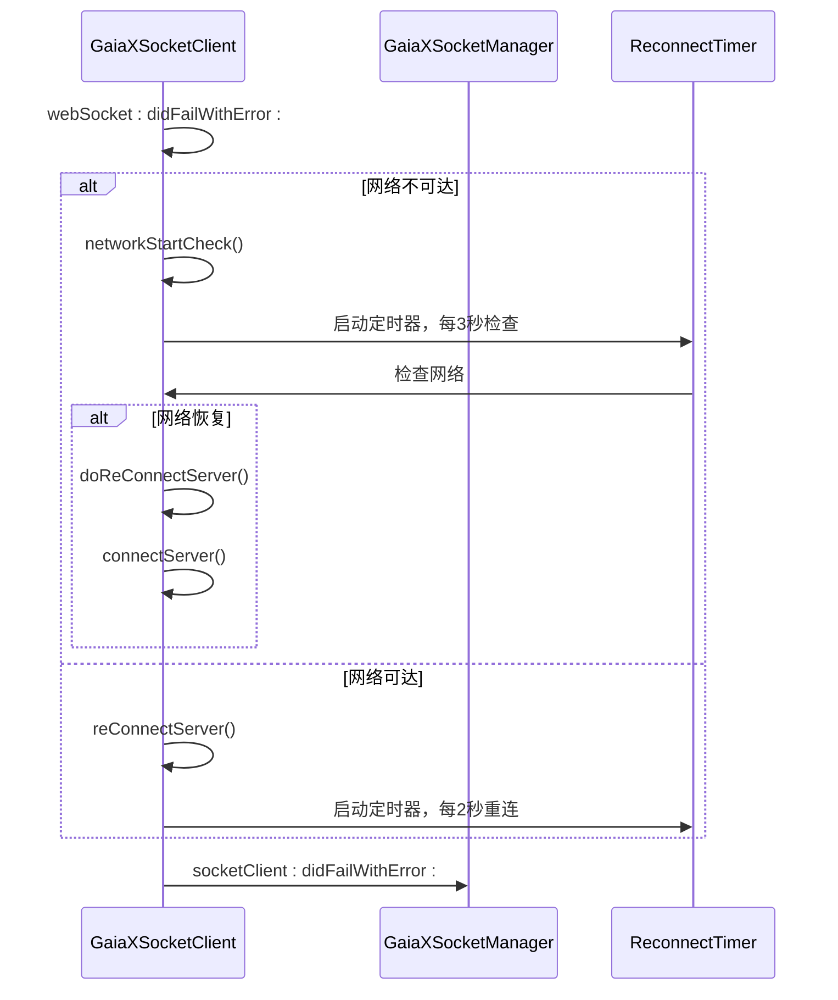
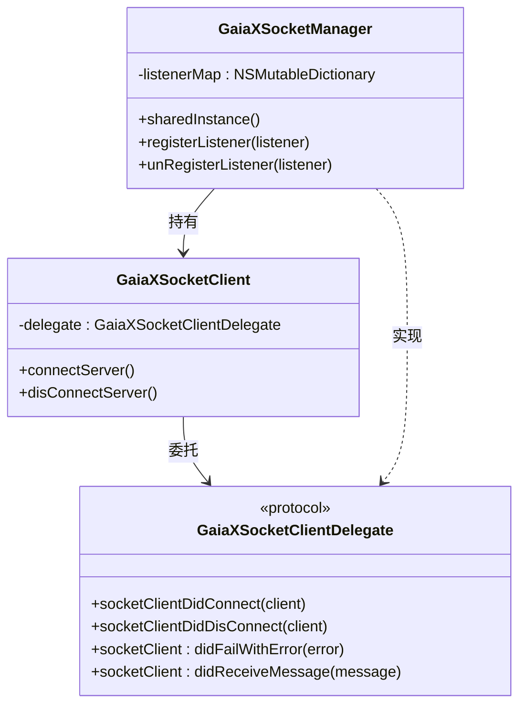

# 错误处理机制

<cite>
**本文档引用的文件**   
- [GXSocket.kt](file://GaiaXAndroidClientToStudio/src/main/java/com/alibaba/gaiax/studio/GXSocket.kt)
- [GaiaXSocketManager.m](file://GaiaXSocketiOS/GaiaXSocket/GaiaXSocketManager.m)
- [GaiaXSocketClient.m](file://GaiaXSocketiOS/GaiaXSocket/GaiaXSocketClient.m)
- [WebSocketManager.java](file://GaiaXAndroidClientToStudio/src/main/java/com/alibaba/gaiax/studio/third/socket/websocket/WebSocketManager.java)
</cite>

## 目录
1. [简介](#简介)
2. [Android端错误处理机制](#android端错误处理机制)
3. [iOS端错误处理机制](#ios端错误处理机制)
4. [跨平台错误码与异常分类](#跨平台错误码与异常分类)
5. [常见错误场景与解决方案](#常见错误场景与解决方案)
6. [消息可靠性保障策略](#消息可靠性保障策略)
7. [最佳实践](#最佳实践)

## 简介
GaiaX消息系统为开发者提供了稳定可靠的实时通信能力，支持在Android和iOS平台上进行高效的模板数据同步与调试。该系统基于WebSocket协议构建，具备完善的错误处理机制，能够有效应对网络异常、消息丢失、连接超时等常见问题。

本文档深入分析GaiaX消息系统的错误处理实现，重点介绍Android端`GXSocket.kt`中的异常捕获与重连机制，以及iOS端`GaiaXSocketManager.m`的错误反馈流程。通过对比双平台实现，阐述其在连接管理、心跳检测、超时处理等方面的设计理念，并为不同经验水平的开发者提供实用的错误处理指导。

## Android端错误处理机制

### 异常捕获与连接状态管理
Android端通过`GXSocket`类实现WebSocket连接的封装，该类实现了`SocketListener`接口，用于监听连接生命周期事件。核心异常捕获机制体现在以下几个回调方法中：

- **`onConnectFailed(e: Throwable)`**：当连接失败时触发，记录错误日志并更新连接状态`gxSocketIsConnected`为`false`。
- **`onDisconnect()`**：连接断开时调用，负责清理资源并通知监听器。
- **`onSendDataError(errorResponse: ErrorResponse?)`**：发送数据失败时的回调，目前为空实现，可扩展用于重试逻辑。

**Section sources**
- [GXSocket.kt](file://GaiaXAndroidClientToStudio/src/main/java/com/alibaba/gaiax/studio/GXSocket.kt#L103-L118)
- [GXSocket.kt](file://GaiaXAndroidClientToStudio/src/main/java/com/alibaba/gaiax/studio/GXSocket.kt#L120-L121)

### 自动重连策略
Android端的重连机制由底层`WebSocketManager`和`DefaultReconnectManager`协同实现。`GXSocket`在初始化`WebSocketSetting`时配置了关键参数：

```kotlin
webSocketSetting?.connectTimeout = 15 * 1000 // 连接超时时间
webSocketSetting?.connectionLostTimeout = 0  // 心跳超时（0表示不启用）
webSocketSetting?.reconnectFrequency = 1     // 重连频率
webSocketSetting?.setReconnectWithNetworkChanged(true) // 网络变化时自动重连
```

当连接断开且非用户主动断开时，`WebSocketManager`会通过`getSocketWrapperListener()`中的`onDisconnect()`回调触发`DefaultReconnectManager`的`startReconnect()`方法，实现自动重连。

**Section sources**
- [GXSocket.kt](file://GaiaXAndroidClientToStudio/src/main/java/com/alibaba/gaiax/studio/GXSocket.kt#L82-L90)
- [WebSocketManager.java](file://GaiaXAndroidClientToStudio/src/main/java/com/alibaba/gaiax/studio/third/socket/websocket/WebSocketManager.java#L360-L380)

### 超时处理
Android端的超时处理主要体现在连接超时和网络状态监控上：
- **连接超时**：通过`WebSocketSetting.connectTimeout`设置为15秒，超过此时间未建立连接则判定为失败。
- **网络状态变化重连**：通过`setReconnectWithNetworkChanged(true)`和注册`NetworkChangedReceiver`，在网络恢复时自动尝试重连。

**Section sources**
- [GXSocket.kt](file://GaiaXAndroidClientToStudio/src/main/java/com/alibaba/gaiax/studio/GXSocket.kt#L82-L90)

## iOS端错误处理机制

### 连接与断开处理
iOS端通过`GaiaXSocketManager`单例管理连接，其核心逻辑在`GaiaXSocketClient`中实现。`GaiaXSocketClient`遵循`SRWebSocketDelegate`协议，处理底层WebSocket事件。

- **连接成功**：`webSocketDidOpen:`回调中更新状态并通知所有注册的监听器。
- **连接失败**：`webSocket:didFailWithError:`回调中，根据网络状态决定是立即重连还是等待网络恢复。
- **主动断开**：`disConnectServer:`方法会设置`closeManually`标志，防止触发自动重连。



**Diagram sources**
- [GaiaXSocketClient.m](file://GaiaXSocketiOS/GaiaXSocket/GaiaXSocketClient.m#L195-L210)
- [GaiaXSocketClient.m](file://GaiaXSocketiOS/GaiaXSocket/GaiaXSocketClient.m#L273-L277)

### 心跳包与网络检测
iOS端实现了主动的网络状态检测机制：
- **网络可达性检查**：使用`GaiaXSocketUtils isNetworkReachable`方法定期（每3秒）检查网络状态。
- **自动重连**：当检测到网络中断时，会断开连接并启动一个定时器，定期尝试重新连接。

**Section sources**
- [GaiaXSocketClient.m](file://GaiaXSocketiOS/GaiaXSocket/GaiaXSocketClient.m#L137-L145)

## 跨平台错误码与异常分类

### 错误码定义
虽然代码中未显式定义错误码常量，但通过分析可以归纳出以下错误类型：

| 错误类型 | 描述 | 触发场景 |
| :--- | :--- | :--- |
| 连接失败 | 建立WebSocket连接失败 | 网络问题、服务器地址错误、超时 |
| 连接断开 | 已建立的连接意外中断 | 网络波动、服务器重启、客户端切后台 |
| 数据发送失败 | 无法将消息发送到服务器 | 连接未建立、连接已断开 |
| 消息解析失败 | 服务器返回的消息格式不符合JSON-RPC规范 | 服务器端bug、网络传输错误 |

### 用户反馈机制
iOS端通过`GaiaXSocketManager`的`listenerMap`管理多个监听器，当发生连接、断开或接收消息等事件时，会遍历所有监听器并调用其对应的代理方法，实现了灵活的事件分发机制。



**Diagram sources**
- [GaiaXSocketManager.m](file://GaiaXSocketiOS/GaiaXSocket/GaiaXSocketManager.m#L19-L25)
- [GaiaXSocketClient.m](file://GaiaXSocketiOS/GaiaXSocket/GaiaXSocketClient.m#L21-L23)
- [GaiaXSocketProtocol.h](file://GaiaXSocketiOS/GaiaXSocket/GaiaXSocketProtocol.h#L19-L19)

## 常见错误场景与解决方案

### 网络不稳定导致的消息丢失
**场景描述**：在弱网环境下，WebSocket连接可能频繁断开重连，导致消息丢失。

**解决方案**：
1. **Android端**：依赖底层库的自动重连机制，确保连接恢复后能继续通信。
2. **iOS端**：通过`reConnectTimer`实现指数退避或固定间隔重连，避免频繁请求。
3. **应用层**：对于关键消息（如模板更新），可设计消息确认机制，客户端发送后等待服务端ACK。

### 连接超时
**场景描述**：首次连接或重连时，因网络延迟或服务器响应慢导致超时。

**解决方案**：
- **Android端**：合理设置`connectTimeout`（如15秒），避免过短导致频繁失败，过长影响用户体验。
- **iOS端**：`SRWebSocket`库内部处理超时，无需额外配置。

## 消息可靠性保障策略

### 消息确认机制
当前代码未实现显式的消息确认（ACK）机制。对于需要高可靠性的消息，建议在应用层实现：
- 发送方为每条消息生成唯一ID。
- 接收方处理完消息后，发送一个包含原消息ID的确认响应。
- 发送方设置超时定时器，若未收到确认，则进行重试。

### 重复消息过滤
由于重连可能导致消息重复，接收方应具备幂等性处理能力：
- 利用消息中的`id`字段作为去重依据。
- 维护一个已处理消息ID的缓存（如`Set`），在处理新消息前先检查是否已存在。

### 状态同步恢复
当连接恢复后，客户端可能丢失了部分状态。可通过以下方式恢复：
- **Android端**：`GXSocket`在`onMessage`中通过`methodIdManager`管理方法ID，确保响应能正确路由。
- **全量同步**：连接建立后，主动向服务器请求最新的完整状态。

## 最佳实践

### 为初学者提供的建议
1. **正确初始化**：确保在调用`connectToServer()`前传入有效的服务器地址。
2. **监听连接状态**：实现`GXSocketListener`，在`onSocketDisconnected()`中提示用户检查网络。
3. **优雅断开**：使用`disconnectToServer()`而非直接销毁对象，确保资源被正确释放。

### 为经验丰富的开发者提供的建议
1. **扩展错误处理**：重写`onSendDataError`方法，实现带退避策略的重试逻辑。
2. **监控与日志**：增强日志记录，捕获`onConnectFailed`中的`Throwable`详细信息，便于问题排查。
3. **性能优化**：对于高频消息，考虑批量发送或使用二进制帧（`send(ByteBuffer)`）以减少开销。