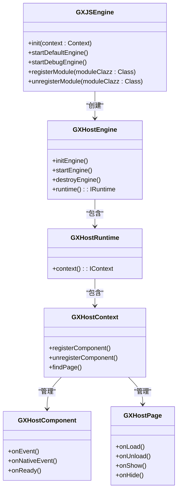
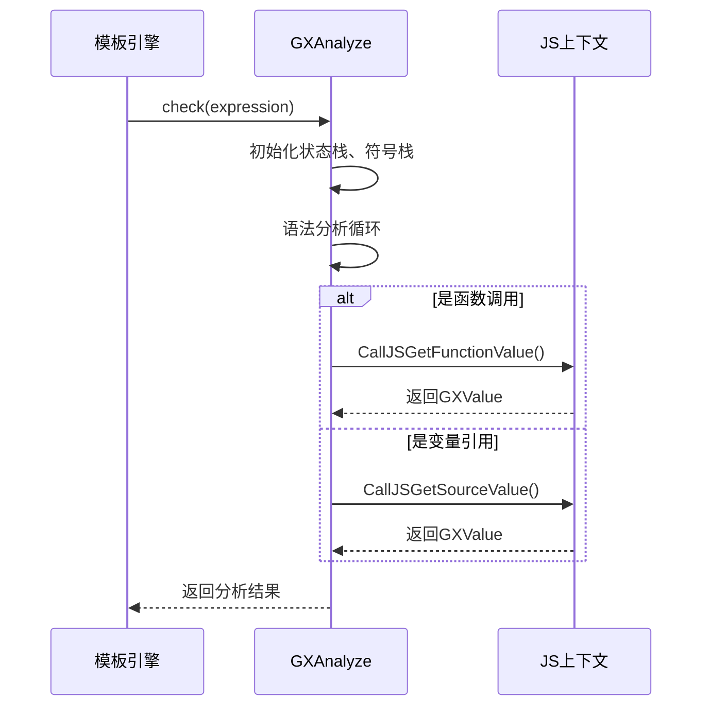
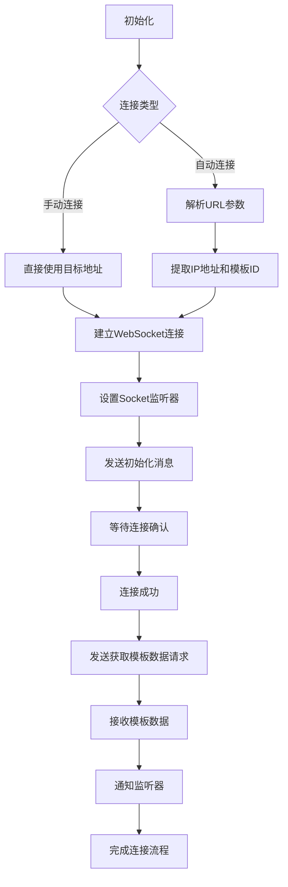
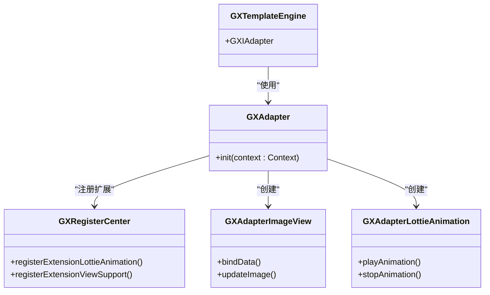
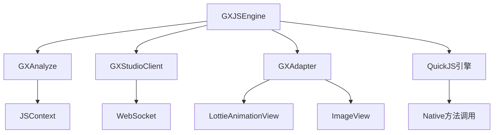

# 扩展功能

<cite>
**本文档中引用的文件**  
- [GXJSEngine.kt](file://GaiaXAndroidJS/src/main/kotlin/com/alibaba/gaiax/js/GXJSEngine.kt)
- [GXStudioClient.kt](file://GaiaXAndroidClientToStudio/src/main/java/com/alibaba/gaiax/studio/GXStudioClient.kt)
- [GXAdapter.kt](file://GaiaXAndroidAdapter/src/main/java/com/alibaba/gaiax/adapter/GXAdapter.kt)
- [GXAnalyze.cpp](file://GaiaXAnalyze/GXAnalyzeAndroid/src/main/cpp/GXAnalyzeCore/GXAnalyze.cpp)
- [GXHostEngine.kt](file://GaiaXAndroidJS/src/main/kotlin/com/alibaba/gaiax/js/engine/GXHostEngine.kt)
- [GXHostContext.kt](file://GaiaXAndroidJS/src/main/kotlin/com/alibaba/gaiax/js/engine/GXHostContext.kt)
- [GXHostComponent.kt](file://GaiaXAndroidJS/src/main/kotlin/com/alibaba/gaiax/js/engine/GXHostComponent.kt)
- [GXHostPage.kt](file://GaiaXAndroidJS/src/main/kotlin/com/alibaba/gaiax/js/engine/GXHostPage.kt)
- [GXHostRuntime.kt](file://GaiaXAndroidJS/src/main/kotlin/com/alibaba/gaiax/js/engine/GXHostRuntime.kt)
- [GXSocket.kt](file://GaiaXAndroidClientToStudio/src/main/java/com/alibaba/gaiax/studio/GXSocket.kt)
- [GXSocketKey.kt](file://GaiaXAndroidClientToStudio/src/main/java/com/alibaba/gaiax/studio/GXSocketKey.kt)
- [IDevTools.kt](file://GaiaXAndroidClientToStudio/src/main/java/com/alibaba/gaiax/studio/IDevTools.kt)
- [GXAdapterImageView.kt](file://GaiaXAndroidAdapter/src/main/java/com/alibaba/gaiax/adapter/GXAdapterImageView.kt)
- [GXAdapterLottieAnimation.kt](file://GaiaXAndroidAdapter/src/main/java/com/alibaba/gaiax/adapter/GXAdapterLottieAnimation.kt)
- [Log.kt](file://GaiaXAndroidAdapter/src/main/java/com/alibaba/gaiax/adapter/Log.kt)
</cite>

## 目录
1. [简介](#简介)
2. [JS引擎集成](#js引擎集成)
3. [表达式分析](#表达式分析)
4. [开发工具集成](#开发工具集成)
5. [适配器模式支持](#适配器模式支持)
6. [组件依赖关系](#组件依赖关系)
7. [性能优化建议](#性能优化建议)
8. [常见问题与最佳实践](#常见问题与最佳实践)
9. [结论](#结论)

## 简介
GaiaX框架通过一系列扩展功能实现了高度可定制化和灵活的动态化能力。本文档深入分析其四大核心扩展机制：JS引擎集成、表达式分析、开发工具集成和适配器模式支持。这些功能共同构成了GaiaX强大的动态渲染和开发调试能力，为开发者提供了从底层实现到上层应用的完整解决方案。

## JS引擎集成

GaiaX通过GXJSEngine实现JavaScript脚本支持，为模板提供动态逻辑处理能力。该引擎基于QuickJS实现，支持在Android平台上执行JavaScript代码，并与原生组件进行双向通信。

GXJSEngine作为JS引擎的管理类，负责引擎的初始化、启动、关闭以及自定义模块的注册。它支持两种引擎类型：QuickJS（生产环境）和DebugJS（调试环境），通过`startDefaultEngine()`和`startDebugEngine()`方法分别启动。引擎采用单例模式，通过`lazy`委托确保全局唯一实例。

引擎初始化时会从assets目录加载自定义模块配置文件（`gaiax_js_modules/module_*.json`），并根据配置动态注册JS模块。模块注册机制允许开发者扩展JS功能，通过继承`GXJSBaseModule`类实现自定义功能模块。

**图示来源**
- [GXJSEngine.kt](file://GaiaXAndroidJS/src/main/kotlin/com/alibaba/gaiax/js/GXJSEngine.kt)
- [GXHostEngine.kt](file://GaiaXAndroidJS/src/main/kotlin/com/alibaba/gaiax/js/engine/GXHostEngine.kt)
- [GXHostRuntime.kt](file://GaiaXAndroidJS/src/main/kotlin/com/alibaba/gaiax/js/engine/GXHostRuntime.kt)
- [GXHostContext.kt](file://GaiaXAndroidJS/src/main/kotlin/com/alibaba/gaiax/js/engine/GXHostContext.kt)
- [GXHostComponent.kt](file://GaiaXAndroidJS/src/main/kotlin/com/alibaba/gaiax/js/engine/GXHostComponent.kt)
- [GXHostPage.kt](file://GaiaXAndroidJS/src/main/kotlin/com/alibaba/gaiax/js/engine/GXHostPage.kt)

**本节来源**
- [GXJSEngine.kt](file://GaiaXAndroidJS/src/main/kotlin/com/alibaba/gaiax/js/GXJSEngine.kt#L1-L426)

## 表达式分析

GaiaX通过GXAnalyze组件实现表达式分析功能，支持在模板中使用JavaScript表达式进行动态计算。该功能基于语法分析技术，将表达式字符串解析为抽象语法树（AST），并缓存分析结果以提高执行效率。

GXAnalyze的核心是`check`方法，它实现了语法分析并生成缓存表达式的过程。该方法使用状态栈和符号栈进行语法分析，通过预测分析表确定语法结构。分析过程中会构建值栈和参数栈，用于存储中间计算结果和函数参数。

表达式分析支持变量引用、函数调用、算术运算、逻辑运算等多种语法结构。分析结果以GXValue类型返回，支持布尔、浮点、字符串等多种数据类型。对于函数调用，系统会通过`CallJSGetFunctionValue`回调机制在JS环境中执行函数并返回结果。

**图示来源**
- [GXAnalyze.cpp](file://GaiaXAnalyze/GXAnalyzeAndroid/src/main/cpp/GXAnalyzeCore/GXAnalyze.cpp#L1469-L1506)
- [GXNapiAnalyze.cpp](file://GaiaXHarmony/GaiaXAnalyze/GaiaXAnalyzeHarmony/GaiaXAnalyze/src/main/cpp/GXNapiAnalyze.cpp#L150-L177)
- [GXNapiAnalyze.cpp](file://GaiaXHarmony/GaiaXAnalyze/GaiaXAnalyzeHarmony/GaiaXAnalyze/src/main/cpp/GXNapiAnalyze.cpp#L203-L228)

**本节来源**
- [GXAnalyze.cpp](file://GaiaXAnalyze/GXAnalyzeAndroid/src/main/cpp/GXAnalyzeCore/GXAnalyze.cpp#L1469-L1506)

## 开发工具集成

GaiaX通过GXStudioClient实现可视化开发工具连接功能，支持实时预览、数据推送和调试模式切换。该功能基于WebSocket协议，实现移动端与开发工具之间的双向通信。

GXStudioClient作为连接客户端，负责建立与GaiaX Studio的WebSocket连接。它支持自动连接和手动连接两种模式，通过解析URL参数获取连接地址和模板ID。连接建立后，客户端会发送初始化消息，并监听来自开发工具的各种指令。

系统支持多种消息类型，包括模板数据获取、模板更新、预览模式切换、JS调试模式切换等。通过`IFastPreviewListener`接口，客户端可以接收模板数据更新事件，并通知上层应用重新渲染。通过`ISocketReceiver`接口，可以接收来自JS环境的调用请求。

**图示来源**
- [GXStudioClient.kt](file://GaiaXAndroidClientToStudio/src/main/java/com/alibaba/gaiax/studio/GXStudioClient.kt)
- [GXSocket.kt](file://GaiaXAndroidClientToStudio/src/main/java/com/alibaba/gaiax/studio/GXSocket.kt)

**本节来源**
- [GXStudioClient.kt](file://GaiaXAndroidClientToStudio/src/main/java/com/alibaba/gaiax/studio/GXStudioClient.kt#L1-L282)

## 适配器模式支持

GaiaX通过GXAdapter实现适配器模式支持，允许开发者自定义组件和扩展功能。该机制基于注册中心模式，通过GXRegisterCenter实现功能扩展点的动态注册。

GXAdapter作为默认适配器实现，负责注册各种扩展组件。它通过`registerExtensionLottieAnimation`方法注册Lottie动画扩展，通过`registerExtensionViewSupport`方法注册自定义视图支持。系统预置了图片视图和Lottie视图的适配器实现。

适配器模式采用策略设计模式，不同的适配器实现对应不同的组件类型。例如，GXAdapterImageView处理图片显示逻辑，GXAdapterLottieAnimation处理Lottie动画播放逻辑。这种设计实现了关注点分离，使每种组件类型都有专门的处理逻辑。

**图示来源**
- [GXAdapter.kt](file://GaiaXAndroidAdapter/src/main/java/com/alibaba/gaiax/adapter/GXAdapter.kt)
- [GXAdapterImageView.kt](file://GaiaXAndroidAdapter/src/main/java/com/alibaba/gaiax/adapter/GXAdapterImageView.kt)
- [GXAdapterLottieAnimation.kt](file://GaiaXAndroidAdapter/src/main/java/com/alibaba/gaiax/adapter/GXAdapterLottieAnimation.kt)
- [GXRegisterCenter](file://GaiaXAndroid/src/main/kotlin/com/alibaba/gaiax/GXRegisterCenter.kt)

**本节来源**
- [GXAdapter.kt](file://GaiaXAndroidAdapter/src/main/java/com/alibaba/gaiax/adapter/GXAdapter.kt#L1-L62)

## 组件依赖关系

GaiaX的扩展功能组件之间存在明确的依赖关系。GXJSEngine作为核心，依赖于GXAnalyze进行表达式分析，依赖于GXStudioClient进行调试连接，依赖于GXAdapter进行组件适配。

JS引擎在执行过程中需要调用表达式分析器来解析模板中的表达式，需要通过Socket连接向开发工具发送日志信息，需要使用适配器来创建和管理自定义组件。这些依赖关系通过接口注入的方式实现，保证了组件之间的松耦合。

**图示来源**
- [GXJSEngine.kt](file://GaiaXAndroidJS/src/main/kotlin/com/alibaba/gaiax/js/GXJSEngine.kt)
- [GXAnalyze.cpp](file://GaiaXAnalyze/GXAnalyzeAndroid/src/main/cpp/GXAnalyzeCore/GXAnalyze.cpp)
- [GXStudioClient.kt](file://GaiaXAndroidClientToStudio/src/main/java/com/alibaba/gaiax/studio/GXStudioClient.kt)
- [GXAdapter.kt](file://GaiaXAndroidAdapter/src/main/java/com/alibaba/gaiax/adapter/GXAdapter.kt)

**本节来源**
- [GXJSEngine.kt](file://GaiaXAndroidJS/src/main/kotlin/com/alibaba/gaiax/js/GXJSEngine.kt#L1-L426)
- [GXAnalyze.cpp](file://GaiaXAnalyze/GXAnalyzeAndroid/src/main/cpp/GXAnalyzeCore/GXAnalyze.cpp#L1469-L1506)
- [GXStudioClient.kt](file://GaiaXAndroidClientToStudio/src/main/java/com/alibaba/gaiax/studio/GXStudioClient.kt#L1-L282)
- [GXAdapter.kt](file://GaiaXAndroidAdapter/src/main/java/com/alibaba/gaiax/adapter/GXAdapter.kt#L1-L62)

## 性能优化建议

为确保GaiaX扩展功能的高性能运行，建议采取以下优化措施：

1. **JS引擎优化**：合理管理引擎生命周期，在不需要时及时调用`stopDefaultEngine()`释放资源。避免频繁创建和销毁引擎实例。

2. **表达式缓存**：GXAnalyze已内置表达式分析结果缓存机制，建议在模板设计时尽量使用可缓存的表达式结构，避免使用动态变化的表达式文本。

3. **连接管理**：GXStudioClient的WebSocket连接应妥善管理，应用进入后台时应断开连接，返回前台时再重新连接，以节省网络资源和电量。

4. **适配器复用**：自定义适配器应实现视图复用机制，避免每次绑定数据时都创建新视图，提高列表滚动性能。

5. **模块懒加载**：对于不常用的JS模块，建议采用懒加载方式，在需要时才进行注册和初始化。

## 常见问题与最佳实践

### 常见问题

1. **JS引擎启动失败**：检查assets目录下是否有正确的模块配置文件，确保文件名符合`module_*.json`命名规范。

2. **表达式分析错误**：检查表达式语法是否正确，避免使用不支持的JS语法特性。

3. **WebSocket连接失败**：检查设备网络状态，确保没有开启VPN，确认IP地址和端口正确。

4. **自定义组件不显示**：确认适配器已正确注册，检查组件类型标识符是否匹配。

### 最佳实践

1. **模块化设计**：将JS功能按业务领域拆分为多个模块，便于管理和维护。

2. **错误处理**：在JS代码中添加完善的错误处理机制，通过`IJsExceptionListener`捕获并处理异常。

3. **日志监控**：利用`ILogListener`监控JS执行日志，及时发现和解决问题。

4. **资源管理**：在组件销毁时及时清理相关资源，避免内存泄漏。

## 结论

GaiaX的扩展功能通过JS引擎集成、表达式分析、开发工具集成和适配器模式支持，构建了一个完整而强大的动态化解决方案。这些功能相互协作，为开发者提供了从开发调试到生产部署的全流程支持。通过深入理解这些扩展机制的实现原理和使用方法，开发者可以充分发挥GaiaX的潜力，构建高性能、高灵活性的动态化应用。