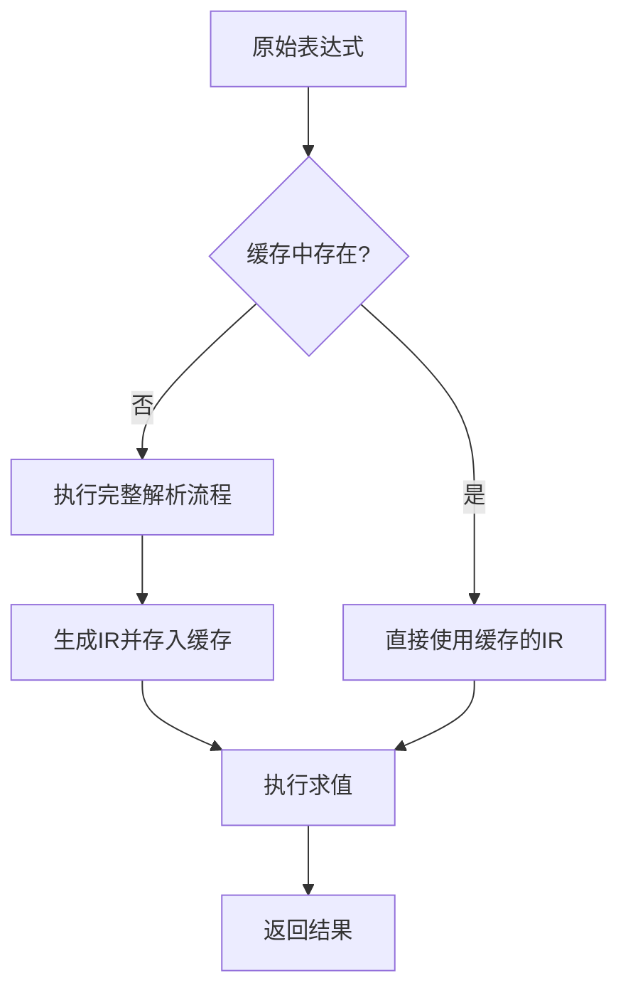
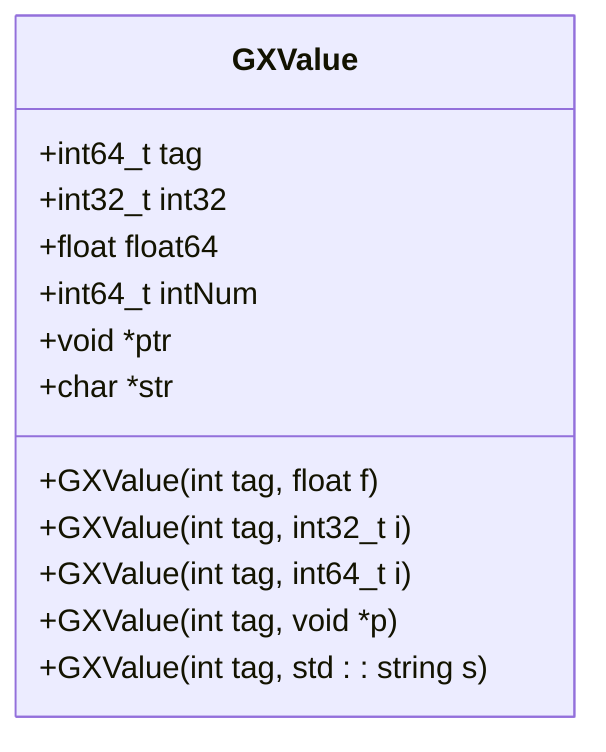
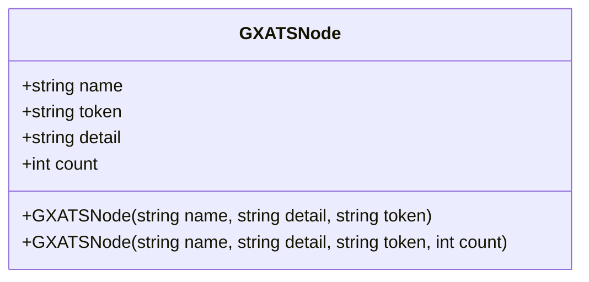

# 性能优化

<cite>
**本文档中引用的文件**  
- [GXAnalyze.cpp](file://GaiaXHarmony/GaiaXAnalyze/GXAnalyzeCore/GXAnalyze.cpp)
- [GXAnalyze.h](file://GaiaXHarmony/GaiaXAnalyze/GXAnalyzeCore/GXAnalyze.h)
- [GXATSNode.cpp](file://GaiaXHarmony/GaiaXAnalyze/GXAnalyzeCore/GXATSNode.cpp)
- [GXATSNode.h](file://GaiaXHarmony/GaiaXAnalyze/GXAnalyzeCore/GXATSNode.h)
- [GXValue.h](file://GaiaXHarmony/GaiaXAnalyze/GXAnalyzeCore/GXValue.h)
- [GXWordAnalyze.cpp](file://GaiaXHarmony/GaiaXAnalyze/GXAnalyzeCore/GXWordAnalyze.cpp)
- [GXWordAnalyze.h](file://GaiaXHarmony/GaiaXAnalyze/GXAnalyzeCore/GXWordAnalyze.h)
- [GXExpression.m](file://GaiaXiOS/GaiaXiOS/Binding/Expression/GXExpression.m)
- [GXCacheCenter.m](file://GaiaXiOS/GaiaXiOS/Template/Cache/GXCacheCenter.m)
- [GXExtensionExpression.kt](file://GaiaXAndroid/src/main/kotlin/com/alibaba/gaiax/expression/GXExtensionExpression.kt)
</cite>

## 目录
1. [引言](#引言)
2. [表达式分析引擎性能瓶颈](#表达式分析引擎性能瓶颈)
3. [缓存机制实现原理](#缓存机制实现原理)
4. [GXValue与GXATSNode数据结构优化](#gxvalue与gxatsnode数据结构优化)
5. [内存与算法优化策略](#内存与算法优化策略)
6. [性能监控与基准测试](#性能监控与基准测试)
7. [跨设备性能一致性](#跨设备性能一致性)
8. [性能调优建议](#性能调优建议)
9. [结论](#结论)

## 引言

GaiaX表达式分析引擎是实现动态模板渲染的核心组件，负责解析和求值模板中的表达式。在高频率、高并发的使用场景下，表达式求值的性能直接影响用户体验。本文档深入分析GaiaX表达式分析引擎的性能瓶颈，并详细阐述其优化策略，包括缓存机制、数据结构设计、内存管理以及算法复杂度优化。通过剖析实际代码库中的实现，为开发者提供从基础到高级的性能调优指导。

## 表达式分析引擎性能瓶颈

表达式分析引擎的主要性能瓶颈集中在表达式的解析和求值过程。在未优化的情况下，每次求值都需要经历完整的词法分析、语法分析和语义分析流程，这在高频率调用场景下会产生显著的性能开销。

### 词法与语法分析开销

词法分析（Lexical Analysis）将原始表达式字符串分解为有意义的词法单元（Token），而语法分析（Syntax Analysis）则根据预定义的文法规则构建语法树。这两个过程涉及大量的字符串操作和状态机遍历，时间复杂度较高。例如，在`GXWordAnalyze.cpp`中，`scanner`函数通过遍历字符数组来识别关键字、标识符、数字和运算符，这一过程对字符串的频繁操作是性能消耗的主要来源之一。

### 高频求值场景下的重复计算

在动态UI渲染中，同一表达式可能被频繁求值。如果每次求值都重新解析，将导致大量重复的计算工作。例如，在列表滚动或动画过程中，绑定的表达式会随着数据变化而反复求值，若无缓存机制，性能将急剧下降。

**Section sources**
- [GXWordAnalyze.cpp](file://GaiaXHarmony/GaiaXAnalyze/GXAnalyzeCore/GXWordAnalyze.cpp#L81-L411)
- [GXAnalyze.cpp](file://GaiaXHarmony/GaiaXAnalyze/GXAnalyzeCore/GXAnalyze.cpp#L1483-L1520)

## 缓存机制实现原理

为解决上述性能瓶颈，GaiaX引入了高效的缓存机制，将耗时的解析过程与快速的求值过程分离，实现解析结果的缓存和复用。

### 缓存策略与数据结构

缓存机制的核心是将解析后的表达式转换为一种可快速求值的中间表示（Intermediate Representation, IR）。在`GXAnalyze.cpp`中，`check`函数负责语法分析并生成缓存表达式，而`calculateCache`函数则利用该缓存进行快速求值。

**Diagram sources**
- [GXAnalyze.cpp](file://GaiaXHarmony/GaiaXAnalyze/GXAnalyzeCore/GXAnalyze.cpp#L1483-L1520)
- [GXAnalyze.cpp](file://GaiaXHarmony/GaiaXAnalyze/GXAnalyzeCore/GXAnalyze.cpp#L1221-L1266)

### 缓存的生成与复用

1.  **首次解析**：当一个新表达式被求值时，引擎会调用`check`函数。该函数使用LR(1)分析法，通过状态栈、符号栈和值栈来模拟语法分析过程，最终生成一个由数字和操作符组成的“缓存字符串”（cacheString），这个字符串代表了求值的指令序列。
2.  **缓存存储**：生成的`cacheString`与原始表达式关联，并存储在全局缓存映射（`unordered_map<string, string> cache`）中。
3.  **后续求值**：当同一表达式再次被求值时，引擎首先在缓存中查找。如果命中，则直接调用`calculateCache`函数，该函数根据`cacheString`中的指令，直接操作值栈（`valueStack`）完成计算，避免了昂贵的字符串解析。

这种策略将O(n)的解析复杂度（n为表达式长度）摊销到首次调用，后续调用的复杂度接近O(1)，极大地提升了高频求值场景的性能。

**Section sources**
- [GXAnalyze.cpp](file://GaiaXHarmony/GaiaXAnalyze/GXAnalyzeCore/GXAnalyze.cpp#L1483-L1520)
- [GXAnalyze.cpp](file://GaiaXHarmony/GaiaXAnalyze/GXAnalyzeCore/GXAnalyze.cpp#L1221-L1266)
- [GXAnalyze.cpp](file://GaiaXHarmony/GaiaXAnalyze/GXAnalyzeCore/GXAnalyze.cpp#L41)

## GXValue与GXATSNode数据结构优化

高效的数据结构是性能优化的基础。`GXValue`和`GXATSNode`的设计充分考虑了内存访问模式和对象创建开销。

### GXValue：联合体式内存布局

`GXValue`类采用类似C语言联合体（Union）的设计，通过一个`tag`字段标识数据类型，并复用同一块内存空间存储不同类型的值。

**Diagram sources**
- [GXValue.h](file://GaiaXHarmony/GaiaXAnalyze/GXAnalyzeCore/GXValue.h#L35-L80)

这种设计的优势在于：
- **内存紧凑**：无论存储何种类型，`GXValue`的大小是固定的，避免了因存储不同类型而产生的内存碎片。
- **减少堆分配**：对于`float`、`int`、`bool`等基本类型，值直接存储在`GXValue`对象内部，无需额外的堆内存分配。只有`string`、`array`、`map`等复杂类型才需要在堆上分配内存，并通过指针（`str`, `ptr`）引用。
- **快速类型判断**：通过`tag`字段可以O(1)时间判断数据类型，用于后续的类型安全操作。

### GXATSNode：轻量级词法单元

`GXATSNode`是词法分析的产物，代表一个词法单元（Token）。其设计非常简洁，仅包含`name`（词法值）、`token`（类型）和`detail`（详细信息）等字符串字段。

**Diagram sources**
- [GXATSNode.h](file://GaiaXHarmony/GaiaXAnalyze/GXAnalyzeCore/GXATSNode.h#L24-L35)

该结构体的优化点在于：
- **按值传递**：由于其体积小，可以在函数间按值传递，避免了指针解引用的开销。
- **栈上分配**：大多数`GXATSNode`实例在函数调用栈上创建和销毁，生命周期短，由编译器自动管理，效率极高。

**Section sources**
- [GXValue.h](file://GaiaXHarmony/GaiaXAnalyze/GXAnalyzeCore/GXValue.h#L19-L173)
- [GXATSNode.h](file://GaiaXHarmony/GaiaXAnalyze/GXAnalyzeCore/GXATSNode.h#L24-L40)
- [GXATSNode.cpp](file://GaiaXHarmony/GaiaXAnalyze/GXAnalyzeCore/GXATSNode.cpp#L20-L46)

## 内存与算法优化策略

除了数据结构和缓存，GaiaX还采用了多种底层优化技术来进一步提升性能。

### 减少字符串操作

字符串操作是性能杀手。在`GXWordAnalyze.cpp`的`scanner`函数中，通过预分配字符数组`token`来收集字符，避免了在循环中频繁使用`std::string`的`+=`操作。分析完成后，再一次性构造`std::string`对象，减少了内存分配和拷贝的次数。

### 优化算法复杂度

- **LR(1)分析法**：语法分析采用LR(1)分析法，这是一种高效的自底向上分析方法，其时间复杂度为O(n)，其中n是输入长度。通过预计算的`gotoTable`和`action`表，分析过程可以快速决策，避免了回溯。
- **静态初始化**：文法规则、终结符/非终结符集合等静态数据在`init()`函数中一次性初始化（`isInit`标志确保只执行一次），避免了每次分析都重新构建这些数据结构。

### 预分配内存池

在`check`函数中，关键的栈结构（`statusStack`, `symbolStack`, `valueStack`, `paramsStack`）都使用了`new`操作符进行预分配，其大小基于输入表达式的长度。这避免了在分析过程中因栈空间不足而导致的动态扩容和内存拷贝，保证了操作的连续性和高效性。

**Section sources**
- [GXWordAnalyze.cpp](file://GaiaXHarmony/GaiaXAnalyze/GXAnalyzeCore/GXWordAnalyze.cpp#L84-L408)
- [GXAnalyze.cpp](file://GaiaXHarmony/GaiaXAnalyze/GXAnalyzeCore/GXAnalyze.cpp#L447-L457)
- [GXAnalyze.cpp](file://GaiaXHarmony/GaiaXAnalyze/GXAnalyzeCore/GXAnalyze.cpp#L1483-L1520)

## 性能监控与基准测试

为了量化优化效果并持续改进，性能监控和基准测试至关重要。

### 缓存命中率监控

通过监控`cache`映射的大小和访问频率，可以评估缓存的有效性。高命中率表明缓存机制工作良好，大部分求值请求都能复用解析结果。

### 基准测试

应针对典型表达式（如简单算术、复杂逻辑、函数调用）设计基准测试，测量：
- **解析时间**：首次求值的耗时。
- **求值时间**：缓存命中后的求值耗时。
- **内存占用**：缓存占用的内存大小。

通过对比优化前后的基准测试结果，可以直观地验证优化策略的有效性。

**Section sources**
- [GXAnalyze.cpp](file://GaiaXHarmony/GaiaXAnalyze/GXAnalyzeCore/GXAnalyze.cpp#L41)
- [GXCacheCenter.m](file://GaiaXiOS/GaiaXiOS/Template/Cache/GXCacheCenter.m#L1-L55)

## 跨设备性能一致性

GaiaX是一个跨平台框架，需确保在不同设备上性能表现一致。

### 缓存容量管理

在`GXCacheCenter.m`中，可以看到为表达式缓存（`expressionCahche`）设置了固定的容量（200）。这防止了缓存无限增长导致内存溢出，尤其是在内存受限的移动设备上。通过LRU（最近最少使用）等策略淘汰旧的缓存项，可以在内存和性能之间取得平衡。

### 平台无关的核心逻辑

`GXAnalyzeCore`目录下的C++代码是性能敏感的核心逻辑，它被设计为平台无关的。这确保了在Android、iOS和HarmonyOS等不同平台上，表达式求值的核心算法和性能特征保持一致。

**Section sources**
- [GXCacheCenter.m](file://GaiaXiOS/GaiaXiOS/Template/Cache/GXCacheCenter.m#L28-L32)
- [GXAnalyzeCore](file://GaiaXHarmony/GaiaXAnalyze/GXAnalyzeCore/)

## 性能调优建议

### 初学者建议

1.  **理解缓存机制**：认识到表达式解析是昂贵的操作，尽量避免在循环或频繁触发的回调中创建新的表达式字符串。
2.  **复用表达式**：如果多个地方需要计算相同的逻辑，应复用同一个表达式对象或字符串。
3.  **避免复杂表达式**：在模板中尽量使用简单、清晰的表达式，避免嵌套过深或过于复杂的逻辑，这有助于提高解析和求值效率。

### 进阶开发者建议

1.  **分析缓存命中率**：在应用中集成监控，观察关键表达式的缓存命中情况，低命中率可能意味着表达式字符串存在不必要的变化（如包含动态ID）。
2.  **优化数据源访问**：`getSourceValue`方法的实现效率也会影响整体性能。确保数据源的访问是高效的，例如使用索引或缓存。
3.  **自定义函数优化**：如果注册了自定义函数（通过`getFunctionValue`），确保这些函数内部实现是高效的，避免在函数内进行耗时的I/O或复杂计算。

**Section sources**
- [GXExpression.m](file://GaiaXiOS/GaiaXiOS/Binding/Expression/GXExpression.m#L1-L34)
- [GXExtensionExpression.kt](file://GaiaXAndroid/src/main/kotlin/com/alibaba/gaiax/expression/GXExtensionExpression.kt#L1-L31)

## 结论

GaiaX表达式分析引擎通过一系列精心设计的优化策略，有效解决了高频率求值场景下的性能瓶颈。其核心在于将解析与求值分离，利用缓存机制复用解析结果。`GXValue`和`GXATSNode`的高效数据结构设计，以及对字符串操作、内存分配和算法复杂度的底层优化，共同构建了一个高性能的表达式求值引擎。开发者应理解这些机制，并遵循相应的调优建议，以充分发挥GaiaX的性能潜力，为用户提供流畅的动态化体验。