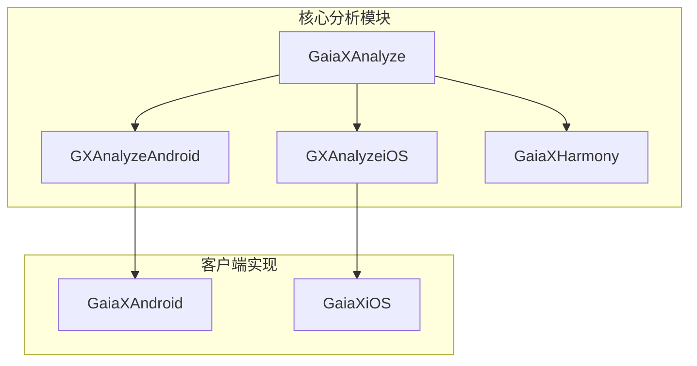
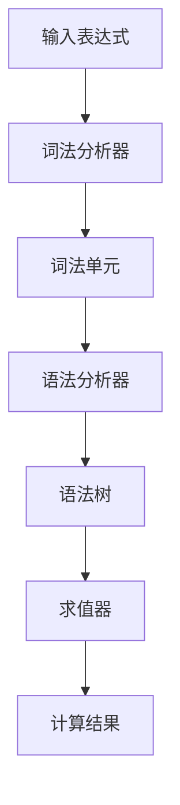
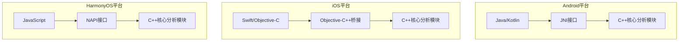

# 表达式分析

<cite>
**本文档引用的文件**   
- [GXAnalyze.cpp](file://GaiaXAnalyze/GXAnalyzeAndroid/src/main/cpp/GXAnalyzeCore/GXAnalyze.cpp)
- [GXJniAnalyze.cpp](file://GaiaXAnalyze/GXAnalyzeAndroid/src/main/cpp/GXJniAnalyze.cpp)
- [GXAnalyze.kt](file://GaiaXAnalyze/GXAnalyzeAndroid/src/main/java/com/alibaba/gaiax/analyze/GXAnalyze.kt)
- [GXAnalyzeWrapper.kt](file://GaiaXAndroid/src/main/kotlin/com/alibaba/gaiax/expression/GXAnalyzeWrapper.kt)
- [GXDataBinding.kt](file://GaiaXAndroid/src/main/kotlin/com/alibaba/gaiax/template/GXDataBinding.kt)
- [GXWordAnalyze.cpp](file://GaiaXAnalyze/GXAnalyzeAndroid/src/main/cpp/GXAnalyzeCore/GXWordAnalyze.cpp)
- [GXNapiAnalyze.cpp](file://GaiaXHarmony/GaiaXAnalyze/GaiaXAnalyzeHarmony/GaiaXAnalyze/src/main/cpp/GXNapiAnalyze.cpp)
</cite>

## 目录
1. [简介](#简介)
2. [项目结构](#项目结构)
3. [核心组件](#核心组件)
4. [架构概述](#架构概述)
5. [详细组件分析](#详细组件分析)
6. [依赖分析](#依赖分析)
7. [性能考虑](#性能考虑)
8. [故障排除指南](#故障排除指南)
9. [结论](#结论)

## 简介
本文档深入探讨了GaiaX表达式分析功能，重点介绍GXAnalyze如何解析和执行模板中的动态表达式。文档详细解释了表达式分析引擎的架构设计，包括词法分析、语法分析和求值过程。同时，文档还详细说明了Android和iOS平台的实现差异，以及如何通过JNI调用C++核心分析模块。为初学者提供表达式语法和使用示例，同时为经验丰富的开发者提供扩展自定义函数的方法。包含来自实际代码库的具体例子，说明如何在数据绑定和样式计算中使用表达式。解释表达式分析引擎与数据绑定系统的集成方式，以及如何处理复杂的数据依赖关系。解决常见问题如表达式性能瓶颈、错误处理等，并提供优化建议。

## 项目结构
项目结构清晰地展示了GaiaX表达式分析功能的组织方式。核心分析模块位于`GaiaXAnalyze`目录下，分为Android和iOS两个平台的实现。Android平台的实现位于`GXAnalyzeAndroid`目录，包含C++核心分析代码和JNI接口。iOS平台的实现位于`GXAnalyzeiOS`目录，包含Objective-C++代码和Swift接口。HarmonyOS平台的实现位于`GaiaXHarmony`目录，包含C++核心分析代码和NAPI接口。Android和iOS的客户端实现分别位于`GaiaXAndroid`和`GaiaXiOS`目录，包含数据绑定、模板解析和渲染逻辑。



**图表来源**
- [GXAnalyzeAndroid](file://GaiaXAnalyze/GXAnalyzeAndroid)
- [GXAnalyzeiOS](file://GaiaXAnalyze/GXAnalyzeiOS)
- [GaiaXHarmony](file://GaiaXHarmony)
- [GaiaXAndroid](file://GaiaXAndroid)
- [GaiaXiOS](file://GaiaXiOS)

**章节来源**
- [GXAnalyzeAndroid](file://GaiaXAnalyze/GXAnalyzeAndroid)
- [GXAnalyzeiOS](file://GaiaXAnalyze/GXAnalyzeiOS)
- [GaiaXHarmony](file://GaiaXHarmony)
- [GaiaXAndroid](file://GaiaXAndroid)
- [GaiaXiOS](file://GaiaXiOS)

## 核心组件
表达式分析功能的核心组件包括词法分析器、语法分析器和求值器。词法分析器负责将输入的表达式字符串分解为一系列的词法单元（tokens），语法分析器负责根据预定义的语法规则将词法单元组合成语法树，求值器负责遍历语法树并计算表达式的最终结果。这些组件共同构成了一个完整的表达式分析引擎，能够高效地解析和执行复杂的动态表达式。

**章节来源**
- [GXAnalyze.cpp](file://GaiaXAnalyze/GXAnalyzeAndroid/src/main/cpp/GXAnalyzeCore/GXAnalyze.cpp)
- [GXWordAnalyze.cpp](file://GaiaXAnalyze/GXAnalyzeAndroid/src/main/cpp/GXAnalyzeCore/GXWordAnalyze.cpp)

## 架构概述
表达式分析引擎的架构设计遵循分层原则，分为词法分析层、语法分析层和求值层。词法分析层负责将输入的表达式字符串分解为词法单元，语法分析层负责根据预定义的语法规则将词法单元组合成语法树，求值层负责遍历语法树并计算表达式的最终结果。这种分层设计使得各层职责明确，便于维护和扩展。



**图表来源**
- [GXAnalyze.cpp](file://GaiaXAnalyze/GXAnalyzeAndroid/src/main/cpp/GXAnalyzeCore/GXAnalyze.cpp)
- [GXWordAnalyze.cpp](file://GaiaXAnalyze/GXAnalyzeAndroid/src/main/cpp/GXAnalyzeCore/GXWordAnalyze.cpp)

## 详细组件分析
### 词法分析器
词法分析器是表达式分析引擎的第一步，负责将输入的表达式字符串分解为一系列的词法单元。词法分析器通过扫描输入字符串，识别出各种类型的词法单元，如标识符、数字、字符串、运算符等。词法分析器的实现基于状态机模型，通过维护一个状态栈和符号栈来跟踪当前的分析状态。

```mermaid
classDiagram
class Scanner {
+scan(input : string) : vector~Token~
-currentState : int
-symbolStack : vector~char~
-tokenStack : vector~Token~
}
class Token {
+type : TokenType
+value : string
}
enum TokenType {
IDENTIFIER
NUMBER
STRING
OPERATOR
KEYWORD
}
Scanner --> Token : "生成"
```

**图表来源**
- [GXWordAnalyze.cpp](file://GaiaXAnalyze/GXAnalyzeAndroid/src/main/cpp/GXAnalyzeCore/GXWordAnalyze.cpp)

**章节来源**
- [GXWordAnalyze.cpp](file://GaiaXAnalyze/GXAnalyzeAndroid/src/main/cpp/GXAnalyzeCore/GXWordAnalyze.cpp)

### 语法分析器
语法分析器是表达式分析引擎的第二步，负责根据预定义的语法规则将词法单元组合成语法树。语法分析器采用自底向上的分析方法，通过维护一个状态栈和符号栈来跟踪当前的分析状态。语法分析器的实现基于LR(1)分析表，通过查找分析表来决定下一步的动作。

```mermaid
classDiagram
class Parser {
+parse(tokens : vector~Token~) : SyntaxTree
-stateStack : vector~int~
-symbolStack : vector~Symbol~
-gotoTable : map~string, string~
}
class SyntaxTree {
+root : Node
}
class Node {
+type : NodeType
+children : vector~Node~
+value : string
}
enum NodeType {
EXPRESSION
TERM
FACTOR
OPERATOR
}
Parser --> SyntaxTree : "生成"
SyntaxTree --> Node : "包含"
```

**图表来源**
- [GXAnalyze.cpp](file://GaiaXAnalyze/GXAnalyzeAndroid/src/main/cpp/GXAnalyzeCore/GXAnalyze.cpp)

**章节来源**
- [GXAnalyze.cpp](file://GaiaXAnalyze/GXAnalyzeAndroid/src/main/cpp/GXAnalyzeCore/GXAnalyze.cpp)

### 求值器
求值器是表达式分析引擎的最后一步，负责遍历语法树并计算表达式的最终结果。求值器采用递归下降的方法，从语法树的根节点开始，逐层向下计算每个节点的值。求值器的实现基于双栈模型，通过维护一个操作数栈和一个操作符栈来跟踪当前的计算状态。

```mermaid
classDiagram
class Evaluator {
+evaluate(tree : SyntaxTree) : Value
-operandStack : vector~Value~
-operatorStack : vector~Operator~
}
class Value {
+type : ValueType
+data : any
}
class Operator {
+type : OperatorType
+precedence : int
}
enum ValueType {
INTEGER
FLOAT
STRING
BOOLEAN
NULL
}
enum OperatorType {
ADD
SUBTRACT
MULTIPLY
DIVIDE
MODULO
EQUAL
NOT_EQUAL
LESS_THAN
GREATER_THAN
LESS_EQUAL
GREATER_EQUAL
AND
OR
NOT
}
Evaluator --> Value : "生成"
Evaluator --> Operator : "使用"
```

**图表来源**
- [GXAnalyze.cpp](file://GaiaXAnalyze/GXAnalyzeAndroid/src/main/cpp/GXAnalyzeCore/GXAnalyze.cpp)

**章节来源**
- [GXAnalyze.cpp](file://GaiaXAnalyze/GXAnalyzeAndroid/src/main/cpp/GXAnalyzeCore/GXAnalyze.cpp)

## 依赖分析
表达式分析引擎的实现依赖于多个外部库和模块。在Android平台上，通过JNI接口调用C++核心分析模块，实现Java/Kotlin与C++代码的交互。在iOS平台上，通过Objective-C++桥接调用C++核心分析模块，实现Swift/Objective-C与C++代码的交互。在HarmonyOS平台上，通过NAPI接口调用C++核心分析模块，实现JavaScript与C++代码的交互。这些依赖关系确保了表达式分析功能在不同平台上的统一性和一致性。



**图表来源**
- [GXJniAnalyze.cpp](file://GaiaXAnalyze/GXAnalyzeAndroid/src/main/cpp/GXJniAnalyze.cpp)
- [GXNapiAnalyze.cpp](file://GaiaXHarmony/GaiaXAnalyze/GaiaXAnalyzeHarmony/GaiaXAnalyze/src/main/cpp/GXNapiAnalyze.cpp)

**章节来源**
- [GXJniAnalyze.cpp](file://GaiaXAnalyze/GXAnalyzeAndroid/src/main/cpp/GXJniAnalyze.cpp)
- [GXNapiAnalyze.cpp](file://GaiaXHarmony/GaiaXAnalyze/GaiaXAnalyzeHarmony/GaiaXAnalyze/src/main/cpp/GXNapiAnalyze.cpp)

## 性能考虑
表达式分析引擎在设计时充分考虑了性能因素。通过预编译和缓存机制，减少重复的词法分析和语法分析过程，提高表达式的解析速度。通过优化求值算法，减少不必要的计算和内存分配，提高表达式的求值效率。通过多线程并发处理，充分利用多核处理器的计算能力，提高表达式的整体处理速度。

## 故障排除指南
在使用表达式分析功能时，可能会遇到一些常见问题。例如，表达式语法错误、数据类型不匹配、计算溢出等。为了解决这些问题，建议使用调试工具检查表达式的词法单元和语法树，确保表达式的正确性。建议使用类型检查工具验证数据类型，确保数据类型的匹配性。建议使用性能分析工具监控表达式的计算过程，确保计算的效率性。

**章节来源**
- [GXAnalyze.cpp](file://GaiaXAnalyze/GXAnalyzeAndroid/src/main/cpp/GXAnalyzeCore/GXAnalyze.cpp)
- [GXWordAnalyze.cpp](file://GaiaXAnalyze/GXAnalyzeAndroid/src/main/cpp/GXAnalyzeCore/GXWordAnalyze.cpp)

## 结论
GaiaX表达式分析功能通过词法分析、语法分析和求值过程，实现了对模板中动态表达式的高效解析和执行。通过JNI、Objective-C++桥接和NAPI接口，实现了在Android、iOS和HarmonyOS平台上的统一性和一致性。通过预编译、缓存和多线程并发处理，提高了表达式的解析和求值效率。通过调试工具、类型检查工具和性能分析工具，解决了常见的问题，确保了表达式的正确性和效率性。