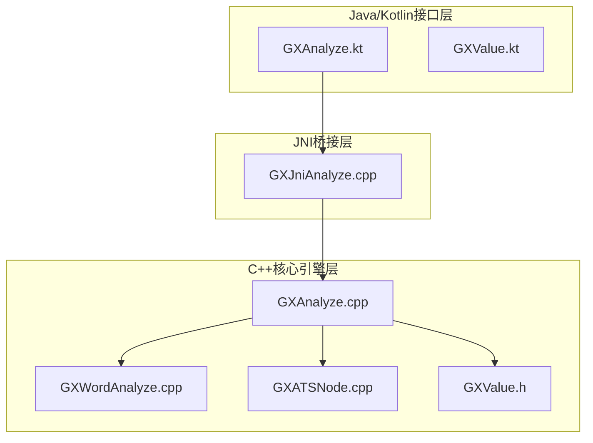
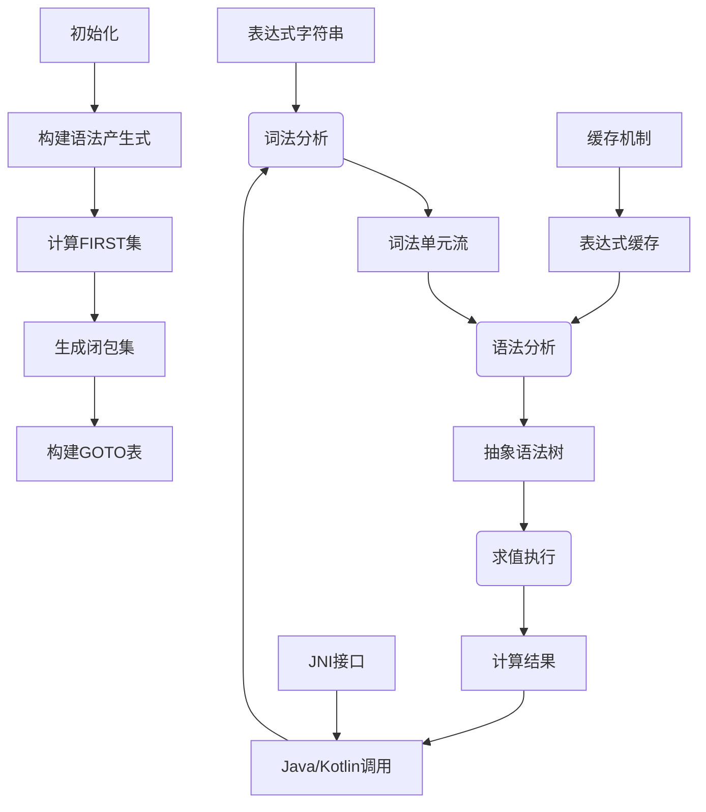
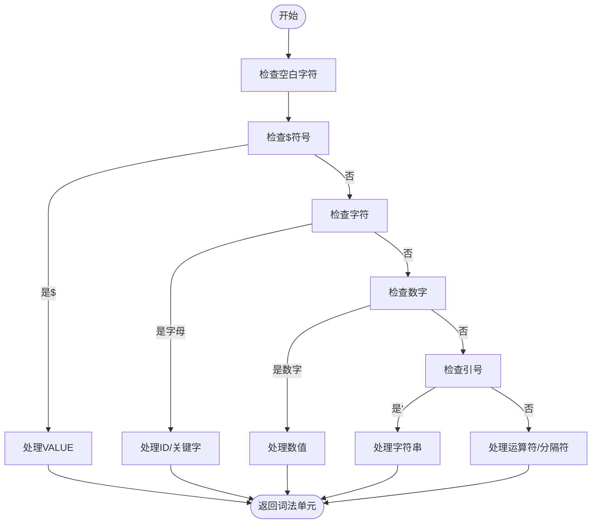
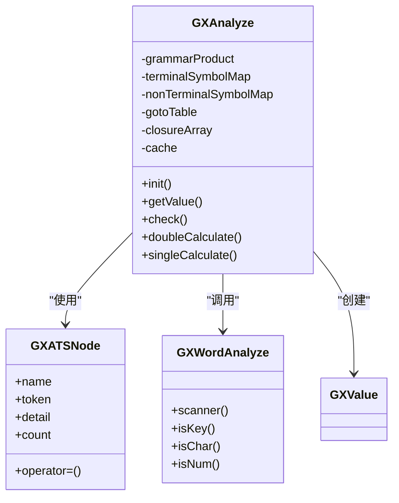
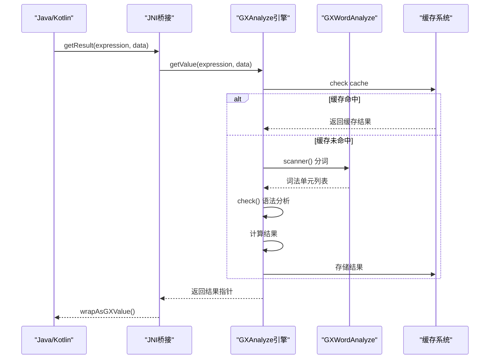
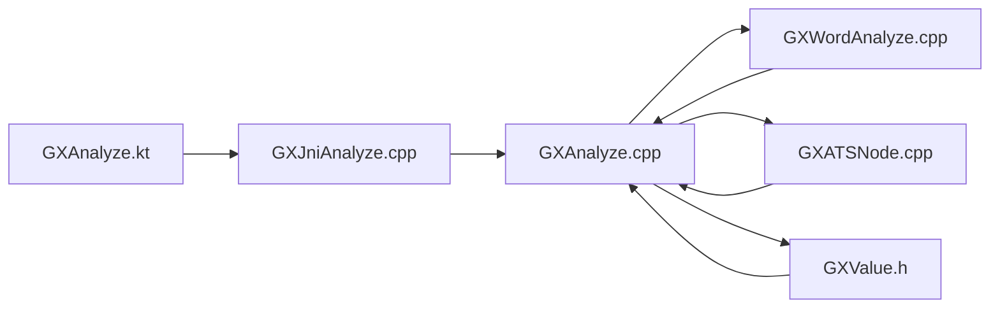

# 表达式分析引擎

<cite>
**本文档引用的文件**
- [GXAnalyze.cpp](file://GaiaXAnalyze/GXAnalyzeAndroid/src/main/cpp/GXAnalyzeCore/GXAnalyze.cpp)
- [GXWordAnalyze.cpp](file://GaiaXAnalyze/GXAnalyzeAndroid/src/main/cpp/GXAnalyzeCore/GXWordAnalyze.cpp)
- [GXAnalyze.h](file://GaiaXAnalyze/GXAnalyzeAndroid/src/main/cpp/GXAnalyzeCore/GXAnalyze.h)
- [GXWordAnalyze.h](file://GaiaXAnalyze/GXAnalyzeAndroid/src/main/cpp/GXAnalyzeCore/GXWordAnalyze.h)
- [GXATSNode.cpp](file://GaiaXAnalyze/GXAnalyzeAndroid/src/main/cpp/GXAnalyzeCore/GXATSNode.cpp)
- [GXATSNode.h](file://GaiaXAnalyze/GXAnalyzeAndroid/src/main/cpp/GXAnalyzeCore/GXATSNode.h)
- [GXValue.h](file://GaiaXAnalyze/GXAnalyzeAndroid/src/main/cpp/GXAnalyzeCore/GXValue.h)
- [GXJniAnalyze.cpp](file://GaiaXAnalyze/GXAnalyzeAndroid/src/main/cpp/GXJniAnalyze.cpp)
- [GXAnalyze.kt](file://GaiaXAnalyze/GXAnalyzeAndroid/src/main/java/com/alibaba/gaiax/analyze/GXAnalyze.kt)
- [GXValue.kt](file://GaiaXAnalyze/GXAnalyzeAndroid/src/main/java/com/alibaba/gaiax/analyze/GXValue.kt)
</cite>

## 目录
1. [简介](#简介)
2. [项目结构](#项目结构)
3. [核心组件](#核心组件)
4. [架构概述](#架构概述)
5. [详细组件分析](#详细组件分析)
6. [依赖分析](#依赖分析)
7. [性能考虑](#性能考虑)
8. [故障排除指南](#故障排除指南)
9. [结论](#结论)

## 简介
GaiaX表达式分析引擎（GXAnalyze）是一个高性能、跨平台的表达式求值系统，专为动态模板渲染场景设计。该引擎采用LR语法分析方法，结合词法分析、语法分析和求值执行三个阶段，能够高效解析和计算复杂的表达式。引擎支持多种数据类型（包括布尔值、数值、字符串、数组和映射），并实现了完整的错误处理机制。通过JNI接口，该引擎在Android平台上实现了Java/Kotlin与C++的无缝集成，确保了高性能的同时保持了良好的可扩展性。

## 项目结构
GaiaX表达式分析引擎的代码库采用分层架构设计，主要分为Java/Kotlin接口层、JNI桥接层和C++核心引擎层。这种分层设计实现了平台无关性与高性能计算的完美结合。

**图源**
- [GXAnalyze.kt](file://GaiaXAnalyze/GXAnalyzeAndroid/src/main/java/com/alibaba/gaiax/analyze/GXAnalyze.kt)
- [GXJniAnalyze.cpp](file://GaiaXAnalyze/GXAnalyzeAndroid/src/main/cpp/GXJniAnalyze.cpp)
- [GXAnalyze.cpp](file://GaiaXAnalyze/GXAnalyzeAndroid/src/main/cpp/GXAnalyzeCore/GXAnalyze.cpp)
- [GXWordAnalyze.cpp](file://GaiaXAnalyze/GXAnalyzeAndroid/src/main/cpp/GXAnalyzeCore/GXWordAnalyze.cpp)
- [GXATSNode.cpp](file://GaiaXAnalyze/GXAnalyzeAndroid/src/main/cpp/GXAnalyzeCore/GXATSNode.cpp)
- [GXValue.h](file://GaiaXAnalyze/GXAnalyzeAndroid/src/main/cpp/GXAnalyzeCore/GXValue.h)

**节源**
- [GXAnalyze.kt](file://GaiaXAnalyze/GXAnalyzeAndroid/src/main/java/com/alibaba/gaiax/analyze/GXAnalyze.kt)
- [GXJniAnalyze.cpp](file://GaiaXAnalyze/GXAnalyzeAndroid/src/main/cpp/GXJniAnalyze.cpp)

## 核心组件
GXAnalyze核心引擎由多个关键组件构成，包括词法分析器（GXWordAnalyze）、语法分析器（GXAnalyze）、抽象语法树节点（GXATSNode）和值容器（GXValue）。这些组件协同工作，完成从原始表达式字符串到计算结果的完整转换过程。引擎采用LR分析法进行语法解析，通过状态栈、符号栈和值栈的管理机制实现高效的表达式求值。整个系统设计注重性能优化，通过表达式缓存机制避免重复解析，显著提升了计算效率。

**节源**
- [GXAnalyze.cpp](file://GaiaXAnalyze/GXAnalyzeAndroid/src/main/cpp/GXAnalyzeCore/GXAnalyze.cpp)
- [GXWordAnalyze.cpp](file://GaiaXAnalyze/GXAnalyzeAndroid/src/main/cpp/GXAnalyzeCore/GXWordAnalyze.cpp)
- [GXATSNode.cpp](file://GaiaXAnalyze/GXAnalyzeAndroid/src/main/cpp/GXAnalyzeCore/GXATSNode.cpp)
- [GXValue.h](file://GaiaXAnalyze/GXAnalyzeAndroid/src/main/cpp/GXAnalyzeCore/GXValue.h)

## 架构概述
GXAnalyze引擎采用经典的编译器架构，分为词法分析、语法分析和求值执行三个主要阶段。引擎在初始化时构建语法分析表，包括FIRST集、闭包集和GOTO表，为后续的LR分析提供基础。整个系统通过JNI接口与Java/Kotlin层通信，实现了高性能的本地计算。

**图源**
- [GXAnalyze.cpp](file://GaiaXAnalyze/GXAnalyzeAndroid/src/main/cpp/GXAnalyzeCore/GXAnalyze.cpp)
- [GXWordAnalyze.cpp](file://GaiaXAnalyze/GXAnalyzeAndroid/src/main/cpp/GXAnalyzeCore/GXWordAnalyze.cpp)

## 详细组件分析
### 词法分析器分析
词法分析器（GXWordAnalyze）负责将输入的表达式字符串分解为有意义的词法单元（tokens）。分析器通过状态机的方式逐字符扫描输入字符串，识别关键字、标识符、数值、字符串和运算符等不同类型的词法单元。

**图源**
- [GXWordAnalyze.cpp](file://GaiaXAnalyze/GXAnalyzeAndroid/src/main/cpp/GXAnalyzeCore/GXWordAnalyze.cpp)

**节源**
- [GXWordAnalyze.cpp](file://GaiaXAnalyze/GXAnalyzeAndroid/src/main/cpp/GXAnalyzeCore/GXWordAnalyze.cpp)
- [GXWordAnalyze.h](file://GaiaXAnalyze/GXAnalyzeAndroid/src/main/cpp/GXAnalyzeCore/GXWordAnalyze.h)

### 语法分析器分析
语法分析器（GXAnalyze）采用LR分析法，基于预构建的语法分析表对词法单元流进行规约和移进操作。分析器维护状态栈、符号栈和值栈，通过这些数据结构实现表达式的语法验证和语义计算。

**图源**
- [GXAnalyze.cpp](file://GaiaXAnalyze/GXAnalyzeAndroid/src/main/cpp/GXAnalyzeCore/GXAnalyze.cpp)
- [GXATSNode.cpp](file://GaiaXAnalyze/GXAnalyzeAndroid/src/main/cpp/GXAnalyzeCore/GXATSNode.cpp)
- [GXWordAnalyze.cpp](file://GaiaXAnalyze/GXAnalyzeAndroid/src/main/cpp/GXAnalyzeCore/GXWordAnalyze.cpp)

**节源**
- [GXAnalyze.cpp](file://GaiaXAnalyze/GXAnalyzeAndroid/src/main/cpp/GXAnalyzeCore/GXAnalyze.cpp)
- [GXAnalyze.h](file://GaiaXAnalyze/GXAnalyzeAndroid/src/main/cpp/GXAnalyzeCore/GXAnalyze.h)

### 求值执行流程
求值执行过程是表达式分析引擎的核心，它将语法分析的结果转换为具体的计算值。引擎通过递归下降的方式遍历抽象语法树，结合上下文数据源完成表达式求值。

**图源**
- [GXAnalyze.kt](file://GaiaXAnalyze/GXAnalyzeAndroid/src/main/java/com/alibaba/gaiax/analyze/GXAnalyze.kt)
- [GXJniAnalyze.cpp](file://GaiaXAnalyze/GXAnalyzeAndroid/src/main/cpp/GXJniAnalyze.cpp)
- [GXAnalyze.cpp](file://GaiaXAnalyze/GXAnalyzeAndroid/src/main/cpp/GXAnalyzeCore/GXAnalyze.cpp)

**节源**
- [GXAnalyze.kt](file://GaiaXAnalyze/GXAnalyzeAndroid/src/main/java/com/alibaba/gaiax/analyze/GXAnalyze.kt)
- [GXJniAnalyze.cpp](file://GaiaXAnalyze/GXAnalyzeAndroid/src/main/cpp/GXJniAnalyze.cpp)

## 依赖分析
GXAnalyze引擎的组件之间存在明确的依赖关系，形成了清晰的调用链。Java/Kotlin层通过JNI接口调用本地方法，JNI桥接层负责参数转换和环境管理，C++核心引擎层完成实际的表达式分析和计算任务。

**图源**
- [GXAnalyze.kt](file://GaiaXAnalyze/GXAnalyzeAndroid/src/main/java/com/alibaba/gaiax/analyze/GXAnalyze.kt)
- [GXJniAnalyze.cpp](file://GaiaXAnalyze/GXAnalyzeAndroid/src/main/cpp/GXJniAnalyze.cpp)
- [GXAnalyze.cpp](file://GaiaXAnalyze/GXAnalyzeAndroid/src/main/cpp/GXAnalyzeCore/GXAnalyze.cpp)
- [GXWordAnalyze.cpp](file://GaiaXAnalyze/GXAnalyzeAndroid/src/main/cpp/GXAnalyzeCore/GXWordAnalyze.cpp)
- [GXATSNode.cpp](file://GaiaXAnalyze/GXAnalyzeAndroid/src/main/cpp/GXAnalyzeCore/GXATSNode.cpp)
- [GXValue.h](file://GaiaXAnalyze/GXAnalyzeAndroid/src/main/cpp/GXAnalyzeCore/GXValue.h)

**节源**
- [GXAnalyze.kt](file://GaiaXAnalyze/GXAnalyzeAndroid/src/main/java/com/alibaba/gaiax/analyze/GXAnalyze.kt)
- [GXJniAnalyze.cpp](file://GaiaXAnalyze/GXAnalyzeAndroid/src/main/cpp/GXJniAnalyze.cpp)
- [GXAnalyze.cpp](file://GaiaXAnalyze/GXAnalyzeAndroid/src/main/cpp/GXAnalyzeCore/GXAnalyze.cpp)

## 性能考虑
GXAnalyze引擎在设计时充分考虑了性能优化，采用了多种技术手段提升表达式求值的效率。引擎通过预构建语法分析表避免了运行时的复杂计算，利用LR分析法实现了线性时间复杂度的语法分析。表达式缓存机制有效避免了重复解析相同表达式的开销，显著提升了系统整体性能。内存管理方面，引擎采用智能指针和对象池技术，减少了内存分配和垃圾回收的开销。JNI调用经过精心优化，最小化了Java与C++之间的数据转换成本。

## 故障排除指南
当表达式分析引擎出现异常时，可以通过以下步骤进行排查：首先检查表达式语法是否正确，确保所有括号匹配、运算符使用恰当；其次验证数据源是否包含表达式所需的所有字段；然后确认JNI环境是否正确初始化；最后查看日志输出，分析具体的错误信息。引擎提供了详细的错误报告机制，能够在词法分析、语法分析和求值执行各个阶段捕获并报告错误。

**节源**
- [GXAnalyze.cpp](file://GaiaXAnalyze/GXAnalyzeAndroid/src/main/cpp/GXAnalyzeCore/GXAnalyze.cpp)
- [GXWordAnalyze.cpp](file://GaiaXAnalyze/GXAnalyzeAndroid/src/main/cpp/GXAnalyzeCore/GXWordAnalyze.cpp)
- [GXJniAnalyze.cpp](file://GaiaXAnalyze/GXAnalyzeAndroid/src/main/cpp/GXJniAnalyze.cpp)

## 结论
GaiaX表达式分析引擎通过精心设计的架构和高效的实现，为动态模板渲染提供了强大的表达式求值能力。引擎采用LR分析法确保了语法分析的正确性和效率，通过JNI接口实现了跨语言的高性能计算。系统的模块化设计使得各个组件职责清晰，便于维护和扩展。未来可以进一步优化缓存策略，支持更多复杂的表达式类型，并增强错误诊断能力，为开发者提供更好的使用体验。