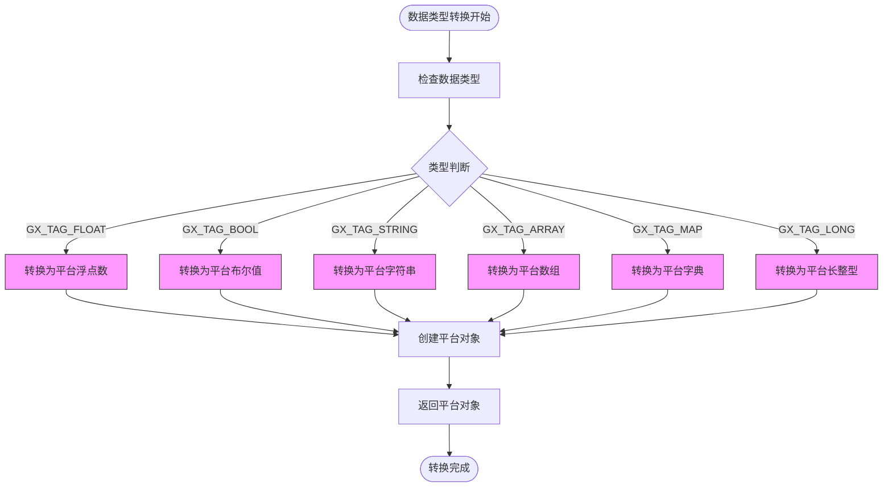

# 跨平台实现

<cite>
**本文档引用的文件**
- [GXJniAnalyze.cpp](file://GaiaXAnalyze/GXAnalyzeAndroid/src/main/cpp/GXJniAnalyze.cpp)
- [GXAnalyze.kt](file://GaiaXAnalyze/GXAnalyzeAndroid/src/main/java/com/alibaba/gaiax/analyze/GXAnalyze.kt)
- [GXAnalyzeBridge.h](file://GaiaXAnalyze/GXAnalyzeiOS/GXAnalyzeiOS/Expression/GXAnalyzeBridge.h)
- [GXNativeAnalyze.h](file://GaiaXAnalyze/GXAnalyzeiOS/GXAnalyzeiOS/Expression/GXNativeAnalyze.h)
- [GXAnalyzeCore.h](file://GaiaXAnalyze/GXAnalyzeAndroid/src/main/cpp/GXAnalyzeCore/GXAnalyze.h)
- [GXValue.h](file://GaiaXAnalyze/GXAnalyzeAndroid/src/main/cpp/GXAnalyzeCore/GXValue.h)
- [GXAnalyzeImpl.hpp](file://GaiaXAnalyze/GXAnalyzeiOS/GXAnalyzeiOS/Expression/GXAnalyzeImpl.hpp)
- [GXNapiAnalyze.cpp](file://GaiaXHarmony/GaiaXAnalyze/GaiaXAnalyzeHarmony/GaiaXAnalyze/src/main/cpp/GXNapiAnalyze.cpp)
- [CMakeLists.txt](file://GaiaXAnalyze/GXAnalyzeAndroid/src/main/cpp/GXAnalyzeCore/CMakeLists.txt)
</cite>

## 目录
1. [简介](#简介)
2. [项目结构](#项目结构)
3. [核心组件](#核心组件)
4. [架构概述](#架构概述)
5. [详细组件分析](#详细组件分析)
6. [依赖分析](#依赖分析)
7. [性能考量](#性能考量)
8. [故障排除指南](#故障排除指南)
9. [结论](#结论)

## 简介
本文档详细阐述了GaiaX表达式分析模块在Android和iOS平台上的跨平台实现机制。重点分析了Android平台通过JNI调用C++核心模块的实现方式，以及iOS平台通过Objective-C++桥接层与原生代码交互的原理。文档为初学者提供了平台适配的基本概念，同时为经验丰富的开发者解析了跨平台数据传递和内存管理的最佳实践。

## 项目结构
GaiaX表达式分析模块采用跨平台架构设计，核心分析逻辑以C++实现，通过不同平台的桥接层与原生代码交互。Android平台使用JNI作为桥接机制，而iOS平台使用Objective-C++桥接。

**图示来源**
- [GXJniAnalyze.cpp](file://GaiaXAnalyze/GXAnalyzeAndroid/src/main/cpp/GXJniAnalyze.cpp)
- [GXAnalyzeBridge.h](file://GaiaXAnalyze/GXAnalyzeiOS/GXAnalyzeiOS/Expression/GXAnalyzeBridge.h)

**本节来源**
- [GXJniAnalyze.cpp](file://GaiaXAnalyze/GXAnalyzeAndroid/src/main/cpp/GXJniAnalyze.cpp)
- [GXAnalyzeBridge.h](file://GaiaXAnalyze/GXAnalyzeiOS/GXAnalyzeiOS/Expression/GXAnalyzeBridge.h)

## 核心组件
GaiaX表达式分析的核心组件包括C++分析引擎、平台特定的桥接层和原生接口。C++核心模块负责表达式解析和计算，而桥接层负责在原生代码和核心引擎之间传递数据。

**本节来源**
- [GXAnalyzeCore.h](file://GaiaXAnalyze/GXAnalyzeAndroid/src/main/cpp/GXAnalyzeCore/GXAnalyze.h)
- [GXValue.h](file://GaiaXAnalyze/GXAnalyzeAndroid/src/main/cpp/GXAnalyzeCore/GXValue.h)

## 架构概述
GaiaX表达式分析采用分层架构，将核心逻辑与平台特定实现分离。这种设计确保了跨平台行为的一致性，同时允许针对不同平台进行优化。

**图示来源**
- [GXAnalyzeCore.h](file://GaiaXAnalyze/GXAnalyzeAndroid/src/main/cpp/GXAnalyzeCore/GXAnalyze.h)
- [GXJniAnalyze.cpp](file://GaiaXAnalyze/GXAnalyzeAndroid/src/main/cpp/GXJniAnalyze.cpp)
- [GXAnalyzeImpl.hpp](file://GaiaXAnalyze/GXAnalyzeiOS/GXAnalyzeiOS/Expression/GXAnalyzeImpl.hpp)
- [GXAnalyzeBridge.h](file://GaiaXAnalyze/GXAnalyzeiOS/GXAnalyzeiOS/Expression/GXAnalyzeBridge.h)

## 详细组件分析

### Android平台JNI实现
Android平台通过JNI桥接层与C++核心分析模块交互。`GXJniAnalyze.cpp`文件实现了JNI接口，处理Java与C++之间的数据类型转换和方法调用。

**图示来源**
- [GXJniAnalyze.cpp](file://GaiaXAnalyze/GXAnalyzeAndroid/src/main/cpp/GXJniAnalyze.cpp)
- [GXAnalyze.kt](file://GaiaXAnalyze/GXAnalyzeAndroid/src/main/java/com/alibaba/gaiax/analyze/GXAnalyze.kt)

**本节来源**
- [GXJniAnalyze.cpp](file://GaiaXAnalyze/GXAnalyzeAndroid/src/main/cpp/GXJniAnalyze.cpp)
- [GXAnalyze.kt](file://GaiaXAnalyze/GXAnalyzeAndroid/src/main/java/com/alibaba/gaiax/analyze/GXAnalyze.kt)

### iOS平台Objective-C++桥接
iOS平台使用Objective-C++桥接层`GXAnalyzeBridge`与C++核心模块交互。桥接层提供Objective-C接口，内部使用C++实现与核心分析引擎的通信。

**图示来源**
- [GXAnalyzeBridge.h](file://GaiaXAnalyze/GXAnalyzeiOS/GXAnalyzeiOS/Expression/GXAnalyzeBridge.h)
- [GXNativeAnalyze.h](file://GaiaXAnalyze/GXAnalyzeiOS/GXAnalyzeiOS/Expression/GXNativeAnalyze.h)
- [GXAnalyzeImpl.hpp](file://GaiaXAnalyze/GXAnalyzeiOS/GXAnalyzeiOS/Expression/GXAnalyzeImpl.hpp)

**本节来源**
- [GXAnalyzeBridge.h](file://GaiaXAnalyze/GXAnalyzeiOS/GXAnalyzeiOS/Expression/GXAnalyzeBridge.h)
- [GXNativeAnalyze.h](file://GaiaXAnalyze/GXAnalyzeiOS/GXAnalyzeiOS/Expression/GXNativeAnalyze.h)

### 数据类型转换机制
跨平台数据传递需要处理不同平台间的数据类型转换。Android和iOS平台采用了不同的转换策略来确保数据的一致性。

**图示来源**
- [GXJniAnalyze.cpp](file://GaiaXAnalyze/GXAnalyzeAndroid/src/main/cpp/GXJniAnalyze.cpp)
- [GXAnalyzeImpl.hpp](file://GaiaXAnalyze/GXAnalyzeiOS/GXAnalyzeiOS/Expression/GXAnalyzeImpl.hpp)

**本节来源**
- [GXJniAnalyze.cpp](file://GaiaXAnalyze/GXAnalyzeAndroid/src/main/cpp/GXJniAnalyze.cpp)
- [GXAnalyzeImpl.hpp](file://GaiaXAnalyze/GXAnalyzeiOS/GXAnalyzeiOS/Expression/GXAnalyzeImpl.hpp)

## 依赖分析
GaiaX表达式分析模块的依赖关系清晰，核心模块独立于平台实现，通过桥接层与原生代码交互。

**图示来源**
- [CMakeLists.txt](file://GaiaXAnalyze/GXAnalyzeAndroid/src/main/cpp/GXAnalyzeCore/CMakeLists.txt)
- [GXJniAnalyze.cpp](file://GaiaXAnalyze/GXAnalyzeAndroid/src/main/cpp/GXJniAnalyze.cpp)
- [GXAnalyzeImpl.hpp](file://GaiaXAnalyze/GXAnalyzeiOS/GXAnalyzeiOS/Expression/GXAnalyzeImpl.hpp)

**本节来源**
- [CMakeLists.txt](file://GaiaXAnalyze/GXAnalyzeAndroid/src/main/cpp/GXAnalyzeCore/CMakeLists.txt)
- [GXJniAnalyze.cpp](file://GaiaXAnalyze/GXAnalyzeAndroid/src/main/cpp/GXJniAnalyze.cpp)
- [GXAnalyzeImpl.hpp](file://GaiaXAnalyze/GXAnalyzeiOS/GXAnalyzeiOS/Expression/GXAnalyzeImpl.hpp)

## 性能考量
跨平台实现需要考虑性能优化，特别是在数据传递和内存管理方面。Android和iOS平台采用了不同的优化策略来提高表达式分析的效率。

- **Android平台**：使用弱全局引用避免内存泄漏，通过JNI本地引用管理临时对象
- **iOS平台**：利用Objective-C++的混合编程优势，减少数据复制开销
- **通用优化**：核心分析逻辑使用C++实现，确保计算性能最优

**本节来源**
- [GXJniAnalyze.cpp](file://GaiaXAnalyze/GXAnalyzeAndroid/src/main/cpp/GXJniAnalyze.cpp)
- [GXAnalyzeImpl.hpp](file://GaiaXAnalyze/GXAnalyzeiOS/GXAnalyzeiOS/Expression/GXAnalyzeImpl.hpp)

## 故障排除指南
在跨平台开发中，常见的问题包括JNI调用失败、数据类型转换错误和内存管理问题。

**常见问题及解决方案：**
- **JNI调用失败**：检查JNI方法签名是否正确，确保C++函数声明与Java声明匹配
- **数据类型转换错误**：验证GXValue标签的正确性，确保类型转换逻辑完整
- **内存泄漏**：检查弱全局引用的使用，确保及时释放不再需要的对象引用
- **平台行为不一致**：确保核心分析逻辑在所有平台上保持一致，差异仅存在于桥接层

**本节来源**
- [GXJniAnalyze.cpp](file://GaiaXAnalyze/GXAnalyzeAndroid/src/main/cpp/GXJniAnalyze.cpp)
- [GXAnalyzeBridge.h](file://GaiaXAnalyze/GXAnalyzeiOS/GXAnalyzeiOS/Expression/GXAnalyzeBridge.h)

## 结论
GaiaX表达式分析模块通过精心设计的跨平台架构，实现了Android和iOS平台的一致性行为。Android平台利用JNI桥接，iOS平台使用Objective-C++桥接，两者都有效地将原生代码与C++核心分析引擎连接起来。这种架构不仅确保了功能的一致性，还允许针对不同平台进行特定优化，为开发者提供了高效、可靠的表达式分析解决方案。