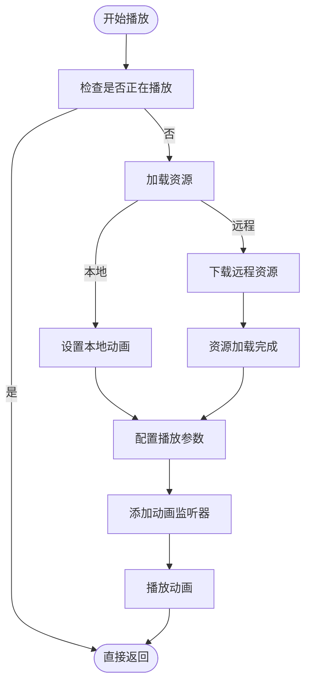
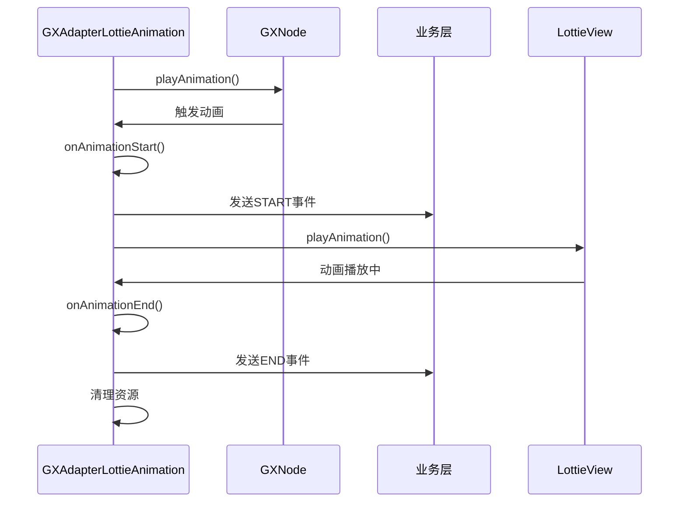
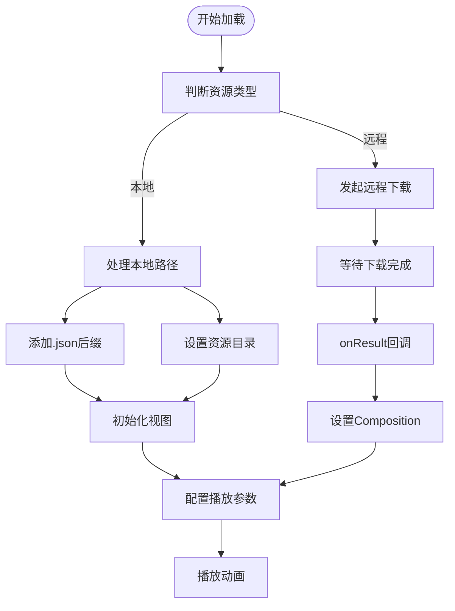

# 动画适配器实现

<cite>
**本文档引用文件**  
- [GXAdapterLottieAnimation.kt](file://GaiaXAndroidAdapter/src/main/java/com/alibaba/gaiax/adapter/GXAdapterLottieAnimation.kt)
- [GXLottieAnimation.kt](file://GaiaXAndroid/src/main/kotlin/com/alibaba/gaiax/template/animation/GXLottieAnimation.kt)
- [GXNode.kt](file://GaiaXAndroid/src/main/kotlin/com/alibaba/gaiax/render/node/GXNode.kt)
- [GXTemplateContext.kt](file://GaiaXAndroid/src/main/kotlin/com/alibaba/gaiax/context/GXTemplateContext.kt)
</cite>

## 目录
1. [简介](#简介)
2. [适配器实现结构](#适配器实现结构)
3. [动画配置解析与初始化](#动画配置解析与初始化)
4. [动画生命周期管理](#动画生命周期管理)
5. [事件监听与状态通知](#事件监听与状态通知)
6. [本地与远程资源加载](#本地与远程资源加载)
7. [性能优化策略](#性能优化策略)
8. [异常处理机制](#异常处理机制)
9. [模板配置示例](#模板配置示例)
10. [总结](#总结)

## 简介
`GXAdapterLottieAnimation` 是 GaiaX 框架中用于支持 Lottie 动画的核心适配器组件。该适配器负责解析模板中的动画配置，初始化 Lottie 动画视图，并管理动画的播放、暂停和资源释放等生命周期行为。通过该适配器，业务层可以灵活地在模板中嵌入本地或远程的 Lottie 动画资源，并通过事件监听机制接收动画状态变化通知。

**本文档引用文件**  
- [GXAdapterLottieAnimation.kt](file://GaiaXAndroidAdapter/src/main/java/com/alibaba/gaiax/adapter/GXAdapterLottieAnimation.kt)
- [GXLottieAnimation.kt](file://GaiaXAndroid/src/main/kotlin/com/alibaba/gaiax/template/animation/GXLottieAnimation.kt)

## 适配器实现结构
`GXAdapterLottieAnimation` 继承自 `GXLottieAnimation`，实现了 Lottie 动画的具体播放逻辑。其核心职责包括：

- 解析模板中定义的 `lottieUrl`、`autoPlay`、`loop` 等动画属性
- 根据资源类型（本地或远程）选择相应的播放路径
- 初始化 Lottie 视图并设置动画参数
- 管理动画的播放、暂停和资源释放
- 通过事件监听器将动画状态变化通知到业务层

该适配器通过 `GXNode` 获取动画视图引用，并利用 `GXTemplateContext` 提供的上下文信息完成动画的绑定与触发。

**本文档引用文件**  
- [GXAdapterLottieAnimation.kt](file://GaiaXAndroidAdapter/src/main/java/com/alibaba/gaiax/adapter/GXAdapterLottieAnimation.kt)
- [GXNode.kt](file://GaiaXAndroid/src/main/kotlin/com/alibaba/gaiax/render/node/GXNode.kt)
- [GXTemplateContext.kt](file://GaiaXAndroid/src/main/kotlin/com/alibaba/gaiax/context/GXTemplateContext.kt)

## 动画配置解析与初始化
适配器通过 `GXLottieAnimation.create()` 方法解析模板中的动画配置。该方法从 JSON 数据中提取以下关键属性：

- **value**: 本地动画资源路径
- **url**: 远程动画资源 URL
- **loop**: 是否循环播放
- **loopCount**: 循环次数

当 `value` 或 `url` 存在时，适配器会创建 `GXAdapterLottieAnimation` 实例，并将解析后的配置赋值给 `gxLocalUri` 或 `gxRemoteUri` 字段。随后在 `playAnimation` 方法中根据资源类型调用 `localPlay` 或 `remotePlay` 进行初始化。

**本文档引用文件**  
- [GXLottieAnimation.kt](file://GaiaXAndroid/src/main/kotlin/com/alibaba/gaiax/template/animation/GXLottieAnimation.kt)
- [GXAdapterLottieAnimation.kt](file://GaiaXAndroidAdapter/src/main/java/com/alibaba/gaiax/adapter/GXAdapterLottieAnimation.kt)

## 动画生命周期管理
适配器通过 `playAnimation` 方法统一管理动画的生命周期。在播放前，会检查当前节点是否正在播放动画，避免重复触发。

### 播放控制
- **本地播放**：调用 `localPlay` 方法，通过 `LottieAnimationView.setAnimation()` 设置本地资源
- **远程播放**：调用 `remotePlay` 方法，使用 `LottieCompositionFactory.fromUrl()` 异步加载远程资源

### 暂停与释放
- 动画结束时，通过 `onAnimationEnd` 回调清除所有监听器
- 调用 `removeAllAnimatorListeners()`、`removeAllUpdateListeners()` 和 `removeAllLottieOnCompositionLoadedListener()` 释放资源
- 设置 `gxNode.isAnimating = false` 标记动画结束状态



**动画来源**  
- [GXAdapterLottieAnimation.kt](file://GaiaXAndroidAdapter/src/main/java/com/alibaba/gaiax/adapter/GXAdapterLottieAnimation.kt#L80-L135)
- [GXAdapterLottieAnimation.kt](file://GaiaXAndroidAdapter/src/main/java/com/alibaba/gaiax/adapter/GXAdapterLottieAnimation.kt#L136-L205)

**本节来源**  
- [GXAdapterLottieAnimation.kt](file://GaiaXAndroidAdapter/src/main/java/com/alibaba/gaiax/adapter/GXAdapterLottieAnimation.kt#L31-L206)

## 事件监听与状态通知
适配器通过 `GXDefaultAnimatorListener` 监听动画状态变化，并将事件通知到业务层。

### 事件触发
- **onAnimationStart**: 动画开始时，通过 `templateData?.eventListener?.onAnimationEvent()` 发送 "START" 事件
- **onAnimationEnd**: 动画结束时，发送 "END" 事件并清理资源

### 事件参数
事件对象包含以下关键信息：
- **state**: 动画状态（START/END）
- **nodeId**: 节点 ID
- **view**: 动画视图引用
- **animationParams**: 动画参数
- **animationParamsExpression**: 动画表达式

业务层可通过注册 `GXIEventListener` 接收这些事件，实现动画状态的响应式处理。



**动画来源**  
- [GXAdapterLottieAnimation.kt](file://GaiaXAndroidAdapter/src/main/java/com/alibaba/gaiax/adapter/GXAdapterLottieAnimation.kt#L107-L130)
- [GXAdapterLottieAnimation.kt](file://GaiaXAndroidAdapter/src/main/java/com/alibaba/gaiax/adapter/GXAdapterLottieAnimation.kt#L167-L187)

**本节来源**  
- [GXAdapterLottieAnimation.kt](file://GaiaXAndroidAdapter/src/main/java/com/alibaba/gaiax/adapter/GXAdapterLottieAnimation.kt#L31-L206)

## 本地与远程资源加载
适配器支持本地和远程两种资源加载方式，确保动画在不同场景下的可用性。

### 本地资源处理
- **路径补全**: `localAppendJson()` 方法自动为不以 `.json` 结尾的路径添加后缀
- **资源目录**: `localInitLottieLocalResourceDir()` 设置 `imageAssetsFolder`，确保资源正确加载

### 远程资源加载
- 使用 `LottieCompositionFactory.fromUrl()` 异步加载
- 通过 `addListener()` 监听加载结果
- 加载成功后调用 `setComposition()` 设置动画

### 资源加载流程


**动画来源**  
- [GXAdapterLottieAnimation.kt](file://GaiaXAndroidAdapter/src/main/java/com/alibaba/gaiax/adapter/GXAdapterLottieAnimation.kt#L62-L77)
- [GXAdapterLottieAnimation.kt](file://GaiaXAndroidAdapter/src/main/java/com/alibaba/gaiax/adapter/GXAdapterLottieAnimation.kt#L136-L205)

**本节来源**  
- [GXAdapterLottieAnimation.kt](file://GaiaXAndroidAdapter/src/main/java/com/alibaba/gaiax/adapter/GXAdapterLottieAnimation.kt#L31-L206)

## 性能优化策略
适配器通过多种机制优化 Lottie 动画的性能表现。

### 缓存策略
- **资源缓存**: Lottie 库内部对已加载的 Composition 进行缓存
- **视图复用**: 通过 `GXNode` 复用动画视图，避免重复创建

### 内存控制
- **及时释放**: 动画结束后立即移除所有监听器
- **资源清理**: 调用 `removeAllLottieOnCompositionLoadedListener()` 防止内存泄漏
- **状态管理**: 通过 `gxNode.isAnimating` 标记动画状态，避免重复播放

### 播放优化
- **点击禁用**: 设置 `isClickable = false` 防止用户交互干扰动画
- **预加载**: 远程资源采用异步加载，不影响主线程渲染

**本节来源**  
- [GXAdapterLottieAnimation.kt](file://GaiaXAndroidAdapter/src/main/java/com/alibaba/gaiax/adapter/GXAdapterLottieAnimation.kt#L99-L101)
- [GXAdapterLottieAnimation.kt](file://GaiaXAndroidAdapter/src/main/java/com/alibaba/gaiax/adapter/GXAdapterLottieAnimation.kt#L155-L157)

## 异常处理机制
适配器内置了完善的异常处理机制，确保动画在异常情况下的稳定性。

### 资源加载失败
- 远程加载失败时，`onResult` 回调的 `composition` 为 null
- 通过 `gxNode.isAnimating = composition != null` 更新动画状态
- 不抛出异常，仅标记动画未启动

### 格式不支持
- Lottie 库自动处理 JSON 格式解析
- 对于不支持的动画特性，Lottie 会降级显示或跳过

### 空值保护
- 检查 `lottieView` 是否为 null
- 验证 `gxNode.lottieView` 类型转换是否成功
- 确保 `templateData?.eventListener` 存在再触发事件

**本节来源**  
- [GXAdapterLottieAnimation.kt](file://GaiaXAndroidAdapter/src/main/java/com/alibaba/gaiax/adapter/GXAdapterLottieAnimation.kt#L145-L153)
- [GXAdapterLottieAnimation.kt](file://GaiaXAndroidAdapter/src/main/java/com/alibaba/gaiax/adapter/GXAdapterLottieAnimation.kt#L164-L165)

## 模板配置示例
以下是在模板中配置 Lottie 动画的典型示例：

### 本地动画配置
```json
{
  "animation": {
    "type": "lottie",
    "lottieAnimator": {
      "value": "lottie/success",
      "loop": true
    }
  }
}
```

### 远程动画配置
```json
{
  "animation": {
    "type": "lottie",
    "lottieAnimator": {
      "url": "https://example.com/animation.json",
      "loopCount": 3
    }
  }
}
```

### 关键配置说明
- **value**: 本地资源路径（相对于 assets 目录）
- **url**: 远程资源 URL
- **loop**: 布尔值，true 表示无限循环
- **loopCount**: 指定循环次数

**本节来源**  
- [GXAdapterLottieAnimation.kt](file://GaiaXAndroidAdapter/src/main/java/com/alibaba/gaiax/adapter/GXAdapterLottieAnimation.kt#L49-L58)
- [GXLottieAnimation.kt](file://GaiaXAndroid/src/main/kotlin/com/alibaba/gaiax/template/animation/GXLottieAnimation.kt#L54-L66)

## 总结
`GXAdapterLottieAnimation` 作为 GaiaX 框架中 Lottie 动画的核心适配器，实现了完整的动画生命周期管理。通过解析模板配置、初始化动画视图、管理播放状态和事件通知，为业务层提供了稳定可靠的动画支持。适配器在性能优化和异常处理方面也做了充分考虑，确保动画在各种场景下的流畅运行。开发者可通过简单的模板配置，快速集成本地或远程的 Lottie 动画资源，提升用户体验。