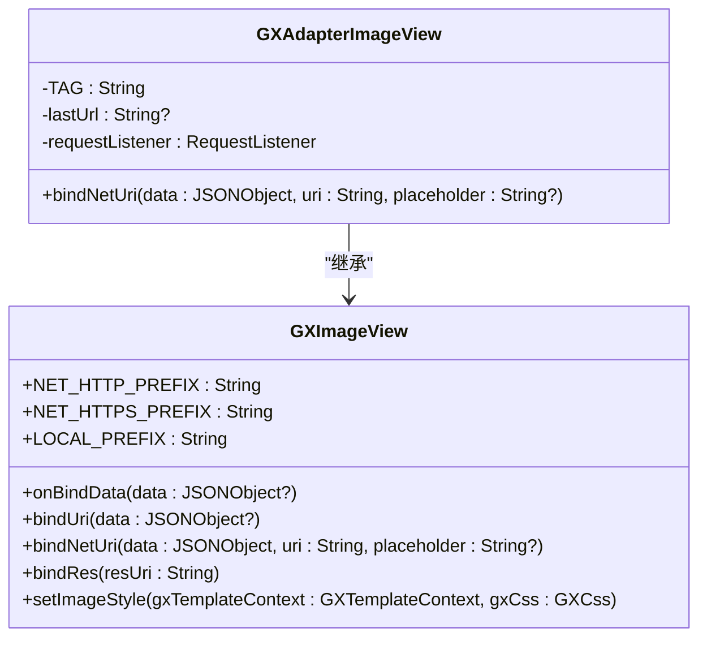
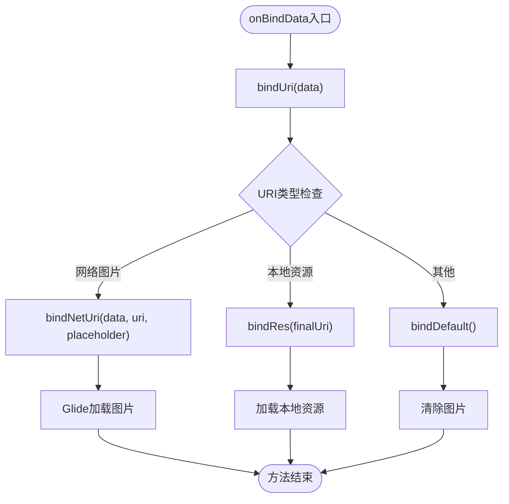
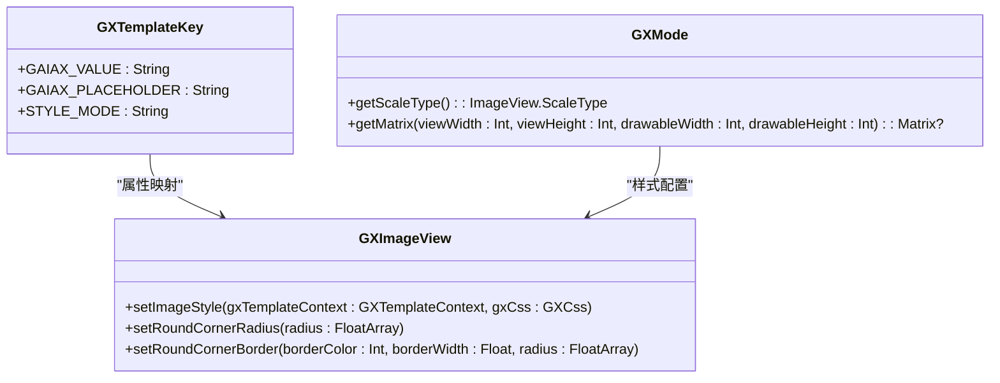
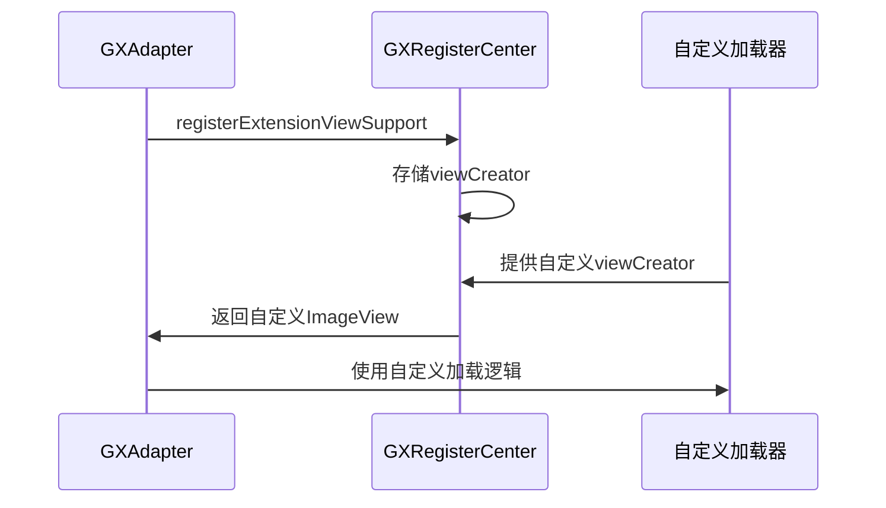
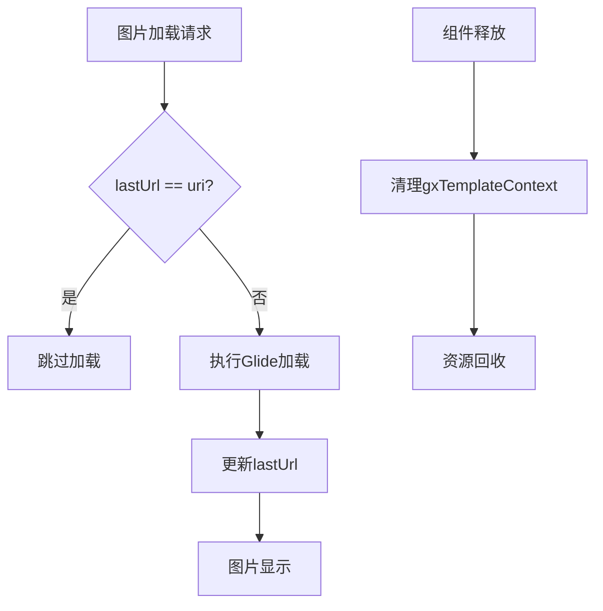
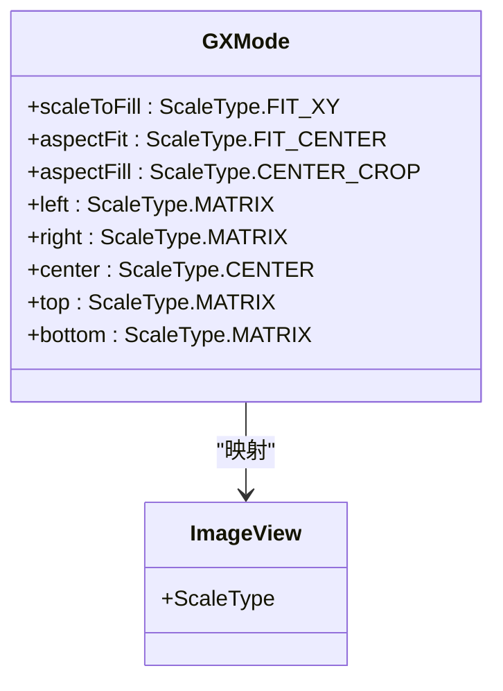
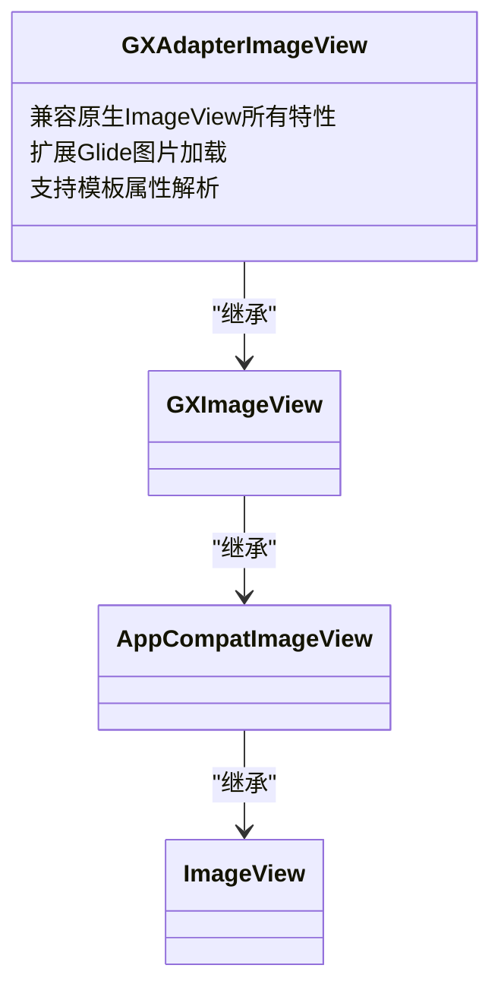

# 图片适配器实现

<cite>
**本文档引用文件**   
- [GXAdapterImageView.kt](file://GaiaXAndroidAdapter/src/main/java/com/alibaba/gaiax/adapter/GXAdapterImageView.kt)
- [GXImageView.kt](file://GaiaXAndroid/src/main/kotlin/com/alibaba/gaiax/render/view/basic/GXImageView.kt)
- [GXAdapter.kt](file://GaiaXAndroidAdapter/src/main/java/com/alibaba/gaiax/adapter/GXAdapter.kt)
- [GXTemplateKey.kt](file://GaiaXAndroid/src/main/kotlin/com/alibaba/gaiax/template/GXTemplateKey.kt)
- [GXMode.kt](file://GaiaXAndroid/src/main/kotlin/com/alibaba/gaiax/template/GXMode.kt)
</cite>

## 目录
1. [简介](#简介)
2. [核心组件分析](#核心组件分析)
3. [onBindData方法实现](#onbinddata方法实现)
4. [图片属性解析与映射](#图片属性解析与映射)
5. [自定义图片加载器集成](#自定义图片加载器集成)
6. [图片内存管理策略](#图片内存管理策略)
7. [scaleType显示效果处理](#scaleType显示效果处理)
8. [Android原生ImageView兼容性](#android原生imageview兼容性)

## 简介
GXAdapterImageView是GaiaX框架中的图片组件适配器，负责处理图片资源的加载和显示。该组件继承自GXImageView，通过重写bindNetUri方法实现了网络图片加载功能，并利用Glide库进行图片加载和缓存管理。适配器能够解析模板中的图片属性，如src、mode等，并将其映射到具体的ImageView配置。同时，组件还实现了图片内存管理策略，包括缓存机制和资源回收，确保应用性能和内存使用效率。

## 核心组件分析
GXAdapterImageView作为图片适配器的核心组件，继承自GXImageView并实现了图片加载的具体逻辑。该组件通过Glide库实现网络图片加载，同时支持本地资源和占位图的处理。组件的关键特性包括图片URL缓存、加载监听器和资源管理。

**图示来源**
- [GXAdapterImageView.kt](file://GaiaXAndroidAdapter/src/main/java/com/alibaba/gaiax/adapter/GXAdapterImageView.kt#L29-L78)
- [GXImageView.kt](file://GaiaXAndroid/src/main/kotlin/com/alibaba/gaiax/render/view/basic/GXImageView.kt#L40-L249)

**本节来源**
- [GXAdapterImageView.kt](file://GaiaXAndroidAdapter/src/main/java/com/alibaba/gaiax/adapter/GXAdapterImageView.kt#L29-L78)
- [GXImageView.kt](file://GaiaXAndroid/src/main/kotlin/com/alibaba/gaiax/render/view/basic/GXImageView.kt#L40-L249)

## onBindData方法实现
onBindData方法是图片适配器的核心实现，负责处理图片资源的加载和显示。该方法通过bindUri方法解析数据，根据URI类型调用相应的处理逻辑。

**图示来源**
- [GXImageView.kt](file://GaiaXAndroid/src/main/kotlin/com/alibaba/gaiax/render/view/basic/GXImageView.kt#L88-L91)
- [GXImageView.kt](file://GaiaXAndroid/src/main/kotlin/com/alibaba/gaiax/render/view/basic/GXImageView.kt#L97-L115)

**本节来源**
- [GXImageView.kt](file://GaiaXAndroid/src/main/kotlin/com/alibaba/gaiax/render/view/basic/GXImageView.kt#L88-L115)

## 图片属性解析与映射
图片适配器通过解析模板中的属性来配置ImageView。关键属性包括src、mode、placeholder等，这些属性被映射到具体的ImageView配置。

**图示来源**
- [GXMode.kt](file://GaiaXAndroid/src/main/kotlin/com/alibaba/gaiax/template/GXMode.kt#L25-L445)
- [GXTemplateKey.kt](file://GaiaXAndroid/src/main/kotlin/com/alibaba/gaiax/template/GXTemplateKey.kt#L23-L459)
- [GXImageView.kt](file://GaiaXAndroid/src/main/kotlin/com/alibaba/gaiax/render/view/basic/GXImageView.kt#L175-L184)

**本节来源**
- [GXMode.kt](file://GaiaXAndroid/src/main/kotlin/com/alibaba/gaiax/template/GXMode.kt#L25-L445)
- [GXTemplateKey.kt](file://GaiaXAndroid/src/main/kotlin/com/alibaba/gaiax/template/GXTemplateKey.kt#L23-L459)
- [GXImageView.kt](file://GaiaXAndroid/src/main/kotlin/com/alibaba/gaiax/render/view/basic/GXImageView.kt#L175-L184)

## 自定义图片加载器集成
通过GXAdapter可以集成自定义的图片加载器，替换默认的Glide实现。注册机制允许开发者提供自己的图片加载逻辑。

**图示来源**
- [GXAdapter.kt](file://GaiaXAndroidAdapter/src/main/java/com/alibaba/gaiax/adapter/GXAdapter.kt#L31-L61)
- [GXRegisterCenter.kt](file://GaiaXAndroid/src/main/kotlin/com/alibaba/gaiax/GXRegisterCenter.kt#L47-L513)

**本节来源**
- [GXAdapter.kt](file://GaiaXAndroidAdapter/src/main/java/com/alibaba/gaiax/adapter/GXAdapter.kt#L31-L61)

## 图片内存管理策略
图片适配器实现了完整的内存管理策略，包括缓存机制和资源回收。通过lastUrl缓存避免重复加载，同时在组件释放时清理资源。

**图示来源**
- [GXAdapterImageView.kt](file://GaiaXAndroidAdapter/src/main/java/com/alibaba/gaiax/adapter/GXAdapterImageView.kt#L60-L77)
- [GXImageView.kt](file://GaiaXAndroid/src/main/kotlin/com/alibaba/gaiax/render/view/basic/GXImageView.kt#L246-L248)

**本节来源**
- [GXAdapterImageView.kt](file://GaiaXAndroidAdapter/src/main/java/com/alibaba/gaiax/adapter/GXAdapterImageView.kt#L60-L77)
- [GXImageView.kt](file://GaiaXAndroid/src/main/kotlin/com/alibaba/gaiax/render/view/basic/GXImageView.kt#L246-L248)

## scaleType显示效果处理
图片适配器支持多种scaleType显示效果，通过GXMode类实现不同的图片缩放和裁剪模式。这些模式映射到Android原生的ScaleType。

**图示来源**
- [GXMode.kt](file://GaiaXAndroid/src/main/kotlin/com/alibaba/gaiax/template/GXMode.kt#L27-L48)
- [GXImageView.kt](file://GaiaXAndroid/src/main/kotlin/com/alibaba/gaiax/render/view/basic/GXImageView.kt#L175-L184)

**本节来源**
- [GXMode.kt](file://GaiaXAndroid/src/main/kotlin/com/alibaba/gaiax/template/GXMode.kt#L27-L48)

## Android原生ImageView兼容性
GXAdapterImageView完全兼容Android原生ImageView的特性，同时扩展了更多功能。通过继承AppCompatImageView，确保了与原生组件的兼容性。

**图示来源**
- [GXImageView.kt](file://GaiaXAndroid/src/main/kotlin/com/alibaba/gaiax/render/view/basic/GXImageView.kt#L42-L43)
- [GXAdapterImageView.kt](file://GaiaXAndroidAdapter/src/main/java/com/alibaba/gaiax/adapter/GXAdapterImageView.kt#L30-L31)

**本节来源**
- [GXImageView.kt](file://GaiaXAndroid/src/main/kotlin/com/alibaba/gaiax/render/view/basic/GXImageView.kt#L42-L43)
- [GXAdapterImageView.kt](file://GaiaXAndroidAdapter/src/main/java/com/alibaba/gaiax/adapter/GXAdapterImageView.kt#L30-L31)