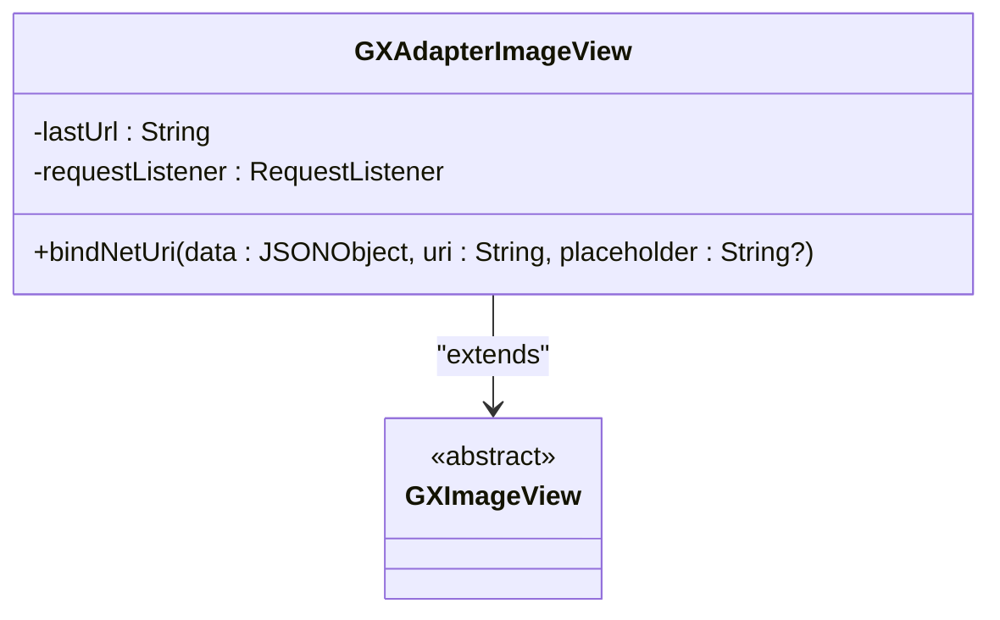
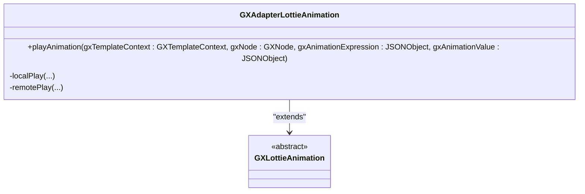
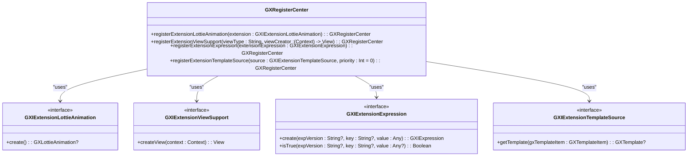
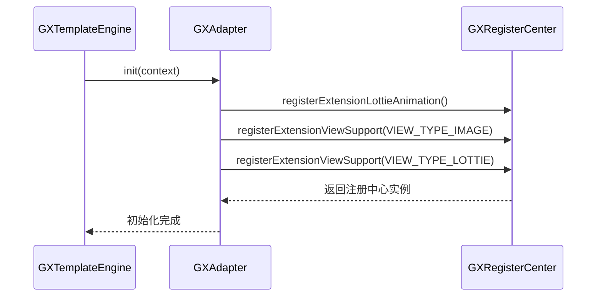
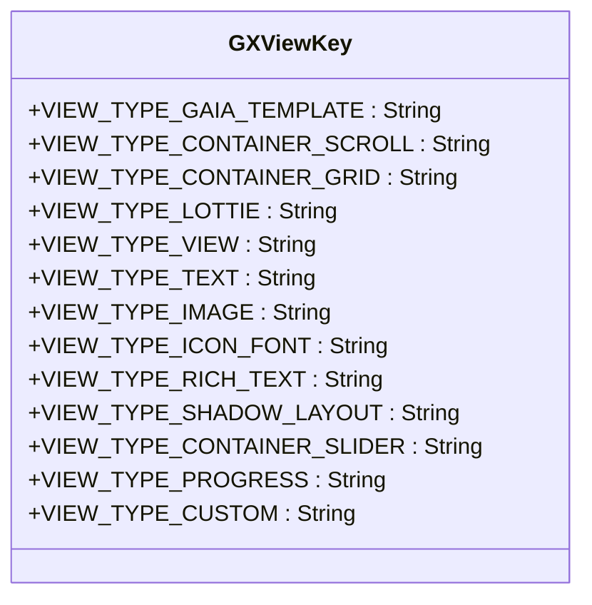
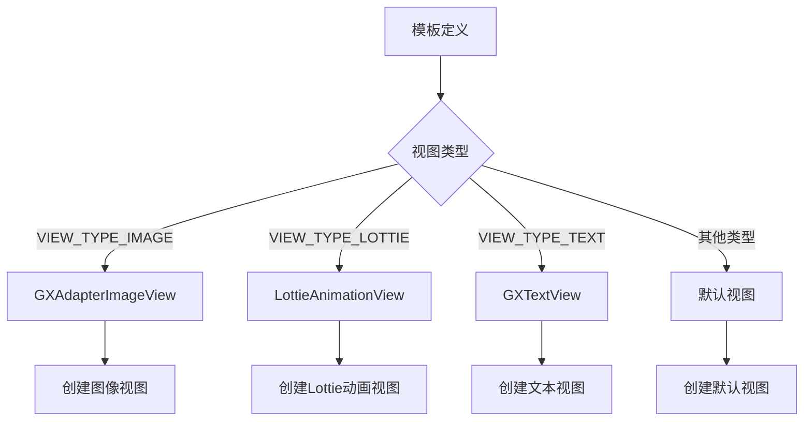

# 自定义适配器开发

<cite>
**Referenced Files in This Document**   
- [GXAdapter.kt](file://GaiaXAndroidAdapter/src/main/java/com/alibaba/gaiax/adapter/GXAdapter.kt)
- [GXRegisterCenter.kt](file://GaiaXAndroid/src/main/kotlin/com/alibaba/gaiax/GXRegisterCenter.kt)
- [GXAdapterImageView.kt](file://GaiaXAndroidAdapter/src/main/java/com/alibaba/gaiax/adapter/GXAdapterImageView.kt)
- [GXAdapterLottieAnimation.kt](file://GaiaXAndroidAdapter/src/main/java/com/alibaba/gaiax/adapter/GXAdapterLottieAnimation.kt)
- [GXTemplateEngine.kt](file://GaiaXAndroid/src/main/kotlin/com/alibaba/gaiax/GXTemplateEngine.kt)
- [GXViewKey.kt](file://GaiaXAndroid/src/main/kotlin/com/alibaba/gaiax/render/view/GXViewKey.kt)
</cite>

## 目录
1. [简介](#简介)
2. [核心组件](#核心组件)
3. [适配器实现](#适配器实现)
4. [注册中心](#注册中心)
5. [视图类型](#视图类型)
6. [最佳实践](#最佳实践)
7. [常见问题](#常见问题)
8. [调试与测试](#调试与测试)
9. [结论](#结论)

## 简介
本文档旨在为开发者提供创建和注册自定义适配器的详细指南，以扩展GaiaX功能。通过实现GXAdapter接口，开发者可以创建从简单文本组件到复杂交互组件的各种自定义适配器。文档详细说明了类型匹配、视图创建和数据绑定等关键方法的重写，以及如何通过GXRegisterCenter注册自定义适配器并在模板中使用自定义组件类型。

## 核心组件

本文档分析的核心组件包括GXAdapter、GXRegisterCenter、GXAdapterImageView和GXAdapterLottieAnimation等类，它们共同构成了GaiaX框架中自定义适配器的基础。

**Section sources**
- [GXAdapter.kt](file://GaiaXAndroidAdapter/src/main/java/com/alibaba/gaiax/adapter/GXAdapter.kt#L31-L61)
- [GXRegisterCenter.kt](file://GaiaXAndroid/src/main/kotlin/com/alibaba/gaiax/GXRegisterCenter.kt#L47-L513)
- [GXAdapterImageView.kt](file://GaiaXAndroidAdapter/src/main/java/com/alibaba/gaiax/adapter/GXAdapterImageView.kt#L30-L78)
- [GXAdapterLottieAnimation.kt](file://GaiaXAndroidAdapter/src/main/java/com/alibaba/gaiax/adapter/GXAdapterLottieAnimation.kt#L30-L206)

## 适配器实现

### GXAdapter接口实现
GXAdapter类实现了GXTemplateEngine.GXIAdapter接口，是自定义适配器的核心实现。该类通过重写init方法，在初始化过程中注册各种扩展功能。

```mermaid
classDiagram
class GXAdapter {
+init(context : Context)
}
class GXTemplateEngine {
<<interface>>
GXIAdapter {
+init(context : Context)
}
}
GXAdapter --> GXTemplateEngine : "implements"
```

**Diagram sources**
- [GXAdapter.kt](file://GaiaXAndroidAdapter/src/main/java/com/alibaba/gaiax/adapter/GXAdapter.kt#L31-L61)
- [GXTemplateEngine.kt](file://GaiaXAndroid/src/main/kotlin/com/alibaba/gaiax/GXTemplateEngine.kt#L95-L97)

### 图像适配器实现
GXAdapterImageView类继承自GXImageView，实现了自定义图像视图的逻辑。该适配器使用Glide库进行图片加载，并通过requestListener监听图片加载状态。



**Diagram sources**
- [GXAdapterImageView.kt](file://GaiaXAndroidAdapter/src/main/java/com/alibaba/gaiax/adapter/GXAdapterImageView.kt#L30-L78)

### Lottie动画适配器实现
GXAdapterLottieAnimation类实现了GXLottieAnimation接口，提供了Lottie动画的播放功能。该适配器支持本地和远程Lottie动画的播放，并处理动画的开始和结束事件。



**Diagram sources**
- [GXAdapterLottieAnimation.kt](file://GaiaXAndroidAdapter/src/main/java/com/alibaba/gaiax/adapter/GXAdapterLottieAnimation.kt#L30-L206)

**Section sources**
- [GXAdapter.kt](file://GaiaXAndroidAdapter/src/main/java/com/alibaba/gaiax/adapter/GXAdapter.kt#L31-L61)
- [GXAdapterImageView.kt](file://GaiaXAndroidAdapter/src/main/java/com/alibaba/gaiax/adapter/GXAdapterImageView.kt#L30-L78)
- [GXAdapterLottieAnimation.kt](file://GaiaXAndroidAdapter/src/main/java/com/alibaba/gaiax/adapter/GXAdapterLottieAnimation.kt#L30-L206)

## 注册中心

### GXRegisterCenter功能
GXRegisterCenter是GaiaX的注册中心，负责管理各种扩展功能的注册。它提供了多种注册方法，包括注册Lottie动画、视图支持、表达式等。



**Diagram sources**
- [GXRegisterCenter.kt](file://GaiaXAndroid/src/main/kotlin/com/alibaba/gaiax/GXRegisterCenter.kt#L47-L513)

### 注册流程
自定义适配器的注册流程通过GXAdapter的init方法实现，该方法在SDK初始化时被调用。注册流程包括注册Lottie动画、图像视图和Lottie视图等组件。



**Diagram sources**
- [GXAdapter.kt](file://GaiaXAndroidAdapter/src/main/java/com/alibaba/gaiax/adapter/GXAdapter.kt#L31-L61)
- [GXRegisterCenter.kt](file://GaiaXAndroid/src/main/kotlin/com/alibaba/gaiax/GXRegisterCenter.kt#L47-L513)
- [GXTemplateEngine.kt](file://GaiaXAndroid/src/main/kotlin/com/alibaba/gaiax/GXTemplateEngine.kt#L876-L928)

**Section sources**
- [GXRegisterCenter.kt](file://GaiaXAndroid/src/main/kotlin/com/alibaba/gaiax/GXRegisterCenter.kt#L47-L513)
- [GXAdapter.kt](file://GaiaXAndroidAdapter/src/main/java/com/alibaba/gaiax/adapter/GXAdapter.kt#L31-L61)

## 视图类型

### GXViewKey常量
GXViewKey对象定义了所有支持的视图类型常量，这些常量用于标识不同类型的视图组件。



**Diagram sources**
- [GXViewKey.kt](file://GaiaXAndroid/src/main/kotlin/com/alibaba/gaiax/render/view/GXViewKey.kt#L22-L49)

### 视图类型映射
视图类型与具体的视图创建逻辑通过GXRegisterCenter的registerExtensionViewSupport方法进行映射。当模板中使用特定视图类型时，系统会根据注册的映射关系创建相应的视图实例。



**Diagram sources**
- [GXAdapter.kt](file://GaiaXAndroidAdapter/src/main/java/com/alibaba/gaiax/adapter/GXAdapter.kt#L31-L61)
- [GXViewKey.kt](file://GaiaXAndroid/src/main/kotlin/com/alibaba/gaiax/render/view/GXViewKey.kt#L22-L49)

**Section sources**
- [GXViewKey.kt](file://GaiaXAndroid/src/main/kotlin/com/alibaba/gaiax/render/view/GXViewKey.kt#L22-L49)

## 最佳实践

### 线程安全处理
在实现自定义适配器时，需要注意线程安全问题。所有UI相关的操作都应在主线程中执行，而耗时的网络请求或文件读取操作应在后台线程中完成。

### 资源管理
自定义适配器应妥善管理资源，特别是在处理图片和动画时。建议使用图片加载库（如Glide）来管理图片缓存，并在视图销毁时及时释放相关资源。

### 性能优化
为了提高性能，可以考虑以下优化措施：
- 使用视图复用机制减少内存占用
- 对频繁使用的资源进行缓存
- 避免在onBind方法中执行耗时操作
- 使用合适的图片尺寸和格式

**Section sources**
- [GXAdapterImageView.kt](file://GaiaXAndroidAdapter/src/main/java/com/alibaba/gaiax/adapter/GXAdapterImageView.kt#L30-L78)
- [GXAdapterLottieAnimation.kt](file://GaiaXAndroidAdapter/src/main/java/com/alibaba/gaiax/adapter/GXAdapterLottieAnimation.kt#L30-L206)

## 常见问题

### 视图复用导致的状态错乱
当视图被复用时，可能会出现状态错乱的问题。解决方法是在bind方法中重置视图的所有状态，确保每次绑定数据时视图都处于初始状态。

### 内存泄漏预防
为了避免内存泄漏，应注意以下几点：
- 及时取消网络请求和动画
- 避免持有Activity或Context的强引用
- 在视图销毁时清理所有监听器和回调

**Section sources**
- [GXAdapterImageView.kt](file://GaiaXAndroidAdapter/src/main/java/com/alibaba/gaiax/adapter/GXAdapterImageView.kt#L30-L78)
- [GXAdapterLottieAnimation.kt](file://GaiaXAndroidAdapter/src/main/java/com/alibaba/gaiax/adapter/GXAdapterLottieAnimation.kt#L30-L206)

## 调试与测试

### 调试技巧
- 使用日志记录关键方法的调用和参数
- 在开发环境中开启调试模式，查看详细的执行流程
- 使用性能分析工具检测内存使用和CPU占用情况

### 测试方法
- 编写单元测试验证核心逻辑的正确性
- 进行集成测试确保各组件协同工作正常
- 在不同设备和屏幕尺寸上进行兼容性测试

**Section sources**
- [GXAdapter.kt](file://GaiaXAndroidAdapter/src/main/java/com/alibaba/gaiax/adapter/GXAdapter.kt#L31-L61)
- [GXAdapterImageView.kt](file://GaiaXAndroidAdapter/src/main/java/com/alibaba/gaiax/adapter/GXAdapterImageView.kt#L30-L78)

## 结论
通过实现GXAdapter接口并利用GXRegisterCenter注册自定义适配器，开发者可以灵活地扩展GaiaX的功能。本文档详细介绍了从简单文本组件到复杂交互组件的自定义适配器开发方法，包括实现关键方法、注册适配器、处理常见问题和优化性能等方面的最佳实践。遵循这些指导原则，开发者可以创建稳定、高效且兼容性良好的自定义组件，从而满足各种业务需求。