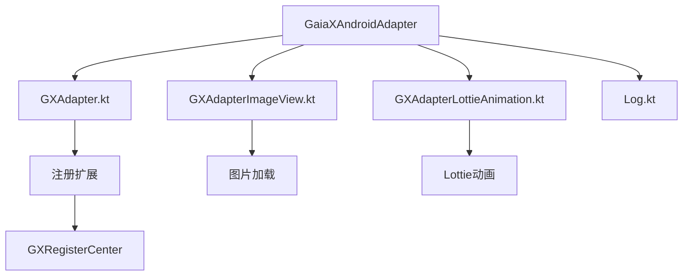
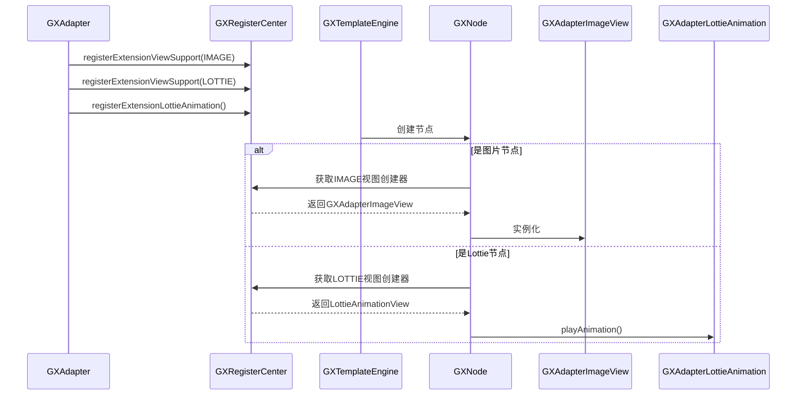
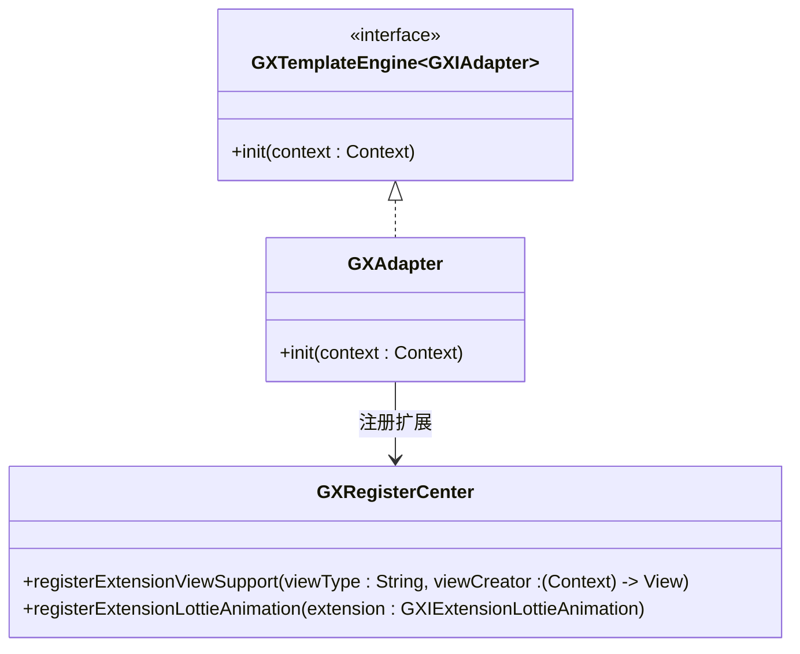
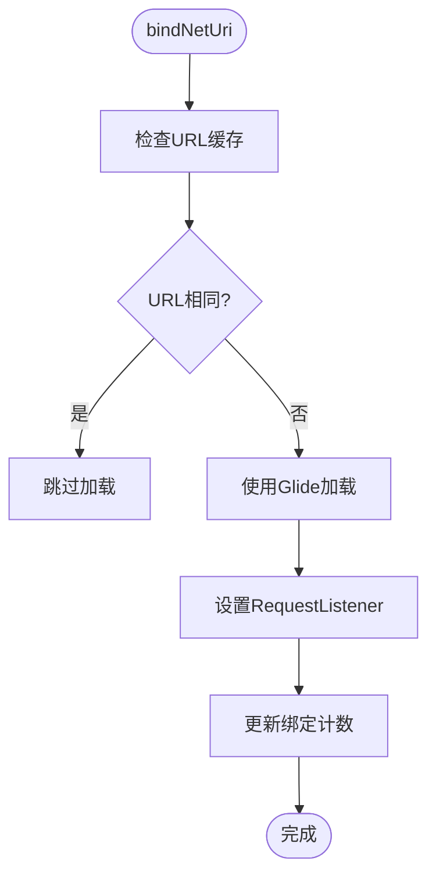
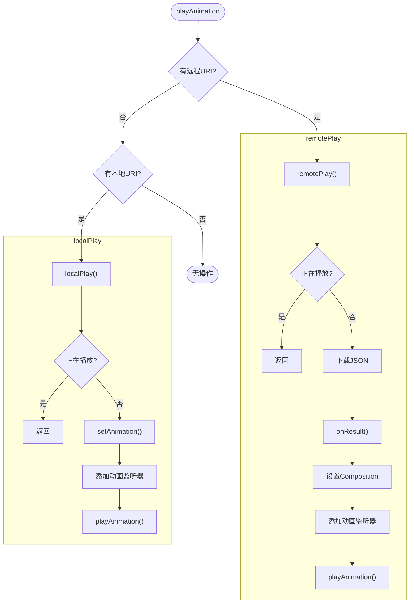
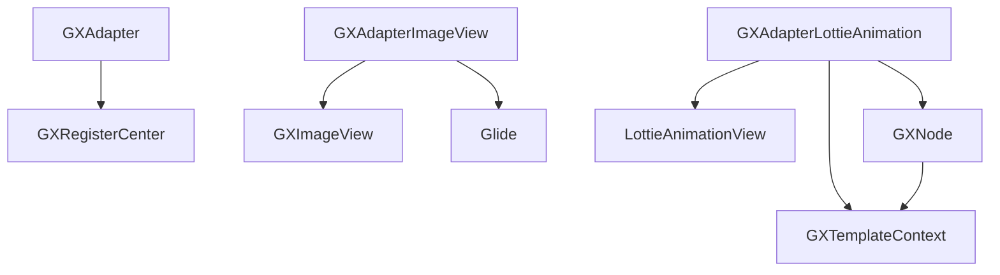

# 适配器支持

<cite>
**本文档中引用的文件**  
- [GXAdapter.kt](file://GaiaXAndroidAdapter/src/main/java/com/alibaba/gaiax/adapter/GXAdapter.kt)
- [GXAdapterImageView.kt](file://GaiaXAndroidAdapter/src/main/java/com/alibaba/gaiax/adapter/GXAdapterImageView.kt)
- [GXAdapterLottieAnimation.kt](file://GaiaXAndroidAdapter/src/main/java/com/alibaba/gaiax/adapter/GXAdapterLottieAnimation.kt)
- [Log.kt](file://GaiaXAndroidAdapter/src/main/java/com/alibaba/gaiax/adapter/Log.kt)
- [GXImageView.kt](file://GaiaXAndroid/src/main/kotlin/com/alibaba/gaiax/render/view/basic/GXImageView.kt)
- [GXLottieAnimation.kt](file://GaiaXAndroid/src/main/kotlin/com/alibaba/gaiax/template/animation/GXLottieAnimation.kt)
- [GXNode.kt](file://GaiaXAndroid/src/main/kotlin/com/alibaba/gaiax/render/node/GXNode.kt)
- [GXTemplateContext.kt](file://GaiaXAndroid/src/main/kotlin/com/alibaba/gaiax/context/GXTemplateContext.kt)
- [GXRegisterCenter.kt](file://GaiaXAndroid/src/main/kotlin/com/alibaba/gaiax/GXRegisterCenter.kt)
</cite>

## 目录
1. [简介](#简介)
2. [项目结构](#项目结构)
3. [核心组件](#核心组件)
4. [架构概述](#架构概述)
5. [详细组件分析](#详细组件分析)
6. [依赖分析](#依赖分析)
7. [性能考虑](#性能考虑)
8. [故障排除指南](#故障排除指南)
9. [结论](#结论)

## 简介
本文档详细介绍了 GaiaX 框架中适配器系统的设计与实现，重点阐述了 GXAdapter 如何通过适配器模式实现自定义组件的扩展机制。文档深入解析了视图注册、类型匹配和生命周期管理等核心设计原理，并以 GXAdapterImageView 和 GXAdapterLottieAnimation 为例，说明了图片加载与 Lottie 动画播放的具体实现方式。同时，为开发者提供了自定义适配器的创建与注册方法、性能优化策略以及常见问题的解决方案。

## 项目结构
GaiaX 的适配器功能主要由 `GaiaXAndroidAdapter` 模块实现，该模块位于项目根目录下，其核心功能集中在 `src/main/java/com/alibaba/gaiax/adapter/` 包中。该模块通过实现 `GXTemplateEngine.GXIAdapter` 接口，向 GaiaX 核心引擎注册自定义的视图和动画扩展。

**图表来源**
- [GXAdapter.kt](file://GaiaXAndroidAdapter/src/main/java/com/alibaba/gaiax/adapter/GXAdapter.kt#L1-L62)
- [GXAdapterImageView.kt](file://GaiaXAndroidAdapter/src/main/java/com/alibaba/gaiax/adapter/GXAdapterImageView.kt#L1-L79)
- [GXAdapterLottieAnimation.kt](file://GaiaXAndroidAdapter/src/main/java/com/alibaba/gaiax/adapter/GXAdapterLottieAnimation.kt#L1-L207)

**章节来源**
- [GXAdapter.kt](file://GaiaXAndroidAdapter/src/main/java/com/alibaba/gaiax/adapter/GXAdapter.kt#L1-L62)

## 核心组件
本节分析适配器系统中的核心组件，包括适配器主类、图片视图适配器和 Lottie 动画适配器。这些组件共同构成了 GaiaX 扩展外部功能的基础。

**章节来源**
- [GXAdapter.kt](file://GaiaXAndroidAdapter/src/main/java/com/alibaba/gaiax/adapter/GXAdapter.kt#L1-L62)
- [GXAdapterImageView.kt](file://GaiaXAndroidAdapter/src/main/java/com/alibaba/gaiax/adapter/GXAdapterImageView.kt#L1-L79)
- [GXAdapterLottieAnimation.kt](file://GaiaXAndroidAdapter/src/main/java/com/alibaba/gaiax/adapter/GXAdapterLottieAnimation.kt#L1-L207)

## 架构概述
GaiaX 的适配器系统采用注册中心模式，通过 `GXRegisterCenter` 统一管理所有扩展。`GXAdapter` 作为适配器的入口，在初始化时向注册中心注册自定义的视图创建器和动画处理器。核心引擎在渲染模板时，会根据节点类型从注册中心获取对应的实现。

**图表来源**
- [GXAdapter.kt](file://GaiaXAndroidAdapter/src/main/java/com/alibaba/gaiax/adapter/GXAdapter.kt#L33-L62)
- [GXRegisterCenter.kt](file://GaiaXAndroid/src/main/kotlin/com/alibaba/gaiax/GXRegisterCenter.kt#L47-L513)
- [GXLottieAnimation.kt](file://GaiaXAndroid/src/main/kotlin/com/alibaba/gaiax/template/animation/GXLottieAnimation.kt#L24-L70)

## 详细组件分析
本节对适配器系统中的关键组件进行深入分析，包括其设计模式、实现逻辑和交互流程。

### GXAdapter 分析
`GXAdapter` 是适配器系统的入口，实现了 `GXIAdapter` 接口。其 `init` 方法在引擎初始化时被调用，负责向 `GXRegisterCenter` 注册所有扩展。

#### 适配器模式设计

**图表来源**
- [GXAdapter.kt](file://GaiaXAndroidAdapter/src/main/java/com/alibaba/gaiax/adapter/GXAdapter.kt#L33-L62)
- [GXRegisterCenter.kt](file://GaiaXAndroid/src/main/kotlin/com/alibaba/gaiax/GXRegisterCenter.kt#L47-L513)

**章节来源**
- [GXAdapter.kt](file://GaiaXAndroidAdapter/src/main/java/com/alibaba/gaiax/adapter/GXAdapter.kt#L1-L62)

### GXAdapterImageView 分析
`GXAdapterImageView` 负责处理模板中图片的加载和显示，它继承自 `GXImageView` 并重写了 `bindNetUri` 方法。

#### 图片加载流程

**图表来源**
- [GXAdapterImageView.kt](file://GaiaXAndroidAdapter/src/main/java/com/alibaba/gaiax/adapter/GXAdapterImageView.kt#L31-L79)
- [GXImageView.kt](file://GaiaXAndroid/src/main/kotlin/com/alibaba/gaiax/render/view/basic/GXImageView.kt#L42-L250)

**章节来源**
- [GXAdapterImageView.kt](file://GaiaXAndroidAdapter/src/main/java/com/alibaba/gaiax/adapter/GXAdapterImageView.kt#L1-L79)

### GXAdapterLottieAnimation 分析
`GXAdapterLottieAnimation` 是 `GXLottieAnimation` 的具体实现，负责处理 Lottie 动画的播放逻辑，支持本地和远程资源。

#### 动画播放流程

**图表来源**
- [GXAdapterLottieAnimation.kt](file://GaiaXAndroidAdapter/src/main/java/com/alibaba/gaiax/adapter/GXAdapterLottieAnimation.kt#L31-L207)
- [GXLottieAnimation.kt](file://GaiaXAndroid/src/main/kotlin/com/alibaba/gaiax/template/animation/GXLottieAnimation.kt#L24-L70)

**章节来源**
- [GXAdapterLottieAnimation.kt](file://GaiaXAndroidAdapter/src/main/java/com/alibaba/gaiax/adapter/GXAdapterLottieAnimation.kt#L1-L207)

## 依赖分析
适配器系统与 GaiaX 核心模块存在紧密的依赖关系，主要通过 `GXRegisterCenter` 和 `GXTemplateEngine` 进行交互。

**图表来源**
- [GXAdapter.kt](file://GaiaXAndroidAdapter/src/main/java/com/alibaba/gaiax/adapter/GXAdapter.kt#L27-L30)
- [GXAdapterImageView.kt](file://GaiaXAndroidAdapter/src/main/java/com/alibaba/gaiax/adapter/GXAdapterImageView.kt#L23-L24)
- [GXAdapterLottieAnimation.kt](file://GaiaXAndroidAdapter/src/main/java/com/alibaba/gaiax/adapter/GXAdapterLottieAnimation.kt#L27-L29)
- [GXNode.kt](file://GaiaXAndroid/src/main/kotlin/com/alibaba/gaiax/render/node/GXNode.kt#L25-L26)
- [GXTemplateContext.kt](file://GaiaXAndroid/src/main/kotlin/com/alibaba/gaiax/context/GXTemplateContext.kt#L23-L24)

**章节来源**
- [GXAdapter.kt](file://GaiaXAndroidAdapter/src/main/java/com/alibaba/gaiax/adapter/GXAdapter.kt#L1-L62)
- [GXAdapterImageView.kt](file://GaiaXAndroidAdapter/src/main/java/com/alibaba/gaiax/adapter/GXAdapterImageView.kt#L1-L79)
- [GXAdapterLottieAnimation.kt](file://GaiaXAndroidAdapter/src/main/java/com/alibaba/gaiax/adapter/GXAdapterLottieAnimation.kt#L1-L207)

## 性能考虑
为确保适配器系统的高性能，开发者应关注以下几点：
- **图片加载**：`GXAdapterImageView` 内置了 URL 缓存机制，避免重复加载相同的网络图片。
- **动画资源**：Lottie 动画应优先使用本地资源，远程加载会增加网络开销和延迟。
- **内存管理**：在 `GXAdapterLottieAnimation` 中，每次播放前都会移除所有监听器，防止内存泄漏。
- **日志控制**：通过 `Log.kt` 中的 `SystemProp` 机制，可以动态控制日志输出，避免生产环境的性能损耗。

## 故障排除指南
本节提供适配器系统常见问题的解决方案。

**章节来源**
- [Log.kt](file://GaiaXAndroidAdapter/src/main/java/com/alibaba/gaiax/adapter/Log.kt#L1-L121)
- [GXAdapterLottieAnimation.kt](file://GaiaXAndroidAdapter/src/main/java/com/alibaba/gaiax/adapter/GXAdapterLottieAnimation.kt#L89-L91)
- [GXAdapterImageView.kt](file://GaiaXAndroidAdapter/src/main/java/com/alibaba/gaiax/adapter/GXAdapterImageView.kt#L63-L65)

### 常见问题
1.  **内存泄漏**：确保在动画播放结束或视图销毁时，正确移除所有监听器（如 `GXAdapterLottieAnimation` 所做）。
2.  **视图复用**：在 `bindNetUri` 中通过 `lastUrl` 缓存机制，避免在列表滚动时重复加载图片。
3.  **资源加载失败**：检查网络权限、资源路径和 Lottie JSON 文件的完整性。
4.  **日志开关**：通过系统属性 `debug.com.alibaba.gaiax.adapter.log` 可开启适配器模块的详细日志。

## 结论
GaiaX 的适配器系统通过清晰的注册机制和模块化设计，为框架提供了强大的扩展能力。`GXAdapter` 作为桥梁，将 `Glide` 和 `Lottie` 等第三方库无缝集成到核心渲染流程中。其设计充分考虑了性能、内存和可维护性，为开发者提供了创建自定义组件的标准范式。通过深入理解 `GXAdapterImageView` 和 `GXAdapterLottieAnimation` 的实现，开发者可以轻松地为 GaiaX 添加更多功能。