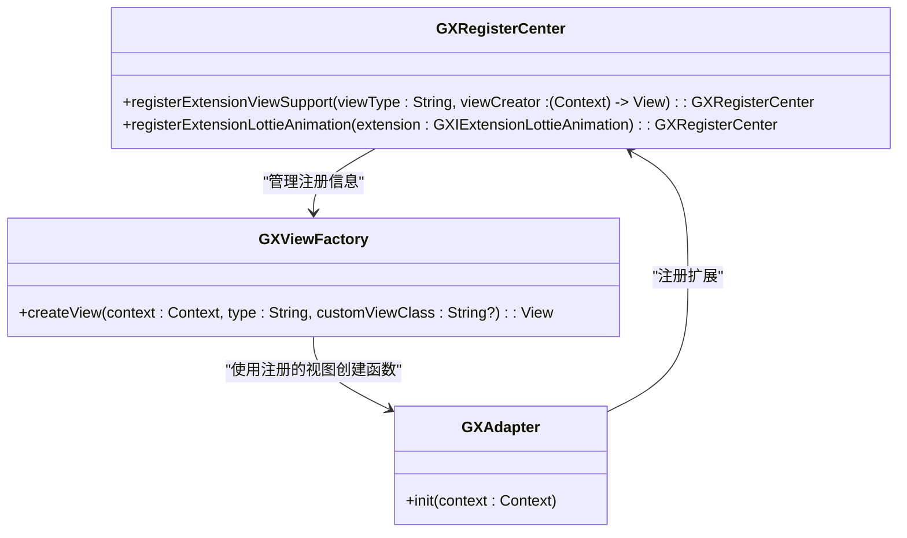
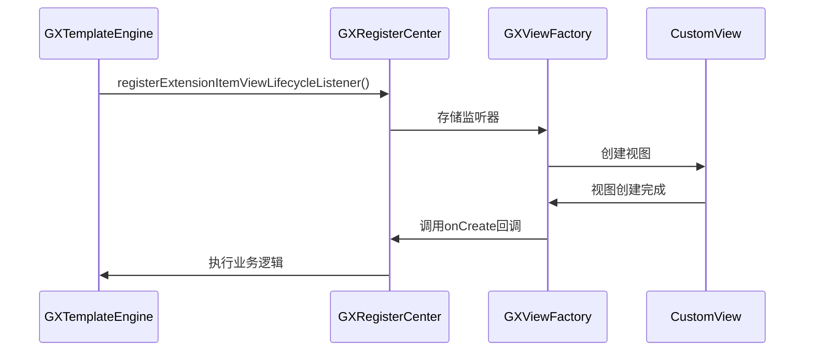
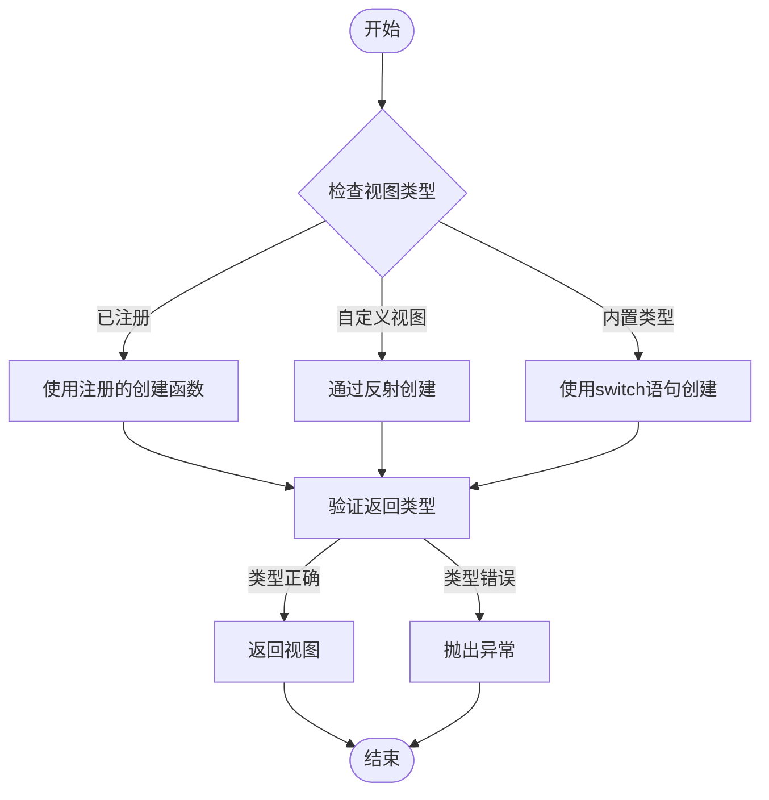
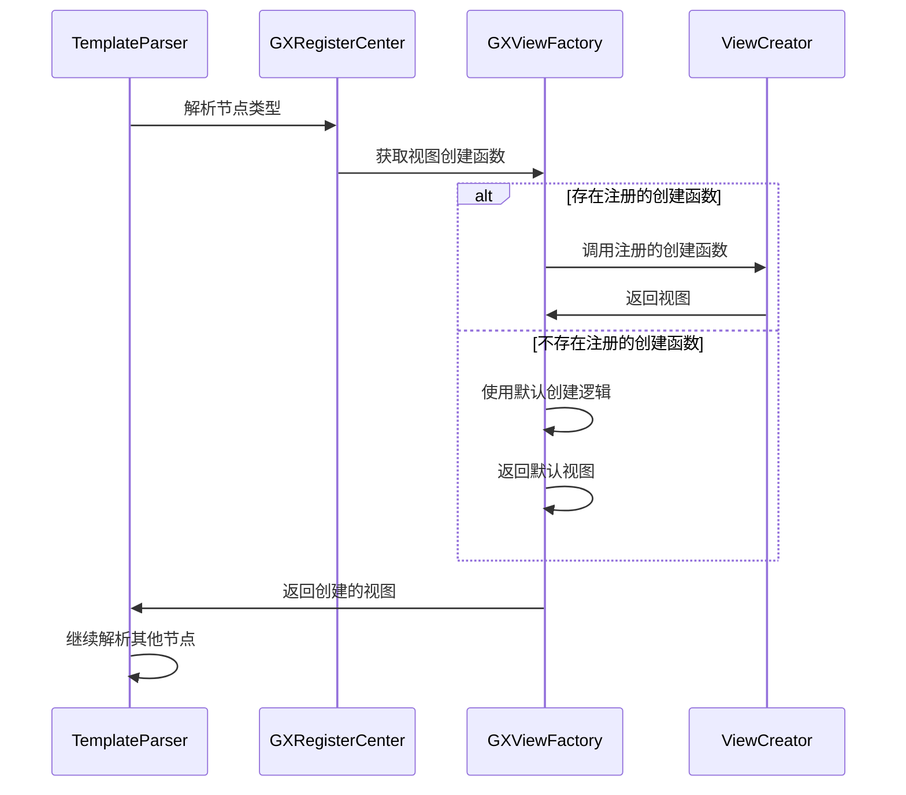
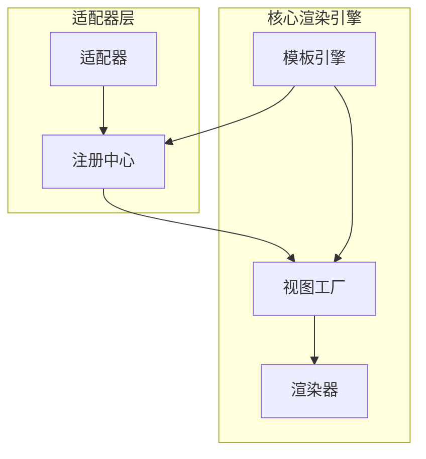

# 适配器架构设计

<cite>
**本文档引用的文件**   
- [GXAdapter.kt](file://GaiaXAndroidAdapter/src/main/java/com/alibaba/gaiax/adapter/GXAdapter.kt)
- [GXRegisterCenter.kt](file://GaiaXAndroid/src/main/kotlin/com/alibaba/gaiax/GXRegisterCenter.kt)
- [GXTemplateEngine.kt](file://GaiaXAndroid/src/main/kotlin/com/alibaba/gaiax/GXTemplateEngine.kt)
- [GXViewFactory.kt](file://GaiaXAndroid/src/main/kotlin/com/alibaba/gaiax/render/view/GXViewFactory.kt)
</cite>

## 目录
1. [适配器系统概述](#适配器系统概述)
2. [核心组件分析](#核心组件分析)
3. [适配器注册与匹配机制](#适配器注册与匹配机制)
4. [生命周期回调管理](#生命周期回调管理)
5. [类型安全的转换流程](#类型安全的转换流程)
6. [与GXRegisterCenter的协同工作](#与gxregistercenter的协同工作)
7. [模板解析与视图创建时序](#模板解析与视图创建时序)
8. [架构图解](#架构图解)
9. [设计权衡与性能影响](#设计权衡与性能影响)

## 适配器系统概述
适配器系统是GaiaX框架的核心扩展机制，通过GXAdapter作为扩展点，实现了框架的灵活性和可扩展性。该系统允许开发者注册自定义的视图类型、动画组件和其他功能扩展，从而满足多样化的业务需求。适配器模式在框架中的应用，使得核心渲染引擎与具体实现解耦，提高了代码的可维护性和可测试性。

## 核心组件分析
适配器系统的核心组件包括GXAdapter、GXRegisterCenter和GXViewFactory。GXAdapter作为适配器的入口点，负责初始化各种扩展功能。GXRegisterCenter是注册中心，管理所有扩展的注册和查找。GXViewFactory则是视图工厂，根据注册的类型创建相应的视图实例。

**Section sources**
- [GXAdapter.kt](file://GaiaXAndroidAdapter/src/main/java/com/alibaba/gaiax/adapter/GXAdapter.kt#L31-L61)
- [GXRegisterCenter.kt](file://GaiaXAndroid/src/main/kotlin/com/alibaba/gaiax/GXRegisterCenter.kt#L47-L513)
- [GXViewFactory.kt](file://GaiaXAndroid/src/main/kotlin/com/alibaba/gaiax/render/view/GXViewFactory.kt#L29-L74)

## 适配器注册与匹配机制
适配器的注册与匹配机制是通过GXRegisterCenter实现的。开发者可以通过registerExtensionViewSupport方法注册自定义视图，该方法接受视图类型和视图创建函数作为参数。注册后，GXViewFactory在创建视图时会根据类型查找对应的创建函数。



**Diagram sources **
- [GXRegisterCenter.kt](file://GaiaXAndroid/src/main/kotlin/com/alibaba/gaiax/GXRegisterCenter.kt#L427-L432)
- [GXViewFactory.kt](file://GaiaXAndroid/src/main/kotlin/com/alibaba/gaiax/render/view/GXViewFactory.kt#L33-L60)
- [GXAdapter.kt](file://GaiaXAndroidAdapter/src/main/java/com/alibaba/gaiax/adapter/GXAdapter.kt#L34-L60)

## 生命周期回调管理
适配器系统通过GXRegisterCenter管理生命周期回调。开发者可以注册GXIItemViewLifecycleListener来监听视图的创建、复用、可见性变化和销毁等事件。这些回调在视图的生命周期中被触发，允许开发者执行相应的业务逻辑。



**Diagram sources **
- [GXRegisterCenter.kt](file://GaiaXAndroid/src/main/kotlin/com/alibaba/gaiax/GXRegisterCenter.kt#L476-L480)
- [GXViewFactory.kt](file://GaiaXAndroid/src/main/kotlin/com/alibaba/gaiax/render/view/GXViewFactory.kt#L33-L60)

## 类型安全的转换流程
适配器系统通过泛型和类型检查确保类型安全。在注册和创建视图时，系统会验证类型的一致性。GXViewFactory的createView方法使用泛型T : View来确保返回的视图类型正确。同时，通过反射机制创建自定义视图时，也会进行类型检查。



**Diagram sources **
- [GXViewFactory.kt](file://GaiaXAndroid/src/main/kotlin/com/alibaba/gaiax/render/view/GXViewFactory.kt#L33-L60)
- [GXViewFactory.kt](file://GaiaXAndroid/src/main/kotlin/com/alibaba/gaiax/render/view/GXViewFactory.kt#L62-L73)

## 与GXRegisterCenter的协同工作
适配器系统与GXRegisterCenter紧密协作，实现动态组件扩展。GXRegisterCenter作为中央注册中心，管理所有扩展的注册和查找。适配器通过GXRegisterCenter注册各种扩展，如Lottie动画、自定义视图等。核心渲染引擎通过GXRegisterCenter获取这些扩展，实现功能的动态加载。

```mermaid
classDiagram
class GXRegisterCenter {
+extensionLottieAnimation : GXIExtensionLottieAnimation?
+extensionViewSupport : Map<String, (Context) -> View>
+extensionColor : GXIExtensionColor?
+extensionSize : GXIExtensionSize?
}
class GXAdapter {
+init(context : Context)
}
class GXTemplateEngine {
+createView(gxTemplateItem : GXTemplateItem, gxMeasureSize : GXMeasureSize) : View?
+bindData(gxView : View?, gxTemplateData : GXTemplateData) : Unit
}
GXAdapter --> GXRegisterCenter : "注册扩展"
GXTemplateEngine --> GXRegisterCenter : "获取扩展"
GXRegisterCenter --> GXTemplateEngine : "提供扩展功能"
```

**Diagram sources **
- [GXRegisterCenter.kt](file://GaiaXAndroid/src/main/kotlin/com/alibaba/gaiax/GXRegisterCenter.kt#L333-L333)
- [GXAdapter.kt](file://GaiaXAndroidAdapter/src/main/java/com/alibaba/gaiax/adapter/GXAdapter.kt#L34-L60)
- [GXTemplateEngine.kt](file://GaiaXAndroid/src/main/kotlin/com/alibaba/gaiax/GXTemplateEngine.kt#L557-L582)

## 模板解析与视图创建时序
适配器在模板解析和视图创建过程中扮演关键角色。当模板引擎解析模板时，会根据节点类型查找对应的适配器。如果找到匹配的适配器，则使用其创建视图；否则，使用默认的视图创建逻辑。这一过程确保了自定义组件能够无缝集成到模板中。



**Diagram sources **
- [GXRegisterCenter.kt](file://GaiaXAndroid/src/main/kotlin/com/alibaba/gaiax/GXRegisterCenter.kt#L427-L432)
- [GXViewFactory.kt](file://GaiaXAndroid/src/main/kotlin/com/alibaba/gaiax/render/view/GXViewFactory.kt#L33-L60)

## 架构图解
适配器层与核心渲染引擎的交互关系如下图所示。适配器层位于核心渲染引擎之上，通过注册中心与引擎通信。这种分层架构使得核心引擎保持简洁，同时允许通过适配器扩展各种功能。



**Diagram sources **
- [GXAdapter.kt](file://GaiaXAndroidAdapter/src/main/java/com/alibaba/gaiax/adapter/GXAdapter.kt#L31-L61)
- [GXRegisterCenter.kt](file://GaiaXAndroid/src/main/kotlin/com/alibaba/gaiax/GXRegisterCenter.kt#L47-L513)
- [GXTemplateEngine.kt](file://GaiaXAndroid/src/main/kotlin/com/alibaba/gaiax/GXTemplateEngine.kt#L77-L927)
- [GXViewFactory.kt](file://GaiaXAndroid/src/main/kotlin/com/alibaba/gaiax/render/view/GXViewFactory.kt#L29-L74)

## 设计权衡与性能影响
适配器系统的设计在灵活性和性能之间进行了权衡。通过注册中心和工厂模式，系统实现了高度的可扩展性，但这也带来了一定的性能开销。每次视图创建都需要查找注册的创建函数，这可能会影响性能。为了优化性能，系统采用了缓存机制，将常用的创建函数缓存起来，减少查找时间。

**Section sources**
- [GXRegisterCenter.kt](file://GaiaXAndroid/src/main/kotlin/com/alibaba/gaiax/GXRegisterCenter.kt#L317-L334)
- [GXViewFactory.kt](file://GaiaXAndroid/src/main/kotlin/com/alibaba/gaiax/render/view/GXViewFactory.kt#L31-L31)