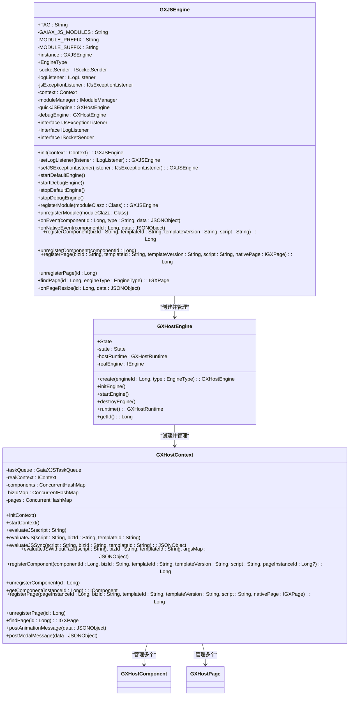
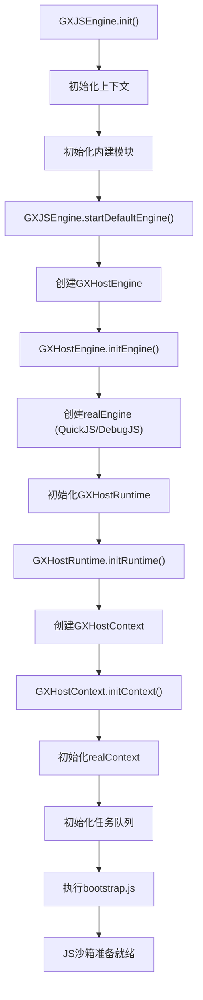
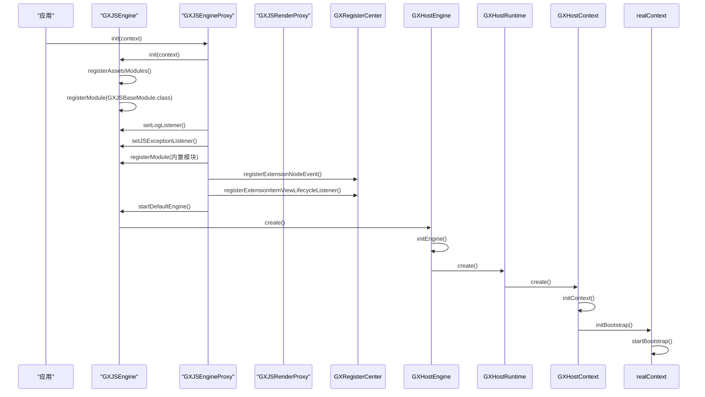
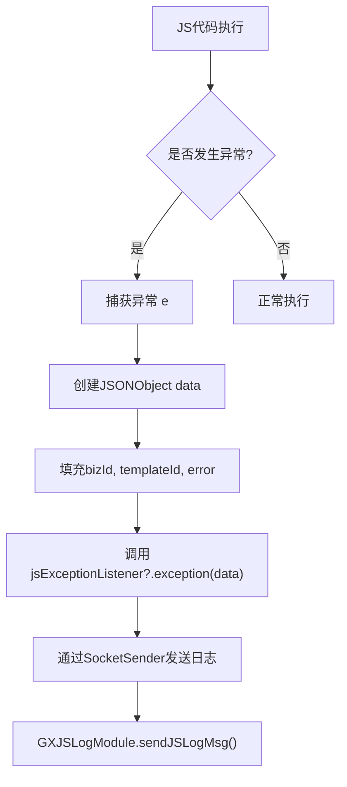
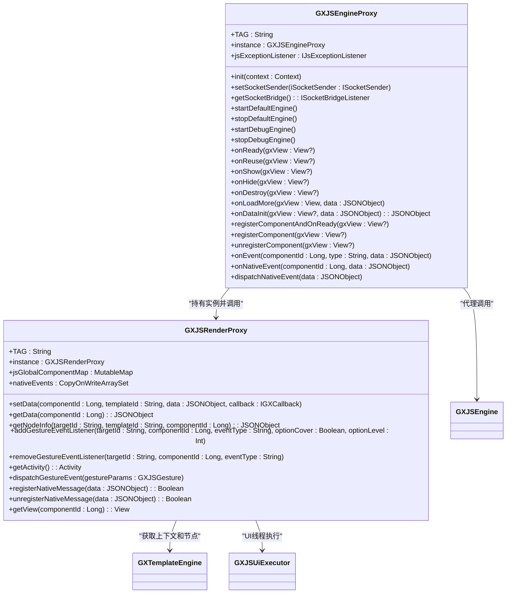

# 代码安全

<cite>
**本文档引用文件**   
- [GXJSEngine.kt](file://GaiaXAndroidJS/src/main/kotlin/com/alibaba/gaiax/js/GXJSEngine.kt)
- [GXJSEngineProxy.kt](file://GaiaXAndroidJSProxy/src/main/java/com/alibaba/gaiax/js/proxy/GXJSEngineProxy.kt)
- [GXJSRenderProxy.kt](file://GaiaXAndroidJSProxy/src/main/java/com/alibaba/gaiax/js/proxy/GXJSRenderProxy.kt)
- [GXHostEngine.kt](file://GaiaXAndroidJS/src/main/kotlin/com/alibaba/gaiax/js/engine/GXHostEngine.kt)
- [GXHostContext.kt](file://GaiaXAndroidJS/src/main/kotlin/com/alibaba/gaiax/js/engine/GXHostContext.kt)
</cite>

## 目录
1. [引言](#引言)
2. [核心安全机制](#核心安全机制)
3. [JS执行沙箱与权限控制](#js执行沙箱与权限控制)
4. [模块注册与安全扩展](#模块注册与安全扩展)
5. [异常处理与日志监控](#异常处理与日志监控)
6. [JS与原生交互安全边界](#js与原生交互安全边界)
7. [性能与安全监控](#性能与安全监控)
8. [总结](#总结)

## 引言
GaiaX框架通过GXJSEngine和GXJSRenderProxy实现了安全的JS代码执行环境，重点防范JS引擎相关的安全风险。本指南详细阐述了JS代码执行的安全沙箱机制、代码注入防护、恶意脚本检测等安全措施，帮助开发者构建安全的代码执行环境。

## 核心安全机制

GaiaX框架通过多层封装和隔离机制确保JS代码执行的安全性。GXJSEngine作为核心JS引擎类，负责JS引擎的启动、关闭以及自定义模块的注册。通过单例模式（`instance`）确保全局唯一性，避免资源冲突和状态混乱。

**图示来源**
- [GXJSEngine.kt](file://GaiaXAndroidJS/src/main/kotlin/com/alibaba/gaiax/js/GXJSEngine.kt)
- [GXHostEngine.kt](file://GaiaXAndroidJS/src/main/kotlin/com/alibaba/gaiax/js/engine/GXHostEngine.kt)
- [GXHostContext.kt](file://GaiaXAndroidJS/src/main/kotlin/com/alibaba/gaiax/js/engine/GXHostContext.kt)

**本节来源**
- [GXJSEngine.kt](file://GaiaXAndroidJS/src/main/kotlin/com/alibaba/gaiax/js/GXJSEngine.kt#L1-L426)
- [GXHostEngine.kt](file://GaiaXAndroidJS/src/main/kotlin/com/alibaba/gaiax/js/engine/GXHostEngine.kt#L1-L96)

## JS执行沙箱与权限控制

GaiaX通过GXHostEngine和GXHostContext构建了JS执行的沙箱环境。GXHostEngine作为宿主引擎，内部封装了`realEngine`（如QuickJS或DebugJS），实现了SDK与底层JS引擎的隔离。每个GXHostEngine实例管理一个GXHostRuntime，而每个GXHostRuntime又管理一个GXHostContext，形成“引擎->运行时->上下文”的层级结构。

**图示来源**
- [GXJSEngine.kt](file://GaiaXAndroidJS/src/main/kotlin/com/alibaba/gaiax/js/GXJSEngine.kt#L66-L72)
- [GXHostEngine.kt](file://GaiaXAndroidJS/src/main/kotlin/com/alibaba/gaiax/js/engine/GXHostEngine.kt#L36-L54)
- [GXHostContext.kt](file://GaiaXAndroidJS/src/main/kotlin/com/alibaba/gaiax/js/engine/GXHostContext.kt#L58-L68)

**本节来源**
- [GXJSEngine.kt](file://GaiaXAndroidJS/src/main/kotlin/com/alibaba/gaiax/js/GXJSEngine.kt#L66-L72)
- [GXHostEngine.kt](file://GaiaXAndroidJS/src/main/kotlin/com/alibaba/gaiax/js/engine/GXHostEngine.kt#L36-L54)
- [GXHostContext.kt](file://GaiaXAndroidJS/src/main/kotlin/com/alibaba/gaiax/js/engine/GXHostContext.kt#L58-L68)

## 模块注册与安全扩展

GaiaX通过模块化机制扩展JS功能，同时确保安全性。GXJSEngine在初始化时通过`registerAssetsModules()`方法从assets目录加载模块配置，动态注册自定义模块。所有模块必须继承`GXJSBaseModule`，并通过`registerModule()`方法注册，确保类型安全。

**图示来源**
- [GXJSEngine.kt](file://GaiaXAndroidJS/src/main/kotlin/com/alibaba/gaiax/js/GXJSEngine.kt#L84-L126)
- [GXJSEngineProxy.kt](file://GaiaXAndroidJSProxy/src/main/java/com/alibaba/gaiax/js/proxy/GXJSEngineProxy.kt#L83-L120)

**本节来源**
- [GXJSEngine.kt](file://GaiaXAndroidJS/src/main/kotlin/com/alibaba/gaiax/js/GXJSEngine.kt#L84-L126)
- [GXJSEngineProxy.kt](file://GaiaXAndroidJSProxy/src/main/java/com/alibaba/gaiax/js/proxy/GXJSEngineProxy.kt#L83-L120)

## 异常处理与日志监控

GaiaX框架建立了完善的异常处理和日志监控机制。通过`setJSExceptionListener()`和`setLogListener()`方法，开发者可以监听JS执行异常和错误日志。当JS代码执行发生异常时，`IJsExceptionListener.exception()`方法会被调用，异常信息包含模板ID、业务ID和错误堆栈，便于定位问题。

**图示来源**
- [GXJSEngine.kt](file://GaiaXAndroidJS/src/main/kotlin/com/alibaba/gaiax/js/GXJSEngine.kt#L404-L417)
- [GXJSEngineProxy.kt](file://GaiaXAndroidJSProxy/src/main/java/com/alibaba/gaiax/js/proxy/GXJSEngineProxy.kt#L98-L106)

**本节来源**
- [GXJSEngine.kt](file://GaiaXAndroidJS/src/main/kotlin/com/alibaba/gaiax/js/GXJSEngine.kt#L404-L417)
- [GXJSEngineProxy.kt](file://GaiaXAndroidJSProxy/src/main/java/com/alibaba/gaiax/js/proxy/GXJSEngineProxy.kt#L98-L106)

## JS与原生交互安全边界

GXJSRenderProxy作为JS与原生代码交互的安全边界，通过`jsGlobalComponentMap`维护JS组件ID与原生视图的映射关系。由于JS运行在独立线程，无法直接持有视图引用，因此通过组件ID进行间接访问，避免内存泄漏和线程安全问题。

**图示来源**
- [GXJSRenderProxy.kt](file://GaiaXAndroidJSProxy/src/main/java/com/alibaba/gaiax/js/proxy/GXJSRenderProxy.kt#L1-L180)
- [GXJSEngineProxy.kt](file://GaiaXAndroidJSProxy/src/main/java/com/alibaba/gaiax/js/proxy/GXJSEngineProxy.kt#L1-L407)

**本节来源**
- [GXJSRenderProxy.kt](file://GaiaXAndroidJSProxy/src/main/java/com/alibaba/gaiax/js/proxy/GXJSRenderProxy.kt#L1-L180)
- [GXJSEngineProxy.kt](file://GaiaXAndroidJSProxy/src/main/java/com/alibaba/gaiax/js/proxy/GXJSEngineProxy.kt#L1-L407)

## 性能与安全监控

GaiaX通过任务队列和性能监控机制确保JS执行的稳定性和安全性。GXHostContext内部维护`GaiaXJSTaskQueue`，所有JS代码执行（`evaluateJS`）都通过任务队列调度，避免阻塞主线程。同时，通过`postAnimationMessage`和`postModalMessage`等方法，实现对JS执行行为的监控和控制。

**本节来源**
- [GXHostContext.kt](file://GaiaXAndroidJS/src/main/kotlin/com/alibaba/gaiax/js/engine/GXHostContext.kt#L41-L43)
- [GXHostContext.kt](file://GaiaXAndroidJS/src/main/kotlin/com/alibaba/gaiax/js/engine/GXHostContext.kt#L109-L122)

## 总结
GaiaX框架通过GXJSEngine和GXJSRenderProxy构建了安全的JS执行环境，实现了沙箱隔离、权限控制、异常处理和安全交互。开发者应遵循最佳实践，合理使用模块扩展，监控JS执行行为，确保应用的安全性和稳定性。