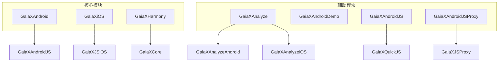
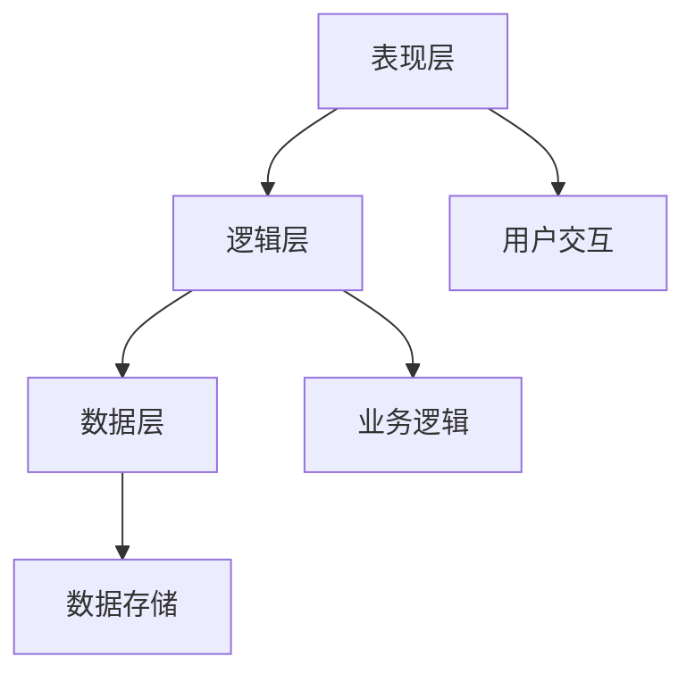
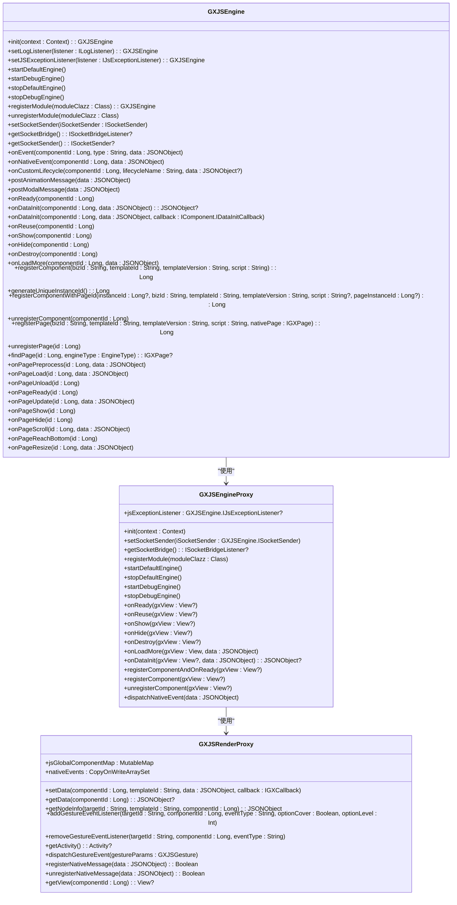
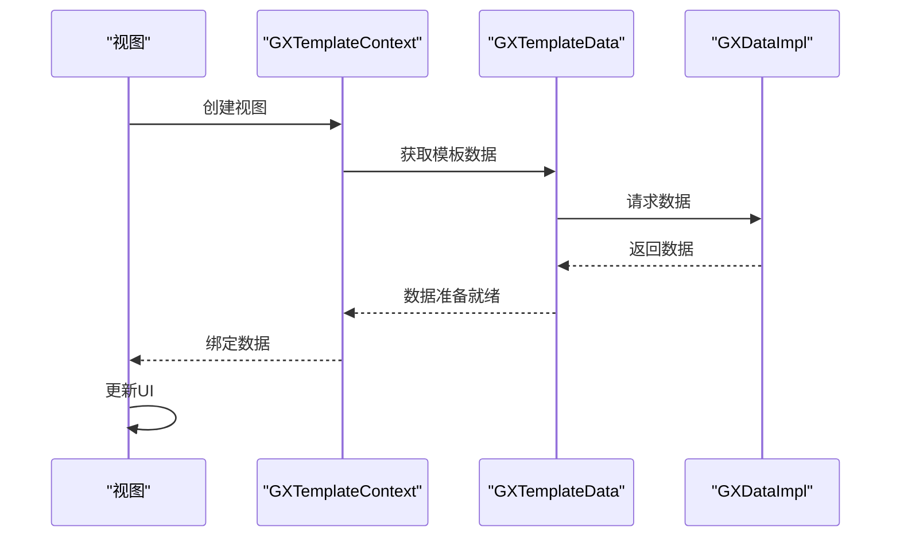
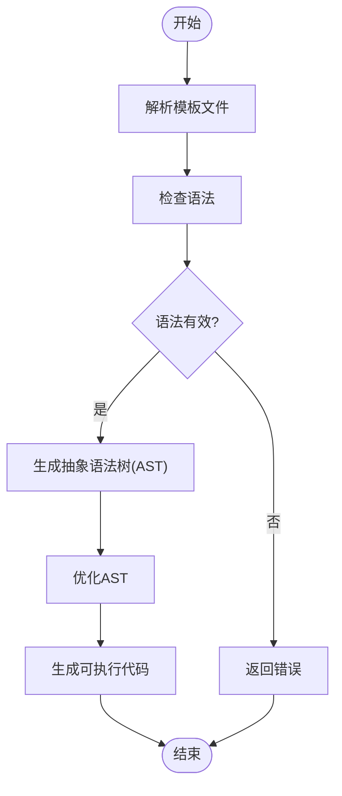
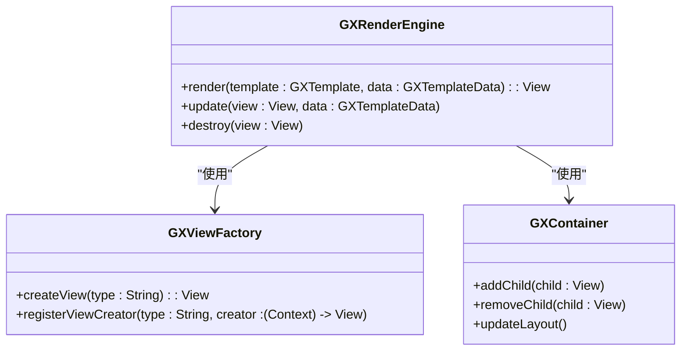
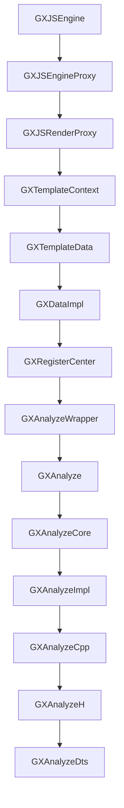

# 安全考虑最佳实践

<cite>
**本文档引用的文件**   
- [GXJSEngine.kt](file://GaiaXAndroidJS/src/main/kotlin/com/alibaba/gaiax/js/GXJSEngine.kt)
- [GXJSEngineProxy.kt](file://GaiaXAndroidJSProxy/src/main/java/com/alibaba/gaiax/js/proxy/GXJSEngineProxy.kt)
- [GXJSRenderProxy.kt](file://GaiaXAndroidJSProxy/src/main/java/com/alibaba/gaiax/js/proxy/GXJSRenderProxy.kt)
- [GXAnalyzeWrapper.kt](file://GaiaXAndroid/src/main/kotlin/com/alibaba/gaiax/expression/GXAnalyzeWrapper.kt)
- [GXRegisterCenter.kt](file://GaiaXAndroid/src/main/kotlin/com/alibaba/gaiax/GXRegisterCenter.kt)
- [GXDataImpl.kt](file://GaiaXAndroid/src/main/kotlin/com/alibaba/gaiax/data/GXDataImpl.kt)
- [GXJSBuildInModule.kt](file://GaiaXAndroidJSProxy/src/main/java/com/alibaba/gaiax/js/proxy/modules/GXJSBuildInModule.kt)
- [GXJSBuildInStorageModule.kt](file://GaiaXAndroidJSProxy/src/main/java/com/alibaba/gaiax/js/proxy/modules/GXJSBuildInStorageModule.kt)
- [GXJSBuildInTipsModule.kt](file://GaiaXAndroidJSProxy/src/main/java/com/alibaba/gaiax/js/proxy/modules/GXJSBuildInTipsModule.kt)
- [GXJSEventModule.kt](file://GaiaXAndroidJSProxy/src/main/java/com/alibaba/gaiax/js/proxy/modules/GXJSEventModule.kt)
- [GXJSLogModule.kt](file://GaiaXAndroidJSProxy/src/main/java/com/alibaba/gaiax/js/proxy/modules/GXJSLogModule.kt)
- [GXJSNativeEventModule.kt](file://GaiaXAndroidJSProxy/src/main/java/com/alibaba/gaiax/js/proxy/modules/GXJSNativeEventModule.kt)
- [GXJSNativeTargetModule.kt](file://GaiaXAndroidJSProxy/src/main/java/com/alibaba/gaiax/js/proxy/modules/GXJSNativeTargetModule.kt)
- [GXJSNativeUtilModule.kt](file://GaiaXAndroidJSProxy/src/main/java/com/alibaba/gaiax/js/proxy/modules/GXJSNativeUtilModule.kt)
- [GXAnalyze.cpp](file://GaiaXAnalyze/GXAnalyzeAndroid/src/main/cpp/GXAnalyzeCore/GXAnalyze.cpp)
- [GXNapiAnalyze.cpp](file://GaiaXHarmony/GaiaXAnalyze/GaiaXAnalyzeHarmony/GaiaXAnalyze/src/main/cpp/GXNapiAnalyze.cpp)
- [GXAnalyze.h](file://GaiaXAnalyze/GXAnalyzeAndroid/src/main/cpp/GXAnalyzeCore/GXAnalyze.h)
- [GXAnalyzeCore/index.d.ts](file://GaiaXHarmony/GaiaXAnalyze/GaiaXAnalyzeHarmony/GaiaXAnalyze/src/main/cpp/types/analysiscore/index.d.ts)
- [Base64.java](file://GaiaXAndroidClientToStudio/src/main/java/com/alibaba/gaiax/studio/third/socket/java_websocket/util/Base64.java)
- [PermissionUtil.java](file://GaiaXAndroidClientToStudio/src/main/java/com/alibaba/gaiax/studio/third/socket/websocket/util/PermissionUtil.java)
- [GXAnalyzeImpl.hpp](file://GaiaXiOS/GaiaXiOS/Binding/Expression/GXAnalyzeImpl.hpp)
- [GXFunction.m](file://GaiaXiOS/GaiaXiOS/Binding/Expression/GXFunction.m)
- [GXInjector.ets](file://GaiaXHarmony/GaiaXCore/GaiaX/src/main/ets/components/injector/GXInjector.ets)
- [Utils.ets](file://GaiaXHarmony/GaiaXCore/GaiaX/src/main/ets/components/mainpage/Utils.ets)
</cite>

## 目录
1. [简介](#简介)
2. [项目结构](#项目结构)
3. [核心组件](#核心组件)
4. [架构概述](#架构概述)
5. [详细组件分析](#详细组件分析)
6. [依赖分析](#依赖分析)
7. [性能考虑](#性能考虑)
8. [故障排除指南](#故障排除指南)
9. [结论](#结论)
10. [附录](#附录)

## 简介
GaiaX框架是一个动态模板开发解决方案，旨在为开发者提供高效、灵活的UI构建能力。本指南将深入探讨GaiaX框架的安全性最佳实践，重点介绍如何在各种场景下确保框架的安全性。基于实际代码库中的安全机制，我们将提供全面的安全防护建议，涵盖从初学者到经验丰富的开发者所需的知识。内容包括防范JS注入攻击、数据泄露风险、通信安全问题等潜在威胁，以及如何实现安全的数据传输和存储，构建安全的扩展机制。此外，还将详细说明权限控制、数据加密、安全审计等方面的最佳实践，帮助开发者构建安全可信的应用。

## 项目结构
GaiaX框架的项目结构清晰，分为多个模块，每个模块负责不同的功能。主要模块包括GaiaXAndroid、GaiaXiOS、GaiaXHarmony等，分别对应不同平台的实现。此外，还有用于分析和测试的模块，如GaiaXAnalyze和GaiaXAndroidDemo。这种模块化的设计有助于提高代码的可维护性和可扩展性。



**Diagram sources**
- [GaiaXAndroid](file://GaiaXAndroid)
- [GaiaXiOS](file://GaiaXiOS)
- [GaiaXHarmony](file://GaiaXHarmony)
- [GaiaXAnalyze](file://GaiaXAnalyze)
- [GaiaXAndroidJS](file://GaiaXAndroidJS)
- [GaiaXAndroidJSProxy](file://GaiaXAndroidJSProxy)

**Section sources**
- [GaiaXAndroid](file://GaiaXAndroid)
- [GaiaXiOS](file://GaiaXiOS)
- [GaiaXHarmony](file://GaiaXHarmony)
- [GaiaXAnalyze](file://GaiaXAnalyze)
- [GaiaXAndroidJS](file://GaiaXAndroidJS)
- [GaiaXAndroidJSProxy](file://GaiaXAndroidJSProxy)

## 核心组件
GaiaX框架的核心组件主要包括JS引擎、数据绑定、模板解析和渲染引擎。这些组件协同工作，实现了动态UI的构建和渲染。

**Section sources**
- [GXJSEngine.kt](file://GaiaXAndroidJS/src/main/kotlin/com/alibaba/gaiax/js/GXJSEngine.kt)
- [GXJSEngineProxy.kt](file://GaiaXAndroidJSProxy/src/main/java/com/alibaba/gaiax/js/proxy/GXJSEngineProxy.kt)
- [GXJSRenderProxy.kt](file://GaiaXAndroidJSProxy/src/main/java/com/alibaba/gaiax/js/proxy/GXJSRenderProxy.kt)
- [GXAnalyzeWrapper.kt](file://GaiaXAndroid/src/main/kotlin/com/alibaba/gaiax/expression/GXAnalyzeWrapper.kt)
- [GXRegisterCenter.kt](file://GaiaXAndroid/src/main/kotlin/com/alibaba/gaiax/GXRegisterCenter.kt)

## 架构概述
GaiaX框架的架构设计遵循分层原则，确保各层之间的职责明确，降低耦合度。整体架构可以分为三层：表现层、逻辑层和数据层。



**Diagram sources**
- [GXJSEngine.kt](file://GaiaXAndroidJS/src/main/kotlin/com/alibaba/gaiax/js/GXJSEngine.kt)
- [GXJSEngineProxy.kt](file://GaiaXAndroidJSProxy/src/main/java/com/alibaba/gaiax/js/proxy/GXJSEngineProxy.kt)
- [GXJSRenderProxy.kt](file://GaiaXAndroidJSProxy/src/main/java/com/alibaba/gaiax/js/proxy/GXJSRenderProxy.kt)

## 详细组件分析
### JS引擎分析
JS引擎是GaiaX框架的核心组件之一，负责执行JavaScript代码，实现动态逻辑处理。

#### 类图


**Diagram sources**
- [GXJSEngine.kt](file://GaiaXAndroidJS/src/main/kotlin/com/alibaba/gaiax/js/GXJSEngine.kt)
- [GXJSEngineProxy.kt](file://GaiaXAndroidJSProxy/src/main/java/com/alibaba/gaiax/js/proxy/GXJSEngineProxy.kt)
- [GXJSRenderProxy.kt](file://GaiaXAndroidJSProxy/src/main/java/com/alibaba/gaiax/js/proxy/GXJSRenderProxy.kt)

**Section sources**
- [GXJSEngine.kt](file://GaiaXAndroidJS/src/main/kotlin/com/alibaba/gaiax/js/GXJSEngine.kt)
- [GXJSEngineProxy.kt](file://GaiaXAndroidJSProxy/src/main/java/com/alibaba/gaiax/js/proxy/GXJSEngineProxy.kt)
- [GXJSRenderProxy.kt](file://GaiaXAndroidJSProxy/src/main/java/com/alibaba/gaiax/js/proxy/GXJSRenderProxy.kt)

### 数据绑定分析
数据绑定是GaiaX框架中实现UI与数据同步的关键机制。

#### 序列图


**Diagram sources**
- [GXTemplateContext](file://GaiaXAndroid/src/main/kotlin/com/alibaba/gaiax/context/GXTemplateContext.kt)
- [GXTemplateData](file://GaiaXAndroid/src/main/kotlin/com/alibaba/gaiax/template/GXTemplateData.kt)
- [GXDataImpl.kt](file://GaiaXAndroid/src/main/kotlin/com/alibaba/gaiax/data/GXDataImpl.kt)

**Section sources**
- [GXTemplateContext](file://GaiaXAndroid/src/main/kotlin/com/alibaba/gaiax/context/GXTemplateContext.kt)
- [GXTemplateData](file://GaiaXAndroid/src/main/kotlin/com/alibaba/gaiax/template/GXTemplateData.kt)
- [GXDataImpl.kt](file://GaiaXAndroid/src/main/kotlin/com/alibaba/gaiax/data/GXDataImpl.kt)

### 模板解析分析
模板解析是GaiaX框架中处理模板文件的核心过程。

#### 流程图


**Diagram sources**
- [GXAnalyzeWrapper.kt](file://GaiaXAndroid/src/main/kotlin/com/alibaba/gaiax/expression/GXAnalyzeWrapper.kt)
- [GXAnalyze.cpp](file://GaiaXAnalyze/GXAnalyzeAndroid/src/main/cpp/GXAnalyzeCore/GXAnalyze.cpp)
- [GXAnalyze.h](file://GaiaXAnalyze/GXAnalyzeAndroid/src/main/cpp/GXAnalyzeCore/GXAnalyze.h)

**Section sources**
- [GXAnalyzeWrapper.kt](file://GaiaXAndroid/src/main/kotlin/com/alibaba/gaiax/expression/GXAnalyzeWrapper.kt)
- [GXAnalyze.cpp](file://GaiaXAnalyze/GXAnalyzeAndroid/src/main/cpp/GXAnalyzeCore/GXAnalyze.cpp)
- [GXAnalyze.h](file://GaiaXAnalyze/GXAnalyzeAndroid/src/main/cpp/GXAnalyzeCore/GXAnalyze.h)

### 渲染引擎分析
渲染引擎负责将解析后的模板转换为实际的UI界面。

#### 类图


**Diagram sources**
- [GXRenderEngine](file://GaiaXAndroid/src/main/kotlin/com/alibaba/gaiax/render/GXRenderEngine.kt)
- [GXViewFactory](file://GaiaXAndroid/src/main/kotlin/com/alibaba/gaiax/render/view/GXViewFactory.kt)
- [GXContainer](file://GaiaXAndroid/src/main/kotlin/com/alibaba/gaiax/render/view/container/GXContainer.kt)

**Section sources**
- [GXRenderEngine](file://GaiaXAndroid/src/main/kotlin/com/alibaba/gaiax/render/GXRenderEngine.kt)
- [GXViewFactory](file://GaiaXAndroid/src/main/kotlin/com/alibaba/gaiax/render/view/GXViewFactory.kt)
- [GXContainer](file://GaiaXAndroid/src/main/kotlin/com/alibaba/gaiax/render/view/container/GXContainer.kt)

## 依赖分析
GaiaX框架的组件之间存在复杂的依赖关系，理解这些依赖关系对于维护和扩展框架至关重要。



**Diagram sources**
- [GXJSEngine.kt](file://GaiaXAndroidJS/src/main/kotlin/com/alibaba/gaiax/js/GXJSEngine.kt)
- [GXJSEngineProxy.kt](file://GaiaXAndroidJSProxy/src/main/java/com/alibaba/gaiax/js/proxy/GXJSEngineProxy.kt)
- [GXJSRenderProxy.kt](file://GaiaXAndroidJSProxy/src/main/java/com/alibaba/gaiax/js/proxy/GXJSRenderProxy.kt)
- [GXTemplateContext](file://GaiaXAndroid/src/main/kotlin/com/alibaba/gaiax/context/GXTemplateContext.kt)
- [GXTemplateData](file://GaiaXAndroid/src/main/kotlin/com/alibaba/gaiax/template/GXTemplateData.kt)
- [GXDataImpl.kt](file://GaiaXAndroid/src/main/kotlin/com/alibaba/gaiax/data/GXDataImpl.kt)
- [GXRegisterCenter.kt](file://GaiaXAndroid/src/main/kotlin/com/alibaba/gaiax/GXRegisterCenter.kt)
- [GXAnalyzeWrapper.kt](file://GaiaXAndroid/src/main/kotlin/com/alibaba/gaiax/expression/GXAnalyzeWrapper.kt)
- [GXAnalyze.cpp](file://GaiaXAnalyze/GXAnalyzeAndroid/src/main/cpp/GXAnalyzeCore/GXAnalyze.cpp)
- [GXAnalyze.h](file://GaiaXAnalyze/GXAnalyzeAndroid/src/main/cpp/GXAnalyzeCore/GXAnalyze.h)
- [GXAnalyzeImpl.hpp](file://GaiaXiOS/GaiaXiOS/Binding/Expression/GXAnalyzeImpl.hpp)
- [GXAnalyzeCore/index.d.ts](file://GaiaXHarmony/GaiaXAnalyze/GaiaXAnalyzeHarmony/GaiaXAnalyze/src/main/cpp/types/analysiscore/index.d.ts)

**Section sources**
- [GXJSEngine.kt](file://GaiaXAndroidJS/src/main/kotlin/com/alibaba/gaiax/js/GXJSEngine.kt)
- [GXJSEngineProxy.kt](file://GaiaXAndroidJSProxy/src/main/java/com/alibaba/gaiax/js/proxy/GXJSEngineProxy.kt)
- [GXJSRenderProxy.kt](file://GaiaXAndroidJSProxy/src/main/java/com/alibaba/gaiax/js/proxy/GXJSRenderProxy.kt)
- [GXTemplateContext](file://GaiaXAndroid/src/main/kotlin/com/alibaba/gaiax/context/GXTemplateContext.kt)
- [GXTemplateData](file://GaiaXAndroid/src/main/kotlin/com/alibaba/gaiax/template/GXTemplateData.kt)
- [GXDataImpl.kt](file://GaiaXAndroid/src/main/kotlin/com/alibaba/gaiax/data/GXDataImpl.kt)
- [GXRegisterCenter.kt](file://GaiaXAndroid/src/main/kotlin/com/alibaba/gaiax/GXRegisterCenter.kt)
- [GXAnalyzeWrapper.kt](file://GaiaXAndroid/src/main/kotlin/com/alibaba/gaiax/expression/GXAnalyzeWrapper.kt)
- [GXAnalyze.cpp](file://GaiaXAnalyze/GXAnalyzeAndroid/src/main/cpp/GXAnalyzeCore/GXAnalyze.cpp)
- [GXAnalyze.h](file://GaiaXAnalyze/GXAnalyzeAndroid/src/main/cpp/GXAnalyzeCore/GXAnalyze.h)
- [GXAnalyzeImpl.hpp](file://GaiaXiOS/GaiaXiOS/Binding/Expression/GXAnalyzeImpl.hpp)
- [GXAnalyzeCore/index.d.ts](file://GaiaXHarmony/GaiaXAnalyze/GaiaXAnalyzeHarmony/GaiaXAnalyze/src/main/cpp/types/analysiscore/index.d.ts)

## 性能考虑
在设计和实现GaiaX框架时，性能是一个重要的考虑因素。以下是一些关键的性能优化建议：

1. **减少不必要的计算**：避免在每次渲染时进行重复的计算，尽量使用缓存机制。
2. **异步处理**：对于耗时的操作，如网络请求和文件读写，应使用异步处理，避免阻塞主线程。
3. **内存管理**：合理管理内存，避免内存泄漏，及时释放不再使用的对象。
4. **代码优化**：使用高效的算法和数据结构，减少时间和空间复杂度。

## 故障排除指南
在使用GaiaX框架时，可能会遇到各种问题。以下是一些常见的故障排除方法：

1. **检查日志**：查看日志文件，寻找错误信息和警告。
2. **调试工具**：使用调试工具，如断点和变量监视，帮助定位问题。
3. **单元测试**：编写单元测试，确保每个组件的功能正确。
4. **性能监控**：使用性能监控工具，分析应用的性能瓶颈。

**Section sources**
- [GXJSEngine.kt](file://GaiaXAndroidJS/src/main/kotlin/com/alibaba/gaiax/js/GXJSEngine.kt)
- [GXJSEngineProxy.kt](file://GaiaXAndroidJSProxy/src/main/java/com/alibaba/gaiax/js/proxy/GXJSEngineProxy.kt)
- [GXJSRenderProxy.kt](file://GaiaXAndroidJSProxy/src/main/java/com/alibaba/gaiax/js/proxy/GXJSRenderProxy.kt)
- [GXAnalyzeWrapper.kt](file://GaiaXAndroid/src/main/kotlin/com/alibaba/gaiax/expression/GXAnalyzeWrapper.kt)
- [GXRegisterCenter.kt](file://GaiaXAndroid/src/main/kotlin/com/alibaba/gaiax/GXRegisterCenter.kt)

## 结论
GaiaX框架通过其模块化的设计和丰富的功能，为开发者提供了强大的动态UI构建能力。通过遵循本文档中的安全最佳实践，开发者可以有效地防范各种安全威胁，确保应用的安全性和可靠性。希望本指南能帮助开发者更好地理解和使用GaiaX框架，构建出高质量的应用。

## 附录
### 附录A：许可证
```
Ali-GaiaX-Project is a template dynamic develop solutions developed by Alibaba and licensed under the Apache License (Version 2.0)
This product contains various third-party components under other open source licenses. 
See the NOTICE file for more information.
```

### 附录B：术语表
- **JS引擎**：负责执行JavaScript代码的组件。
- **数据绑定**：实现UI与数据同步的机制。
- **模板解析**：处理模板文件，生成可执行代码的过程。
- **渲染引擎**：将解析后的模板转换为实际UI界面的组件。