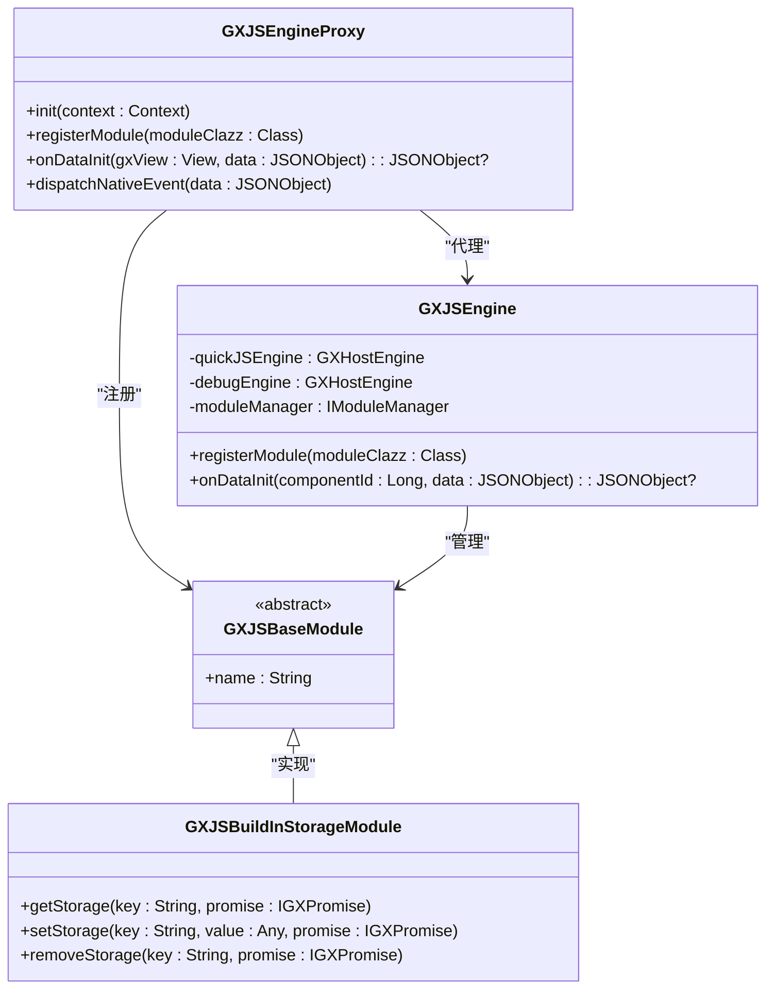

# 数据安全

<cite>
**本文档引用的文件**  
- [GXJSEngineProxy.kt](file://GaiaXAndroidJSProxy/src/main/java/com/alibaba/gaiax/js/proxy/GXJSEngineProxy.kt)
- [GXJSBuildInStorageModule.kt](file://GaiaXAndroidJSProxy/src/main/java/com/alibaba/gaiax/js/proxy/modules/GXJSBuildInStorageModule.kt)
- [GXJSPreferenceUtil.kt](file://GaiaXAndroidJSProxy/src/main/java/com/alibaba/gaiax/js/proxy/utils/GXJSPreferenceUtil.kt)
- [GXDataParser.m](file://GaiaXiOS/GaiaXiOS/Binding/Data/GXDataParser.m)
- [GXDataParser.ets](file://GaiaXHarmony/GaiaXCore/GaiaX/src/main/ets/binding/GXDataParser.ets)
</cite>

## 目录
1. [引言](#引言)
2. [数据存储安全](#数据存储安全)
3. [数据传输安全](#数据传输安全)
4. [数据处理与绑定安全](#数据处理与绑定安全)
5. [GXJSEngineProxy 安全控制机制](#gxjsengineproxy-安全控制机制)
6. [敏感信息脱敏与访问控制](#敏感信息脱敏与访问控制)
7. [安全数据处理模式示例](#安全数据处理模式示例)
8. [数据生命周期管理](#数据生命周期管理)
9. [总结](#总结)

## 引言
GaiaX 框架为跨平台动态化渲染提供了强大的能力，其核心依赖于 JS 引擎与原生视图的深度集成。在这一过程中，数据作为连接逻辑与界面的桥梁，其安全性至关重要。本指南旨在为开发者提供一套完整的数据安全最佳实践，涵盖从数据存储、传输到处理的全生命周期。我们将重点分析 GXJSEngineProxy 中的安全控制机制，探讨如何防止恶意数据注入和非法访问，并通过具体示例展示安全的数据处理模式，帮助构建一个健壮、安全的数据处理体系。

## 数据存储安全

GaiaX 框架通过 `GXJSBuildInStorageModule` 提供了内置的持久化存储能力，该模块基于 Android 的 `SharedPreferences` 实现，为 JS 代码提供了 `getStorage`、`setStorage` 和 `removeStorage` 等异步方法。

### 安全的数据存储策略
该模块在设计上已包含基础的安全考量：
1.  **数据封装**：所有存储的数据都会被封装在一个 `JSONObject` 中，包含 `type` 和 `data` 两个字段。`type` 字段用于标识数据类型（如 `String`, `Int`, `JSONObject`），这确保了在读取时能正确地反序列化，防止类型混淆攻击。
2.  **类型安全转换**：在 `setStorage` 方法中，使用 `JSDataConvert.getDataTypeByValue()` 获取数据类型，并在 `getStorage` 方法中通过 `JSDataConvert.getDataValueByType()` 进行安全转换，避免了直接解析可能带来的类型错误或注入风险。
3.  **独立的存储空间**：存储使用一个固定的文件名 `GAIAX_JS_STORAGE`，将 GaiaX 的数据与其他应用数据隔离，降低了数据被其他模块意外或恶意访问的风险。

**建议**：尽管框架提供了基础保护，开发者仍应避免在 `SharedPreferences` 中存储高度敏感的信息（如密码、密钥）。对于此类数据，应使用 Android Keystore 系统或更安全的加密存储方案。

**Section sources**
- [GXJSBuildInStorageModule.kt](file://GaiaXAndroidJSProxy/src/main/java/com/alibaba/gaiax/js/proxy/modules/GXJSBuildInStorageModule.kt#L1-L77)
- [GXJSPreferenceUtil.kt](file://GaiaXAndroidJSProxy/src/main/java/com/alibaba/gaiax/js/proxy/utils/GXJSPreferenceUtil.kt#L1-L114)

## 数据传输安全

在 GaiaX 的架构中，数据在原生层（Native）与 JS 引擎层之间频繁传输。这种跨语言通信是安全防护的重点。

### 安全的数据绑定机制
数据绑定是 GaiaX 的核心功能，它允许模板通过表达式动态地从数据源获取数据。该过程由 `GXDataParser` 类（或其对应平台的实现）负责。

1.  **iOS 实现分析**：在 iOS 平台，`GXDataParser.m` 文件中的 `parseData:withSource:` 方法是数据解析的入口。它首先检查输入数据是否为 `NSDictionary` 类型，然后调用 `gx_handleDB:withData:` 进行处理。对于字典中的每个值，如果它是字符串，则视为表达式，通过 `GXExpression` 模块进行求值；如果是字典或数组，则递归处理。这种明确的类型检查和分发机制，确保了只有预期格式的数据才会被处理，有效防止了非预期数据类型的注入。
2.  **HarmonyOS 实现分析**：在 HarmonyOS 平台，`GXDataParser.ets` 使用 `gxHandleData` 方法。它通过 `GXUtils.isObject`、`isString`、`isArray` 等工具函数对数据类型进行严格判断，并分别处理。对于字符串，它调用 `gxHandleExp` 进行表达式求值。这种基于类型的安全分发模式与 iOS 实现一致，体现了框架在多平台上的安全一致性。

**关键安全点**：数据绑定过程中的表达式求值是潜在的攻击面。框架通过将表达式求值限制在 `GXExpression` 模块内，并由 `GXAnalyzeCore`（如 `GXATSNode`）进行语法分析，可以有效控制求值范围，防止执行任意代码。

**Section sources**
- [GXDataParser.m](file://GaiaXiOS/GaiaXiOS/Binding/Data/GXDataParser.m#L1-L112)
- [GXDataParser.ets](file://GaiaXHarmony/GaiaXCore/GaiaX/src/main/ets/binding/GXDataParser.ets#L1-L80)

## 数据处理与绑定安全

数据处理不仅涉及绑定，还包括在 JS 引擎中对数据的计算、转换和操作。

### 防止恶意数据注入
恶意数据注入通常发生在数据从不可信源进入系统时。GaiaX 的安全防护体现在以下几个层面：
1.  **输入验证**：如上所述，`GXDataParser` 在解析数据前会进行类型检查，非 `NSDictionary` 类型的数据会被直接拒绝并记录日志。
2.  **沙箱环境**：JS 代码在 QuickJS 引擎中运行，该引擎本身提供了一个相对隔离的执行环境。虽然 QuickJS 功能强大，但其与原生系统的交互是通过预定义的 API 模块（如 `GXJSBuildInModule`）进行的，这限制了 JS 代码的权限。
3.  **模块化访问控制**：所有对原生功能的访问都必须通过注册的 JS 模块。开发者无法在 JS 代码中直接调用任意的原生方法，这从根本上防止了因数据注入而引发的任意代码执行。

## GXJSEngineProxy 安全控制机制

`GXJSEngineProxy` 是 GaiaX JS 引擎的代理类，它封装了引擎的初始化、模块注册和生命周期管理，是安全控制的核心枢纽。

**Diagram sources**
- [GXJSEngineProxy.kt](file://GaiaXAndroidJSProxy/src/main/java/com/alibaba/gaiax/js/proxy/GXJSEngineProxy.kt#L44-L406)
- [GXJSEngine.kt](file://GaiaXAndroidJS/src/main/kotlin/com/alibaba/gaiax/js/GXJSEngine.kt#L1-L426)

### 核心安全功能
1.  **模块注册控制**：`init()` 方法在初始化时会注册一系列内置模块（如 `GXJSBuildInStorageModule`, `GXJSLogModule`）。`registerModule()` 方法允许扩展，但所有模块都必须继承自 `GXJSBaseModule`，这确保了模块接口的规范性和可审计性。
2.  **异常监控**：`init()` 方法设置了 `IJsExceptionListener`，当 JS 代码抛出异常时，该监听器会被触发。这不仅有助于调试，更重要的是可以捕获潜在的恶意行为或异常数据导致的崩溃，防止信息泄露。
3.  **数据初始化安全**：`onDataInit()` 方法是 JS 组件接收初始数据的入口。它通过 `GXTemplateContext` 获取正确的 `componentId`，确保数据被发送到正确的组件，防止数据错位或被错误组件截获。
4.  **原生事件分发**：`dispatchNativeEvent()` 方法负责将原生事件分发给 JS。它会为每个事件添加时间戳，并通过 `onNativeEvent()` 发送给所有注册的组件。这种集中分发机制便于进行事件审计和过滤。

**Section sources**
- [GXJSEngineProxy.kt](file://GaiaXAndroidJSProxy/src/main/java/com/alibaba/gaiax/js/proxy/GXJSEngineProxy.kt#L44-L406)

## 敏感信息脱敏与访问控制

除了技术层面的防护，开发者也应主动对敏感信息进行处理。

### 实践建议
1.  **数据最小化**：仅向 JS 引擎传递模板渲染所必需的数据。避免将包含用户隐私、认证令牌等敏感信息的完整数据对象传递给前端。
2.  **前端脱敏**：对于必须展示的敏感信息（如手机号、身份证号），应在原生层进行脱敏处理（例如，将手机号 `138****1234`）后再传递给 JS。
3.  **访问控制**：利用 GaiaX 的模板权限系统，对不同业务、不同版本的模板进行权限划分。确保高权限的模板（如能访问存储的）仅由可信的业务方使用。

## 安全数据处理模式示例

以下是一个安全的数据处理流程示例：

1.  **原生层**：业务逻辑获取到用户数据 `userData`。
2.  **数据脱敏**：原生代码创建一个新的 `safeData` 对象，仅包含渲染所需的字段，并对手机号等字段进行脱敏。
3.  **数据绑定**：将 `safeData` 作为数据源，通过 `GXTemplateEngine` 渲染模板。模板中的表达式（如 `{{user.phone}}`）会安全地从 `safeData` 中获取脱敏后的数据。
4.  **JS 存储**：如果需要持久化，JS 代码调用 `setStorage("key", value)`。该请求被 `GXJSBuildInStorageModule` 拦截，数据被安全地封装并存入 `SharedPreferences`。
5.  **异常处理**：在整个流程中，任何异常都会被 `GXJSEngine` 的异常监听器捕获，并可以上报至监控系统。

此模式确保了敏感数据在进入 JS 环境前已被处理，且所有跨层操作都在框架的安全机制下进行。

## 数据生命周期管理

数据安全贯穿其整个生命周期：
-   **创建**：在原生层创建数据时，应遵循最小权限原则。
-   **存储**：使用安全的存储方式，并定期清理过期数据。
-   **传输**：在 Native 和 JS 之间传输时，依赖框架的类型检查和绑定机制。
-   **使用**：在 JS 中使用时，确保在沙箱环境中，并通过受控的 API 访问外部资源。
-   **销毁**：当模板销毁时，`GXJSEngineProxy` 的 `onDestroy()` 和 `unregisterComponent()` 方法会清理相关的 JS 组件和内存，防止数据残留。

## 总结
GaiaX 框架通过 `GXJSEngineProxy` 的集中代理、`GXDataParser` 的安全绑定、`GXJSBuildInStorageModule` 的封装存储以及严格的模块化设计，构建了一个多层次的数据安全防护体系。开发者应充分利用这些机制，同时遵循数据最小化和前端脱敏的最佳实践，共同构建一个安全、可靠的动态化应用。