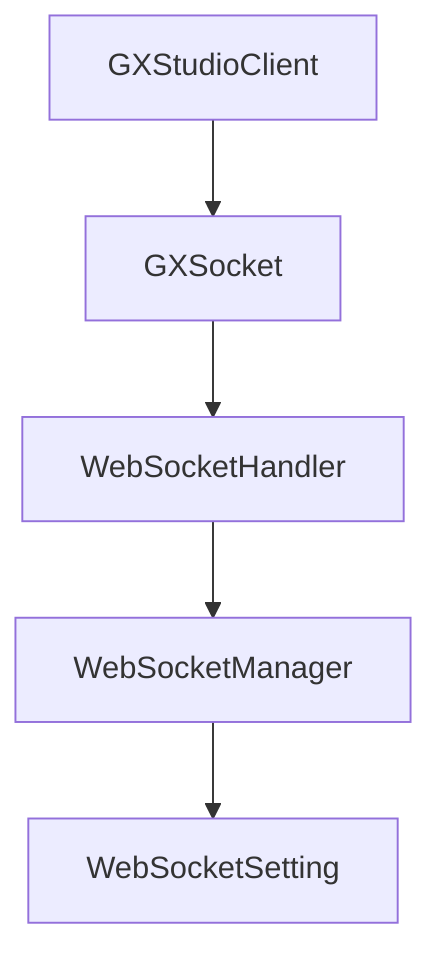

# 通信安全

<cite>
**本文档引用文件**   
- [GXSocket.kt](file://GaiaXAndroidClientToStudio/src/main/java/com/alibaba/gaiax/studio/GXSocket.kt)
- [GXStudioClient.kt](file://GaiaXAndroidClientToStudio/src/main/java/com/alibaba/gaiax/studio/GXStudioClient.kt)
- [GXSocketKey.kt](file://GaiaXAndroidClientToStudio/src/main/java/com/alibaba/gaiax/studio/GXSocketKey.kt)
- [WebSocketSetting.java](file://GaiaXAndroidClientToStudio/src/main/java/com/alibaba/gaiax/studio/third/socket/websocket/WebSocketSetting.java)
- [WebSocketManager.java](file://GaiaXAndroidClientToStudio/src/main/java/com/alibaba/gaiax/studio/third/socket/websocket/WebSocketManager.java)
- [WebSocketHandler.java](file://GaiaXAndroidClientToStudio/src/main/java/com/alibaba/gaiax/studio/third/socket/websocket/WebSocketHandler.java)
- [ErrorResponse.java](file://GaiaXAndroidClientToStudio/src/main/java/com/alibaba/gaiax/studio/third/socket/websocket/response/ErrorResponse.java)
- [GaiaXSocketModel.h](file://GaiaXSocketiOS/GaiaXSocket/GaiaXSocketModel.h)
- [GaiaXSocketJsonRpcDefine.h](file://GaiaXSocketiOS/GaiaXSocket/GaiaXSocketJsonRpcDefine.h)
</cite>

## 目录
1. [引言](#引言)
2. [项目结构](#项目结构)
3. [核心组件](#核心组件)
4. [架构概述](#架构概述)
5. [详细组件分析](#详细组件分析)
6. [依赖分析](#依赖分析)
7. [性能考虑](#性能考虑)
8. [故障排除指南](#故障排除指南)
9. [结论](#结论)

## 引言
本指南旨在为GaiaX框架的通信安全提供最佳实践，重点介绍如何确保客户端与开发工具、服务端之间的安全通信。通过深入分析GXSocket和GXStudioClient的实现，详细说明Socket通信的安全机制，包括连接认证、数据加密传输、消息完整性校验等，以防止中间人攻击、重放攻击等网络威胁。同时，提供安全的通信协议配置指南，涵盖TLS/SSL配置、认证令牌管理、通信超时设置等关键方面。此外，还包括通信过程中的异常处理、安全审计日志记录以及通信性能与安全的平衡策略，帮助开发者构建可靠的通信安全体系。

## 项目结构
GaiaX框架的通信模块主要由Android和iOS两个平台的实现组成，其中Android端的通信安全机制主要集中在`GaiaXAndroidClientToStudio`模块中。该模块通过WebSocket协议实现客户端与开发工具之间的实时通信，支持实时预览、手动推送等功能。iOS端的实现位于`GaiaXSocketiOS`模块，提供了类似的通信功能。两个平台的实现均基于JSON-RPC 2.0协议，确保了跨平台的一致性和互操作性。

```mermaid
graph TD
subgraph "Android"
A[GaiaXAndroidClientToStudio]
A --> B[GXSocket.kt]
A --> C[GXStudioClient.kt]
A --> D[GXSocketKey.kt]
A --> E[third/socket]
end
subgraph "iOS"
F[GaiaXSocketiOS]
F --> G[GaiaXSocket]
G --> H[GaiaXSocketClient.h]
G --> I[GaiaXSocketManager.h]
G --> J[GaiaXSocketModel.h]
end
A < --> F
```

**图示来源**
- [GXSocket.kt](file://GaiaXAndroidClientToStudio/src/main/java/com/alibaba/gaiax/studio/GXSocket.kt#L1-L442)
- [GXStudioClient.kt](file://GaiaXAndroidClientToStudio/src/main/java/com/alibaba/gaiax/studio/GXStudioClient.kt#L1-L282)
- [GXSocketKey.kt](file://GaiaXAndroidClientToStudio/src/main/java/com/alibaba/gaiax/studio/GXSocketKey.kt#L1-L13)
- [GaiaXSocketClient.h](file://GaiaXSocketiOS/GaiaXSocket/GaiaXSocketClient.h#L1-L66)
- [GaiaXSocketManager.h](file://GaiaXSocketiOS/GaiaXSocket/GaiaXSocketManager.h#L1-L46)
- [GaiaXSocketModel.h](file://GaiaXSocketiOS/GaiaXSocket/GaiaXSocketModel.h#L1-L48)

**章节来源**
- [GXSocket.kt](file://GaiaXAndroidClientToStudio/src/main/java/com/alibaba/gaiax/studio/GXSocket.kt#L1-L442)
- [GXStudioClient.kt](file://GaiaXAndroidClientToStudio/src/main/java/com/alibaba/gaiax/studio/GXStudioClient.kt#L1-L282)

## 核心组件

### GXSocket
`GXSocket`类是Android端通信的核心组件，负责管理WebSocket连接的生命周期，包括连接建立、断开、消息接收和发送等。它实现了`SocketListener`接口，监听WebSocket的各种事件，如连接成功、连接失败、消息接收等。通过`connectToServer`方法，可以指定服务器地址并建立连接；通过`disconnectToServer`方法，可以断开连接。`onMessage`方法用于处理接收到的消息，根据消息类型调用相应的回调方法。

### GXStudioClient
`GXStudioClient`类是GXSocket的封装，提供了更高层次的API，简化了开发者对通信功能的使用。它通过`init`方法初始化，通过`autoConnect`和`manualConnect`方法实现自动连接和手动连接。`GXStudioClient`还提供了`IFastPreviewListener`和`ISocketReceiver`接口，允许开发者监听实时预览和接收Socket消息。

### GXSocketKey
`GXSocketKey`对象定义了WebSocket通信中使用的常量，如协议名称和版本号。这些常量在`GXSocket`和`GXStudioClient`中被引用，确保了通信协议的一致性。

**章节来源**
- [GXSocket.kt](file://GaiaXAndroidClientToStudio/src/main/java/com/alibaba/gaiax/studio/GXSocket.kt#L1-L442)
- [GXStudioClient.kt](file://GaiaXAndroidClientToStudio/src/main/java/com/alibaba/gaiax/studio/GXStudioClient.kt#L1-L282)
- [GXSocketKey.kt](file://GaiaXAndroidClientToStudio/src/main/java/com/alibaba/gaiax/studio/GXSocketKey.kt#L1-L13)

## 架构概述

### Android端通信架构
Android端的通信架构基于WebSocket协议，通过`WebSocketHandler`管理多个`WebSocketManager`实例，每个实例对应一个WebSocket连接。`WebSocketManager`负责具体的连接管理和消息收发，而`WebSocketSetting`则用于配置连接参数，如连接地址、超时时间、重连次数等。`GXSocket`作为`WebSocketManager`的使用者，通过`WebSocketHandler`获取`WebSocketManager`实例，并注册监听器来处理连接事件和消息事件。

```mermaid
classDiagram
class WebSocketHandler {
+init(setting : WebSocketSetting) WebSocketManager
+initGeneralWebSocket(key : String, setting : WebSocketSetting) WebSocketManager
+getWebSocket(key : String) WebSocketManager
+removeWebSocket(key : String) WebSocketManager
}
class WebSocketManager {
+isConnect() boolean
+reconnect() WebSocketManager
+reconnect(setting : WebSocketSetting) WebSocketManager
+disConnect() WebSocketManager
+send(text : String) void
+send(bytes : byte[]) void
+send(byteBuffer : ByteBuffer) void
+addListener(listener : SocketListener) WebSocketManager
+removeListener(listener : SocketListener) WebSocketManager
+getSetting() WebSocketSetting
+destroy() void
}
class WebSocketSetting {
+connectUrl : String
+responseProcessDispatcher : IResponseDispatcher
+processDataOnBackground : boolean
+reconnectWithNetworkChanged : boolean
+connectionLostTimeout : int
+mProxy : Proxy
+draft : Draft
+httpHeaders : Map~String, String~
+connectTimeout : int
+reconnectFrequency : int
+responseDelivery : ResponseDelivery
}
class GXSocket {
+gxSocketIsConnected : boolean
+gxSocketListener : GXSocketListener
+socketReceiver : ISocketReceiver
+updateTask : Runnable
+lastTemplateId : String
+subTemplateCount : int
+mainTemplateId : String
+mainTemplateJson : JSONObject
+webSocketManager : WebSocketManager
+webSocketSetting : WebSocketSetting
+serverAddress : String
+uiHandler : Handler
+methodIdManager : ConcurrentHashMap~Int, String~
+devTools : IDevTools
+TAG : String
+SOCKET_KEY : String
+isManualPush(type : String) boolean
+isFastPreview(type : String) boolean
+disconnectToServer() void
+connectToServer(address : String) void
+onConnected() void
+onConnectFailed(e : Throwable) void
+onDisconnect() void
+onSendDataError(errorResponse : ErrorResponse) void
+onMessage(message : String, data : T) void
+onMessage(bytes : ByteBuffer, data : T) void
+onPing(framedata : Framedata) void
+onPong(framedata : Framedata) void
+sendMsgWithFastPreviewInit() void
+sendMsgWithManualPushInit() void
+sendMsgWithMultiTypeInit() void
+sendGetTemplateData104(templateId : String) void
+sendGetTemplateData103(templateId : String) void
+sendGetTemplateData(templateId : String) void
+createTemplateData(templateData : JSONObject) JSONObject
+fastPreviewAndPushReceivingMsgProcessor(message : String) void
+sendMessage(data : JSONObject) void
+responseObtainMode(socketId : Int) void
+obtainResultFromGetTemplate(templateData : JSONObject) void
+sendMsgForChangeMode(socketId : Int, previewMode : String, jsMode : String) void
}
class GXStudioClient {
+applicationContext : Context
+fastPreviewListener : IFastPreviewListener
+socketHelper : GXSocket
+currentAddress : String
+currentTemplateId : String
+currentType : String
+isWaitDisconnectMsgThenConnectGaiaStudio : boolean
+gxSocketListener : GXSocketListener
+init(context : Context) void
+destroy() void
+manualConnect1(context : Context, params : JSONObject) void
+autoConnect(context : Context, params : JSONObject) void
+manualConnect(context : Context, params : JSONObject) void
+getParams(url : String) JSONObject
+isConnectVpn(context : Context) boolean
+tryToConnectGaiaStudio(address : String, templateId : String, type : String) void
+toConnectGaiaStudio() void
+sendInitMsg() void
+sendMessage(data : JSONObject) void
+sendMsg(data : JSONObject) void
+sendMsgForObtainMode() void
+sendMsgForDisconnect() void
+sendMsgForGetTemplateData(templateId : String) void
+sendJSLogMsg(logLevel : String, logContent : String) void
+sendMsgForChangeMode(previewMode : String, jsMode : String) void
+setDevTools(dev : IDevTools) void
+setSocketReceiver(iSocketReceiver : ISocketReceiver) void
+isGaiaStudioConnected() Boolean
+TAG : String
+PREVIEW_AUTO : String
+PREVIEW_MANUAL : String
+PREVIEW_NONE : String
+JS_DEFAULT : String
+JS_BREAKPOINT : String
+instance : GXStudioClient
}
WebSocketHandler --> WebSocketManager : "创建"
WebSocketManager --> WebSocketSetting : "使用"
GXSocket --> WebSocketHandler : "使用"
GXStudioClient --> GXSocket : "封装"
```



**图示来源**
- [WebSocketHandler.java](file://GaiaXAndroidClientToStudio/src/main/java/com/alibaba/gaiax/studio/third/socket/websocket/WebSocketHandler.java#L1-L218)
- [WebSocketManager.java](file://GaiaXAndroidClientToStudio/src/main/java/com/alibaba/gaiax/studio/third/socket/websocket/WebSocketManager.java#L1-L416)
- [WebSocketSetting.java](file://GaiaXAndroidClientToStudio/src/main/java/com/alibaba/gaiax/studio/third/socket/websocket/WebSocketSetting.java#L1-L243)
- [GXSocket.kt](file://GaiaXAndroidClientToStudio/src/main/java/com/alibaba/gaiax/studio/GXSocket.kt#L1-L442)
- [GXStudioClient.kt](file://GaiaXAndroidClientToStudio/src/main/java/com/alibaba/gaiax/studio/GXStudioClient.kt#L1-L282)

## 详细组件分析

### GXSocket分析
`GXSocket`类是Android端通信的核心，它通过`WebSocketHandler`管理WebSocket连接。`connectToServer`方法用于建立连接，`disconnectToServer`方法用于断开连接。`onMessage`方法处理接收到的消息，根据消息类型调用相应的回调方法。`sendMessage`方法用于发送消息，支持文本、字节数组和ByteBuffer类型的数据。

#### 连接管理
`GXSocket`通过`WebSocketHandler`的`initGeneralWebSocket`方法创建`WebSocketManager`实例，并注册监听器来处理连接事件。`connectToServer`方法设置连接参数，如连接地址、超时时间、重连次数等，并调用`WebSocketManager`的`start`方法开始连接。`disconnectToServer`方法调用`WebSocketManager`的`disConnect`方法断开连接。

#### 消息处理
`GXSocket`通过`onMessage`方法处理接收到的消息。消息类型包括`initialized`、`mode/get`、`template/get`、`template/didChangedNotification`、`js/callSync`、`js/callAsync`、`js/callPromise`、`js/getLibrary`和`close`。对于每种消息类型，`GXSocket`都会调用相应的回调方法，如`onStudioConnected`、`responseObtainMode`、`obtainResultFromGetTemplate`等。

#### 消息发送
`GXSocket`通过`sendMessage`方法发送消息。消息格式遵循JSON-RPC 2.0协议，包含`jsonrpc`、`method`、`params`和`id`字段。`sendMessage`方法将消息转换为JSON字符串，并通过`WebSocketManager`的`send`方法发送。

**章节来源**
- [GXSocket.kt](file://GaiaXAndroidClientToStudio/src/main/java/com/alibaba/gaiax/studio/GXSocket.kt#L1-L442)

### GXStudioClient分析
`GXStudioClient`类是`GXSocket`的封装，提供了更高层次的API，简化了开发者对通信功能的使用。`init`方法用于初始化`GXStudioClient`，`autoConnect`和`manualConnect`方法用于实现自动连接和手动连接。`GXStudioClient`还提供了`IFastPreviewListener`和`ISocketReceiver`接口，允许开发者监听实时预览和接收Socket消息。

#### 初始化
`GXStudioClient`通过`init`方法初始化，设置`applicationContext`并创建`GXSocket`实例。`init`方法确保`GXSocket`实例的唯一性，避免重复创建。

#### 连接
`GXStudioClient`通过`autoConnect`和`manualConnect`方法实现自动连接和手动连接。`autoConnect`方法用于实时预览，`manualConnect`方法用于手动推送。`tryToConnectGaiaStudio`方法处理连接逻辑，如果当前连接地址与目标地址不同，则先断开当前连接，再尝试连接新地址。

#### 消息处理
`GXStudioClient`通过`gxSocketListener`监听`GXSocket`的事件，如`onSocketConnected`、`onSocketDisconnected`、`onStudioConnected`、`onStudioAddData`和`onStudioUpdate`。`onSocketConnected`方法调用`sendInitMsg`方法发送初始化消息，`onStudioConnected`方法调用`sendGetTemplateData`方法获取模板数据。

#### 消息发送
`GXStudioClient`通过`sendMessage`方法发送消息，支持JSON格式的消息。`sendMsgForObtainMode`方法用于获取当前模式，`sendMsgForDisconnect`方法用于断开连接，`sendMsgForGetTemplateData`方法用于获取模板数据，`sendJSLogMsg`方法用于发送JS日志，`sendMsgForChangeMode`方法用于更改模式。

**章节来源**
- [GXStudioClient.kt](file://GaiaXAndroidClientToStudio/src/main/java/com/alibaba/gaiax/studio/GXStudioClient.kt#L1-L282)

## 依赖分析

### Android端依赖
Android端的通信模块依赖于`WebSocketHandler`、`WebSocketManager`和`WebSocketSetting`三个核心类。`WebSocketHandler`负责管理多个`WebSocketManager`实例，`WebSocketManager`负责具体的连接管理和消息收发，`WebSocketSetting`用于配置连接参数。`GXSocket`和`GXStudioClient`通过`WebSocketHandler`获取`WebSocketManager`实例，并注册监听器来处理连接事件和消息事件。



**图示来源**
- [GXStudioClient.kt](file://GaiaXAndroidClientToStudio/src/main/java/com/alibaba/gaiax/studio/GXStudioClient.kt#L1-L282)
- [GXSocket.kt](file://GaiaXAndroidClientToStudio/src/main/java/com/alibaba/gaiax/studio/GXSocket.kt#L1-L442)
- [WebSocketHandler.java](file://GaiaXAndroidClientToStudio/src/main/java/com/alibaba/gaiax/studio/third/socket/websocket/WebSocketHandler.java#L1-L218)
- [WebSocketManager.java](file://GaiaXAndroidClientToStudio/src/main/java/com/alibaba/gaiax/studio/third/socket/websocket/WebSocketManager.java#L1-L416)
- [WebSocketSetting.java](file://GaiaXAndroidClientToStudio/src/main/java/com/alibaba/gaiax/studio/third/socket/websocket/WebSocketSetting.java#L1-L243)

## 性能考虑
在设计通信安全机制时，性能是一个重要的考虑因素。WebSocket协议本身具有较低的延迟和较高的吞吐量，适合实时通信场景。然而，为了确保通信的安全性，需要在性能和安全之间找到平衡点。例如，启用TLS/SSL加密会增加通信延迟，但可以有效防止中间人攻击。此外，合理的超时设置和重连策略可以提高通信的可靠性，但过短的超时时间可能导致频繁的连接失败。因此，开发者需要根据具体的应用场景，权衡性能和安全的需求，选择合适的配置参数。

## 故障排除指南
在使用GaiaX框架的通信功能时，可能会遇到各种问题。以下是一些常见的故障排除建议：

1. **连接失败**：检查网络连接是否正常，确保服务器地址正确无误。如果使用了代理，确保代理配置正确。
2. **消息接收延迟**：检查服务器端的处理逻辑，确保消息处理的效率。如果消息量较大，考虑优化消息处理逻辑或增加服务器资源。
3. **消息丢失**：检查网络稳定性，确保网络连接的可靠性。如果网络不稳定，可以增加重连次数或调整重连间隔。
4. **认证失败**：检查认证令牌的有效性，确保令牌未过期。如果使用了自定义认证机制，确保认证逻辑正确无误。
5. **日志记录**：启用详细的日志记录，帮助定位问题。通过日志可以查看连接状态、消息收发情况等信息，有助于快速定位问题。

**章节来源**
- [GXSocket.kt](file://GaiaXAndroidClientToStudio/src/main/java/com/alibaba/gaiax/studio/GXSocket.kt#L1-L442)
- [GXStudioClient.kt](file://GaiaXAndroidClientToStudio/src/main/java/com/alibaba/gaiax/studio/GXStudioClient.kt#L1-L282)

## 结论
本指南详细介绍了GaiaX框架的通信安全最佳实践，涵盖了连接认证、数据加密传输、消息完整性校验等方面。通过分析`GXSocket`和`GXStudioClient`的实现，提供了安全的通信协议配置指南，帮助开发者构建可靠的通信安全体系。同时，还提供了故障排除指南，帮助开发者解决常见的通信问题。希望本指南能为开发者提供有价值的参考，提升GaiaX框架的通信安全水平。