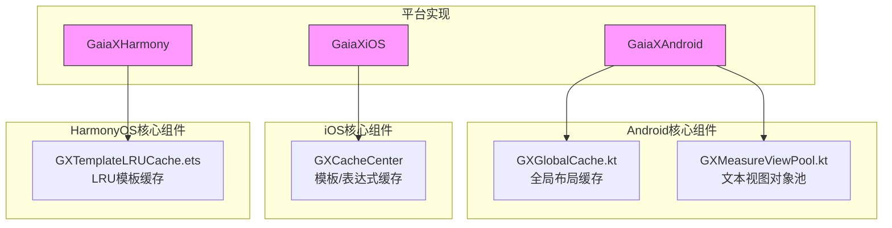
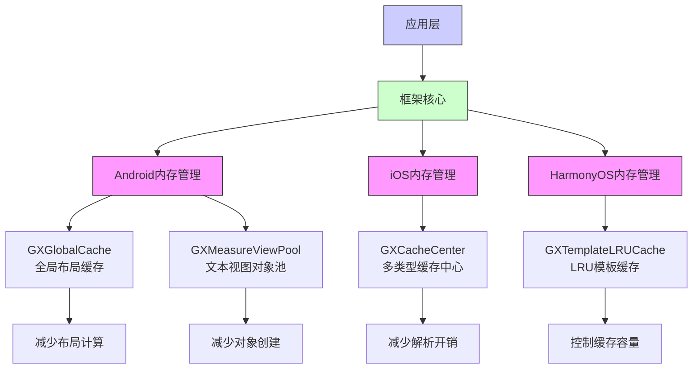
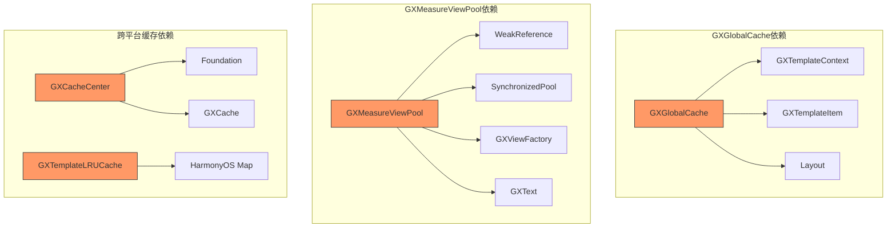

# 内存优化

<cite>
**本文档引用的文件**
- [GXGlobalCache.kt](file://GaiaXAndroid/src/main/kotlin/com/alibaba/gaiax/utils/GXGlobalCache.kt)
- [GXMeasureViewPool.kt](file://GaiaXAndroid/src/main/kotlin/com/alibaba/gaiax/render/node/text/GXMeasureViewPool.kt)
- [GXCacheCenter.h](file://GaiaXiOS/GaiaXiOS/Template/Cache/GXCacheCenter.h)
- [GXCacheCenter.m](file://GaiaXiOS/GaiaXiOS/Template/Cache/GXCacheCenter.m)
- [GXTemplateLRUCache.ets](file://GaiaXHarmony/GaiaXCore/GaiaX/src/main/ets/template/GXTemplateLRUCache.ets)
</cite>

## 目录
1. [简介](#简介)
2. [项目结构](#项目结构)
3. [核心组件](#核心组件)
4. [架构概述](#架构概述)
5. [详细组件分析](#详细组件分析)
6. [依赖分析](#依赖分析)
7. [性能考量](#性能考量)
8. [故障排除指南](#故障排除指南)
9. [结论](#结论)
10. [附录](#附录)（如有必要）

## 简介
本文档旨在为GaiaX框架提供一份详尽的内存优化指南，重点介绍如何减少内存占用并避免内存泄漏。通过深入分析GXGlobalCache、GXMeasureViewPool等关键内存管理组件的实现机制，全面阐述内存使用模式和优化策略。文档将为初学者提供视图复用、资源释放等基础方法，同时为高级开发者提供对象池优化、内存泄漏检测和大对象管理的高级技巧。此外，文档还将详细说明如何优化模板缓存策略、图片资源管理、动画资源释放等关键环节，以及如何利用Android内存分析工具进行性能调优。最后，文档包含内存使用监控和优化效果评估的方法，帮助开发者全面掌握GaiaX框架的内存管理。

## 项目结构
GaiaX框架是一个跨平台的模板动态开发解决方案，其代码库结构清晰，按平台和功能模块进行组织。核心的Android实现位于`GaiaXAndroid`目录下，其中包含了内存管理相关的关键组件。`GXGlobalCache.kt`文件位于`utils`包中，负责全局布局的缓存管理。`GXMeasureViewPool.kt`文件位于`render/node/text`包中，专门用于文本测量视图的对象池管理。iOS和HarmonyOS平台也实现了相应的缓存机制，如iOS的`GXCacheCenter`和HarmonyOS的`GXTemplateLRUCache`，这些组件共同构成了框架的内存优化体系。



**图示来源**
- [GXGlobalCache.kt](file://GaiaXAndroid/src/main/kotlin/com/alibaba/gaiax/utils/GXGlobalCache.kt)
- [GXMeasureViewPool.kt](file://GaiaXAndroid/src/main/kotlin/com/alibaba/gaiax/render/node/text/GXMeasureViewPool.kt)
- [GXCacheCenter.h](file://GaiaXiOS/GaiaXiOS/Template/Cache/GXCacheCenter.h)
- [GXTemplateLRUCache.ets](file://GaiaXHarmony/GaiaXCore/GaiaX/src/main/ets/template/GXTemplateLRUCache.ets)

**本节来源**
- [GXGlobalCache.kt](file://GaiaXAndroid/src/main/kotlin/com/alibaba/gaiax/utils/GXGlobalCache.kt)
- [GXMeasureViewPool.kt](file://GaiaXAndroid/src/main/kotlin/com/alibaba/gaiax/render/node/text/GXMeasureViewPool.kt)

## 核心组件
GaiaX框架的内存优化主要依赖于两个核心组件：`GXGlobalCache`和`GXMeasureViewPool`。`GXGlobalCache`是一个单例类，通过两个`MutableMap`实例（`layoutForPrepareView`和`layoutForTemplateItem`）来缓存布局信息，从而在创建视图时减少重复的计算开销。该组件提供了`put`、`get`和`isExist`等方法来管理缓存，并通过`clean()`方法在适当时机清空所有缓存，防止内存无限增长。

`GXMeasureViewPool`则是一个对象池，专门用于管理`GXText`视图实例。它利用Android的`Pools.SynchronizedPool`来复用视图对象，避免了频繁创建和销毁视图所带来的性能损耗和内存压力。该对象池在获取视图时会进行严格的上下文检查，确保不会因持有已销毁Activity的引用而导致内存泄漏。

**本节来源**
- [GXGlobalCache.kt](file://GaiaXAndroid/src/main/kotlin/com/alibaba/gaiax/utils/GXGlobalCache.kt#L6-L74)
- [GXMeasureViewPool.kt](file://GaiaXAndroid/src/main/kotlin/com/alibaba/gaiax/render/node/text/GXMeasureViewPool.kt#L33-L114)

## 架构概述
GaiaX框架的内存管理架构采用了分层和平台适配的设计模式。在Android平台上，`GXGlobalCache`作为全局缓存中心，负责存储和检索布局计算结果，其核心思想是“空间换时间”，通过牺牲少量内存来换取显著的性能提升。`GXMeasureViewPool`则作为对象池层，专注于特定类型视图（`GXText`）的生命周期管理，通过复用机制减少GC压力。

在跨平台层面，iOS和HarmonyOS平台也实现了类似的缓存策略。iOS的`GXCacheCenter`通过单例模式提供模板、表达式和正则表达式的缓存服务。HarmonyOS则使用`GXTemplateLRUCache`类实现了一个基于LRU（最近最少使用）算法的模板缓存，确保缓存大小可控。



**图示来源**
- [GXGlobalCache.kt](file://GaiaXAndroid/src/main/kotlin/com/alibaba/gaiax/utils/GXGlobalCache.kt)
- [GXMeasureViewPool.kt](file://GaiaXAndroid/src/main/kotlin/com/alibaba/gaiax/render/node/text/GXMeasureViewPool.kt)
- [GXCacheCenter.h](file://GaiaXiOS/GaiaXiOS/Template/Cache/GXCacheCenter.h)
- [GXTemplateLRUCache.ets](file://GaiaXHarmony/GaiaXCore/GaiaX/src/main/ets/template/GXTemplateLRUCache.ets)

## 详细组件分析
### GXGlobalCache分析
`GXGlobalCache`是GaiaX框架中用于优化布局性能的关键组件。它通过缓存`app.visly.stretch.Layout`对象来避免重复的布局计算。该组件提供了两组独立的缓存接口：`putLayoutForPrepareView`/`getLayoutForPrepareView`用于预览视图的布局缓存，`putLayoutForTemplateItem`/`getLayoutForTemplateItem`用于模板项的布局缓存。缓存的键由`GXTemplateEngine.GXTemplateItem`和`GXTemplateContext.size`共同生成，确保了缓存的唯一性和准确性。

一个重要的设计是`clean()`方法，它允许在内存紧张或特定业务场景下主动清空所有缓存，这是一种主动的内存管理策略，防止缓存无限增长导致内存溢出。

#### GXGlobalCache类图
```mermaid
classDiagram
class GXGlobalCache {
+putLayoutForPrepareView(gxTemplateContext : GXTemplateContext, key : GXTemplateItem, value : Layout) void
+getLayoutForPrepareView(gxTemplateContext : GXTemplateContext, key : GXTemplateItem) Layout?
+isExistForPrepareView(gxMeasureSize : GXMeasureSize, key : GXTemplateItem) Boolean
+putLayoutForTemplateItem(gxTemplateContext : GXTemplateContext, key : GXTemplateItem, value : Layout) void
+getLayoutForTemplateItem(gxTemplateContext : GXTemplateContext, key : GXTemplateItem) Layout?
+isExistForTemplateItem(gxMeasureSize : GXMeasureSize, key : GXTemplateItem) Boolean
+clean() void
}
class GXTemplateContext {
+size : GXSize
+traceId : String
}
class GXTemplateEngine$GXTemplateItem {
+key(size : GXSize) : String
}
class Layout {
<<interface>>
}
GXGlobalCache --> GXTemplateContext : "uses"
GXGlobalCache --> GXTemplateEngine$GXTemplateItem : "uses"
GXGlobalCache --> Layout : "stores"
```

**图示来源**
- [GXGlobalCache.kt](file://GaiaXAndroid/src/main/kotlin/com/alibaba/gaiax/utils/GXGlobalCache.kt#L6-L74)

**本节来源**
- [GXGlobalCache.kt](file://GaiaXAndroid/src/main/kotlin/com/alibaba/gaiax/utils/GXGlobalCache.kt#L6-L74)

### GXMeasureViewPool分析
`GXMeasureViewPool`是一个精心设计的对象池，用于解决文本测量过程中的性能瓶颈。其核心是`Pools.SynchronizedPool<WeakReference<GXText>>`，使用`WeakReference`来持有`GXText`实例，这可以确保当视图不再被强引用时，能够被垃圾回收器正常回收，从而避免内存泄漏。

该组件的`obtain`方法是其核心逻辑。在获取视图时，它会进行双重检查：
1.  **上下文检查**：如果从池中获取的`GXText`的`context`与当前请求的`context`不一致（例如，Activity已切换），则放弃复用，创建新实例。
2.  **Activity状态检查**：如果`GXText`的`context`是一个Activity，并且该Activity已被销毁（`isDestroyed`），则同样放弃复用，创建新实例。

这种设计有效地防止了因持有已销毁Activity的引用而导致的内存泄漏问题。

#### GXMeasureViewPool获取流程图
```mermaid
flowchart TD
Start([obtain(context)]) --> Acquire["从池中acquire()"]
Acquire --> HasView{获取到视图?}
HasView --> |是| GetView["get() WeakReference"]
HasView --> |否| CreateNew["createTv(context)"]
GetView --> IsNull{视图为空?}
IsNull --> |是| CreateNew
IsNull --> |否| IsActivity{context是Activity?}
IsActivity --> |否| UseOld["直接使用旧视图"]
IsActivity --> |是| ContextMatch{"context == 请求的context?"}
ContextMatch --> |否| CreateNew
ContextMatch --> |是| IsDestroyed{"Activity.isDestroyed?"}
IsDestroyed --> |是| CreateNew
IsDestroyed --> |否| UseOld
CreateNew --> InitCache["初始化缓存属性"]
CreateNew --> ReturnNew["返回新视图"]
UseOld --> ReturnOld["返回旧视图"]
ReturnNew --> End([返回视图])
ReturnOld --> End
```

**图示来源**
- [GXMeasureViewPool.kt](file://GaiaXAndroid/src/main/kotlin/com/alibaba/gaiax/render/node/text/GXMeasureViewPool.kt#L33-L114)

**本节来源**
- [GXMeasureViewPool.kt](file://GaiaXAndroid/src/main/kotlin/com/alibaba/gaiax/render/node/text/GXMeasureViewPool.kt#L33-L114)

## 依赖分析
`GXGlobalCache`和`GXMeasureViewPool`这两个组件的实现依赖于框架的其他核心模块。`GXGlobalCache`依赖于`GXTemplateContext`和`GXTemplateEngine.GXTemplateItem`来生成缓存键，并依赖于`app.visly.stretch.Layout`来存储布局数据。`GXMeasureViewPool`则依赖于`GXViewFactory`来创建`GXText`实例，并依赖于Android SDK中的`WeakReference`和`Pools.SynchronizedPool`来实现安全的对象池。

跨平台的缓存组件也存在类似的依赖关系。`GXCacheCenter`依赖于iOS的`Foundation`框架和自定义的`GXCache`类。`GXTemplateLRUCache`依赖于HarmonyOS的`Map`数据结构来实现LRU算法。



**图示来源**
- [GXGlobalCache.kt](file://GaiaXAndroid/src/main/kotlin/com/alibaba/gaiax/utils/GXGlobalCache.kt)
- [GXMeasureViewPool.kt](file://GaiaXAndroid/src/main/kotlin/com/alibaba/gaiax/render/node/text/GXMeasureViewPool.kt)
- [GXCacheCenter.h](file://GaiaXiOS/GaiaXiOS/Template/Cache/GXCacheCenter.h)
- [GXTemplateLRUCache.ets](file://GaiaXHarmony/GaiaXCore/GaiaX/src/main/ets/template/GXTemplateLRUCache.ets)

**本节来源**
- [GXGlobalCache.kt](file://GaiaXAndroid/src/main/kotlin/com/alibaba/gaiax/utils/GXGlobalCache.kt)
- [GXMeasureViewPool.kt](file://GaiaXAndroid/src/main/kotlin/com/alibaba/gaiax/render/node/text/GXMeasureViewPool.kt)

## 性能考量
使用`GXGlobalCache`和`GXMeasureViewPool`等内存管理组件可以显著提升应用性能，但同时也需要关注其潜在的性能开销和风险。

**优势**：
- **减少CPU计算**：`GXGlobalCache`避免了重复的布局计算，节省了宝贵的CPU时间。
- **降低GC压力**：`GXMeasureViewPool`通过对象复用，减少了短生命周期对象的创建和销毁，从而降低了垃圾回收的频率和停顿时间。
- **提升响应速度**：缓存和复用机制使得视图的创建和渲染过程更快，提升了用户体验。

**风险与注意事项**：
- **内存占用**：缓存本身会占用内存。如果缓存的数据量过大或生命周期过长，可能会导致内存占用过高。因此，必须实现合理的缓存清理策略（如`GXGlobalCache.clean()`）。
- **内存泄漏**：对象池如果设计不当，很容易成为内存泄漏的源头。`GXMeasureViewPool`通过使用`WeakReference`和严格的上下文检查，有效地规避了这一风险。
- **缓存失效**：需要确保缓存的数据在业务逻辑变化时能够及时失效，否则可能导致显示错误。

## 故障排除指南
在使用GaiaX框架进行内存优化时，可能会遇到以下常见问题：

**问题1：内存占用持续增长**
- **可能原因**：`GXGlobalCache`中的缓存未被及时清理。
- **排查方法**：检查业务逻辑中是否调用了`GXGlobalCache.instance.clean()`方法。使用Android Studio的Memory Profiler工具分析内存堆栈，确认是否存在大量`Layout`对象未被释放。

**问题2：出现内存泄漏（Memory Leak）**
- **可能原因**：虽然`GXMeasureViewPool`设计上已规避，但仍需检查其他地方是否持有`GXText`或其`context`的强引用。
- **排查方法**：使用LeakCanary等内存泄漏检测工具。重点检查`GXText`实例的引用链，确认其`context`是否为已销毁的Activity。

**问题3：缓存命中率低**
- **可能原因**：缓存键的生成逻辑存在问题，导致相同的请求生成了不同的键。
- **排查方法**：检查`GXTemplateItem.key()`方法的实现，确保其在相同输入下能生成一致的键。

**本节来源**
- [GXGlobalCache.kt](file://GaiaXAndroid/src/main/kotlin/com/alibaba/gaiax/utils/GXGlobalCache.kt#L42-L45)
- [GXMeasureViewPool.kt](file://GaiaXAndroid/src/main/kotlin/com/alibaba/gaiax/render/node/text/GXMeasureViewPool.kt#L64-L78)

## 结论
GaiaX框架通过`GXGlobalCache`和`GXMeasureViewPool`等组件，提供了一套行之有效的内存优化方案。`GXGlobalCache`通过缓存布局计算结果，实现了“空间换时间”的性能优化。`GXMeasureViewPool`则通过一个安全的对象池机制，解决了视图频繁创建带来的性能和内存问题，并通过`WeakReference`和上下文检查巧妙地避免了内存泄漏。

开发者在使用这些组件时，应充分理解其工作原理和适用场景。对于初学者，应掌握视图复用和资源释放的基本方法。对于高级开发者，应深入理解对象池的优化技巧，并利用Android内存分析工具进行性能调优。通过合理使用这些内存管理组件，可以显著提升GaiaX应用的性能和稳定性。

## 附录
### Android内存分析工具推荐
- **Memory Profiler**：Android Studio内置工具，用于实时监控内存分配、捕获堆转储（Heap Dump）和分析内存泄漏。
- **LeakCanary**：一个强大的开源库，可以自动检测应用中的内存泄漏，并在通知栏中报告。
- **MAT (Memory Analyzer Tool)**：一个功能强大的独立工具，用于分析堆转储文件，查找内存泄漏的根源。

### 优化效果评估方法
1.  **基准测试**：在优化前后，使用相同的测试用例测量应用的启动时间、内存峰值和GC频率。
2.  **用户场景模拟**：模拟用户真实操作流程（如快速滑动列表），观察内存占用是否稳定。
3.  **长期运行测试**：让应用长时间运行，监控内存占用是否呈线性增长趋势，以判断是否存在内存泄漏。