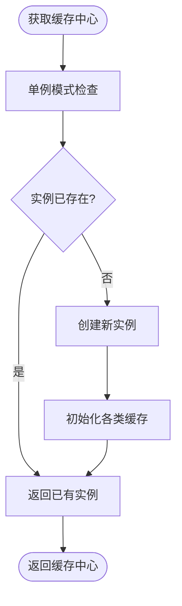

# 缓存策略优化

<cite>
**本文档引用的文件**
- [GXGlobalCache.kt](file://GaiaXAndroid/src/main/kotlin/com/alibaba/gaiax/utils/GXGlobalCache.kt)
- [GXLRUCache.h](file://GaiaXiOS/GaiaXiOS/Template/Cache/GXLRUCache.h)
- [GXLRUCache.m](file://GaiaXiOS/GaiaXiOS/Template/Cache/GXLRUCache.m)
- [GXCache.h](file://GaiaXiOS/GaiaXiOS/Template/Cache/GXCache.h)
- [GXCache.m](file://GaiaXiOS/GaiaXiOS/Template/Cache/GXCache.m)
- [GXCacheCenter.h](file://GaiaXiOS/GaiaXiOS/Template/Cache/GXCacheCenter.h)
- [GXCacheCenter.m](file://GaiaXiOS/GaiaXiOS/Template/Cache/GXCacheCenter.m)
</cite>

## 目录
1. [简介](#简介)
2. [项目结构](#项目结构)
3. [核心组件](#核心组件)
4. [架构概述](#架构概述)
5. [详细组件分析](#详细组件分析)
6. [依赖分析](#依赖分析)
7. [性能考量](#性能考量)
8. [故障排除指南](#故障排除指南)
9. [结论](#结论)

## 简介
本指南深入探讨GaiaX框架中的缓存策略优化，重点介绍如何通过合理的缓存管理减少内存占用并提升性能。基于`GXGlobalCache`和`GXLRUCache`的实现，详细讲解LRU缓存算法在模板、样式、数据等资源上的应用。为初学者提供缓存配置、缓存大小设置的基本方法，为高级开发者提供缓存淘汰策略、多级缓存设计和缓存命中率优化的高级技巧。同时，详细说明如何平衡缓存性能与内存占用，避免缓存膨胀导致的内存问题，以及如何监控缓存使用情况并进行调优。

## 项目结构
GaiaX框架的缓存机制主要分布在Android和iOS两个平台的实现中。Android端的缓存逻辑集中在`GXGlobalCache.kt`文件中，而iOS端则通过`GXLRUCache`、`GXCache`和`GXCacheCenter`三个核心类构建了完整的缓存体系。这种跨平台的设计保持了缓存策略的一致性，同时针对不同平台的特性进行了优化。

```mermaid
graph TB
subgraph "Android平台"
A[GXGlobalCache.kt]
end
subgraph "iOS平台"
B[GXLRUCache]
C[GXCache]
D[GXCacheCenter]
end
A --> "全局布局缓存"
B --> "LRU缓存算法实现"
C --> "缓存封装与线程安全"
D --> "缓存中心管理"
```

**图示来源**
- [GXGlobalCache.kt](file://GaiaXAndroid/src/main/kotlin/com/alibaba/gaiax/utils/GXGlobalCache.kt)
- [GXLRUCache.h](file://GaiaXiOS/GaiaXiOS/Template/Cache/GXLRUCache.h)
- [GXCache.h](file://GaiaXiOS/GaiaXiOS/Template/Cache/GXCache.h)
- [GXCacheCenter.h](file://GaiaXiOS/GaiaXiOS/Template/Cache/GXCacheCenter.h)

**本节来源**
- [GXGlobalCache.kt](file://GaiaXAndroid/src/main/kotlin/com/alibaba/gaiax/utils/GXGlobalCache.kt)
- [GXLRUCache.h](file://GaiaXiOS/GaiaXiOS/Template/Cache/GXLRUCache.h)
- [GXCacheCenter.h](file://GaiaXiOS/GaiaXiOS/Template/Cache/GXCacheCenter.h)

## 核心组件
GaiaX框架的缓存系统由多个核心组件构成，包括Android端的`GXGlobalCache`和iOS端的`GXLRUCache`、`GXCache`以及`GXCacheCenter`。这些组件共同协作，实现了高效的缓存管理机制。`GXGlobalCache`主要用于Android平台的布局缓存，而iOS平台则通过LRU算法实现了更精细的缓存控制。

**本节来源**
- [GXGlobalCache.kt](file://GaiaXAndroid/src/main/kotlin/com/alibaba/gaiax/utils/GXGlobalCache.kt)
- [GXLRUCache.h](file://GaiaXiOS/GaiaXiOS/Template/Cache/GXLRUCache.h)
- [GXCache.h](file://GaiaXiOS/GaiaXiOS/Template/Cache/GXCache.h)

## 架构概述
GaiaX框架的缓存架构采用了分层设计，iOS端的架构尤为清晰。`GXLRUCache`作为底层算法实现，提供了LRU缓存的核心功能；`GXCache`在此基础上封装了线程安全的缓存操作；`GXCacheCenter`作为顶层管理器，统一管理不同类型的缓存实例。这种设计既保证了缓存算法的高效性，又确保了多线程环境下的安全性。


**图示来源**
- [GXLRUCache.h](file://GaiaXiOS/GaiaXiOS/Template/Cache/GXLRUCache.h)
- [GXCache.h](file://GaiaXiOS/GaiaXiOS/Template/Cache/GXCache.h)
- [GXCacheCenter.h](file://GaiaXiOS/GaiaXiOS/Template/Cache/GXCacheCenter.h)

## 详细组件分析

### GXLRUCache分析
`GXLRUCache`是GaiaX框架中LRU缓存算法的核心实现，采用双向链表和哈希表的组合数据结构。这种设计使得缓存的插入、删除和查找操作都能在O(1)时间复杂度内完成，极大地提升了缓存性能。

#### 类图


**图示来源**
- [GXLRUCache.h](file://GaiaXiOS/GaiaXiOS/Template/Cache/GXLRUCache.h)
- [GXLRUCache.m](file://GaiaXiOS/GaiaXiOS/Template/Cache/GXLRUCache.m)

### GXCache分析
`GXCache`是对`GXLRUCache`的进一步封装，主要增加了线程安全机制。通过使用pthread互斥锁，确保了在多线程环境下缓存操作的原子性，避免了数据竞争和不一致的问题。

#### 序列图


**图示来源**
- [GXCache.h](file://GaiaXiOS/GaiaXiOS/Template/Cache/GXCache.h)
- [GXCache.m](file://GaiaXiOS/GaiaXiOS/Template/Cache/GXCache.m)

### GXCacheCenter分析
`GXCacheCenter`作为缓存系统的中心管理器，采用单例模式提供全局唯一的缓存访问点。它管理着模板缓存、表达式缓存和正则缓存三种不同类型的缓存实例，为上层应用提供了统一的缓存接口。

#### 流程图


**图示来源**
- [GXCacheCenter.h](file://GaiaXiOS/GaiaXiOS/Template/Cache/GXCacheCenter.h)
- [GXCacheCenter.m](file://GaiaXiOS/GaiaXiOS/Template/Cache/GXCacheCenter.m)

**本节来源**
- [GXLRUCache.h](file://GaiaXiOS/GaiaXiOS/Template/Cache/GXLRUCache.h)
- [GXLRUCache.m](file://GaiaXiOS/GaiaXiOS/Template/Cache/GXLRUCache.m)
- [GXCache.h](file://GaiaXiOS/GaiaXiOS/Template/Cache/GXCache.h)
- [GXCache.m](file://GaiaXiOS/GaiaXiOS/Template/Cache/GXCache.m)
- [GXCacheCenter.h](file://GaiaXiOS/GaiaXiOS/Template/Cache/GXCacheCenter.h)
- [GXCacheCenter.m](file://GaiaXiOS/GaiaXiOS/Template/Cache/GXCacheCenter.m)

## 依赖分析
GaiaX缓存系统的组件之间存在明确的依赖关系。`GXCacheCenter`依赖于`GXCache`，而`GXCache`又依赖于`GXLRUCache`。这种分层依赖结构使得各组件职责清晰，便于维护和扩展。同时，Android端的`GXGlobalCache`独立实现了类似的缓存功能，形成了跨平台的缓存解决方案。

```mermaid
graph LR
GXCacheCenter --> GXCache
GXCache --> GXLRUCache
GXGlobalCache -.-> "类似功能"
```

**图示来源**
- [GXCacheCenter.h](file://GaiaXiOS/GaiaXiOS/Template/Cache/GXCacheCenter.h)
- [GXCache.h](file://GaiaXiOS/GaiaXiOS/Template/Cache/GXCache.h)
- [GXLRUCache.h](file://GaiaXiOS/GaiaXiOS/Template/Cache/GXLRUCache.h)
- [GXGlobalCache.kt](file://GaiaXAndroid/src/main/kotlin/com/alibaba/gaiax/utils/GXGlobalCache.kt)

**本节来源**
- [GXCacheCenter.h](file://GaiaXiOS/GaiaXiOS/Template/Cache/GXCacheCenter.h)
- [GXCache.h](file://GaiaXiOS/GaiaXiOS/Template/Cache/GXCache.h)
- [GXLRUCache.h](file://GaiaXiOS/GaiaXiOS/Template/Cache/GXLRUCache.h)
- [GXGlobalCache.kt](file://GaiaXAndroid/src/main/kotlin/com/alibaba/gaiax/utils/GXGlobalCache.kt)

## 性能考量
GaiaX框架的缓存策略在性能和内存占用之间取得了良好平衡。通过LRU算法确保了最常用资源的快速访问，同时限制了缓存的最大容量，防止内存无限增长。iOS端的`expressionCahche`设置为200条，`regularCahche`设置为50条，体现了对不同类型资源的差异化缓存策略。Android端的`GXGlobalCache`则通过`clean()`方法提供了手动清理缓存的机制，增强了内存管理的灵活性。

## 故障排除指南
在使用GaiaX缓存系统时，可能会遇到缓存命中率低、内存占用过高等问题。建议通过以下步骤进行排查：首先检查缓存键的生成逻辑是否合理，确保相同资源使用相同的键；其次监控缓存的使用情况，适时调整缓存大小；最后在内存紧张时调用清理方法释放缓存。对于iOS平台，可以通过`allKeys`方法获取当前缓存的所有键，便于分析缓存状态。

**本节来源**
- [GXLRUCache.h](file://GaiaXiOS/GaiaXiOS/Template/Cache/GXLRUCache.h)
- [GXCache.h](file://GaiaXiOS/GaiaXiOS/Template/Cache/GXCache.h)
- [GXGlobalCache.kt](file://GaiaXAndroid/src/main/kotlin/com/alibaba/gaiax/utils/GXGlobalCache.kt)

## 结论
GaiaX框架的缓存策略通过`GXGlobalCache`和`GXLRUCache`的实现，为模板、样式、数据等资源提供了高效的缓存管理。该系统不仅减少了重复计算带来的性能损耗，还通过合理的缓存淘汰机制控制了内存占用。开发者可以根据具体需求调整缓存配置，平衡性能与内存的关系。未来可以考虑引入更智能的缓存预热和预测机制，进一步提升缓存效率。