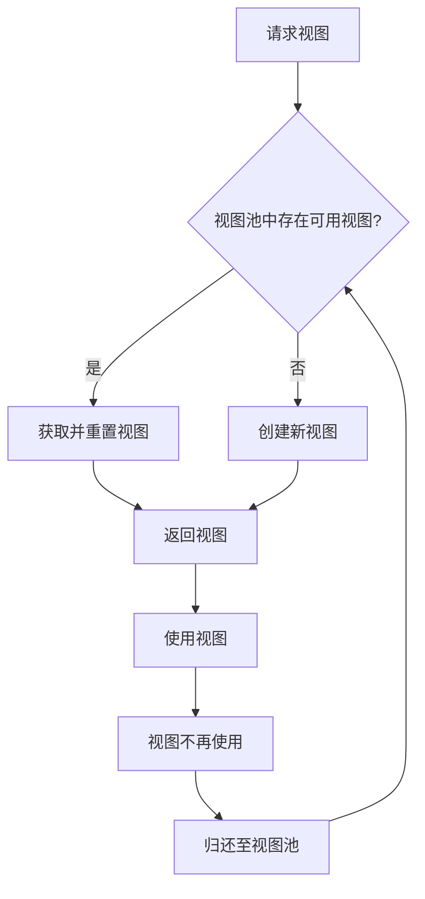
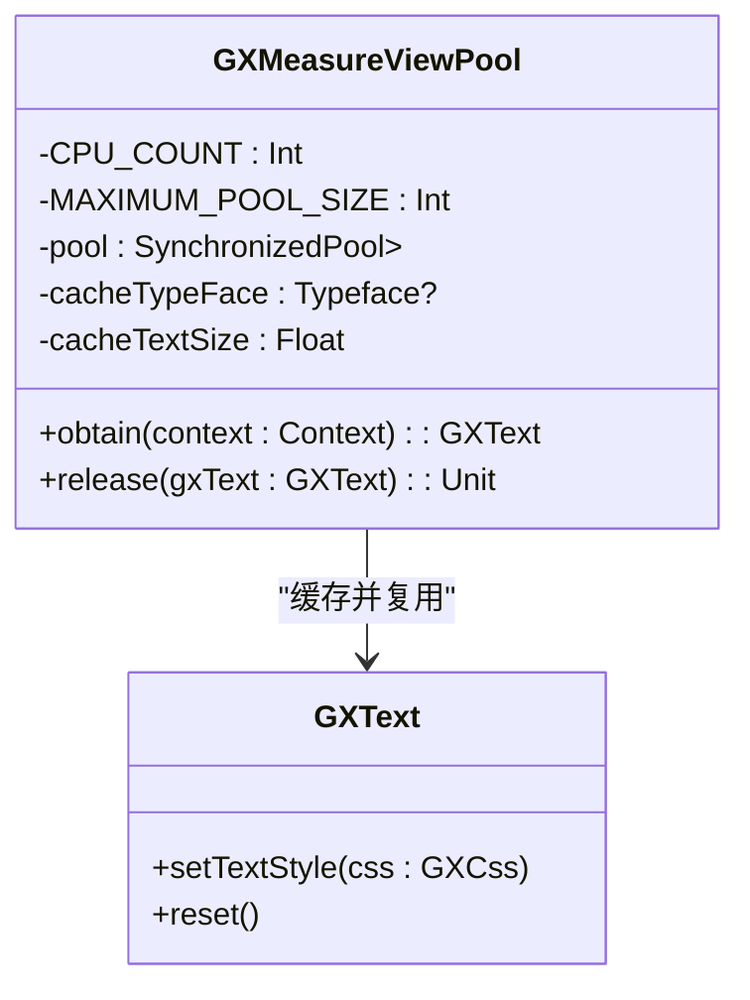
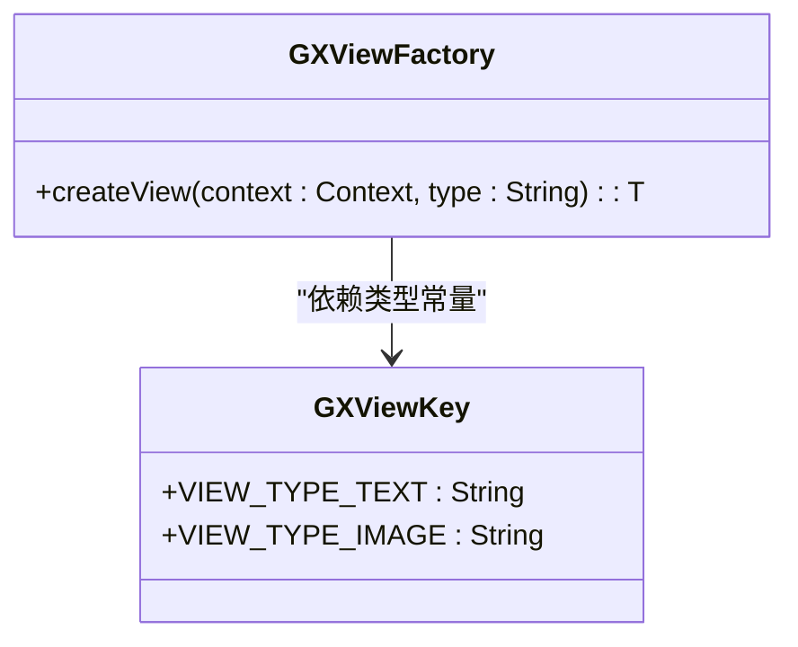
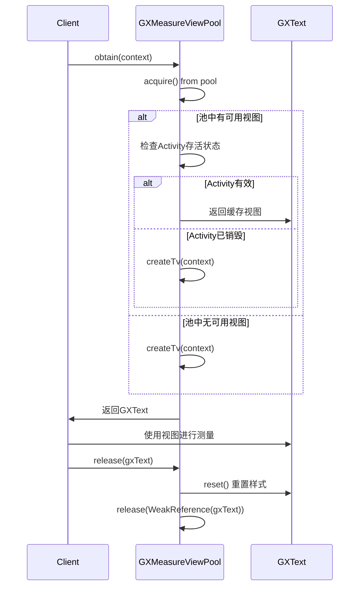

# 视图复用优化

<cite>
**本文档引用文件**  
- [GXMeasureViewPool.kt](file://GaiaXAndroid/src/main/kotlin/com/alibaba/gaiax/render/node/text/GXMeasureViewPool.kt)
- [GXText.kt](file://GaiaXAndroid/src/main/kotlin/com/alibaba/gaiax/render/view/basic/GXText.kt)
- [GXViewFactory.kt](file://GaiaXAndroid/src/main/kotlin/com/alibaba/gaiax/render/view/GXViewFactory.kt)
- [GXJSEngineProxy.kt](file://GaiaXAndroidJSProxy/src/main/java/com/alibaba/gaiax/js/proxy/GXJSEngineProxy.kt)
</cite>

## 目录
1. [引言](#引言)
2. [视图复用机制概述](#视图复用机制概述)
3. [核心组件分析](#核心组件分析)
4. [视图池实现原理](#视图池实现原理)
5. [生命周期管理](#生命周期管理)
6. [复用策略与优化](#复用策略与优化)
7. [滚动列表中的模板复用优化](#滚动列表中的模板复用优化)
8. [状态错乱问题与解决方案](#状态错乱问题与解决方案)
9. [视图复用效果监控](#视图复用效果监控)
10. [高级技巧与调优建议](#高级技巧与调优建议)

## 引言

GaiaX框架通过高效的视图复用机制显著降低了对象创建开销和内存占用，尤其在复杂模板和滚动列表场景下表现优异。本指南基于`GXMeasureViewPool`和`GXNodeViewPool`的实现，深入剖析视图复用的底层原理、生命周期管理及复用策略，为开发者提供从入门到精通的完整实践路径。

## 视图复用机制概述

GaiaX的视图复用机制借鉴了Android `RecyclerView`的回收复用思想，通过维护视图池（View Pool）来缓存不再使用的视图对象，当需要创建新视图时优先从池中获取，从而避免频繁的内存分配与垃圾回收。该机制主要应用于文本测量、滚动容器等高频创建场景，有效提升了渲染性能。



**图示来源**  
- [GXMeasureViewPool.kt](file://GaiaXAndroid/src/main/kotlin/com/alibaba/gaiax/render/node/text/GXMeasureViewPool.kt)

## 核心组件分析

### GXMeasureViewPool

`GXMeasureViewPool`是专为文本测量设计的视图池，用于缓存`GXText`实例，避免在布局计算过程中频繁创建临时文本视图。

**核心功能**：
- 使用`SynchronizedPool`管理固定大小的弱引用池
- 自动根据CPU核心数确定最大池容量（CPU核心数×2+1）
- 缓存并复用文本样式属性（字体、字号、行间距等）



**图示来源**  
- [GXMeasureViewPool.kt](file://GaiaXAndroid/src/main/kotlin/com/alibaba/gaiax/render/node/text/GXMeasureViewPool.kt)
- [GXText.kt](file://GaiaXAndroid/src/main/kotlin/com/alibaba/gaiax/render/view/basic/GXText.kt)

### GXViewFactory

`GXViewFactory`是视图创建工厂，负责根据类型标识创建对应的视图实例，是视图复用机制的入口。



**图示来源**  
- [GXViewFactory.kt](file://GaiaXAndroid/src/main/kotlin/com/alibaba/gaiax/render/view/GXViewFactory.kt)
- [GXViewKey.kt](file://GaiaXAndroid/src/main/kotlin/com/alibaba/gaiax/render/view/GXViewKey.kt)

## 视图池实现原理

### 对象池设计

`GXMeasureViewPool`采用`SynchronizedPool`实现线程安全的对象池，最大容量为`CPU核心数×2+1`，平衡了内存占用与复用效率。

```kotlin
private val CPU_COUNT = Runtime.getRuntime().availableProcessors()
private val MAXIMUM_POOL_SIZE = CPU_COUNT * 2 + 1
private val pool = Pools.SynchronizedPool<WeakReference<GXText>>(MAXIMUM_POOL_SIZE)
```

### 获取与释放流程

1. **获取视图** (`obtain`)：
   - 优先从池中获取
   - 检查宿主Activity是否存活，避免内存泄漏
   - 缓存首次获取视图的默认样式

2. **释放视图** (`release`)：
   - 重置视图状态至默认值
   - 将视图包装为弱引用归还池中



**图示来源**  
- [GXMeasureViewPool.kt](file://GaiaXAndroid/src/main/kotlin/com/alibaba/gaiax/render/node/text/GXMeasureViewPool.kt)

## 生命周期管理

### 视图生命周期回调

GaiaX通过`GXJSEngineProxy`提供了一系列生命周期回调，确保复用视图的状态正确管理。

```kotlin
fun onReuse(gxView: View?) {
    GXTemplateContext.getContext(gxView)?.let { gxTemplateContext ->
        gxExtJSArg(gxTemplateContext)?.jsComponentIds?.forEach { jsComponentId ->
            GXJSEngine.instance.onReuse(jsComponentId)
        }
    }
}
```

### 关键生命周期事件

| 事件 | 触发时机 | 用途 |
|------|--------|------|
| `onReady` | 视图首次创建完成 | 初始化JS组件 |
| `onReuse` | 视图被复用时 | 重置JS组件状态 |
| `onShow` | 视图显示时 | 恢复动画、计时器等 |
| `onHide` | 视图隐藏时 | 暂停动画、释放资源 |
| `onDestroy` | 视图销毁时 | 彻底清理资源 |

**图示来源**  
- [GXJSEngineProxy.kt](file://GaiaXAndroidJSProxy/src/main/java/com/alibaba/gaiax/js/proxy/GXJSEngineProxy.kt)

## 复用策略与优化

### 复用粒度控制

- **细粒度复用**：针对`GXText`等轻量级视图，使用专用池（如`GXMeasureViewPool`）
- **粗粒度复用**：针对模板整体，通过`GXTemplateContext`缓存节点树结构

### 复用条件判断

```kotlin
if (oldText.context != context) {
    // 不同Activity，避免内存泄漏
    return createTv(context)
}

if ((oldText.context as Activity).isDestroyed) {
    // 宿主Activity已销毁
    return createTv(context)
}
```

## 滚动列表中的模板复用优化

### 滚动容器复用

在`RecyclerView`中使用GaiaX模板时，应：
1. 在`onBindViewHolder`中调用`bindData`
2. 避免在`onCreateViewHolder`中创建复杂模板
3. 利用`GXGlobalCache`缓存布局计算结果

### 模板缓存策略

```kotlin
fun prepareView(gxTemplateItem: GXTemplateItem, gxMeasureSize: GXMeasureSize) {
    if (GXGlobalCache.instance.isExistForPrepareView(gxMeasureSize, gxTemplateItem)) {
        return // 直接使用缓存的节点树
    }
    // 执行创建逻辑
}
```

## 状态错乱问题与解决方案

### 常见状态错乱场景

1. **文本样式残留**：复用的`GXText`保留了上一个模板的字体、颜色等样式
2. **数据绑定残留**：未正确重置`onBindData`导致数据显示错误
3. **JS组件状态残留**：未触发`onReuse`导致JS逻辑异常

### 解决方案

1. **强制重置视图状态**：
   ```kotlin
   fun reset() {
       lastLineHeight = null
       lastFontLines = null
       setPadding(0, 0, 0, 0)
       text = ""
   }
   ```

2. **实现`GXIViewBindData`接口**：
   ```kotlin
   override fun onResetData() {
       this.text = ""
   }
   ```

3. **正确处理生命周期**：
   ```kotlin
   override fun onReuse(gxView: View?) {
       Log.d(TAG, "onReuse called")
       // 重置自定义状态
   }
   ```

## 视图复用效果监控

### 性能监控指标

- **对象创建次数**：通过内存分析工具监控`GXText`等对象的创建频率
- **内存占用**：对比启用/禁用复用时的内存峰值
- **布局计算耗时**：测量`fitContent`等操作的执行时间

### 日志监控

启用GaiaX内部日志，关注以下关键词：
- `GXMeasureViewPool`：视图池操作日志
- `onReuse`：复用事件触发
- `bindData`：数据绑定性能

## 高级技巧与调优建议

### 视图池大小调优

- **默认策略**：`CPU核心数×2+1`适用于大多数场景
- **高密度文本场景**：可适当增大池大小（如×3）
- **低内存设备**：可减小池大小或禁用复用

### 复杂视图复用

对于包含动画、视频等复杂组件的模板：
1. 实现`GXIItemViewLifecycleListener`
2. 在`onReuse`中暂停动画、释放媒体资源
3. 在`onShow`中恢复播放

### 自定义视图复用

通过`GXRegisterCenter`注册自定义视图的复用逻辑：

```kotlin
GXRegisterCenter.instance.registerExtensionViewSupport(
    GXViewKey.VIEW_TYPE_CUSTOM,
    MyCustomView::class.java
)
```