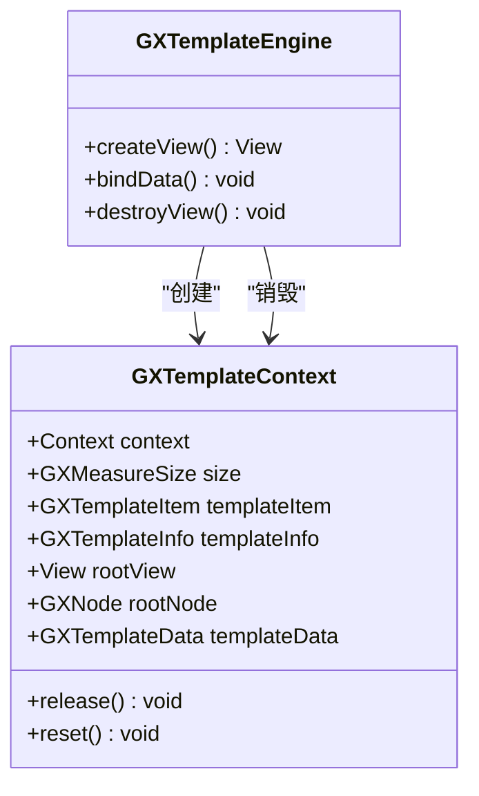
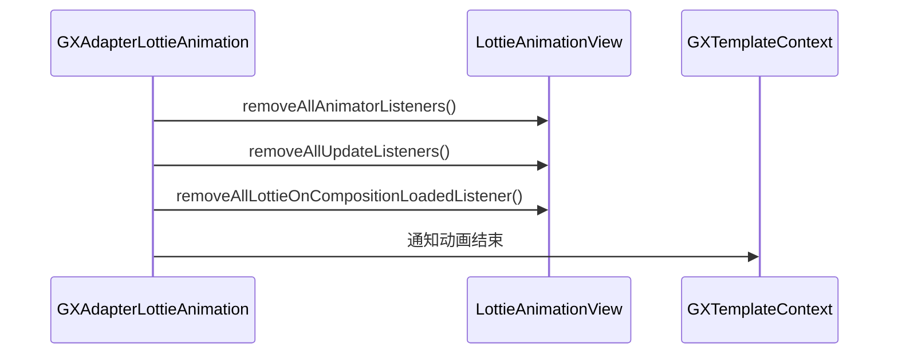
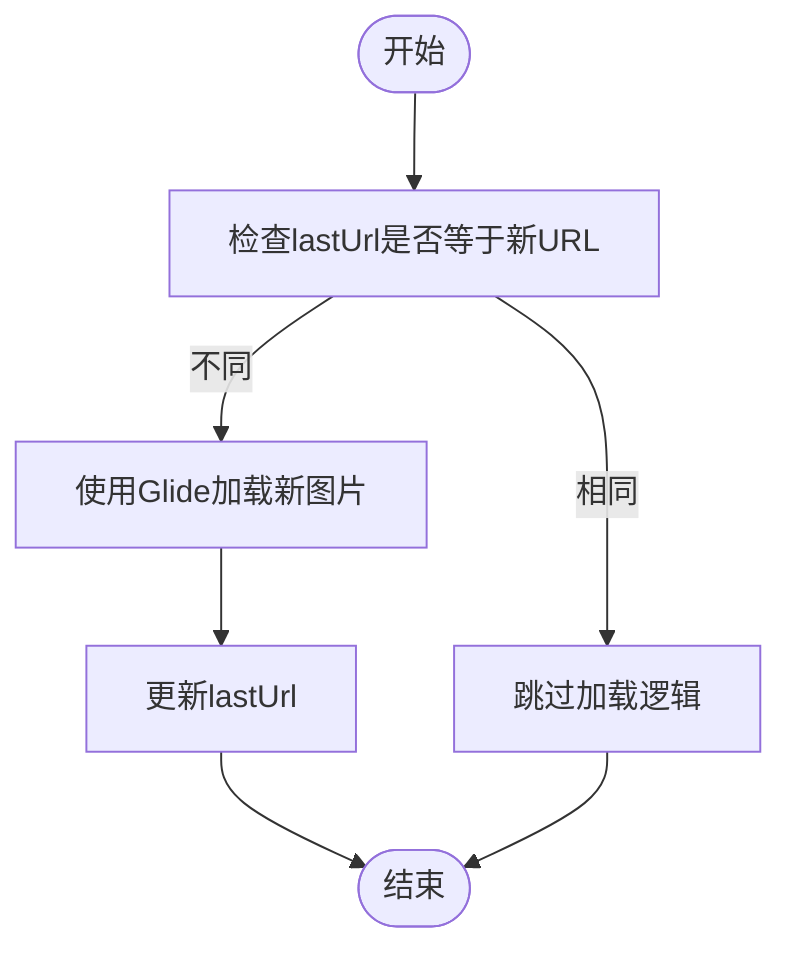

# 资源释放管理

<cite>
**本文档引用的文件**   
- [GXTemplateContext.kt](file://GaiaXAndroid/src/main/kotlin/com/alibaba/gaiax/context/GXTemplateContext.kt)
- [GXJSEngine.kt](file://GaiaXAndroidJS/src/main/kotlin/com/alibaba/gaiax/js/GXJSEngine.kt)
- [GXAdapterLottieAnimation.kt](file://GaiaXAndroidAdapter/src/main/java/com/alibaba/gaiax/adapter/GXAdapterLottieAnimation.kt)
- [GXAdapterImageView.kt](file://GaiaXAndroidAdapter/src/main/java/com/alibaba/gaiax/adapter/GXAdapterImageView.kt)
- [GXTemplateEngine.kt](file://GaiaXAndroid/src/main/kotlin/com/alibaba/gaiax/GXTemplateEngine.kt)
</cite>

## 目录
1. [简介](#简介)
2. [资源生命周期与管理机制](#资源生命周期与管理机制)
3. [模板与视图资源释放](#模板与视图资源释放)
4. [动画资源管理](#动画资源管理)
5. [JS引擎资源释放](#js引擎资源释放)
6. [图片资源管理](#图片资源管理)
7. [高级资源管理技巧](#高级资源管理技巧)
8. [内存泄漏检测与修复](#内存泄漏检测与修复)
9. [总结](#总结)

## 简介
GaiaX框架提供了一套完整的动态模板渲染解决方案，其中资源管理是确保应用性能和稳定性的关键环节。本指南将详细介绍如何正确释放模板、视图、动画等资源以避免内存泄漏。基于GXTemplateContext和GXBaseNode的资源管理机制，深入讲解资源生命周期、释放时机和释放策略。为初学者提供资源释放的基本调用方法，为高级开发者提供复杂场景下的资源管理、监听器清理和引用循环打破的高级技巧。

## 资源生命周期与管理机制
GaiaX框架中的资源管理主要围绕GXTemplateContext展开，该类负责管理模板的上下文信息、视图引用、数据绑定等。每个模板实例都有一个对应的GXTemplateContext，它在模板创建时初始化，在模板销毁时释放。

GXTemplateContext通过引用计数(bindDataCount)来跟踪资源的使用情况，并在适当的时候触发资源释放。当模板不再需要时，必须显式调用destroyView方法来释放相关资源，否则会导致内存泄漏。



**Diagram sources**
- [GXTemplateContext.kt](file://GaiaXAndroid/src/main/kotlin/com/alibaba/gaiax/context/GXTemplateContext.kt)
- [GXTemplateEngine.kt](file://GaiaXAndroid/src/main/kotlin/com/alibaba/gaiax/GXTemplateEngine.kt)

**Section sources**
- [GXTemplateContext.kt](file://GaiaXAndroid/src/main/kotlin/com/alibaba/gaiax/context/GXTemplateContext.kt#L35-L251)
- [GXTemplateEngine.kt](file://GaiaXAndroid/src/main/kotlin/com/alibaba/gaiax/GXTemplateEngine.kt#L78-L928)

## 模板与视图资源释放
在GaiaX框架中，模板和视图资源的释放是通过GXTemplateEngine的destroyView方法完成的。这个方法会清理与指定视图关联的所有资源，包括模板上下文、节点树、事件监听器等。

正确的资源释放流程如下：
1. 当Activity或Fragment即将销毁时
2. 调用GXTemplateEngine.instance.destroyView(view)
3. 将视图引用置为null

```kotlin
// 正确的资源释放示例
override fun onDestroy() {
    super.onDestroy()
    GXTemplateEngine.instance.destroyView(templateView)
    templateView = null
}
```

需要注意的是，如果在RecyclerView中使用GaiaX模板，应该在onViewRecycled回调中释放资源，而不是在onDestroyViewHolder中，这样可以更好地复用模板实例。

**Section sources**
- [GXTemplateEngine.kt](file://GaiaXAndroid/src/main/kotlin/com/alibaba/gaiax/GXTemplateEngine.kt#L627-L631)
- [GXTemplateContext.kt](file://GaiaXAndroid/src/main/kotlin/com/alibaba/gaiax/context/GXTemplateContext.kt#L158-L172)

## 动画资源管理
GaiaX框架支持多种类型的动画资源，包括Lottie动画和属性动画。这些动画资源需要特别注意管理，因为它们通常包含大量的内存占用和复杂的回调机制。

对于Lottie动画，GXAdapterLottieAnimation类负责管理动画资源的加载和释放。在播放远程Lottie动画时，需要确保在动画结束或视图销毁时清理所有监听器：



**Diagram sources**
- [GXAdapterLottieAnimation.kt](file://GaiaXAndroidAdapter/src/main/java/com/alibaba/gaiax/adapter/GXAdapterLottieAnimation.kt)
- [GXLottieAnimation.kt](file://GaiaXAndroid/src/main/kotlin/com/alibaba/gaiax/template/animation/GXLottieAnimation.kt)

**Section sources**
- [GXAdapterLottieAnimation.kt](file://GaiaXAndroidAdapter/src/main/java/com/alibaba/gaiax/adapter/GXAdapterLottieAnimation.kt#L32-L207)
- [GXLottieAnimation.kt](file://GaiaXAndroid/src/main/kotlin/com/alibaba/gaiax/template/animation/GXLottieAnimation.kt#L26-L70)

## JS引擎资源释放
JS引擎资源是GaiaX框架中另一个重要的内存消耗点。GXJSEngine类负责管理JS引擎的生命周期，包括引擎的启动、停止和资源清理。

JS引擎资源释放的关键点：
1. 在应用退出或模块卸载时调用stopDefaultEngine()
2. 取消所有注册的JS组件
3. 清理自定义模块的引用

```kotlin
// JS引擎资源释放示例
fun releaseJSEngineResources() {
    // 停止默认引擎
    GXJSEngine.instance.stopDefaultEngine()
    
    // 停止调试引擎（如果启用）
    GXJSEngine.instance.stopDebugEngine()
    
    // 清理自定义模块
    GXRegisterCenter.instance.extensionLottieAnimation = null
}
```

**Section sources**
- [GXJSEngine.kt](file://GaiaXAndroidJS/src/main/kotlin/com/alibaba/gaiax/js/GXJSEngine.kt#L1-L426)

## 图片资源管理
图片资源管理主要通过GXAdapterImageView类实现。该类使用Glide作为图片加载库，并实现了适当的资源管理策略。

关键的图片资源管理实践：
1. 使用requestListener跟踪图片加载状态
2. 在bindNetUri方法中处理图片URL变更
3. 通过lastUrl字段避免重复加载相同的图片



**Diagram sources**
- [GXAdapterImageView.kt](file://GaiaXAndroidAdapter/src/main/java/com/alibaba/gaiax/adapter/GXAdapterImageView.kt)

**Section sources**
- [GXAdapterImageView.kt](file://GaiaXAndroidAdapter/src/main/java/com/alibaba/gaiax/adapter/GXAdapterImageView.kt#L31-L79)

## 高级资源管理技巧
对于复杂的使用场景，需要采用更精细的资源管理策略：

### 监听器清理
确保在资源释放时清理所有注册的监听器，避免产生内存泄漏：

```kotlin
fun cleanupListeners(gxTemplateContext: GXTemplateContext) {
    // 清理动画监听器
    gxTemplateContext.rootNode?.children?.forEach { node ->
        node.propAnimatorSet?.removeAllListeners()
    }
    
    // 重置模板数据
    gxTemplateContext.templateData = null
    
    // 清理容器引用
    gxTemplateContext.containers?.clear()
}
```

### 引用循环打破
在嵌套模板场景中，需要注意打破可能产生的引用循环：

```kotlin
fun breakReferenceCycle(gxTemplateContext: GXTemplateContext) {
    // 清理视觉模板节点引用
    gxTemplateContext.visualTemplateNode = null
    
    // 释放根节点
    gxTemplateContext.rootNode?.release()
    gxTemplateContext.rootNode = null
}
```

**Section sources**
- [GXTemplateContext.kt](file://GaiaXAndroid/src/main/kotlin/com/alibaba/gaiax/context/GXTemplateContext.kt#L158-L172)
- [GXNode.kt](file://GaiaXAndroid/src/main/kotlin/com/alibaba/gaiax/render/node/GXNode.kt#L120-L133)

## 内存泄漏检测与修复
使用Android Profiler检测GaiaX相关的内存泄漏：

1. 打开Android Studio的Profiler工具
2. 记录应用运行时的内存分配
3. 强制执行垃圾回收
4. 分析内存快照，查找未释放的GXTemplateContext实例

常见内存泄漏模式：
- 未调用destroyView方法
- 持有已销毁视图的引用
- 未清理动画监听器
- JS引擎未正确停止

修复建议：
- 在Activity/Fragment的生命周期方法中正确管理资源
- 使用弱引用持有上下文引用
- 定期检查资源释放逻辑

**Section sources**
- [GXTemplateEngine.kt](file://GaiaXAndroid/src/main/kotlin/com/alibaba/gaiax/GXTemplateEngine.kt#L627-L631)
- [GXTemplateContext.kt](file://GaiaXAndroid/src/main/kotlin/com/alibaba/gaiax/context/GXTemplateContext.kt#L158-L172)

## 总结
GaiaX框架的资源管理是一个系统性的工程，需要开发者在多个层面进行考虑和实现。通过正确使用GXTemplateContext的生命周期管理机制，及时释放模板、视图、动画等资源，可以有效避免内存泄漏问题。对于高级使用场景，还需要注意监听器清理和引用循环打破等细节。结合Android Profiler等工具进行内存泄漏检测，可以进一步提升应用的稳定性和性能。