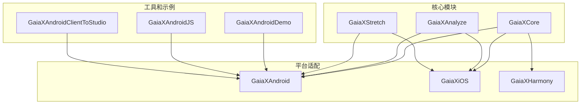
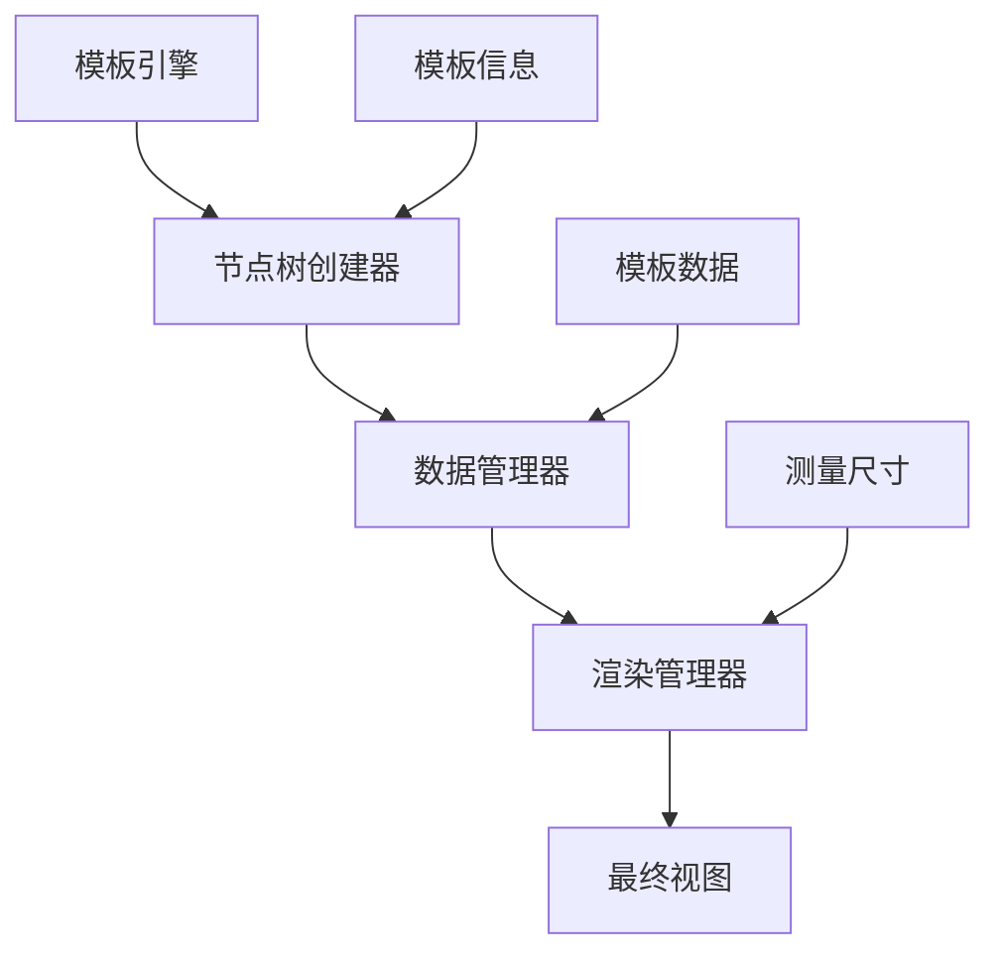
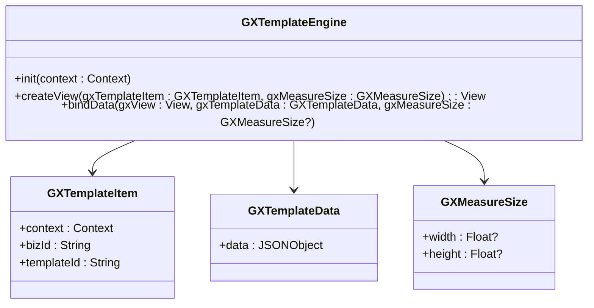
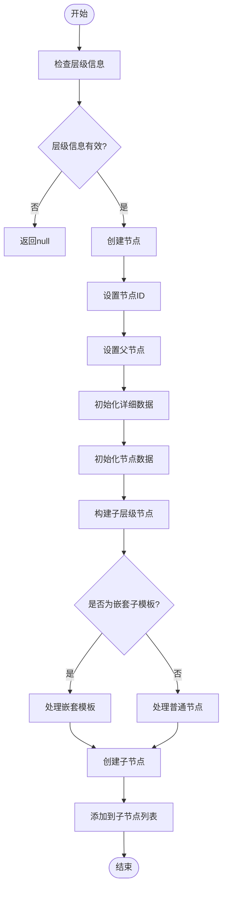
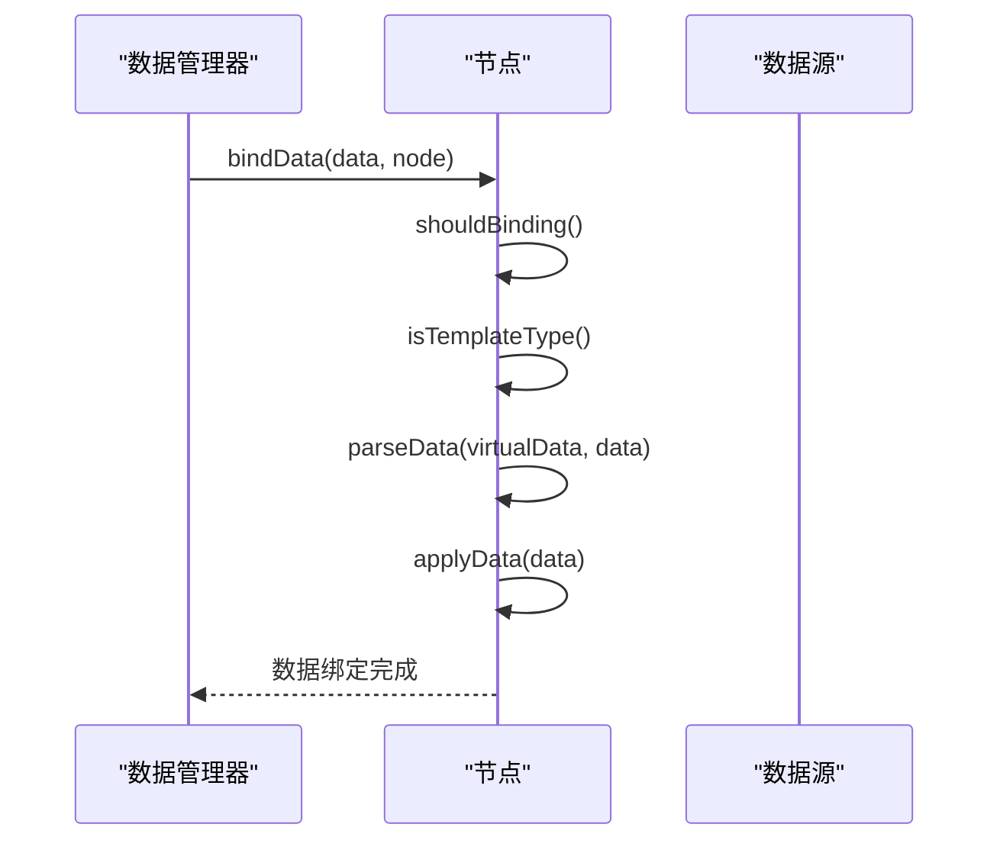
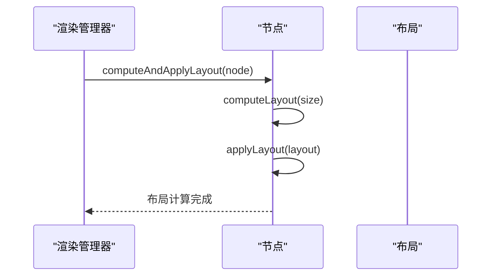
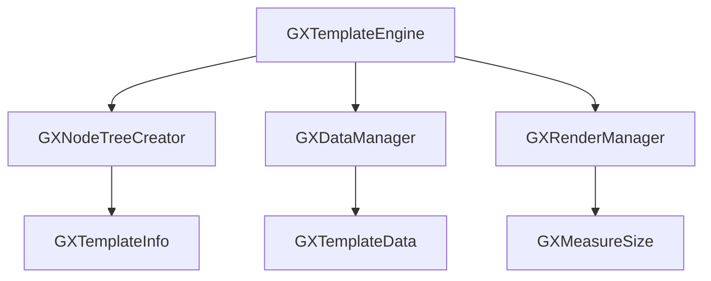

# 性能优化最佳实践

<cite>
**本文档引用的文件**   
- [GXTemplateEngine.kt](file://GaiaXAndroid/src/main/kotlin/com/alibaba/gaiax/GXTemplateEngine.kt)
- [GXNodeTreeCreator.kt](file://GaiaXAndroid/src/main/kotlin/com/alibaba/gaiax/render/node/GXNodeTreeCreator.kt)
- [GXCacheCenter.h](file://GaiaXiOS/GaiaXiOS/Template/Cache/GXCacheCenter.h)
- [GXCacheCenter.m](file://GaiaXiOS/GaiaXiOS/Template/Cache/GXCacheCenter.m)
- [GXDataManager.ets](file://GaiaXHarmony/GaiaXCore/GaiaX/src/main/ets/binding/GXDataManager.ets)
- [GXRenderManager.ets](file://GaiaXHarmony/GaiaXCore/GaiaX/src/main/ets/binding/GXRenderManager.ets)
- [GXNodeTreeCreator.ets](file://GaiaXHarmony/GaiaXCore/GaiaX/src/main/ets/creator/GXNodeTreeCreator.ets)
</cite>

## 目录
1. [简介](#简介)
2. [项目结构](#项目结构)
3. [核心组件](#核心组件)
4. [架构概述](#架构概述)
5. [详细组件分析](#详细组件分析)
6. [依赖分析](#依赖分析)
7. [性能考虑](#性能考虑)
8. [故障排除指南](#故障排除指南)
9. [结论](#结论)
10. [附录](#附录)（如有必要）

## 简介
本文档旨在为GaiaX框架提供全面的性能优化最佳实践指南，重点介绍如何提升模板渲染性能和数据绑定效率。基于实际代码库中的性能关键路径，文档将提供具体的优化策略和技巧，涵盖从初学者到经验丰富的开发者的不同需求层次。内容包括优化模板解析过程、减少不必要的重绘和布局计算、高效处理大数据量绑定以及利用缓存机制提升性能。此外，还将介绍性能分析工具的使用方法和监控策略，帮助开发者构建高性能的应用。

## 项目结构
GaiaX框架是一个跨平台的动态模板引擎，支持Android、iOS和HarmonyOS等多个平台。项目结构清晰，各模块职责分明，便于维护和扩展。

**图表来源**
- [GXCore](file://GaiaXHarmony/GaiaXCore/GaiaX/src/main/ets/)
- [GXAnalyze](file://GaiaXAnalyze/GXAnalyzeAndroid/src/main/cpp/)
- [GXStretch](file://GaiaXStretch/src/lib.rs)

**章节来源**
- [项目结构](file://README.md)

## 核心组件

GaiaX框架的核心组件主要包括模板引擎、节点树创建器、数据管理器和渲染管理器。这些组件协同工作，确保模板的高效渲染和数据的快速绑定。

**章节来源**
- [GXTemplateEngine.kt](file://GaiaXAndroid/src/main/kotlin/com/alibaba/gaiax/GXTemplateEngine.kt#L77-L927)
- [GXNodeTreeCreator.kt](file://GaiaXAndroid/src/main/kotlin/com/alibaba/gaiax/render/node/GXNodeTreeCreator.kt#L28-L135)

## 架构概述

GaiaX框架的架构设计遵循模块化原则，各组件之间通过清晰的接口进行通信。模板引擎负责创建和管理模板上下文，节点树创建器负责构建虚拟节点树，数据管理器负责数据绑定，渲染管理器负责最终的布局计算和视图渲染。

**图表来源**
- [GXTemplateEngine.kt](file://GaiaXAndroid/src/main/kotlin/com/alibaba/gaiax/GXTemplateEngine.kt#L77-L927)
- [GXNodeTreeCreator.kt](file://GaiaXAndroid/src/main/kotlin/com/alibaba/gaiax/render/node/GXNodeTreeCreator.kt#L28-L135)
- [GXDataManager.ets](file://GaiaXHarmony/GaiaXCore/GaiaX/src/main/ets/binding/GXDataManager.ets#L1-L35)
- [GXRenderManager.ets](file://GaiaXHarmony/GaiaXCore/GaiaX/src/main/ets/binding/GXRenderManager.ets#L104-L143)

## 详细组件分析

### 模板引擎分析
模板引擎是GaiaX框架的核心，负责创建和管理模板上下文。它通过`createView`方法创建模板视图，并通过`bindData`方法绑定数据。

#### 类图

**图表来源**
- [GXTemplateEngine.kt](file://GaiaXAndroid/src/main/kotlin/com/alibaba/gaiax/GXTemplateEngine.kt#L77-L927)

### 节点树创建器分析
节点树创建器负责构建虚拟节点树，它是模板渲染的基础。通过递归创建节点，确保每个节点都有正确的父节点和子节点关系。

#### 流程图

**图表来源**
- [GXNodeTreeCreator.kt](file://GaiaXAndroid/src/main/kotlin/com/alibaba/gaiax/render/node/GXNodeTreeCreator.kt#L28-L135)

### 数据管理器分析
数据管理器负责将数据绑定到节点上，确保数据的正确性和一致性。通过递归绑定操作，确保每个节点都能正确地获取和应用数据。

#### 序列图

**图表来源**
- [GXDataManager.ets](file://GaiaXHarmony/GaiaXCore/GaiaX/src/main/ets/binding/GXDataManager.ets#L37-L75)

### 渲染管理器分析
渲染管理器负责最终的布局计算和视图渲染。通过计算和应用布局，确保视图的正确显示。

#### 序列图

**图表来源**
- [GXRenderManager.ets](file://GaiaXHarmony/GaiaXCore/GaiaX/src/main/ets/binding/GXRenderManager.ets#L104-L143)

**章节来源**
- [GXNodeTreeCreator.ets](file://GaiaXHarmony/GaiaXCore/GaiaX/src/main/ets/creator/GXNodeTreeCreator.ets#L27-L59)
- [GXDataManager.ets](file://GaiaXHarmony/GaiaXCore/GaiaX/src/main/ets/binding/GXDataManager.ets#L1-L35)
- [GXRenderManager.ets](file://GaiaXHarmony/GaiaXCore/GaiaX/src/main/ets/binding/GXRenderManager.ets#L104-L143)

## 依赖分析

GaiaX框架的各个组件之间存在明确的依赖关系。模板引擎依赖于节点树创建器、数据管理器和渲染管理器，确保模板的完整生命周期管理。

**图表来源**
- [GXTemplateEngine.kt](file://GaiaXAndroid/src/main/kotlin/com/alibaba/gaiax/GXTemplateEngine.kt#L77-L927)
- [GXNodeTreeCreator.kt](file://GaiaXAndroid/src/main/kotlin/com/alibaba/gaiax/render/node/GXNodeTreeCreator.kt#L28-L135)
- [GXDataManager.ets](file://GaiaXHarmony/GaiaXCore/GaiaX/src/main/ets/binding/GXDataManager.ets#L1-L35)
- [GXRenderManager.ets](file://GaiaXHarmony/GaiaXCore/GaiaX/src/main/ets/binding/GXRenderManager.ets#L104-L143)

**章节来源**
- [GXTemplateEngine.kt](file://GaiaXAndroid/src/main/kotlin/com/alibaba/gaiax/GXTemplateEngine.kt#L77-L927)
- [GXNodeTreeCreator.kt](file://GaiaXAndroid/src/main/kotlin/com/alibaba/gaiax/render/node/GXNodeTreeCreator.kt#L28-L135)
- [GXDataManager.ets](file://GaiaXHarmony/GaiaXCore/GaiaX/src/main/ets/binding/GXDataManager.ets#L1-L35)
- [GXRenderManager.ets](file://GaiaXHarmony/GaiaXCore/GaiaX/src/main/ets/binding/GXRenderManager.ets#L104-L143)

## 性能考虑

### 模板解析优化
- **缓存模板信息**：使用`GXTemplateLRUCache`缓存模板信息，避免重复解析。
- **预编译模板**：在应用启动时预编译常用模板，减少运行时解析时间。

### 减少重绘和布局计算
- **懒加载**：对于不在屏幕内的视图，延迟加载和渲染。
- **局部更新**：只更新发生变化的节点，避免全局重绘。

### 大数据量绑定优化
- **分批处理**：将大数据量分批处理，避免一次性加载导致的性能瓶颈。
- **异步处理**：使用异步任务处理数据绑定，避免阻塞主线程。

### 缓存机制
- **表达式缓存**：使用`GXCacheCenter`缓存表达式计算结果，避免重复计算。
- **正则缓存**：缓存正则表达式匹配结果，提高匹配速度。

**章节来源**
- [GXCacheCenter.h](file://GaiaXiOS/GaiaXiOS/Template/Cache/GXCacheCenter.h#L1-L41)
- [GXCacheCenter.m](file://GaiaXiOS/GaiaXiOS/Template/Cache/GXCacheCenter.m#L1-L56)

## 故障排除指南

### 常见问题
- **模板加载失败**：检查模板文件路径和格式是否正确。
- **数据绑定失败**：确保数据源和模板数据结构一致。
- **布局计算错误**：检查测量尺寸和节点样式是否正确设置。

### 调试工具
- **日志输出**：启用日志输出，查看详细的执行过程。
- **性能分析**：使用性能分析工具，定位性能瓶颈。

**章节来源**
- [GXTemplateEngine.kt](file://GaiaXAndroid/src/main/kotlin/com/alibaba/gaiax/GXTemplateEngine.kt#L77-L927)
- [GXNodeTreeCreator.kt](file://GaiaXAndroid/src/main/kotlin/com/alibaba/gaiax/render/node/GXNodeTreeCreator.kt#L28-L135)
- [GXDataManager.ets](file://GaiaXHarmony/GaiaXCore/GaiaX/src/main/ets/binding/GXDataManager.ets#L1-L35)
- [GXRenderManager.ets](file://GaiaXHarmony/GaiaXCore/GaiaX/src/main/ets/binding/GXRenderManager.ets#L104-L143)

## 结论

GaiaX框架通过模块化设计和高效的性能优化策略，为开发者提供了强大的动态模板渲染能力。通过合理利用缓存机制、减少不必要的重绘和布局计算、高效处理大数据量绑定，可以显著提升应用的性能。希望本文档能帮助开发者更好地理解和使用GaiaX框架，构建高性能的应用。

**章节来源**
- [GXTemplateEngine.kt](file://GaiaXAndroid/src/main/kotlin/com/alibaba/gaiax/GXTemplateEngine.kt#L77-L927)
- [GXNodeTreeCreator.kt](file://GaiaXAndroid/src/main/kotlin/com/alibaba/gaiax/render/node/GXNodeTreeCreator.kt#L28-L135)
- [GXDataManager.ets](file://GaiaXHarmony/GaiaXCore/GaiaX/src/main/ets/binding/GXDataManager.ets#L1-L35)
- [GXRenderManager.ets](file://GaiaXHarmony/GaiaXCore/GaiaX/src/main/ets/binding/GXRenderManager.ets#L104-L143)