# 增量更新策略

<cite>
**本文档引用文件**   
- [GXDataBinding.kt](file://GaiaXAndroid/src/main/kotlin/com/alibaba/gaiax/template/GXDataBinding.kt)
- [GXViewTreeUpdate.kt](file://GaiaXAndroid/src/main/kotlin/com/alibaba/gaiax/render/view/GXViewTreeUpdate.kt)
- [GXNodeTreeUpdate.kt](file://GaiaXAndroid/src/main/kotlin/com/alibaba/gaiax/render/node/GXNodeTreeUpdate.kt)
- [GXViewTreeMerger.kt](file://GaiaXAndroid/src/main/kotlin/com/alibaba/gaiax/render/view/GXViewTreeMerger.kt)
- [GXTemplateContext.kt](file://GaiaXAndroid/src/main/kotlin/com/alibaba/gaiax/context/GXTemplateContext.kt)
- [GXNode.kt](file://GaiaXAndroid/src/main/kotlin/com/alibaba/gaiax/render/node/GXNode.kt)
- [GXTemplateInfo.kt](file://GaiaXAndroid/src/main/kotlin/com/alibaba/gaiax/template/GXTemplateInfo.kt)
- [GXTemplateKey.kt](file://GaiaXAndroid/src/main/kotlin/com/alibaba/gaiax/template/GXTemplateKey.kt)
</cite>

## 目录
1. [引言](#引言)
2. [核心机制分析](#核心机制分析)
3. [数据变更检测](#数据变更检测)
4. [差异计算与局部渲染](#差异计算与局部渲染)
5. [性能优化点](#性能优化点)
6. [初学者实践指南](#初学者实践指南)
7. [高级开发者技巧](#高级开发者技巧)
8. [实际应用场景](#实际应用场景)
9. [结论](#结论)

## 引言
GaiaX框架的增量更新策略旨在通过局部数据更新而非全量刷新来提升界面渲染性能。该策略基于GXDataBinding和GXViewTreeUpdate的实现机制，深入分析了数据变更检测、差异计算和局部渲染过程中的性能优化点。本指南将为初学者提供使用唯一标识符、合理划分数据区域的基本方法，为高级开发者提供自定义diff算法、批量更新合并和更新队列优化的高级技巧。

## 核心机制分析

### GXDataBinding机制
GXDataBinding是GaiaX框架中用于处理数据绑定的核心类，它负责将模板中的表达式与实际数据进行关联。通过`getData`方法，可以获取数据绑定的计算结果，其数据结构包括value、placeholder、accessibilityDesc等字段。

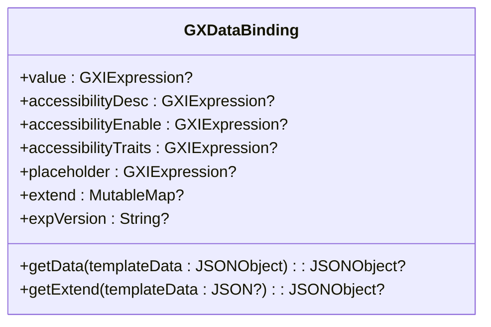

**图表来源**
- [GXDataBinding.kt](file://GaiaXAndroid/src/main/kotlin/com/alibaba/gaiax/template/GXDataBinding.kt#L26-L105)

### GXViewTreeUpdate机制
GXViewTreeUpdate类负责视图树的更新操作，继承自GXViewTreeMerger。它通过`getChildLayout`和`getRootLayout`方法获取子节点和根节点的布局信息，并通过`withRootView`和`withChildView`方法更新视图的位置和大小。

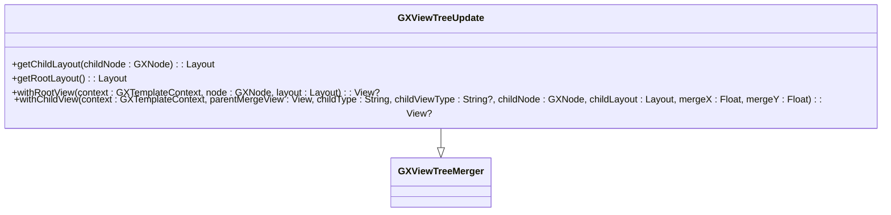

**图表来源**
- [GXViewTreeUpdate.kt](file://GaiaXAndroid/src/main/kotlin/com/alibaba/gaiax/render/view/GXViewTreeUpdate.kt#L28-L81)

**本节来源**
- [GXDataBinding.kt](file://GaiaXAndroid/src/main/kotlin/com/alibaba/gaiax/template/GXDataBinding.kt#L26-L105)
- [GXViewTreeUpdate.kt](file://GaiaXAndroid/src/main/kotlin/com/alibaba/gaiax/render/view/GXViewTreeUpdate.kt#L28-L81)

## 数据变更检测

### 变更检测流程
数据变更检测是增量更新的第一步，主要通过比较新旧数据来识别发生变化的部分。在GaiaX中，这一过程由GXNodeTreeUpdate类的`buildNodeLayout`和`buildViewStyleAndData`方法协同完成。

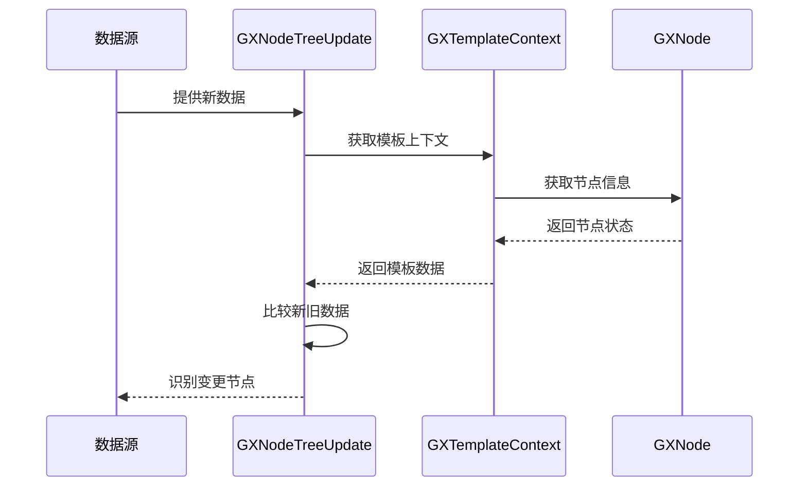

**图表来源**
- [GXNodeTreeUpdate.kt](file://GaiaXAndroid/src/main/kotlin/com/alibaba/gaiax/render/node/GXNodeTreeUpdate.kt#L73-L1322)
- [GXTemplateContext.kt](file://GaiaXAndroid/src/main/kotlin/com/alibaba/gaiax/context/GXTemplateContext.kt#L35-L253)

### 脏检查机制
GaiaX采用脏检查机制来标记需要更新的节点。当某个节点的数据发生改变时，会将其标记为"脏"状态，后续的更新操作将只针对这些被标记的节点。

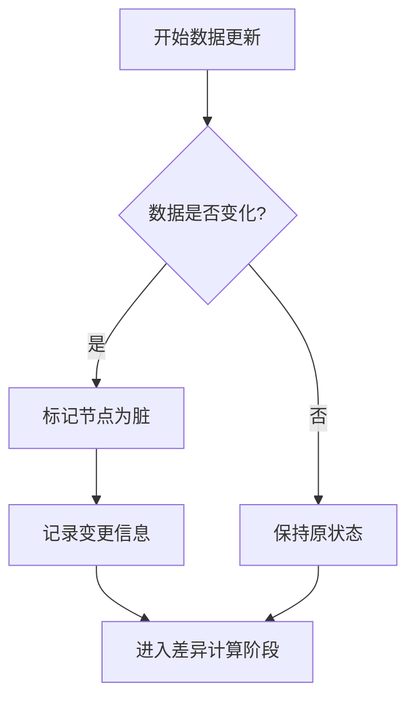

**图表来源**
- [GXNode.kt](file://GaiaXAndroid/src/main/kotlin/com/alibaba/gaiax/render/node/GXNode.kt#L34-L222)
- [GXTemplateContext.kt](file://GaiaXAndroid/src/main/kotlin/com/alibaba/gaiax/context/GXTemplateContext.kt#L35-L253)

**本节来源**
- [GXNodeTreeUpdate.kt](file://GaiaXAndroid/src/main/kotlin/com/alibaba/gaiax/render/node/GXNodeTreeUpdate.kt#L73-L1322)
- [GXTemplateContext.kt](file://GaiaXAndroid/src/main/kotlin/com/alibaba/gaiax/context/GXTemplateContext.kt#L35-L253)
- [GXNode.kt](file://GaiaXAndroid/src/main/kotlin/com/alibaba/gaiax/render/node/GXNode.kt#L34-L222)

## 差异计算与局部渲染

### 差异计算算法
差异计算是增量更新的核心环节，其目标是找出新旧视图树之间的最小差异集。GaiaX通过比较节点树的结构和属性来实现这一目标。

```mermaid
classDiagram
class GXNodeTreeUpdate {
+buildNodeLayout(gxTemplateContext : GXTemplateContext)
+buildViewStyleAndData(gxTemplateContext : GXTemplateContext)
+resetView(gxTemplateContext : GXTemplateContext)
}
class Layout {
+updateNodeTreeLayout(gxTemplateContext : GXTemplateContext, gxNode : GXNode, templateData : JSONObject, size : Size<Float?>)
+updateNodeTreeLayoutByDirtyText(gxTemplateContext : GXTemplateContext, rootNode : GXNode, size : Size<Float?>)
+updateNodeLayout(gxTemplateContext : GXNode, templateData : JSONObject)
+updateContainerLayout(gxTemplateContext : GXTemplateContext, gxNode : GXNode, templateData : JSONObject) : Boolean
+updateNormalLayout(gxTemplateContext : GXTemplateContext, gxNode : GXNode, templateData : JSONObject) : Boolean
}
GXNodeTreeUpdate : : Layout --|> GXNodeTreeUpdate
```

**图表来源**
- [GXNodeTreeUpdate.kt](file://GaiaXAndroid/src/main/kotlin/com/alibaba/gaiax/render/node/GXNodeTreeUpdate.kt#L73-L1322)

### 局部渲染流程
局部渲染是将差异计算的结果应用到UI上的过程。GXViewTreeUpdate通过`withChildView`方法更新特定节点的布局参数，从而实现局部刷新。

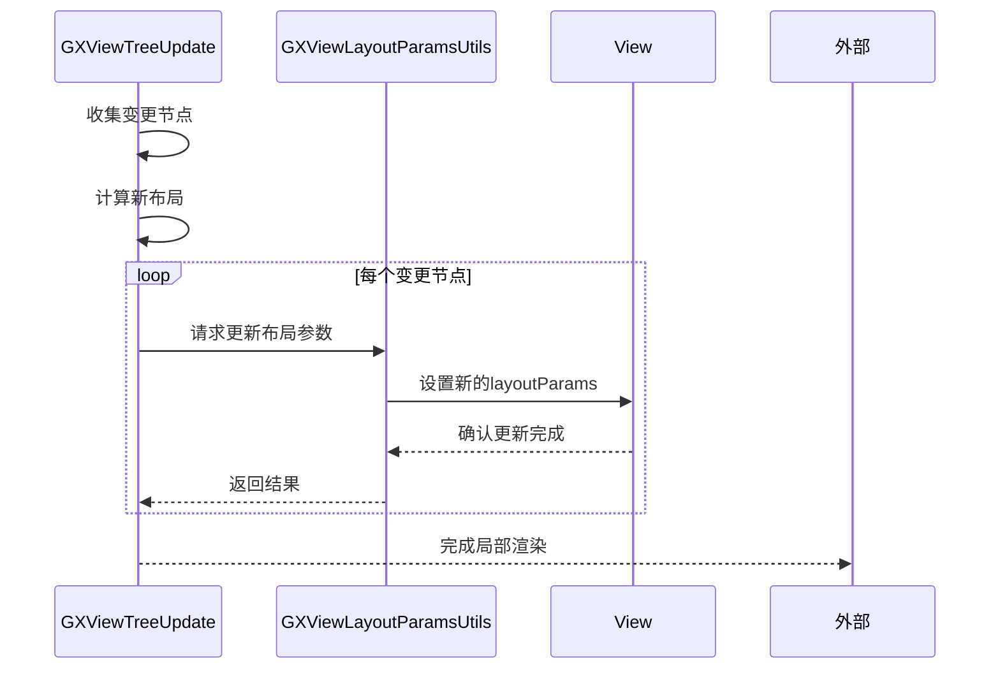

**图表来源**
- [GXViewTreeUpdate.kt](file://GaiaXAndroid/src/main/kotlin/com/alibaba/gaiax/render/view/GXViewTreeUpdate.kt#L28-L81)
- [GXViewLayoutParamsUtils.kt](file://GaiaXAndroid/src/main/kotlin/com/alibaba/gaiax/render/view/GXViewLayoutParamsUtils.kt#L27-L75)

**本节来源**
- [GXNodeTreeUpdate.kt](file://GaiaXAndroid/src/main/kotlin/com/alibaba/gaiax/render/node/GXNodeTreeUpdate.kt#L73-L1322)
- [GXViewTreeUpdate.kt](file://GaiaXAndroid/src/main/kotlin/com/alibaba/gaiax/render/view/GXViewTreeUpdate.kt#L28-L81)
- [GXViewLayoutParamsUtils.kt](file://GaiaXAndroid/src/main/kotlin/com/alibaba/gaiax/render/view/GXViewLayoutParamsUtils.kt#L27-L75)

## 性能优化点

### 减少视图重建
通过复用已存在的视图对象，避免频繁创建和销毁视图，从而减少内存分配和垃圾回收的压力。

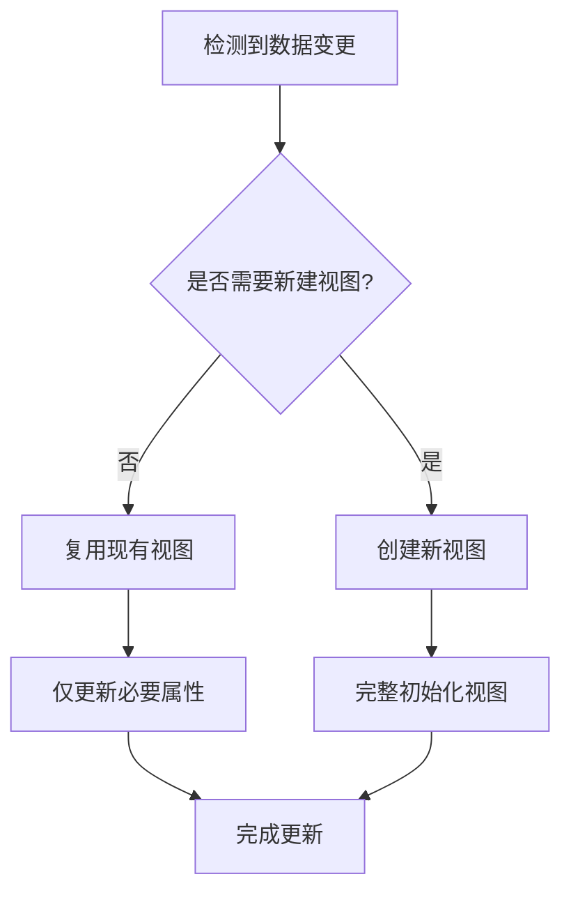

### 利用变化通知机制
通过观察者模式，当数据源发生变化时，直接通知相关的视图组件进行更新，避免了周期性的全量检查。

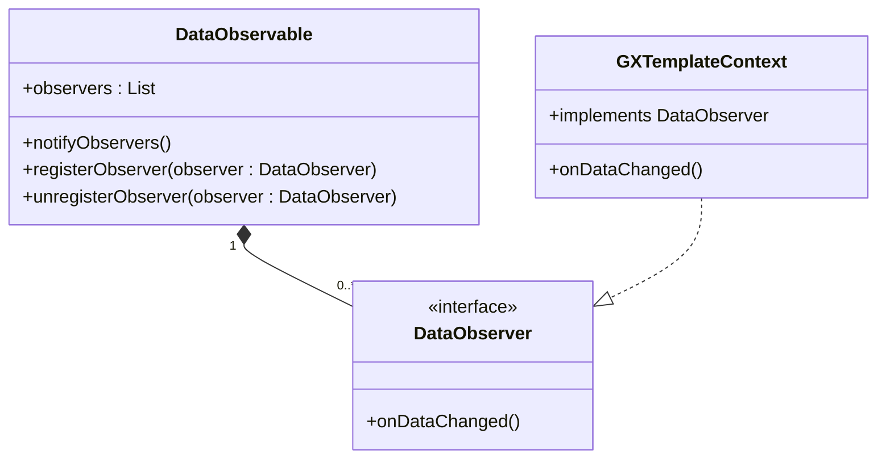

**本节来源**
- [GXTemplateContext.kt](file://GaiaXAndroid/src/main/kotlin/com/alibaba/gaiax/context/GXTemplateContext.kt#L35-L253)
- [GXNode.kt](file://GaiaXAndroid/src/main/kotlin/com/alibaba/gaiax/render/node/GXNode.kt#L34-L222)

## 初学者实践指南

### 使用唯一标识符
为每个可更新的元素分配唯一的标识符，便于精确追踪和更新特定元素。

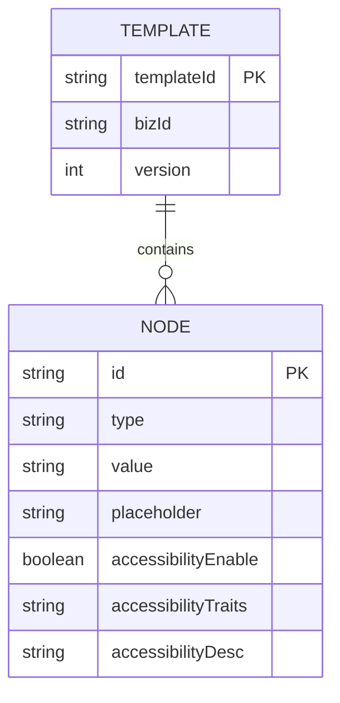

### 合理划分数据区域
将数据划分为不同的逻辑区域，每个区域独立管理自己的更新逻辑，降低整体复杂度。

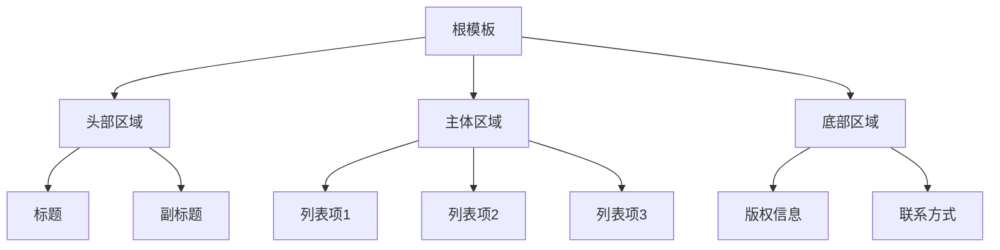

**本节来源**
- [GXTemplateKey.kt](file://GaiaXAndroid/src/main/kotlin/com/alibaba/gaiax/template/GXTemplateKey.kt#L24-L461)
- [GXTemplateInfo.kt](file://GaiaXAndroid/src/main/kotlin/com/alibaba/gaiax/template/GXTemplateInfo.kt#L32-L417)

## 高级开发者技巧

### 自定义diff算法
对于特定场景，可以实现自定义的差异计算算法，以获得更优的性能表现。

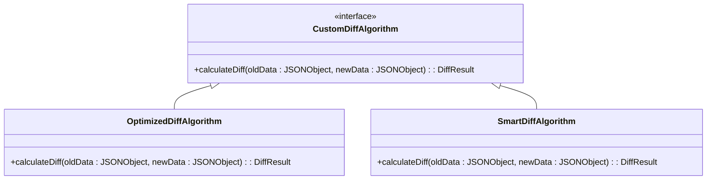

### 批量更新合并
将多个小的更新操作合并为一次大的批量更新，减少UI重绘次数。

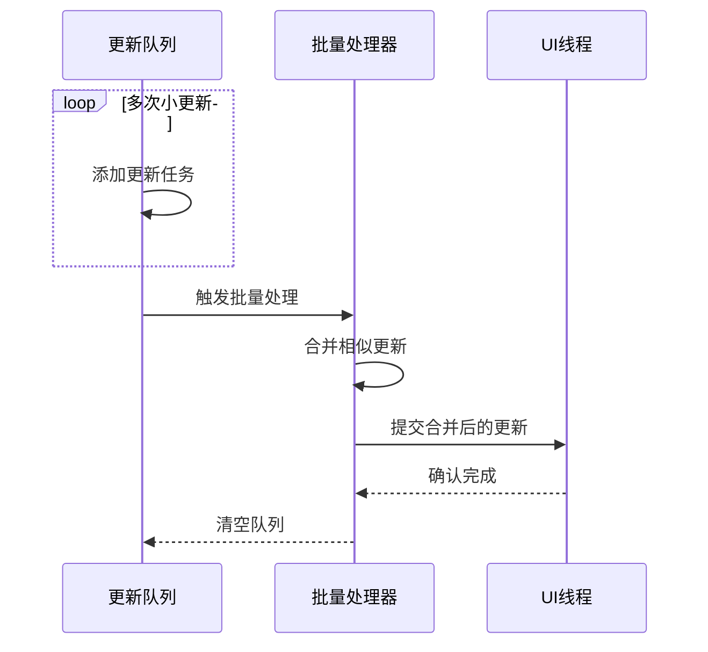

### 更新队列优化
通过优先级队列管理更新任务，确保关键更新能够及时执行。

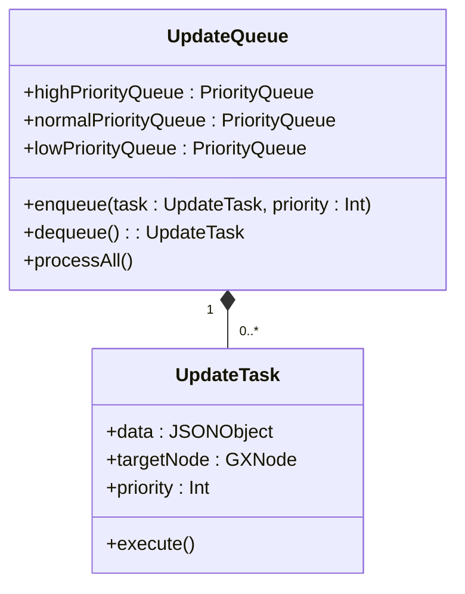

**本节来源**
- [GXViewTreeMerger.kt](file://GaiaXAndroid/src/main/kotlin/com/alibaba/gaiax/render/view/GXViewTreeMerger.kt#L38-L155)
- [GXTemplateContext.kt](file://GaiaXAndroid/src/main/kotlin/com/alibaba/gaiax/context/GXTemplateContext.kt#L35-L253)

## 实际应用场景

### 列表数据高效更新
处理列表数据时，通过唯一标识符匹配新旧数据，仅更新发生变化的项目。

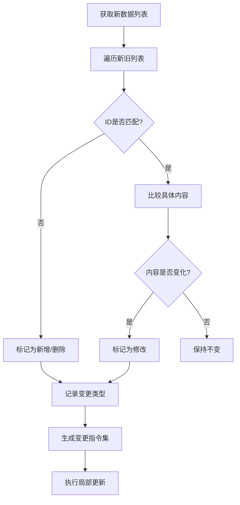

**本节来源**
- [GXNodeTreeUpdate.kt](file://GaiaXAndroid/src/main/kotlin/com/alibaba/gaiax/render/node/GXNodeTreeUpdate.kt#L73-L1322)
- [GXViewTreeUpdate.kt](file://GaiaXAndroid/src/main/kotlin/com/alibaba/gaiax/render/view/GXViewTreeUpdate.kt#L28-L81)

## 结论
GaiaX框架的增量更新策略通过GXDataBinding和GXViewTreeUpdate的协同工作，实现了高效的局部数据更新。通过对数据变更的精确检测、智能的差异计算以及优化的局部渲染，显著提升了界面更新的性能。初学者应掌握使用唯一标识符和合理划分数据区域的基本方法，而高级开发者则可以利用自定义diff算法、批量更新合并和更新队列优化等高级技巧来进一步提升应用性能。