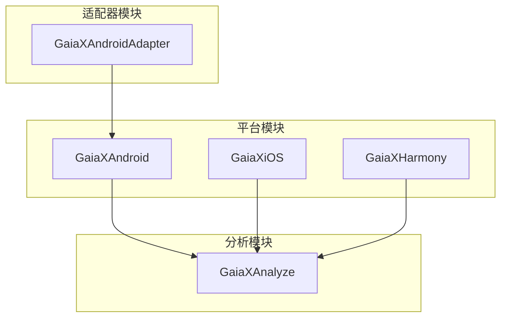
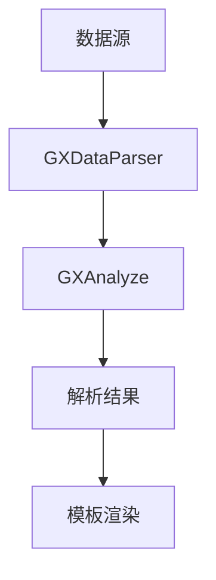
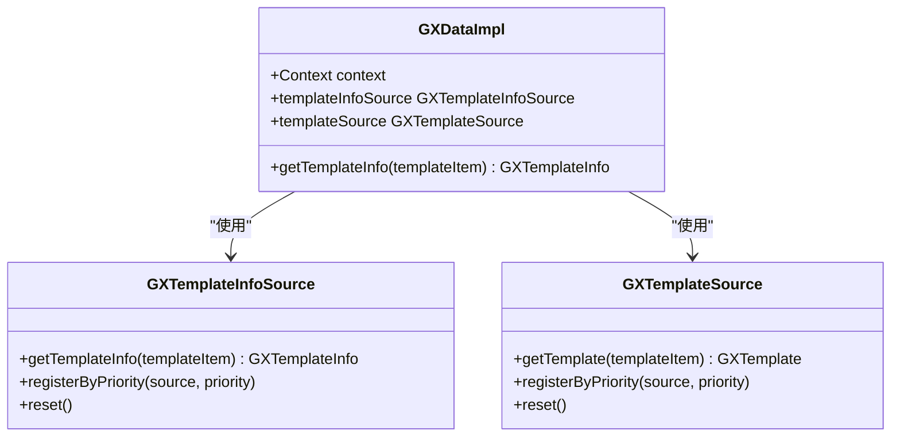
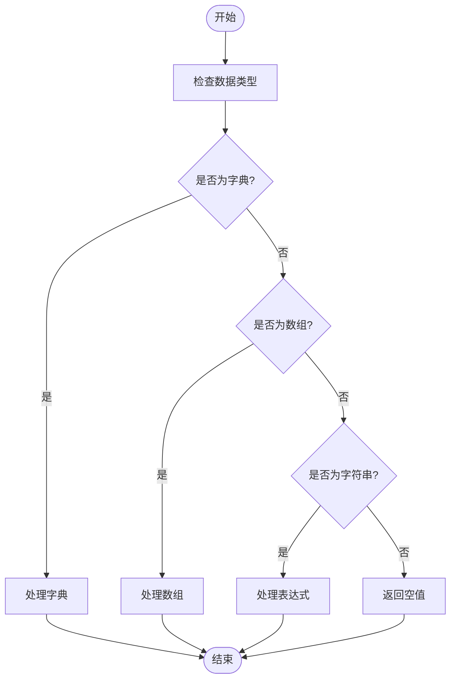
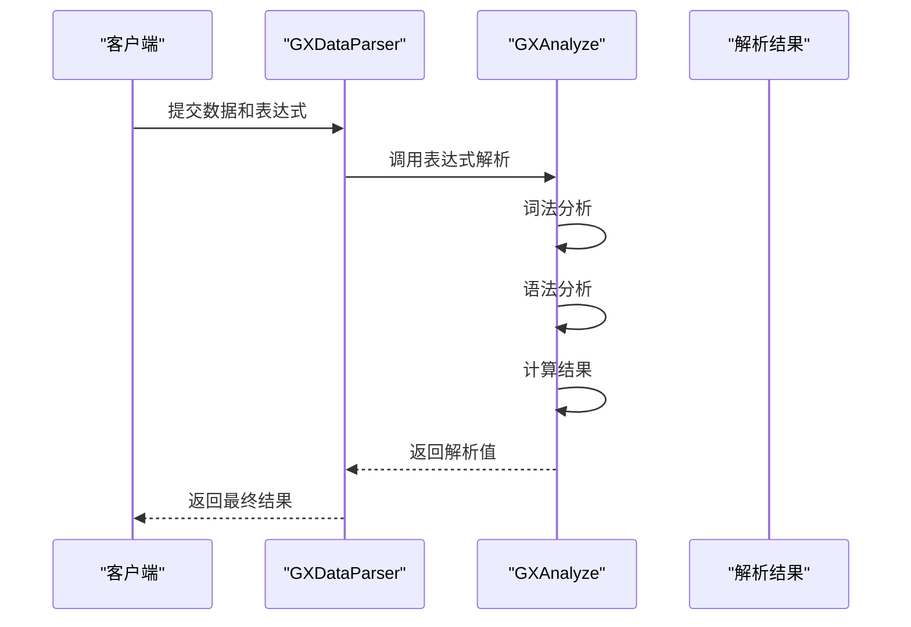
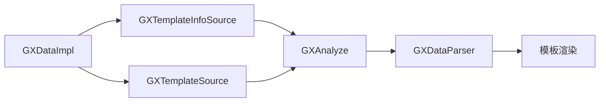

# 数据解析优化

<cite>
**本文档引用文件**   
- [GXDataImpl.kt](file://GaiaXAndroid/src/main/kotlin/com/alibaba/gaiax/data/GXDataImpl.kt)
- [GXDataParser.m](file://GaiaXiOS/GaiaXiOS/Binding/Data/GXDataParser.m)
- [GXDataParser.ets](file://GaiaXHarmony/GaiaXCore/GaiaX/src/main/ets/binding/GXDataParser.ets)
- [GXAnalyze.kt](file://GaiaXAnalyze/GXAnalyzeAndroid/src/main/java/com/alibaba/gaiax/analyze/GXAnalyze.kt)
- [GXAnalyze.h](file://GaiaXAnalyze/GXAnalyzeAndroid/src/main/cpp/GXAnalyzeCore/GXAnalyze.h)
- [GXWordAnalyze.cpp](file://GaiaXAnalyze/GXAnalyzeAndroid/src/main/cpp/GXAnalyzeCore/GXWordAnalyze.cpp)
</cite>

## 目录
1. [引言](#引言)
2. [项目结构](#项目结构)
3. [核心组件](#核心组件)
4. [架构概述](#架构概述)
5. [详细组件分析](#详细组件分析)
6. [依赖分析](#依赖分析)
7. [性能考虑](#性能考虑)
8. [故障排除指南](#故障排除指南)
9. [结论](#结论)

## 引言
本文档旨在为GaiaX框架的数据解析性能优化提供详细的指导。重点介绍如何提升数据解析阶段的效率，基于GXDataImpl的实现机制，深入分析JSON数据解析、类型转换和数据结构构建过程中的性能瓶颈。为初学者提供避免重复解析、合理使用数据预处理的基本方法，为高级开发者提供自定义解析器、流式解析和数据结构扁平化的高级技巧。

## 项目结构
GaiaX框架的项目结构包含多个模块，分别针对不同的平台和功能。主要模块包括GaiaXAndroid、GaiaXiOS、GaiaXHarmony等，每个模块都有其特定的实现和优化策略。

**图表来源**
- [GXDataImpl.kt](file://GaiaXAndroid/src/main/kotlin/com/alibaba/gaiax/data/GXDataImpl.kt)
- [GXDataParser.m](file://GaiaXiOS/GaiaXiOS/Binding/Data/GXDataParser.m)
- [GXDataParser.ets](file://GaiaXHarmony/GaiaXCore/GaiaX/src/main/ets/binding/GXDataParser.ets)

**章节来源**
- [GXDataImpl.kt](file://GaiaXAndroid/src/main/kotlin/com/alibaba/gaiax/data/GXDataImpl.kt)
- [project_structure](file://project_structure)

## 核心组件
核心组件包括GXDataImpl、GXDataParser和GXAnalyze。这些组件负责数据解析、表达式计算和性能优化。

**章节来源**
- [GXDataImpl.kt](file://GaiaXAndroid/src/main/kotlin/com/alibaba/gaiax/data/GXDataImpl.kt)
- [GXDataParser.m](file://GaiaXiOS/GaiaXiOS/Binding/Data/GXDataParser.m)
- [GXDataParser.ets](file://GaiaXHarmony/GaiaXCore/GaiaX/src/main/ets/binding/GXDataParser.ets)

## 架构概述
GaiaX框架的架构设计旨在提供高效的数据解析和表达式计算能力。通过模块化设计，各组件可以独立优化和扩展。

**图表来源**
- [GXDataParser.m](file://GaiaXiOS/GaiaXiOS/Binding/Data/GXDataParser.m)
- [GXAnalyze.kt](file://GaiaXAnalyze/GXAnalyzeAndroid/src/main/java/com/alibaba/gaiax/analyze/GXAnalyze.kt)

## 详细组件分析

### GXDataImpl 分析
GXDataImpl是Android平台上的核心数据处理类，负责模板信息的获取和数据源的管理。

**图表来源**
- [GXDataImpl.kt](file://GaiaXAndroid/src/main/kotlin/com/alibaba/gaiax/data/GXDataImpl.kt)

**章节来源**
- [GXDataImpl.kt](file://GaiaXAndroid/src/main/kotlin/com/alibaba/gaiax/data/GXDataImpl.kt)

### GXDataParser 分析
GXDataParser负责解析数据绑定表达式，支持多种数据类型和嵌套结构。

**图表来源**
- [GXDataParser.m](file://GaiaXiOS/GaiaXiOS/Binding/Data/GXDataParser.m)
- [GXDataParser.ets](file://GaiaXHarmony/GaiaXCore/GaiaX/src/main/ets/binding/GXDataParser.ets)

**章节来源**
- [GXDataParser.m](file://GaiaXiOS/GaiaXiOS/Binding/Data/GXDataParser.m)
- [GXDataParser.ets](file://GaiaXHarmony/GaiaXCore/GaiaX/src/main/ets/binding/GXDataParser.ets)

### GXAnalyze 分析
GXAnalyze是表达式解析的核心组件，支持复杂的表达式计算和函数调用。

**图表来源**
- [GXAnalyze.kt](file://GaiaXAnalyze/GXAnalyzeAndroid/src/main/java/com/alibaba/gaiax/analyze/GXAnalyze.kt)
- [GXAnalyze.h](file://GaiaXAnalyze/GXAnalyzeAndroid/src/main/cpp/GXAnalyzeCore/GXAnalyze.h)

**章节来源**
- [GXAnalyze.kt](file://GaiaXAnalyze/GXAnalyzeAndroid/src/main/java/com/alibaba/gaiax/analyze/GXAnalyze.kt)

## 依赖分析
GaiaX框架的各个组件之间存在明确的依赖关系，通过合理的依赖管理确保系统的稳定性和可维护性。

**图表来源**
- [GXDataImpl.kt](file://GaiaXAndroid/src/main/kotlin/com/alibaba/gaiax/data/GXDataImpl.kt)
- [GXAnalyze.kt](file://GaiaXAnalyze/GXAnalyzeAndroid/src/main/java/com/alibaba/gaiax/analyze/GXAnalyze.kt)

**章节来源**
- [GXDataImpl.kt](file://GaiaXAndroid/src/main/kotlin/com/alibaba/gaiax/data/GXDataImpl.kt)
- [GXAnalyze.kt](file://GaiaXAnalyze/GXAnalyzeAndroid/src/main/java/com/alibaba/gaiax/analyze/GXAnalyze.kt)

## 性能考虑
在数据解析过程中，性能优化是关键。通过避免重复解析、合理使用数据预处理、自定义解析器、流式解析和数据结构扁平化等技巧，可以显著提升解析速度。

**章节来源**
- [GXDataImpl.kt](file://GaiaXAndroid/src/main/kotlin/com/alibaba/gaiax/data/GXDataImpl.kt)
- [GXDataParser.m](file://GaiaXiOS/GaiaXiOS/Binding/Data/GXDataParser.m)
- [GXAnalyze.kt](file://GaiaXAnalyze/GXAnalyzeAndroid/src/main/java/com/alibaba/gaiax/analyze/GXAnalyze.kt)

## 故障排除指南
在数据解析过程中可能遇到各种问题，如数据格式不支持、表达式解析错误等。通过日志记录和调试工具可以快速定位和解决问题。

**章节来源**
- [GXDataParser.m](file://GaiaXiOS/GaiaXiOS/Binding/Data/GXDataParser.m)
- [GXAnalyze.kt](file://GaiaXAnalyze/GXAnalyzeAndroid/src/main/java/com/alibaba/gaiax/analyze/GXAnalyze.kt)

## 结论
本文档详细介绍了GaiaX框架的数据解析性能优化方法，涵盖了从基础到高级的各种技巧。通过合理使用这些方法，可以显著提升数据解析的效率和性能。