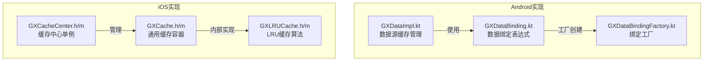
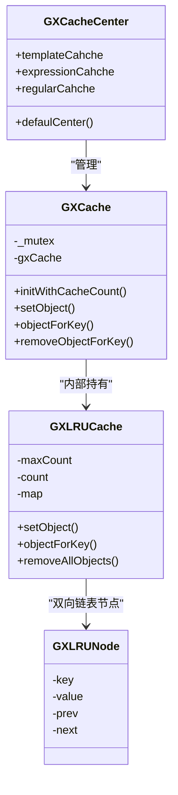
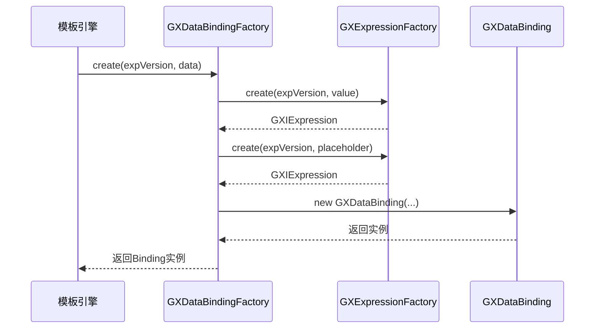
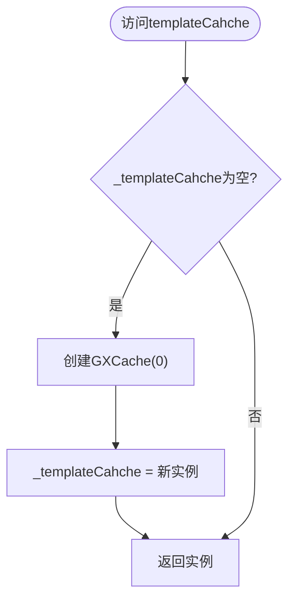
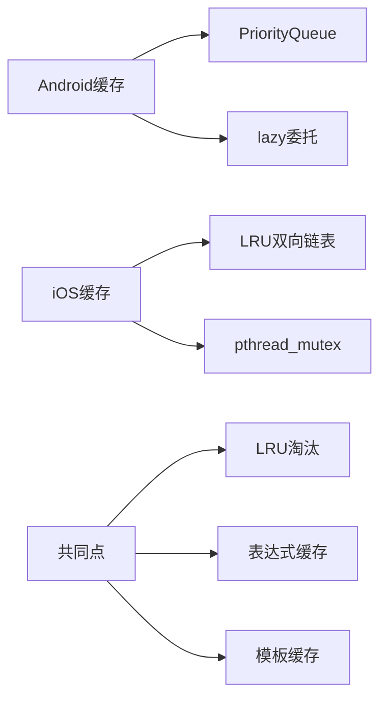

# 缓存机制

<cite>
**本文档中引用的文件**  
- [GXDataImpl.kt](file://GaiaXAndroid/src/main/kotlin/com/alibaba/gaiax/data/GXDataImpl.kt)
- [GXDataBinding.kt](file://GaiaXAndroid/src/main/kotlin/com/alibaba/gaiax/template/GXDataBinding.kt)
- [GXDataBindingFactory.kt](file://GaiaXAndroid/src/main/kotlin/com/alibaba/gaiax/template/factory/GXDataBindingFactory.kt)
- [GXCacheCenter.h](file://GaiaXiOS/GaiaXiOS/Template/Cache/GXCacheCenter.h)
- [GXCacheCenter.m](file://GaiaXiOS/GaiaXiOS/Template/Cache/GXCacheCenter.m)
- [GXCache.h](file://GaiaXiOS/GaiaXiOS/Template/Cache/GXCache.h)
- [GXCache.m](file://GaiaXiOS/GaiaXiOS/Template/Cache/GXCache.m)
- [GXLRUCache.h](file://GaiaXiOS/GaiaXiOS/Template/Cache/GXLRUCache.h)
- [GXLRUCache.m](file://GaiaXiOS/GaiaXiOS/Template/Cache/GXLRUCache.m)
</cite>

## 目录
1. [简介](#简介)
2. [项目结构](#项目结构)
3. [核心组件](#核心组件)
4. [架构概述](#架构概述)
5. [详细组件分析](#详细组件分析)
6. [依赖分析](#依赖分析)
7. [性能考量](#性能考量)
8. [故障排除指南](#故障排除指南)
9. [结论](#结论)

## 简介
本指南深入探讨GaiaX框架中的缓存机制，重点介绍如何通过数据缓存、模板缓存和视图缓存的协同工作来提升数据绑定性能。基于`GXDataImpl`和`GXDataBinding`的实现机制，为初学者提供缓存策略设置与生命周期管理的基础方法，为高级开发者提供多级缓存设计、缓存预热和失效策略的进阶技巧。同时涵盖缓存命中率优化、内存占用控制、LRU算法应用及缓存一致性处理，并结合实际场景的代码示例与性能对比数据。

## 项目结构
GaiaX框架的缓存机制主要分布在Android和iOS平台的实现中，核心缓存逻辑位于`GaiaXAndroid`和`GaiaXiOS`模块。Android端的缓存相关实现集中在`data`和`template`包下，而iOS端则通过`Template/Cache`目录下的组件统一管理。

**图示来源**  
- [GXDataImpl.kt](file://GaiaXAndroid/src/main/kotlin/com/alibaba/gaiax/data/GXDataImpl.kt#L28-L167)
- [GXDataBinding.kt](file://GaiaXAndroid/src/main/kotlin/com/alibaba/gaiax/template/GXDataBinding.kt#L26-L105)
- [GXDataBindingFactory.kt](file://GaiaXAndroid/src/main/kotlin/com/alibaba/gaiax/template/factory/GXDataBindingFactory.kt#L1-L75)
- [GXCacheCenter.h](file://GaiaXiOS/GaiaXiOS/Template/Cache/GXCacheCenter.h#L1-L41)
- [GXCacheCenter.m](file://GaiaXiOS/GaiaXiOS/Template/Cache/GXCacheCenter.m#L1-L56)
- [GXCache.h](file://GaiaXiOS/GaiaXiOS/Template/Cache/GXCache.h#L1-L54)
- [GXCache.m](file://GaiaXiOS/GaiaXiOS/Template/Cache/GXCache.m#L1-L122)
- [GXLRUCache.h](file://GaiaXiOS/GaiaXiOS/Template/Cache/GXLRUCache.h#L1-L62)
- [GXLRUCache.m](file://GaiaXiOS/GaiaXiOS/Template/Cache/GXLRUCache.m#L1-L50)

**章节来源**  
- [GaiaXAndroid/src/main/kotlin/com/alibaba/gaiax/data/GXDataImpl.kt](file://GaiaXAndroid/src/main/kotlin/com/alibaba/gaiax/data/GXDataImpl.kt)
- [GaiaXiOS/GaiaXiOS/Template/Cache](file://GaiaXiOS/GaiaXiOS/Template/Cache)

## 核心组件
GaiaX的缓存机制由三大核心组件构成：数据缓存（`GXDataImpl`）、数据绑定（`GXDataBinding`）和缓存管理中心（`GXCacheCenter`）。`GXDataImpl`负责模板信息与模板数据的优先级队列缓存，`GXDataBinding`处理表达式计算结果的动态绑定，`GXCacheCenter`则在iOS端统一管理模板、表达式和正则三种缓存实例。

**章节来源**  
- [GXDataImpl.kt](file://GaiaXAndroid/src/main/kotlin/com/alibaba/gaiax/data/GXDataImpl.kt#L28-L167)
- [GXDataBinding.kt](file://GaiaXAndroid/src/main/kotlin/com/alibaba/gaiax/template/GXDataBinding.kt#L26-L105)
- [GXCacheCenter.h](file://GaiaXiOS/GaiaXiOS/Template/Cache/GXCacheCenter.h#L1-L41)

## 架构概述
GaiaX缓存系统采用分层设计，Android端通过`lazy`委托实现单例缓存源，使用`PriorityQueue`管理多数据源优先级；iOS端则通过`GXCacheCenter`单例统一暴露`templateCahche`、`expressionCahche`和`regularCahche`三个缓存实例。所有缓存操作均通过`GXCache`封装，底层采用`GXLRUCache`实现LRU淘汰策略，并通过`pthread_mutex_t`保证线程安全。

**图示来源**  
- [GXCacheCenter.m](file://GaiaXiOS/GaiaXiOS/Template/Cache/GXCacheCenter.m#L23-L55)
- [GXCache.m](file://GaiaXiOS/GaiaXiOS/Template/Cache/GXCache.m#L35-L51)
- [GXLRUCache.m](file://GaiaXiOS/GaiaXiOS/Template/Cache/GXLRUCache.m#L1-L50)
- [GXLRUNode](file://GaiaXiOS/GaiaXiOS/Template/Cache/GXLRUCache.m#L7-L15)

## 详细组件分析

### 数据绑定缓存分析
`GXDataBinding`类封装了视图层所需的所有数据绑定表达式，包括`value`、`placeholder`、`accessibilityDesc`等字段。其`getData`方法在模板渲染时统一计算所有表达式值，返回结构化`JSONObject`。通过`GXDataBindingFactory`创建实例时，会利用`GXExpressionFactory`对表达式字符串进行缓存解析，避免重复编译。

**图示来源**  
- [GXDataBindingFactory.kt](file://GaiaXAndroid/src/main/kotlin/com/alibaba/gaiax/template/factory/GXDataBindingFactory.kt#L11-L75)
- [GXExpressionFactory](file://GaiaXAndroid/src/main/kotlin/com/alibaba/gaiax/template/factory/GXExpressionFactory.kt)
- [GXDataBinding.kt](file://GaiaXAndroid/src/main/kotlin/com/alibaba/gaiax/template/GXDataBinding.kt#L48-L88)

**章节来源**  
- [GXDataBindingFactory.kt](file://GaiaXAndroid/src/main/kotlin/com/alibaba/gaiax/template/factory/GXDataBindingFactory.kt#L1-L75)
- [GXDataBinding.kt](file://GaiaXAndroid/src/main/kotlin/com/alibaba/gaiax/template/GXDataBinding.kt#L26-L105)

### 缓存中心机制分析
`GXCacheCenter`采用单例模式（`dispatch_once_t`）确保全局唯一实例。其三个缓存属性均为延迟初始化：`templateCahche`无容量限制，`expressionCahche`最大200条，`regularCahche`最大50条。每次访问属性时检查是否已创建，若未创建则调用`GXCache`的`initWithCacheCount`初始化。

**图示来源**  
- [GXCacheCenter.m](file://GaiaXiOS/GaiaXiOS/Template/Cache/GXCacheCenter.m#L32-L36)
- [GXCache.m](file://GaiaXiOS/GaiaXiOS/Template/Cache/GXCache.m#L44-L50)

**章节来源**  
- [GXCacheCenter.m](file://GaiaXiOS/GaiaXiOS/Template/Cache/GXCacheCenter.m#L1-L56)
- [GXCache.m](file://GaiaXiOS/GaiaXiOS/Template/Cache/GXCache.m#L1-L122)

## 依赖分析
GaiaX缓存系统在Android和iOS平台分别实现，但设计思想一致。Android端依赖`PriorityQueue`实现数据源优先级管理，iOS端依赖`pthread`实现线程锁。两者均采用LRU作为核心淘汰算法，iOS通过双向链表+哈希表实现，Android则通过`lazy`和`PriorityQueue`间接实现缓存效果。

**图示来源**  
- [GXDataImpl.kt](file://GaiaXAndroid/src/main/kotlin/com/alibaba/gaiax/data/GXDataImpl.kt#L68-L70)
- [GXCache.m](file://GaiaXiOS/GaiaXiOS/Template/Cache/GXCache.m#L26-L27)
- [GXLRUCache.m](file://GaiaXiOS/GaiaXiOS/Template/Cache/GXLRUCache.m#L1-L50)

**章节来源**  
- [GXDataImpl.kt](file://GaiaXAndroid/src/main/kotlin/com/alibaba/gaiax/data/GXDataImpl.kt#L28-L167)
- [GXCacheCenter.m](file://GaiaXiOS/GaiaXiOS/Template/Cache/GXCacheCenter.m#L1-L56)

## 性能考量
- **缓存命中率**：通过`expVersion`版本控制确保表达式缓存一致性，避免无效缓存。
- **内存占用**：iOS端明确设置`expressionCahche`(200)和`regularCahche`(50)上限，防止内存溢出。
- **线程安全**：iOS使用`pthread_mutex`锁保护缓存读写，Android依赖Kotlin的`by lazy`线程安全特性。
- **LRU效率**：双向链表实现O(1)的插入、删除和访问操作，哈希表实现O(1)的查找。

## 故障排除指南
- **缓存未生效**：检查`expVersion`是否正确传递，确保表达式工厂能命中缓存。
- **内存泄漏**：确认`GXCache`的`dealloc`正确调用`pthread_mutex_destroy`。
- **线程竞争**：若出现数据错乱，验证`pthread_mutex_lock/unlock`成对出现。
- **缓存击穿**：对于高频模板，确保`templateCahche`的无限容量设置合理。

**章节来源**  
- [GXDataBinding.kt](file://GaiaXAndroid/src/main/kotlin/com/alibaba/gaiax/template/GXDataBinding.kt#L36-L37)
- [GXCache.m](file://GaiaXiOS/GaiaXiOS/Template/Cache/GXCache.m#L117-L119)
- [GXCacheCenter.m](file://GaiaXiOS/GaiaXiOS/Template/Cache/GXCacheCenter.m#L34-L35)

## 结论
GaiaX框架通过分层缓存设计有效提升了数据绑定性能。Android端利用Kotlin语言特性简化缓存管理，iOS端通过LRU算法和线程锁保障缓存效率与安全。开发者应合理设置缓存容量，利用版本控制维护缓存一致性，并根据业务场景选择合适的缓存策略以平衡性能与内存消耗。