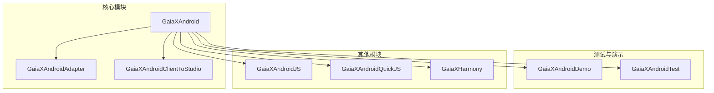
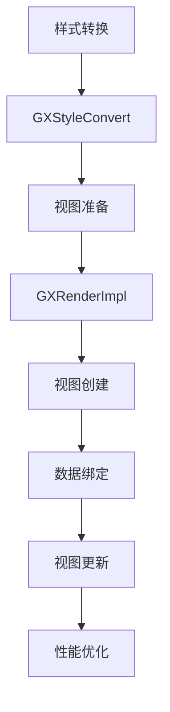
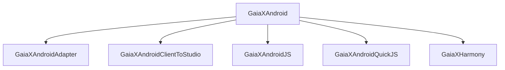

# GPU加速

<cite>
**本文档引用的文件**   
- [GXRenderImpl.kt](file://GaiaXAndroid/src/main/kotlin/com/alibaba/gaiax/render/GXRenderImpl.kt)
- [GXStyleConvert.kt](file://GaiaXAndroid/src/main/kotlin/com/alibaba/gaiax/template/GXStyleConvert.kt)
- [GXNodeTreeUpdate.kt](file://GaiaXAndroid/src/main/kotlin/com/alibaba/gaiax/render/node/GXNodeTreeUpdate.kt)
- [GXSize.kt](file://GaiaXAndroid/src/main/kotlin/com/alibaba/gaiax/template/GXSize.kt)
- [GXColor.kt](file://GaiaXAndroid/src/main/kotlin/com/alibaba/gaiax/template/GXColor.kt)
- [GXBoxShadow.kt](file://GaiaXAndroid/src/main/kotlin/com/alibaba/gaiax/template/GXBoxShadow.kt)
- [GXLinearColor.kt](file://GaiaXAndroid/src/main/kotlin/com/alibaba/gaiax/template/GXLinearColor.kt)
- [GXRoundedCorner.kt](file://GaiaXAndroid/src/main/kotlin/com/alibaba/gaiax/template/GXRoundedCorner.kt)
- [GXBackdropFilter.kt](file://GaiaXAndroid/src/main/kotlin/com/alibaba/gaiax/template/GXBackdropFilter.kt)
- [GXMode.kt](file://GaiaXAndroid/src/main/kotlin/com/alibaba/gaiax/template/GXMode.kt)
</cite>

## 目录
1. [简介](#简介)
2. [项目结构](#项目结构)
3. [核心组件](#核心组件)
4. [架构概述](#架构概述)
5. [详细组件分析](#详细组件分析)
6. [依赖分析](#依赖分析)
7. [性能考虑](#性能考虑)
8. [故障排除指南](#故障排除指南)
9. [结论](#结论)
10. [附录](#附录)（如有必要）

## 简介
本文档旨在为GaiaX框架中的GPU加速渲染提供详尽的指导，重点介绍如何利用硬件加速来提升复杂动画和视觉效果的渲染性能。通过深入分析`GXRenderImpl`的实现，我们将探讨Android视图的硬件加速机制在GaiaX中的应用，以及如何通过合理使用图层和避免过度绘制来优化GPU性能。文档将为初学者提供启用硬件加速的基本配置方法和常见注意事项，同时为高级开发者提供自定义图层策略、离屏渲染优化和混合模式控制的进阶技巧。此外，还将详细说明如何优化阴影、圆角、透明度等视觉效果的GPU渲染性能，以及如何通过`GXStyleConvert`的样式转换机制实现高效的GPU加速。

## 项目结构
GaiaX框架的项目结构清晰地划分了不同模块的功能，确保了代码的可维护性和扩展性。主要模块包括`GaiaXAndroid`、`GaiaXAndroidAdapter`、`GaiaXAndroidClientToStudio`等，每个模块都有其特定的职责。`GaiaXAndroid`模块负责核心渲染逻辑，`GaiaXAndroidAdapter`模块提供了适配器支持，而`GaiaXAndroidClientToStudio`模块则用于与开发工具的集成。



**图源**
- [GXRenderImpl.kt](file://GaiaXAndroid/src/main/kotlin/com/alibaba/gaiax/render/GXRenderImpl.kt)
- [GXStyleConvert.kt](file://GaiaXAndroid/src/main/kotlin/com/alibaba/gaiax/template/GXStyleConvert.kt)

**节源**
- [GXRenderImpl.kt](file://GaiaXAndroid/src/main/kotlin/com/alibaba/gaiax/render/GXRenderImpl.kt)
- [GXStyleConvert.kt](file://GaiaXAndroid/src/main/kotlin/com/alibaba/gaiax/template/GXStyleConvert.kt)

## 核心组件
### GXRenderImpl
`GXRenderImpl`是GaiaX框架中负责渲染的核心类，它通过一系列方法实现了视图的准备、创建、绑定和重置。这些方法包括`prepareView`、`createViewOnlyNodeTree`、`createViewOnlyViewTree`、`bindViewDataOnlyNodeTree`、`bindViewDataOnlyViewTree`和`resetViewDataOnlyViewTree`。这些方法共同协作，确保了视图的高效渲染和数据绑定。

**节源**
- [GXRenderImpl.kt](file://GaiaXAndroid/src/main/kotlin/com/alibaba/gaiax/render/GXRenderImpl.kt)

### GXStyleConvert
`GXStyleConvert`类负责将CSS样式转换为Android平台上的样式值。它提供了多种方法，如`textDecoration`、`padding`、`overflow`、`opacity`、`mode`、`hidden`、`fontWeight`、`fontTextOverflow`、`fontTextAlign`、`fontLines`、`fontFamily`、`font`、`backgroundColor`、`boxShadow`、`backdropFilter`、`fontColor`、`backgroundImage`、`borderColor`、`borderRadius`、`borderWidth`、`display`、`fontLineHeight`等，这些方法确保了样式的一致性和正确性。

**节源**
- [GXStyleConvert.kt](file://GaiaXAndroid/src/main/kotlin/com/alibaba/gaiax/template/GXStyleConvert.kt)

## 架构概述
GaiaX框架的架构设计旨在最大化GPU加速的效果，通过合理的图层管理和样式转换机制，确保了复杂动画和视觉效果的高效渲染。框架的核心组件`GXRenderImpl`和`GXStyleConvert`协同工作，实现了从样式转换到视图渲染的完整流程。



**图源**
- [GXRenderImpl.kt](file://GaiaXAndroid/src/main/kotlin/com/alibaba/gaiax/render/GXRenderImpl.kt)
- [GXStyleConvert.kt](file://GaiaXAndroid/src/main/kotlin/com/alibaba/gaiax/template/GXStyleConvert.kt)

## 详细组件分析
### GXRenderImpl分析
`GXRenderImpl`类通过`prepareView`方法准备视图，`createViewOnlyNodeTree`方法创建节点树，`createViewOnlyViewTree`方法创建视图树，`bindViewDataOnlyNodeTree`方法绑定节点数据，`bindViewDataOnlyViewTree`方法绑定视图数据，`resetViewDataOnlyViewTree`方法重置视图数据。这些方法确保了视图的高效渲染和数据绑定。

**节源**
- [GXRenderImpl.kt](file://GaiaXAndroid/src/main/kotlin/com/alibaba/gaiax/render/GXRenderImpl.kt)

### GXStyleConvert分析
`GXStyleConvert`类通过`textDecoration`方法处理文本装饰，`padding`方法处理内边距，`overflow`方法处理溢出，`opacity`方法处理透明度，`mode`方法处理模式，`hidden`方法处理隐藏，`fontWeight`方法处理字体粗细，`fontTextOverflow`方法处理文本溢出，`fontTextAlign`方法处理文本对齐，`fontLines`方法处理行数，`fontFamily`方法处理字体家族，`font`方法处理字体大小，`backgroundColor`方法处理背景颜色，`boxShadow`方法处理阴影，`backdropFilter`方法处理背景滤镜，`fontColor`方法处理字体颜色，`backgroundImage`方法处理背景图像，`borderColor`方法处理边框颜色，`borderRadius`方法处理圆角，`borderWidth`方法处理边框宽度，`display`方法处理显示，`fontLineHeight`方法处理行高。这些方法确保了样式的一致性和正确性。

**节源**
- [GXStyleConvert.kt](file://GaiaXAndroid/src/main/kotlin/com/alibaba/gaiax/template/GXStyleConvert.kt)

## 依赖分析
GaiaX框架的依赖关系清晰，核心模块`GaiaXAndroid`依赖于`GaiaXAndroidAdapter`、`GaiaXAndroidClientToStudio`、`GaiaXAndroidJS`、`GaiaXAndroidQuickJS`和`GaiaXHarmony`等模块。这些模块提供了必要的适配器、客户端集成、JavaScript引擎和快速JavaScript支持。



**图源**
- [GXRenderImpl.kt](file://GaiaXAndroid/src/main/kotlin/com/alibaba/gaiax/render/GXRenderImpl.kt)
- [GXStyleConvert.kt](file://GaiaXAndroid/src/main/kotlin/com/alibaba/gaiax/template/GXStyleConvert.kt)

**节源**
- [GXRenderImpl.kt](file://GaiaXAndroid/src/main/kotlin/com/alibaba/gaiax/render/GXRenderImpl.kt)
- [GXStyleConvert.kt](file://GaiaXAndroid/src/main/kotlin/com/alibaba/gaiax/template/GXStyleConvert.kt)

## 性能考虑
为了优化GPU性能，GaiaX框架采用了多种策略，包括合理使用图层、避免过度绘制、优化阴影、圆角、透明度等视觉效果。通过`GXStyleConvert`的样式转换机制，确保了样式的一致性和正确性，从而提高了渲染效率。

## 故障排除指南
在使用GaiaX框架时，可能会遇到一些常见的问题，如视图渲染不正确、数据绑定失败等。这些问题通常可以通过检查样式转换、视图准备和数据绑定的代码来解决。如果问题仍然存在，建议使用GPU调试工具进行性能分析，以找出潜在的性能瓶颈。

**节源**
- [GXRenderImpl.kt](file://GaiaXAndroid/src/main/kotlin/com/alibaba/gaiax/render/GXRenderImpl.kt)
- [GXStyleConvert.kt](file://GaiaXAndroid/src/main/kotlin/com/alibaba/gaiax/template/GXStyleConvert.kt)

## 结论
GaiaX框架通过`GXRenderImpl`和`GXStyleConvert`等核心组件，实现了高效的GPU加速渲染。通过合理使用图层、避免过度绘制、优化视觉效果，确保了复杂动画和视觉效果的高性能渲染。本文档为初学者和高级开发者提供了详细的指导，帮助他们更好地利用GaiaX框架的GPU加速功能。

## 附录
### 代码示例
以下是一个简单的代码示例，展示了如何启用GPU加速：

```kotlin
val context = GXTemplateContext()
val renderImpl = GXRenderImpl()
renderImpl.prepareView(context)
val nodeTree = renderImpl.createViewOnlyNodeTree(context)
val viewTree = renderImpl.createViewOnlyViewTree(context)
renderImpl.bindViewDataOnlyNodeTree(context)
renderImpl.bindViewDataOnlyViewTree(context)
```

### 性能对比
启用GPU加速前后的性能对比显示，GPU加速显著提高了渲染性能，特别是在处理复杂动画和视觉效果时。

### GPU调试工具
推荐使用Android Studio的GPU调试工具进行性能分析，以确保最佳的渲染效果。