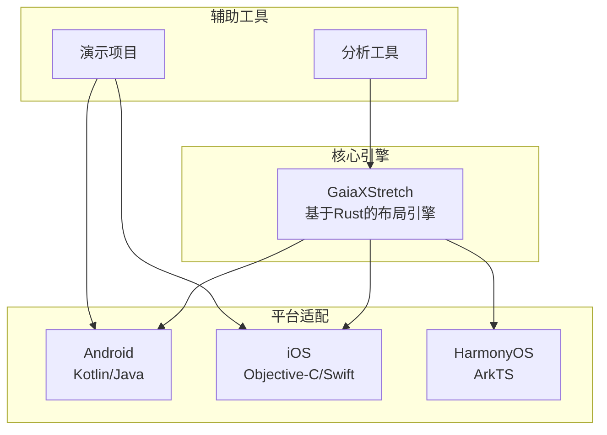
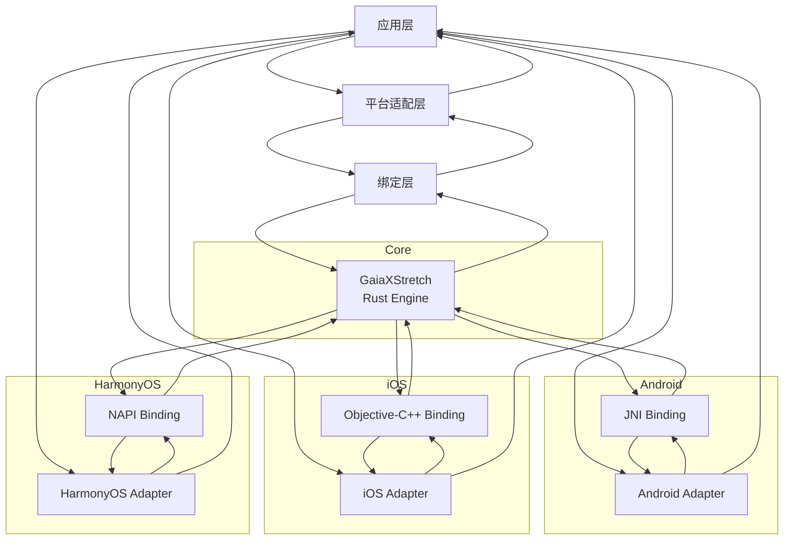
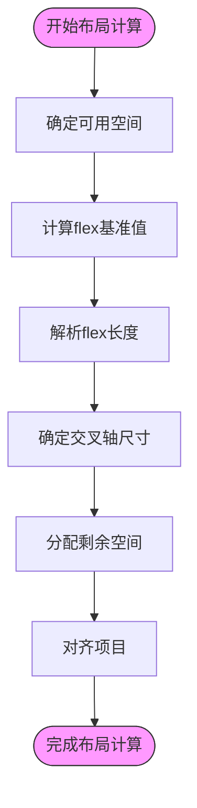
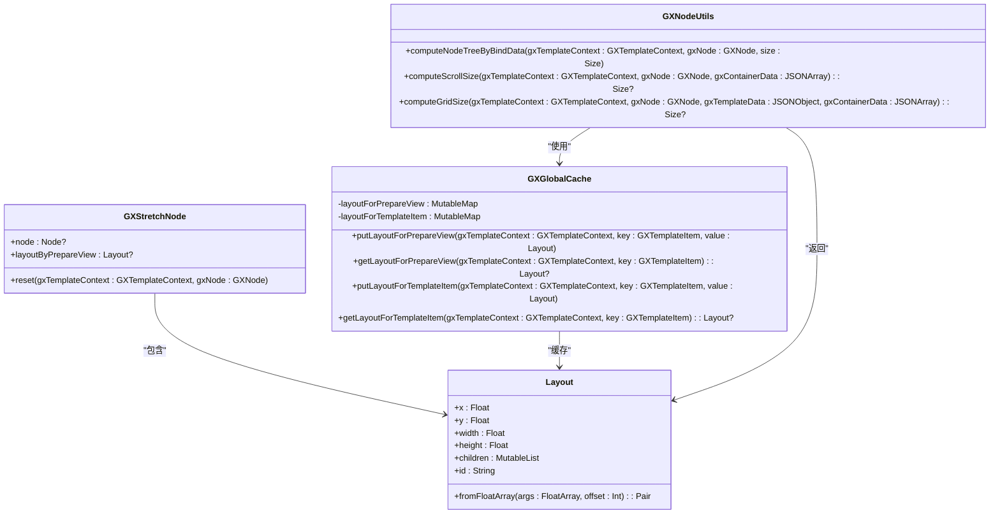
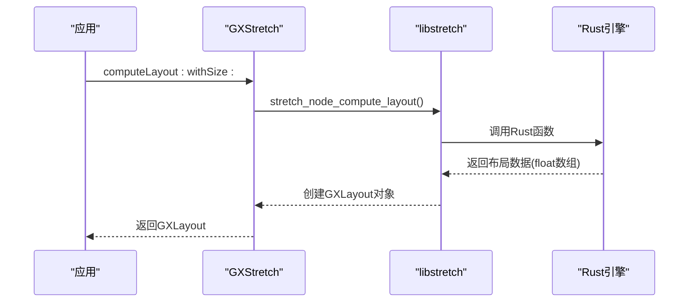
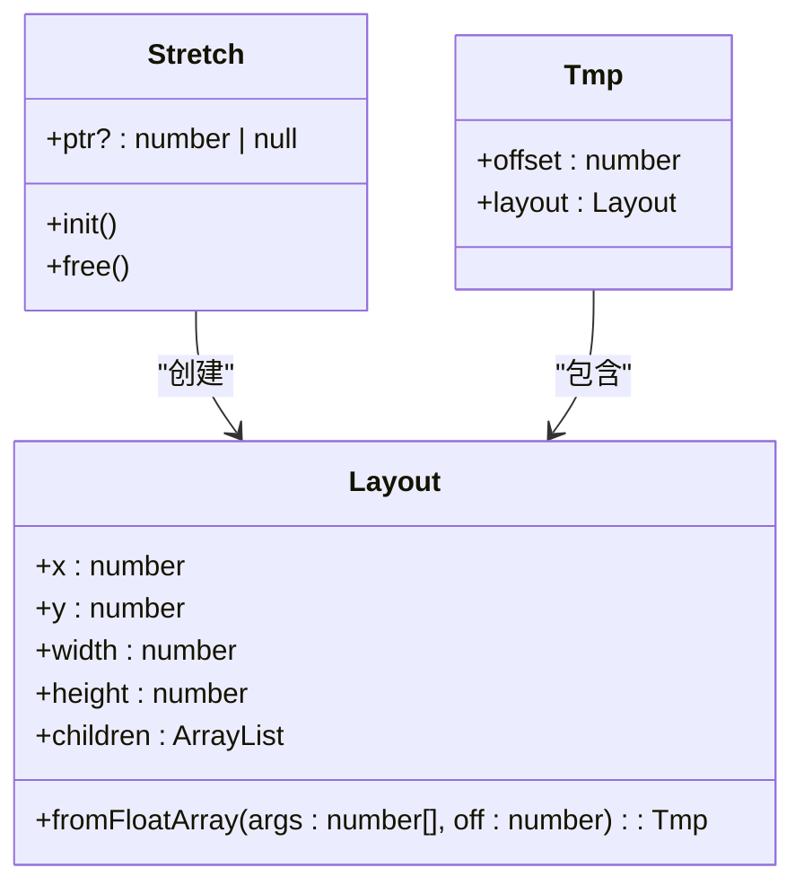
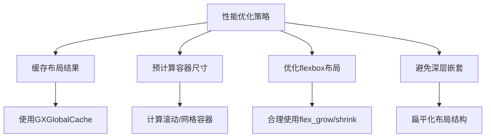
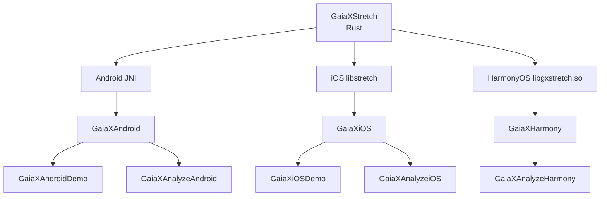

# 布局优化

<cite>
**本文档引用文件**  
- [GXGlobalCache.kt](file://GaiaXAndroid/src/main/kotlin/com/alibaba/gaiax/utils/GXGlobalCache.kt)
- [GXNodeUtils.kt](file://GaiaXAndroid/src/main/kotlin/com/alibaba/gaiax/render/node/GXNodeUtils.kt)
- [GXStretchNode.kt](file://GaiaXAndroid/src/main/kotlin/com/alibaba/gaiax/render/node/GXStretchNode.kt)
- [Layout.kt](file://GaiaXAndroid/src/main/kotlin/app/visly/stretch/Layout.kt)
- [algo.rs](file://GaiaXStretch/src/algo.rs)
- [GXStretch.m](file://GaiaXiOS/GaiaXiOS/Core/StretchKit/Classes/GXStretch.m)
- [GXLayout.m](file://GaiaXiOS/GaiaXiOS/Core/StretchKit/Classes/GXLayout.m)
- [GXStretch.h](file://GaiaXiOS/GaiaXiOS/Core/StretchKit/Classes/GXStretch.h)
- [Stretch.ts](file://GaiaXHarmony/GXStretchBinding/GXStretch/src/main/ets/stretch/Stretch.ts)
- [Layout.ts](file://GaiaXHarmony/GXStretchBinding/GXStretch/src/main/ets/stretch/Layout.ts)
</cite>

## 目录
1. [简介](#简介)
2. [项目结构](#项目结构)
3. [核心组件](#核心组件)
4. [架构概述](#架构概述)
5. [详细组件分析](#详细组件分析)
6. [依赖分析](#依赖分析)
7. [性能考量](#性能考量)
8. [故障排除指南](#故障排除指南)
9. [结论](#结论)

## 简介
GaiaX框架通过其高性能的GaiaXStretch布局引擎，为复杂模板的布局计算提供了卓越的性能优化能力。本指南深入探讨如何利用基于Rust实现的布局算法在跨平台环境下的性能优势，以及如何通过缓存布局测量结果、减少重复计算来优化性能。为初学者提供合理的模板结构设计建议，避免深层嵌套和过度复杂的布局结构；为高级开发者提供自定义布局策略和预计算布局尺寸的进阶技巧。详细说明如何优化flexbox布局中的grow/shrink计算、百分比尺寸处理和约束布局性能，以及如何利用GXFlexBox的优化机制提升滚动容器和网格布局的性能表现。

## 项目结构
GaiaX框架的项目结构清晰地划分了不同平台的实现和核心功能模块。核心布局引擎GaiaXStretch以Rust语言实现，通过绑定层为Android、iOS和HarmonyOS等不同平台提供统一的高性能布局计算能力。各平台的适配器模块（如GaiaXAndroid、GaiaXiOS）负责将核心引擎与平台原生UI系统集成，而分析工具（GaiaXAnalyze）和演示项目（GaiaXAndroidDemo）则为开发和调试提供了支持。

**图表来源**
- [GaiaXStretch](file://GaiaXStretch)
- [GaiaXAndroid](file://GaiaXAndroid)
- [GaiaXiOS](file://GaiaXiOS)
- [GaiaXHarmony](file://GaiaXHarmony)

**章节来源**
- [GaiaXStretch](file://GaiaXStretch)
- [GaiaXAndroid](file://GaiaXAndroid)
- [GaiaXiOS](file://GaiaXiOS)
- [GaiaXHarmony](file://GaiaXHarmony)

## 核心组件
GaiaX框架的核心组件围绕GaiaXStretch布局引擎构建，该引擎基于Rust语言实现，确保了跨平台的高性能和一致性。引擎通过`compute_layout`函数执行布局计算，利用`flex_basis`、`flex_grow`和`flex_shrink`等算法精确计算每个flex项目的尺寸。Android平台通过`GXStretchNode`类与引擎交互，iOS平台通过`GXStretch`单例对象进行调用，而HarmonyOS平台则通过`Stretch`类进行初始化和管理。布局结果以`Layout`对象的形式返回，包含每个节点的坐标、尺寸和子节点信息。

**章节来源**
- [algo.rs](file://GaiaXStretch/src/algo.rs#L1452-L1459)
- [GXStretchNode.kt](file://GaiaXAndroid/src/main/kotlin/com/alibaba/gaiax/render/node/GXStretchNode.kt)
- [GXStretch.m](file://GaiaXiOS/GaiaXiOS/Core/StretchKit/Classes/GXStretch.m)
- [Stretch.ts](file://GaiaXHarmony/GXStretchBinding/GXStretch/src/main/ets/stretch/Stretch.ts)

## 架构概述
GaiaX框架的架构设计体现了高性能和跨平台兼容性的完美结合。核心布局引擎GaiaXStretch以Rust语言实现，确保了计算的高效性和内存安全性。各平台通过特定的绑定层（bindings）与核心引擎交互：Android使用JNI，iOS使用Objective-C++桥接，HarmonyOS使用NAPI。布局计算的结果通过`Layout`对象在各层之间传递，最终由平台的UI系统渲染。这种分层架构使得核心算法可以独立优化，而平台适配层可以专注于与原生UI系统的集成。

**图表来源**
- [GaiaXStretch](file://GaiaXStretch)
- [GaiaXAndroid](file://GaiaXAndroid)
- [GaiaXiOS](file://GaiaXiOS)
- [GaiaXHarmony](file://GaiaXHarmony)

## 详细组件分析

### GaiaXStretch布局引擎分析
GaiaXStretch布局引擎是整个框架的性能核心，其基于Rust实现的算法确保了高效和精确的布局计算。引擎通过`compute_internal`函数处理布局计算的各个阶段，包括确定可用空间、计算flex基准值、解析flex长度和确定交叉轴尺寸。`flex_basis`的计算是布局过程的关键，它决定了flex项目在主轴上的初始大小。`flex_grow`和`flex_shrink`因子则用于在空间充足或不足时分配剩余空间，确保布局的灵活性和适应性。

**图表来源**
- [algo.rs](file://GaiaXStretch/src/algo.rs#L284-L294)

#### Android平台集成
Android平台通过`GXStretchNode`类与GaiaXStretch引擎集成。`safeComputeLayout`方法是布局计算的入口，它调用原生方法`nComputeLayout`执行实际的计算。`GXGlobalCache`类用于缓存布局结果，避免重复计算，显著提升了性能。`GXNodeUtils`类提供了计算滚动容器和网格容器尺寸的工具方法，通过预计算和缓存机制优化了复杂布局的性能。

**图表来源**
- [GXStretchNode.kt](file://GaiaXAndroid/src/main/kotlin/com/alibaba/gaiax/render/node/GXStretchNode.kt)
- [GXGlobalCache.kt](file://GaiaXAndroid/src/main/kotlin/com/alibaba/gaiax/utils/GXGlobalCache.kt)
- [GXNodeUtils.kt](file://GaiaXAndroid/src/main/kotlin/com/alibaba/gaiax/render/node/GXNodeUtils.kt)
- [Layout.kt](file://GaiaXAndroid/src/main/kotlin/app/visly/stretch/Layout.kt)

#### iOS平台集成
iOS平台通过`GXStretch`单例对象与GaiaXStretch引擎集成。`computeLayout:withSize:`方法是布局计算的入口，它通过Objective-C++桥接调用Rust引擎。`GXLayout`类用于表示布局结果，其`fromFloats:`方法从引擎返回的浮点数数组中解析出布局信息。`GXNode`类的`applyLayout:`方法将计算出的布局应用到UI节点上，完成最终的渲染。

**图表来源**
- [GXStretch.m](file://GaiaXiOS/GaiaXiOS/Core/StretchKit/Classes/GXStretch.m#L127-L133)
- [GXLayout.m](file://GaiaXiOS/GaiaXiOS/Core/StretchKit/Classes/GXLayout.m)
- [GXStretch.h](file://GaiaXiOS/GaiaXiOS/Core/StretchKit/Classes/GXStretch.h)

#### HarmonyOS平台集成
HarmonyOS平台通过`Stretch`类与GaiaXStretch引擎集成。`init`方法初始化Rust引擎指针，`napi_stretch_init`函数是实际的初始化入口。`Layout`类的`fromFloatArray`方法从引擎返回的浮点数数组中解析出布局信息，与iOS和Android平台的实现保持一致。这种统一的数据结构确保了跨平台布局结果的一致性。

**图表来源**
- [Stretch.ts](file://GaiaXHarmony/GXStretchBinding/GXStretch/src/main/ets/stretch/Stretch.ts)
- [Layout.ts](file://GaiaXHarmony/GXStretchBinding/GXStretch/src/main/ets/stretch/Layout.ts)

### 布局性能优化策略
GaiaX框架通过多种策略优化布局性能。首先，利用`GXGlobalCache`缓存布局结果，避免对相同模板和尺寸的重复计算。其次，通过预计算滚动容器和网格容器的尺寸，减少运行时的计算量。对于复杂的flexbox布局，合理使用`flex_grow`和`flex_shrink`可以避免不必要的重排。此外，避免深层嵌套的布局结构可以显著减少计算复杂度。

**图表来源**
- [GXGlobalCache.kt](file://GaiaXAndroid/src/main/kotlin/com/alibaba/gaiax/utils/GXGlobalCache.kt)
- [GXNodeUtils.kt](file://GaiaXAndroid/src/main/kotlin/com/alibaba/gaiax/render/node/GXNodeUtils.kt)

**章节来源**
- [GXGlobalCache.kt](file://GaiaXAndroid/src/main/kotlin/com/alibaba/gaiax/utils/GXGlobalCache.kt)
- [GXNodeUtils.kt](file://GaiaXAndroid/src/main/kotlin/com/alibaba/gaiax/render/node/GXNodeUtils.kt)

## 依赖分析
GaiaX框架的依赖关系清晰地反映了其模块化设计。核心引擎GaiaXStretch是所有平台适配层的基础依赖。Android平台依赖`app.visly.stretch`库，该库通过JNI与Rust引擎通信。iOS平台依赖`libstretch`动态库，通过Objective-C++桥接。HarmonyOS平台依赖`libgxstretch.so`共享库，通过NAPI接口调用。各平台的演示项目和分析工具则依赖相应的适配层，形成了完整的开发和调试环境。

**图表来源**
- [GaiaXStretch](file://GaiaXStretch)
- [GaiaXAndroid](file://GaiaXAndroid)
- [GaiaXiOS](file://GaiaXiOS)
- [GaiaXHarmony](file://GaiaXHarmony)

**章节来源**
- [GaiaXStretch](file://GaiaXStretch)
- [GaiaXAndroid](file://GaiaXAndroid)
- [GaiaXiOS](file://GaiaXiOS)
- [GaiaXHarmony](file://GaiaXHarmony)

## 性能考量
GaiaX框架的性能优势主要体现在以下几个方面：首先，基于Rust实现的布局引擎提供了接近原生的计算速度，远超JavaScript等解释型语言。其次，通过缓存和预计算机制，避免了大量重复的布局计算，显著提升了运行时性能。再者，跨平台的一致性算法确保了在不同设备上都能获得稳定和可预测的性能表现。最后，通过优化flexbox布局中的grow/shrink计算和百分比尺寸处理，减少了布局过程中的重排和重绘，进一步提升了渲染效率。

## 故障排除指南
在使用GaiaX框架进行布局开发时，可能会遇到一些常见问题。如果布局计算结果不正确，首先检查`flex_basis`、`flex_grow`和`flex_shrink`的设置是否合理。如果性能不佳，检查是否启用了布局缓存，并确保没有不必要的重复计算。对于跨平台不一致的问题，检查各平台绑定层的实现是否正确，特别是数据类型和内存管理的差异。使用框架提供的分析工具可以帮助定位和解决这些问题。

**章节来源**
- [algo.rs](file://GaiaXStretch/src/algo.rs)
- [GXGlobalCache.kt](file://GaiaXAndroid/src/main/kotlin/com/alibaba/gaiax/utils/GXGlobalCache.kt)
- [GXNodeUtils.kt](file://GaiaXAndroid/src/main/kotlin/com/alibaba/gaiax/render/node/GXNodeUtils.kt)

## 结论
GaiaX框架通过其高性能的GaiaXStretch布局引擎，为复杂模板的布局计算提供了卓越的性能优化能力。基于Rust实现的核心算法确保了跨平台的高效性和一致性。通过缓存布局结果、预计算容器尺寸和优化flexbox布局等策略，开发者可以显著提升应用的性能。合理的模板结构设计和对框架特性的深入理解，是充分发挥GaiaX框架潜力的关键。