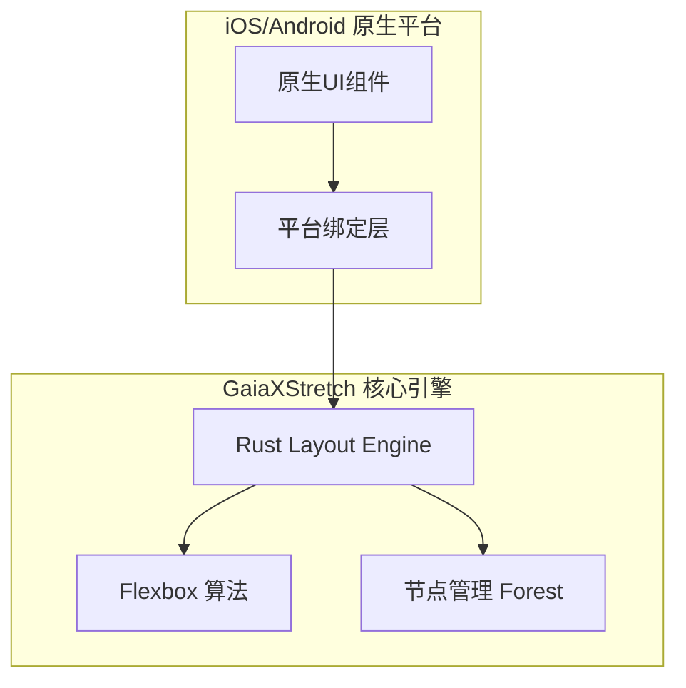
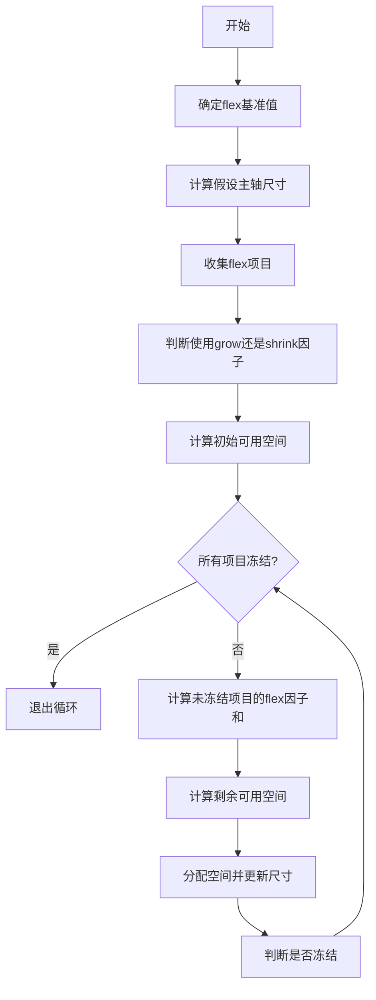
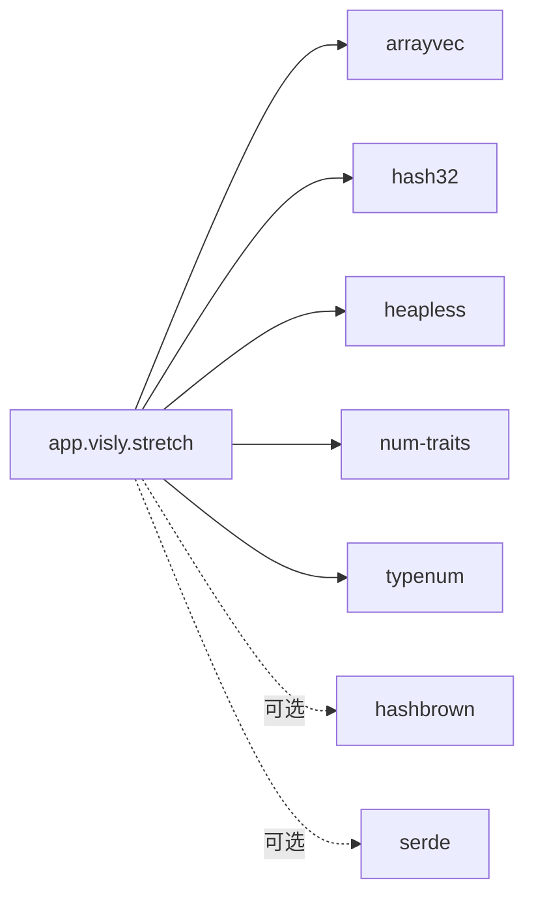

# 布局算法优化

<cite>
**本文档引用文件**   
- [GXStretch.m](file://GaiaXiOS/GaiaXiOS/Core/StretchKit/Classes/GXStretch.m)
- [GXStretch.h](file://GaiaXiOS/GaiaXiOS/Core/StretchKit/Classes/GXStretch.h)
- [GXStretchNode.kt](file://GaiaXAndroid/src/main/kotlin/com/alibaba/gaiax/render/node/GXStretchNode.kt)
- [algo.rs](file://GaiaXStretch/src/algo.rs)
- [style.rs](file://GaiaXStretch/src/style.rs)
- [node.rs](file://GaiaXStretch/src/node.rs)
- [geometry.rs](file://GaiaXStretch/src/geometry.rs)
- [lib.rs](file://GaiaXStretch/src/lib.rs)
</cite>

## 目录
1. [简介](#简介)
2. [项目结构](#项目结构)
3. [核心组件](#核心组件)
4. [架构概述](#架构概述)
5. [详细组件分析](#详细组件分析)
6. [依赖分析](#依赖分析)
7. [性能考量](#性能考量)
8. [故障排除指南](#故障排除指南)
9. [结论](#结论)

## 简介
GaiaX框架通过基于Rust实现的GaiaXStretch布局引擎，实现了跨平台环境下的高性能Flexbox布局计算。本指南深入探讨其布局算法的性能优化机制，重点解析在处理复杂嵌套结构时如何减少不必要的测量与布局计算，优化grow/shrink权重分配，并高效处理百分比尺寸和约束布局。文档为初学者提供避免深层嵌套的模板设计建议，为高级开发者揭示自定义布局算法的扩展点和性能调优参数。

## 项目结构
GaiaX项目是一个多平台的UI框架，其核心布局能力由独立的`GaiaXStretch`模块提供。该模块使用Rust语言实现，通过FFI（Foreign Function Interface）为iOS（Objective-C/Swift）和Android（Kotlin）等平台提供高性能的Flexbox布局服务。`GaiaXStretch`作为独立的Rust库，其算法核心位于`src/algo.rs`，而各平台通过各自的绑定层（bindings）进行调用。

**Section sources**
- [algo.rs](file://GaiaXStretch/src/algo.rs#L1-L1985)
- [lib.rs](file://GaiaXStretch/src/lib.rs#L1-L47)

## 核心组件
核心组件包括Rust实现的`stretch`库，它提供了Flexbox布局的核心算法。`Forest`结构管理着布局节点的树形关系，`Style`结构体定义了所有布局相关的CSS属性。在平台侧，iOS通过`GXStretch` Objective-C类，Android通过`GXStretchNode` Kotlin类，与底层的Rust引擎进行交互，完成节点创建、样式设置、布局计算等操作。

**Section sources**
- [node.rs](file://GaiaXStretch/src/node.rs#L1-L236)
- [style.rs](file://GaiaXStretch/src/style.rs#L1-L395)
- [GXStretchNode.kt](file://GaiaXAndroid/src/main/kotlin/com/alibaba/gaiax/render/node/GXStretchNode.kt#L1-L144)

## 架构概述
GaiaX的布局系统采用分层架构。上层是各平台的原生UI代码，中层是用Rust编写的`GaiaXStretch`高性能布局引擎，两者通过平台特定的绑定层（如iOS的Objective-C++桥接、Android的JNI）进行通信。这种架构确保了布局计算的性能和一致性，同时保持了与原生平台的良好集成。

**Diagram sources **
- [GXStretch.m](file://GaiaXiOS/GaiaXiOS/Core/StretchKit/Classes/GXStretch.m#L19-L138)
- [node.rs](file://GaiaXStretch/src/node.rs#L28-L34)

## 详细组件分析

### GaiaXStretch 布局算法分析
`GaiaXStretch`的布局算法严格遵循W3C Flexbox规范，并在`src/algo.rs`中实现了完整的计算流程。算法的核心是`compute_internal`函数，它通过一系列步骤确定每个节点的最终布局。

#### Flex项目主轴尺寸确定
算法首先确定每个flex项目的`flex基准值`（flex basis），然后根据容器的可用空间和项目的`flex-grow`或`flex-shrink`因子来分配剩余空间。关键优化在于对“不可伸缩项目”的冻结处理：当一个项目的`flex-grow`为0，或其`flex basis`大于其假设主轴尺寸时，该项目将被冻结，不再参与后续的空间分配，从而减少了不必要的计算。

**Diagram sources **
- [algo.rs](file://GaiaXStretch/src/algo.rs#L1275-L1459)

#### 百分比尺寸与约束布局计算
对于百分比尺寸（如`width: 50%`），算法通过`Dimension::resolve`方法将其解析为相对于父容器尺寸的绝对值。约束布局（min/max width/height）则在计算`假设主轴尺寸`时被应用，确保最终尺寸不会超出设定的范围。这保证了布局的灵活性和健壮性。

**Section sources**
- [style.rs](file://GaiaXStretch/src/style.rs#L222-L228)
- [algo.rs](file://GaiaXStretch/src/algo.rs#L324-L336)

### 平台集成分析
#### iOS平台集成
在iOS端，`GXStretch`类作为单例，通过`_stretchptr`持有对Rust引擎的指针。所有布局操作（如`setStyle:forNode:`、`computeLayout:withSize:`）都通过`dispatch_semaphore_t`信号量进行线程同步，确保在多线程环境下安全地调用底层Rust函数。

**Section sources**
- [GXStretch.m](file://GaiaXiOS/GaiaXiOS/Core/StretchKit/Classes/GXStretch.m#L28-L138)
- [GXStretch.h](file://GaiaXiOS/GaiaXiOS/Core/StretchKit/Classes/GXStretch.h#L1-L59)

#### Android平台集成
在Android端，`GXStretchNode`类封装了`app.visly.stretch.Node`对象。通过`createStretchStyle`方法，将平台特定的`GXFlexBox`配置转换为`stretch`库所需的`Style`对象。`resetStyle`方法负责更新节点样式并标记为dirty，触发后续的布局重算。

**Section sources**
- [GXStretchNode.kt](file://GaiaXAndroid/src/main/kotlin/com/alibaba/gaiax/render/node/GXStretchNode.kt#L36-L144)

## 依赖分析
`GaiaXStretch`库的依赖关系清晰，主要依赖于`arrayvec`、`hashbrown`等高性能Rust集合库，以确保数据结构的高效性。其`Cargo.toml`文件显示，它被设计为一个轻量级、高性能的库，通过`std`和`alloc`特性进行功能裁剪，以适应不同平台的运行环境。

**Diagram sources **
- [Cargo.toml](file://GaiaXStretch/Cargo.toml#L1-L60)

## 性能考量
GaiaXStretch的性能优化体现在多个层面：
1.  **缓存机制**：`compute_internal`函数在开始时会检查缓存，如果输入参数未改变，则直接返回缓存结果，避免了重复计算。
2.  **增量更新**：通过`markDirty`机制，只有被标记为dirty的节点才会重新计算布局，极大地减少了全量重排的开销。
3.  **Rust性能**：使用Rust编写核心算法，利用其零成本抽象和内存安全特性，在保证安全的同时获得接近C/C++的性能。
4.  **算法优化**：在处理`flex-grow`与`aspect-ratio`的组合时，有专门的逻辑修复以避免计算错误，体现了对复杂场景的深度优化。

## 故障排除指南
当遇到布局性能问题时，应首先检查是否存在深层嵌套的布局结构，这会显著增加计算复杂度。其次，确认是否频繁地创建和销毁节点，这会破坏缓存机制。对于布局结果不符合预期的情况，应检查`flex-grow`、`flex-shrink`和`flex-basis`的设置是否正确，并利用平台提供的调试工具（如iOS的视图调试器）来可视化布局过程。

**Section sources**
- [algo.rs](file://GaiaXStretch/src/algo.rs#L175-L198)
- [GXStretchNode.kt](file://GaiaXAndroid/src/main/kotlin/com/alibaba/gaiax/render/node/GXStretchNode.kt#L47)

## 结论
GaiaX框架通过将高性能的Rust布局引擎与各平台原生UI系统相结合，成功解决了跨平台UI开发中布局性能和一致性的难题。其基于Flexbox的算法实现不仅高效，而且通过精细的优化策略（如缓存、增量更新、冻结不可伸缩项目）确保了在复杂场景下的流畅体验。开发者应充分利用其提供的扩展点，并遵循避免深层嵌套的最佳实践，以构建高性能的跨平台应用界面。