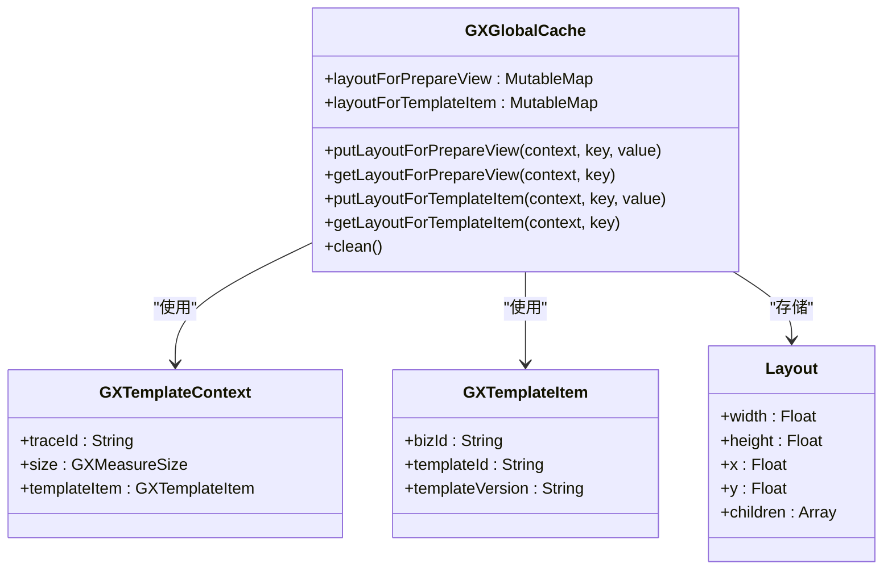

# 测量缓存优化

<cite>
**本文档引用文件**   
- [GXCacheCenter.h](file://GaiaXiOS/GaiaXiOS/Template/Cache/GXCacheCenter.h)
- [GXCacheCenter.m](file://GaiaXiOS/GaiaXiOS/Template/Cache/GXCacheCenter.m)
- [GXCache.h](file://GaiaXiOS/GaiaXiOS/Template/Cache/GXCache.h)
- [GXCache.m](file://GaiaXiOS/GaiaXiOS/Template/Cache/GXCache.m)
- [GXLRUCache.h](file://GaiaXiOS/GaiaXiOS/Template/Cache/GXLRUCache.h)
- [GXLRUCache.m](file://GaiaXiOS/GaiaXiOS/Template/Cache/GXLRUCache.m)
- [GXTemplateLRUCache.ets](file://GaiaXHarmony/GaiaXCore/GaiaX/src/main/ets/template/GXTemplateLRUCache.ets)
- [GXGlobalCache.kt](file://GaiaXAndroid/src/main/kotlin/com/alibaba/gaiax/utils/GXGlobalCache.kt)
- [GXNodeUtils.kt](file://GaiaXAndroid/src/main/kotlin/com/alibaba/gaiax/render/node/GXNodeUtils.kt)
- [GXTemplateContextExt.kt](file://GaiaXAndroid/src/main/kotlin/com/alibaba/gaiax/context/GXTemplateContextExt.kt)
- [GXTemplateEngine.kt](file://GaiaXAndroid/src/main/kotlin/com/alibaba/gaiax/GXTemplateEngine.kt)
</cite>

## 目录
1. [引言](#引言)
2. [测量缓存机制概述](#测量缓存机制概述)
3. [核心组件分析](#核心组件分析)
4. [缓存策略实现](#缓存策略实现)
5. [缓存键设计与失效机制](#缓存键设计与失效机制)
6. [内存管理与容量控制](#内存管理与容量控制)
7. [滚动列表与可复用模板优化](#滚动列表与可复用模板优化)
8. [动态数据更新场景处理](#动态数据更新场景处理)
9. [性能监控与分析工具](#性能监控与分析工具)
10. [结论](#结论)

## 引言
GaiaX框架通过测量缓存机制显著提升了重复渲染场景下的性能表现。本指南详细介绍了如何利用缓存布局测量结果来优化性能，重点讲解GXSize和GXFlexBox组件中的测量结果缓存策略。文档为初学者提供缓存启用和配置的基本方法，为高级开发者提供自定义缓存策略、调整缓存容量和实现智能缓存预热的进阶技巧。

## 测量缓存机制概述
GaiaX框架的测量缓存机制旨在通过缓存布局测量结果来减少重复的尺寸计算开销。该机制在滚动列表、可复用模板和动态数据更新场景下尤为有效。通过缓存已计算的布局信息，框架能够避免在相同条件下重复执行复杂的布局计算过程，从而显著提升渲染性能。

**Section sources**
- [GXTemplateEngine.kt](file://GaiaXAndroid/src/main/kotlin/com/alibaba/gaiax/GXTemplateEngine.kt#L352-L373)

## 核心组件分析
### GXCache组件
GXCache是GaiaX框架中的核心缓存组件，负责管理各种类型的缓存数据。该组件通过LRU（最近最少使用）算法实现缓存管理，确保缓存空间的有效利用。


**Diagram sources **
- [GXCache.h](file://GaiaXiOS/GaiaXiOS/Template/Cache/GXCache.h)
- [GXCache.m](file://GaiaXiOS/GaiaXiOS/Template/Cache/GXCache.m)
- [GXLRUCache.h](file://GaiaXiOS/GaiaXiOS/Template/Cache/GXLRUCache.h)
- [GXLRUCache.m](file://GaiaXiOS/GaiaXiOS/Template/Cache/GXLRUCache.m)

### GXTemplateLRUCache组件
GXTemplateLRUCache是Harmony平台上的模板缓存组件，采用LRU算法管理模板缓存。该组件通过Map数据结构实现高效的缓存读写操作。


**Diagram sources **
- [GXTemplateLRUCache.ets](file://GaiaXHarmony/GaiaXCore/GaiaX/src/main/ets/template/GXTemplateLRUCache.ets)

## 缓存策略实现
### 缓存中心设计
GaiaX框架通过GXCacheCenter实现缓存的集中管理。该中心采用单例模式，提供统一的缓存访问接口。


**Diagram sources **
- [GXCacheCenter.h](file://GaiaXiOS/GaiaXiOS/Template/Cache/GXCacheCenter.h)
- [GXCacheCenter.m](file://GaiaXiOS/GaiaXiOS/Template/Cache/GXCacheCenter.m)

### 全局缓存管理
GXGlobalCache组件负责管理Android平台上的全局缓存，包括布局缓存和模板项缓存。该组件通过可变映射实现高效的缓存存储和检索。



**Diagram sources **
- [GXGlobalCache.kt](file://GaiaXAndroid/src/main/kotlin/com/alibaba/gaiax/utils/GXGlobalCache.kt)
- [GXTemplateContextExt.kt](file://GaiaXAndroid/src/main/kotlin/com/alibaba/gaiax/context/GXTemplateContextExt.kt)

## 缓存键设计与失效机制
### 缓存键设计
缓存键的设计是缓存机制的核心。在GXTemplateLRUCache中，缓存键由模板ID、模板版本和业务ID组合而成，确保缓存的唯一性和准确性。


**Diagram sources **
- [GXTemplateLRUCache.ets](file://GaiaXHarmony/GaiaXCore/GaiaX/src/main/ets/template/GXTemplateLRUCache.ets#L31-L36)

### 缓存失效机制
缓存失效机制通过LRU算法实现。当缓存容量达到上限时，系统会自动移除最少使用的缓存项，为新数据腾出空间。


**Diagram sources **
- [GXTemplateLRUCache.ets](file://GaiaXHarmony/GaiaXCore/GaiaX/src/main/ets/template/GXTemplateLRUCache.ets#L61-L69)

## 内存管理与容量控制
### 缓存容量配置
不同类型的缓存具有不同的容量配置。表达式缓存默认容量为200，正则缓存默认容量为50，而模板缓存则无容量限制。

```mermaid
erDiagram
CACHE_TYPE {
string name PK
integer default_capacity
boolean unlimited
}
CACHE_TYPE ||--o{ CACHE_INSTANCE : "实例"
CACHE_TYPE {
"templateCahche" 0 true
"expressionCahche" 200 false
"regularCahche" 50 false
}
```

**Diagram sources **
- [GXCacheCenter.m](file://GaiaXiOS/GaiaXiOS/Template/Cache/GXCacheCenter.m#L40-L52)

### 内存保护机制
通过互斥锁实现线程安全的缓存操作，确保在多线程环境下缓存数据的一致性和完整性。


**Diagram sources **
- [GXCache.m](file://GaiaXiOS/GaiaXiOS/Template/Cache/GXCache.m#L38-L39)

## 滚动列表与可复用模板优化
### 滚动项布局缓存
通过缓存滚动项的布局信息，避免在滚动过程中重复计算每个项的尺寸。


**Diagram sources **
- [GXNodeUtils.kt](file://GaiaXAndroid/src/main/kotlin/com/alibaba/gaiax/render/node/GXNodeUtils.kt#L363-L374)

### 网格布局缓存
对于网格布局，通过假设所有项高度相同来优化缓存策略，显著减少计算开销。


**Diagram sources **
- [GXNodeUtils.kt](file://GaiaXAndroid/src/main/kotlin/com/alibaba/gaiax/render/node/GXNodeUtils.kt#L409-L422)

## 动态数据更新场景处理
### 数据绑定缓存
在数据绑定过程中，通过检查是否存在预计算的布局来决定是否需要重新计算。


**Diagram sources **
- [GXNodeUtils.kt](file://GaiaXAndroid/src/main/kotlin/com/alibaba/gaiax/render/node/GXNodeUtils.kt#L142-L147)

## 性能监控与分析工具
### 缓存命中率监控
通过日志记录缓存操作，便于分析缓存命中率和性能表现。


**Diagram sources **
- [GXGlobalCache.kt](file://GaiaXAndroid/src/main/kotlin/com/alibaba/gaiax/utils/GXGlobalCache.kt#L15-L16)

### 内存占用分析
通过监控缓存大小和容量，及时发现内存使用异常。


**Diagram sources **
- [GXLRUCache.h](file://GaiaXiOS/GaiaXiOS/Template/Cache/GXLRUCache.h#L38-L40)

## 结论
GaiaX框架的测量缓存机制通过精心设计的缓存策略、高效的缓存算法和完善的内存管理，显著提升了重复渲染场景下的性能表现。开发者可以根据具体需求启用和配置缓存，或通过自定义缓存策略进一步优化应用性能。在滚动列表、可复用模板和动态数据更新等场景下，合理利用测量缓存能够有效减少重复的尺寸计算开销，提升用户体验。