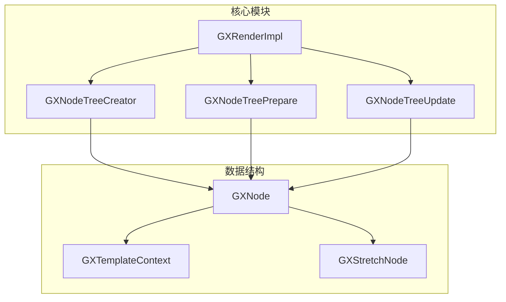
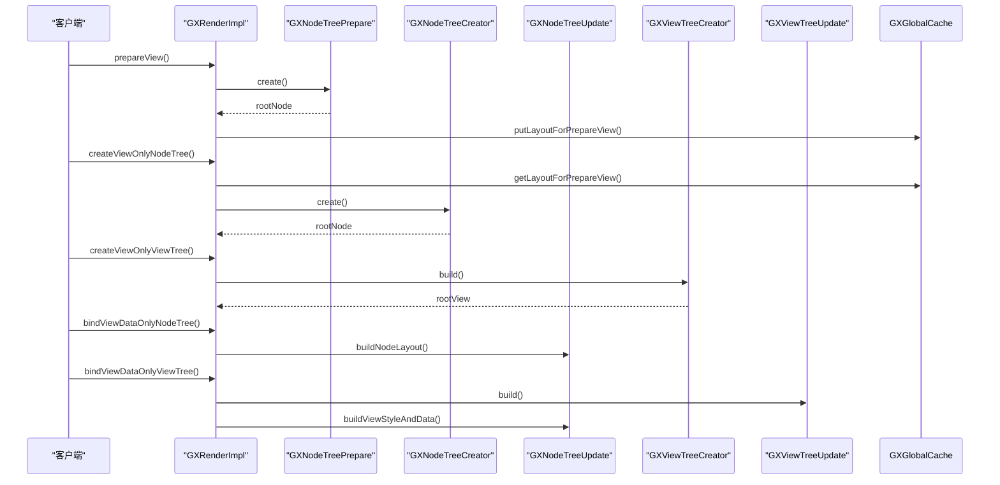
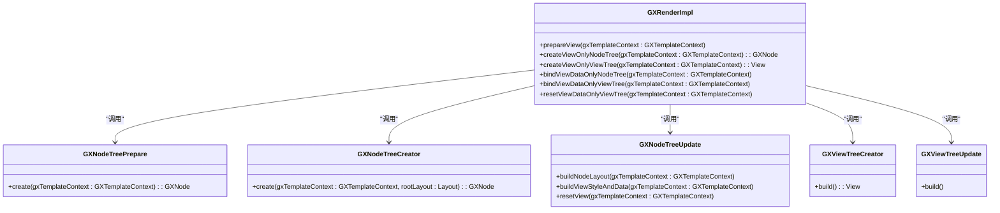
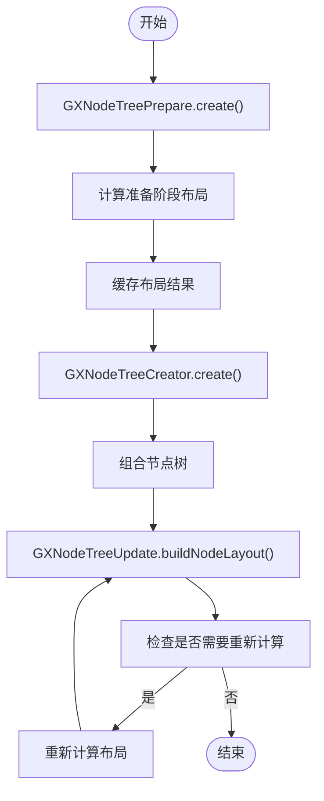
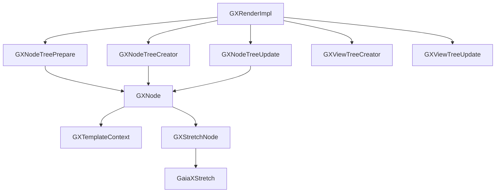

# 渲染性能优化

<cite>
**本文档中引用的文件**  
- [GXRenderImpl.kt](file://GaiaXAndroid/src/main/kotlin/com/alibaba/gaiax/render/GXRenderImpl.kt)
- [GXTemplateContext.kt](file://GaiaXAndroid/src/main/kotlin/com/alibaba/gaiax/context/GXTemplateContext.kt)
- [GXNode.kt](file://GaiaXAndroid/src/main/kotlin/com/alibaba/gaiax/render/node/GXNode.kt)
- [GXNodeTreeCreator.kt](file://GaiaXAndroid/src/main/kotlin/com/alibaba/gaiax/render/node/GXNodeTreeCreator.kt)
- [GXNodeTreePrepare.kt](file://GaiaXAndroid/src/main/kotlin/com/alibaba/gaiax/render/node/GXNodeTreePrepare.kt)
- [GXNodeTreeUpdate.kt](file://GaiaXAndroid/src/main/kotlin/com/alibaba/gaiax/render/node/GXNodeTreeUpdate.kt)
- [GXStretchNode.kt](file://GaiaXAndroid/src/main/kotlin/com/alibaba/gaiax/render/node/GXStretchNode.kt)
</cite>

## 目录
1. [简介](#简介)
2. [项目结构](#项目结构)
3. [核心组件](#核心组件)
4. [架构概述](#架构概述)
5. [详细组件分析](#详细组件分析)
6. [依赖分析](#依赖分析)
7. [性能考虑](#性能考虑)
8. [故障排除指南](#故障排除指南)
9. [结论](#结论)

## 简介
GaiaX框架是一个高性能的跨平台模板渲染引擎，专为复杂UI场景设计。本指南重点介绍如何通过优化模板渲染效率和布局计算性能来提升GaiaX的渲染性能。基于GXRenderImpl和GaiaXStretch布局引擎的实现，深入讲解渲染流程中的性能瓶颈和优化策略。为初学者提供减少重绘和布局计算的基本方法，为高级开发者提供自定义渲染优化和GPU加速的进阶技巧。

## 项目结构
GaiaX项目采用模块化设计，主要包含Android、iOS和HarmonyOS三个平台的实现。核心渲染逻辑位于GaiaXAndroid模块中，通过GXRenderImpl类统一管理渲染流程。布局计算由GaiaXStretch引擎负责，该引擎基于Rust实现，提供高效的布局算法。项目结构清晰，各模块职责分明，便于维护和扩展。

**图表来源**  
- [GXRenderImpl.kt](file://GaiaXAndroid/src/main/kotlin/com/alibaba/gaiax/render/GXRenderImpl.kt)
- [GXNodeTreeCreator.kt](file://GaiaXAndroid/src/main/kotlin/com/alibaba/gaiax/render/node/GXNodeTreeCreator.kt)
- [GXNodeTreePrepare.kt](file://GaiaXAndroid/src/main/kotlin/com/alibaba/gaiax/render/node/GXNodeTreePrepare.kt)
- [GXNodeTreeUpdate.kt](file://GaiaXAndroid/src/main/kotlin/com/alibaba/gaiax/render/node/GXNodeTreeUpdate.kt)
- [GXNode.kt](file://GaiaXAndroid/src/main/kotlin/com/alibaba/gaiax/render/node/GXNode.kt)
- [GXTemplateContext.kt](file://GaiaXAndroid/src/main/kotlin/com/alibaba/gaiax/context/GXTemplateContext.kt)
- [GXStretchNode.kt](file://GaiaXAndroid/src/main/kotlin/com/alibaba/gaiax/render/node/GXStretchNode.kt)

**章节来源**  
- [GXRenderImpl.kt](file://GaiaXAndroid/src/main/kotlin/com/alibaba/gaiax/render/GXRenderImpl.kt#L1-L105)
- [GXNodeTreeCreator.kt](file://GaiaXAndroid/src/main/kotlin/com/alibaba/gaiax/render/node/GXNodeTreeCreator.kt#L1-L136)
- [GXNodeTreePrepare.kt](file://GaiaXAndroid/src/main/kotlin/com/alibaba/gaiax/render/node/GXNodeTreePrepare.kt#L1-L141)
- [GXNodeTreeUpdate.kt](file://GaiaXAndroid/src/main/kotlin/com/alibaba/gaiax/render/node/GXNodeTreeUpdate.kt#L1-L800)

## 核心组件
GaiaX框架的核心组件包括GXRenderImpl、GXNode、GXTemplateContext和GXStretchNode。GXRenderImpl是渲染流程的入口，负责协调节点树创建、布局计算和视图更新。GXNode表示虚拟节点树中的节点，包含节点的样式、布局和事件信息。GXTemplateContext存储模板上下文信息，包括模板数据、视图尺寸和缓存。GXStretchNode封装了GaiaXStretch布局引擎的节点，负责具体的布局计算。

**章节来源**  
- [GXRenderImpl.kt](file://GaiaXAndroid/src/main/kotlin/com/alibaba/gaiax/render/GXRenderImpl.kt#L35-L105)
- [GXNode.kt](file://GaiaXAndroid/src/main/kotlin/com/alibaba/gaiax/render/node/GXNode.kt#L34-L222)
- [GXTemplateContext.kt](file://GaiaXAndroid/src/main/kotlin/com/alibaba/gaiax/context/GXTemplateContext.kt#L35-L253)
- [GXStretchNode.kt](file://GaiaXAndroid/src/main/kotlin/com/alibaba/gaiax/render/node/GXStretchNode.kt#L32-L69)

## 架构概述
GaiaX框架采用分阶段渲染架构，将渲染流程分为准备、创建和绑定三个阶段。在准备阶段，通过GXNodeTreePrepare创建虚拟节点树并计算初始布局。在创建阶段，通过GXNodeTreeCreator创建完整的节点树，并通过GXViewTreeCreator创建视图树。在绑定阶段，通过GXNodeTreeUpdate更新节点布局和样式，并通过GXViewTreeUpdate更新视图布局。

**图表来源**  
- [GXRenderImpl.kt](file://GaiaXAndroid/src/main/kotlin/com/alibaba/gaiax/render/GXRenderImpl.kt#L42-L105)
- [GXNodeTreePrepare.kt](file://GaiaXAndroid/src/main/kotlin/com/alibaba/gaiax/render/node/GXNodeTreePrepare.kt#L31-L45)
- [GXNodeTreeCreator.kt](file://GaiaXAndroid/src/main/kotlin/com/alibaba/gaiax/render/node/GXNodeTreeCreator.kt#L31-L42)
- [GXNodeTreeUpdate.kt](file://GaiaXAndroid/src/main/kotlin/com/alibaba/gaiax/render/node/GXNodeTreeUpdate.kt#L77-L112)
- [GXViewTreeCreator.kt](file://GaiaXAndroid/src/main/kotlin/com/alibaba/gaiax/render/view/GXViewTreeCreator.kt)
- [GXViewTreeUpdate.kt](file://GaiaXAndroid/src/main/kotlin/com/alibaba/gaiax/render/view/GXViewTreeUpdate.kt)

## 详细组件分析

### GXRenderImpl分析
GXRenderImpl是GaiaX框架的渲染入口，负责协调整个渲染流程。它提供了prepareView、createViewOnlyNodeTree、createViewOnlyViewTree、bindViewDataOnlyNodeTree和bindViewDataOnlyViewTree等方法，分别对应渲染流程的不同阶段。

**图表来源**  
- [GXRenderImpl.kt](file://GaiaXAndroid/src/main/kotlin/com/alibaba/gaiax/render/GXRenderImpl.kt#L35-L105)
- [GXNodeTreePrepare.kt](file://GaiaXAndroid/src/main/kotlin/com/alibaba/gaiax/render/node/GXNodeTreePrepare.kt#L29-L45)
- [GXNodeTreeCreator.kt](file://GaiaXAndroid/src/main/kotlin/com/alibaba/gaiax/render/node/GXNodeTreeCreator.kt#L29-L42)
- [GXNodeTreeUpdate.kt](file://GaiaXAndroid/src/main/kotlin/com/alibaba/gaiax/render/node/GXNodeTreeUpdate.kt#L74-L112)
- [GXViewTreeCreator.kt](file://GaiaXAndroid/src/main/kotlin/com/alibaba/gaiax/render/view/GXViewTreeCreator.kt)
- [GXViewTreeUpdate.kt](file://GaiaXAndroid/src/main/kotlin/com/alibaba/gaiax/render/view/GXViewTreeUpdate.kt)

**章节来源**  
- [GXRenderImpl.kt](file://GaiaXAndroid/src/main/kotlin/com/alibaba/gaiax/render/GXRenderImpl.kt#L35-L105)

### GXNodeTree分析
GXNodeTree相关组件负责虚拟节点树的创建和更新。GXNodeTreePrepare用于创建初始节点树并计算准备阶段的布局，GXNodeTreeCreator用于创建完整的节点树，GXNodeTreeUpdate用于更新节点树的布局和样式。

**图表来源**  
- [GXNodeTreePrepare.kt](file://GaiaXAndroid/src/main/kotlin/com/alibaba/gaiax/render/node/GXNodeTreePrepare.kt#L29-L45)
- [GXNodeTreeCreator.kt](file://GaiaXAndroid/src/main/kotlin/com/alibaba/gaiax/render/node/GXNodeTreeCreator.kt#L29-L42)
- [GXNodeTreeUpdate.kt](file://GaiaXAndroid/src/main/kotlin/com/alibaba/gaiax/render/node/GXNodeTreeUpdate.kt#L77-L1322)

**章节来源**  
- [GXNodeTreePrepare.kt](file://GaiaXAndroid/src/main/kotlin/com/alibaba/gaiax/render/node/GXNodeTreePrepare.kt#L29-L45)
- [GXNodeTreeCreator.kt](file://GaiaXAndroid/src/main/kotlin/com/alibaba/gaiax/render/node/GXNodeTreeCreator.kt#L29-L42)
- [GXNodeTreeUpdate.kt](file://GaiaXAndroid/src/main/kotlin/com/alibaba/gaiax/render/node/GXNodeTreeUpdate.kt#L77-L1322)

## 依赖分析
GaiaX框架的组件之间存在明确的依赖关系。GXRenderImpl依赖于GXNodeTreePrepare、GXNodeTreeCreator、GXNodeTreeUpdate、GXViewTreeCreator和GXViewTreeUpdate等组件。GXNodeTree相关组件依赖于GXNode和GXStretchNode。GXNode依赖于GXTemplateContext和GXStretchNode。GXStretchNode依赖于GaiaXStretch布局引擎。

**图表来源**  
- [GXRenderImpl.kt](file://GaiaXAndroid/src/main/kotlin/com/alibaba/gaiax/render/GXRenderImpl.kt#L35-L105)
- [GXNodeTreePrepare.kt](file://GaiaXAndroid/src/main/kotlin/com/alibaba/gaiax/render/node/GXNodeTreePrepare.kt#L29-L45)
- [GXNodeTreeCreator.kt](file://GaiaXAndroid/src/main/kotlin/com/alibaba/gaiax/render/node/GXNodeTreeCreator.kt#L29-L42)
- [GXNodeTreeUpdate.kt](file://GaiaXAndroid/src/main/kotlin/com/alibaba/gaiax/render/node/GXNodeTreeUpdate.kt#L74-L112)
- [GXNode.kt](file://GaiaXAndroid/src/main/kotlin/com/alibaba/gaiax/render/node/GXNode.kt#L34-L222)
- [GXTemplateContext.kt](file://GaiaXAndroid/src/main/kotlin/com/alibaba/gaiax/context/GXTemplateContext.kt#L35-L253)
- [GXStretchNode.kt](file://GaiaXAndroid/src/main/kotlin/com/alibaba/gaiax/render/node/GXStretchNode.kt#L32-L69)

**章节来源**  
- [GXRenderImpl.kt](file://GaiaXAndroid/src/main/kotlin/com/alibaba/gaiax/render/GXRenderImpl.kt#L35-L105)
- [GXNodeTreePrepare.kt](file://GaiaXAndroid/src/main/kotlin/com/alibaba/gaiax/render/node/GXNodeTreePrepare.kt#L29-L45)
- [GXNodeTreeCreator.kt](file://GaiaXAndroid/src/main/kotlin/com/alibaba/gaiax/render/node/GXNodeTreeCreator.kt#L29-L42)
- [GXNodeTreeUpdate.kt](file://GaiaXAndroid/src/main/kotlin/com/alibaba/gaiax/render/node/GXNodeTreeUpdate.kt#L74-L112)
- [GXNode.kt](file://GaiaXAndroid/src/main/kotlin/com/alibaba/gaiax/render/node/GXNode.kt#L34-L222)
- [GXTemplateContext.kt](file://GaiaXAndroid/src/main/kotlin/com/alibaba/gaiax/context/GXTemplateContext.kt#L35-L253)
- [GXStretchNode.kt](file://GaiaXAndroid/src/main/kotlin/com/alibaba/gaiax/render/node/GXStretchNode.kt#L32-L69)

## 性能考虑
GaiaX框架通过多种方式优化渲染性能。首先，通过分阶段渲染将布局计算和视图创建分离，避免不必要的重复计算。其次，通过缓存机制存储准备阶段的布局结果，减少重复计算。再次，通过虚拟节点树减少视图层级，提高渲染效率。最后，通过GaiaXStretch布局引擎提供高效的布局算法，提升复杂模板的渲染速度。

## 故障排除指南
在使用GaiaX框架时，可能会遇到一些常见的性能问题。例如，布局计算耗时过长、视图重绘频繁、内存占用过高等。针对这些问题，可以通过以下方式进行排查和优化：检查模板结构是否过于复杂、确认是否启用了布局缓存、验证虚拟节点树是否正确创建、确保GaiaXStretch布局引擎正常工作。

**章节来源**  
- [GXRenderImpl.kt](file://GaiaXAndroid/src/main/kotlin/com/alibaba/gaiax/render/GXRenderImpl.kt#L42-L105)
- [GXNodeTreePrepare.kt](file://GaiaXAndroid/src/main/kotlin/com/alibaba/gaiax/render/node/GXNodeTreePrepare.kt#L31-L45)
- [GXNodeTreeCreator.kt](file://GaiaXAndroid/src/main/kotlin/com/alibaba/gaiax/render/node/GXNodeTreeCreator.kt#L31-L42)
- [GXNodeTreeUpdate.kt](file://GaiaXAndroid/src/main/kotlin/com/alibaba/gaiax/render/node/GXNodeTreeUpdate.kt#L77-L112)

## 结论
GaiaX框架通过分阶段渲染、缓存机制、虚拟节点树和高效布局算法等多种方式，实现了高性能的模板渲染。通过合理使用这些特性，可以显著提升应用的渲染性能，为用户提供流畅的用户体验。对于初学者，建议从减少重绘和布局计算入手；对于高级开发者，可以深入研究自定义渲染优化和GPU加速等进阶技巧。