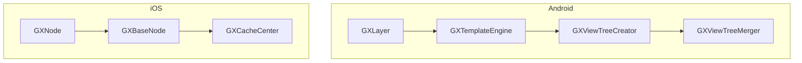
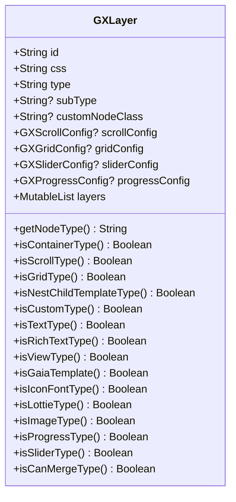
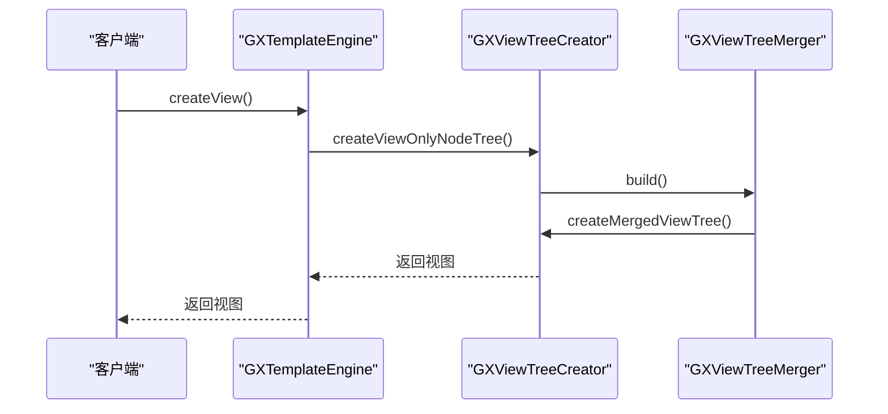
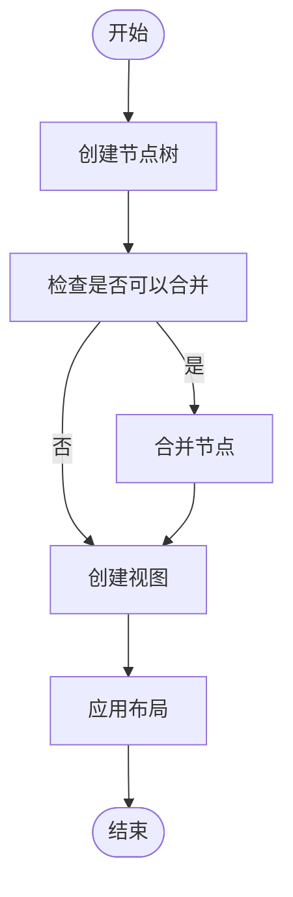
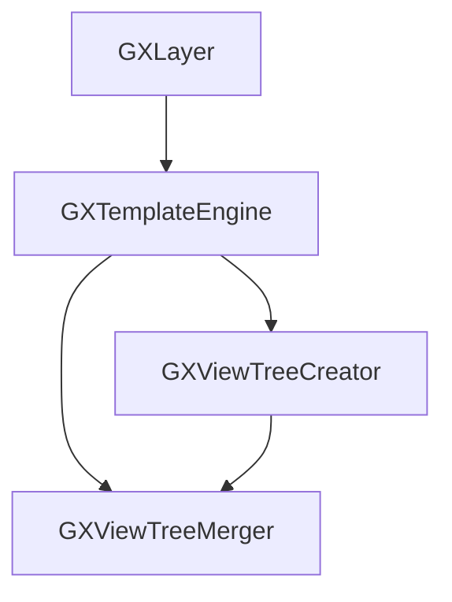

# 层级结构优化

<cite>
**本文档引用文件**   
- [GXLayer.kt](file://GaiaXAndroid/src/main/kotlin/com/alibaba/gaiax/template/GXLayer.kt)
- [GXTemplateEngine.kt](file://GaiaXAndroid/src/main/kotlin/com/alibaba/gaiax/GXTemplateEngine.kt)
- [GXViewTreeCreator.kt](file://GaiaXAndroid/src/main/kotlin/com/alibaba/gaiax/render/view/GXViewTreeCreator.kt)
- [GXViewTreeMerger.kt](file://GaiaXAndroid/src/main/kotlin/com/alibaba/gaiax/render/view/GXViewTreeMerger.kt)
- [GXNode.m](file://GaiaXiOS/GaiaXiOS/Core/StretchKit/Classes/GXNode.m)
- [GXBaseNode.m](file://GaiaXiOS/GaiaXiOS/Component/Node/GXBaseNode.m)
- [GXCacheCenter.h](file://GaiaXiOS/GaiaXiOS/Template/Cache/GXCacheCenter.h)
- [GXCacheCenter.m](file://GaiaXiOS/GaiaXiOS/Template/Cache/GXCacheCenter.m)
</cite>

## 目录
1. [简介](#简介)
2. [项目结构](#项目结构)
3. [核心组件](#核心组件)
4. [架构概述](#架构概述)
5. [详细组件分析](#详细组件分析)
6. [依赖分析](#依赖分析)
7. [性能考虑](#性能考虑)
8. [故障排除指南](#故障排除指南)
9. [结论](#结论)
10. [附录](#附录)（如有必要）

## 简介
本文档旨在为GaiaX框架的视图层级优化提供全面指南，重点介绍如何通过减少视图层级和合并渲染节点来提升渲染性能。基于GXLayer的层级管理机制，深入讲解扁平化布局设计、容器节点合并和过度绘制消除等核心技术。为初学者提供减少嵌套层级、合理使用轻量级容器的基本优化方法；为高级开发者提供自定义层级合并策略、动态层级优化的进阶技巧。详细说明如何通过GXTemplateEngine的预处理机制优化模板层级结构，如何识别和消除冗余容器节点，以及如何利用层级缓存避免重复计算。包含实际代码示例展示层级优化前后的UI性能分析数据，以及如何使用Layout Inspector等工具诊断层级问题。

## 项目结构
本项目包含多个模块，主要分为Android和iOS平台的实现。核心模块包括GaiaXAndroid和GaiaXiOS，分别负责Android和iOS平台的视图渲染。此外，还包括分析工具GaiaXAnalyze、适配器GaiaXAndroidAdapter、客户端到工作室的通信GaiaXAndroidClientToStudio、演示项目GaiaXAndroidDemo、JavaScript引擎GaiaXAndroidJS、快速JavaScript引擎GaiaXAndroidQuickJS、HarmonyOS支持GaiaXHarmony、JavaScript iOS实现GaiaXJSiOS、Socket iOS实现GaiaXSocketiOS、Stretch布局引擎GaiaXStretch和Taro框架支持GaiaXTaro。每个模块都有其特定的功能，共同构成了GaiaX框架的完整生态系统。

**Section sources**
- [GXLayer.kt](file://GaiaXAndroid/src/main/kotlin/com/alibaba/gaiax/template/GXLayer.kt#L1-L312)
- [GXTemplateEngine.kt](file://GaiaXAndroid/src/main/kotlin/com/alibaba/gaiax/GXTemplateEngine.kt#L1-L928)

## 核心组件
GaiaX框架的核心组件包括GXLayer、GXTemplateEngine、GXViewTreeCreator和GXViewTreeMerger。这些组件共同协作，实现了高效的视图层级管理和渲染优化。

**Section sources**
- [GXLayer.kt](file://GaiaXAndroid/src/main/kotlin/com/alibaba/gaiax/template/GXLayer.kt#L1-L312)
- [GXTemplateEngine.kt](file://GaiaXAndroid/src/main/kotlin/com/alibaba/gaiax/GXTemplateEngine.kt#L1-L928)
- [GXViewTreeCreator.kt](file://GaiaXAndroid/src/main/kotlin/com/alibaba/gaiax/render/view/GXViewTreeCreator.kt#L1-L100)
- [GXViewTreeMerger.kt](file://GaiaXAndroid/src/main/kotlin/com/alibaba/gaiax/render/view/GXViewTreeMerger.kt#L1-L158)

## 架构概述
GaiaX框架的架构设计旨在通过减少视图层级和合并渲染节点来提升渲染性能。核心思想是通过GXLayer的层级管理机制，实现扁平化布局设计、容器节点合并和过度绘制消除。GXTemplateEngine负责模板的预处理和渲染，GXViewTreeCreator和GXViewTreeMerger负责视图树的创建和合并。

**Diagram sources **
- [GXLayer.kt](file://GaiaXAndroid/src/main/kotlin/com/alibaba/gaiax/template/GXLayer.kt#L1-L312)
- [GXTemplateEngine.kt](file://GaiaXAndroid/src/main/kotlin/com/alibaba/gaiax/GXTemplateEngine.kt#L1-L928)
- [GXViewTreeCreator.kt](file://GaiaXAndroid/src/main/kotlin/com/alibaba/gaiax/render/view/GXViewTreeCreator.kt#L1-L100)
- [GXViewTreeMerger.kt](file://GaiaXAndroid/src/main/kotlin/com/alibaba/gaiax/render/view/GXViewTreeMerger.kt#L1-L158)
- [GXNode.m](file://GaiaXiOS/GaiaXiOS/Core/StretchKit/Classes/GXNode.m#L1-L648)
- [GXBaseNode.m](file://GaiaXiOS/GaiaXiOS/Component/Node/GXBaseNode.m#L1-L818)
- [GXCacheCenter.h](file://GaiaXiOS/GaiaXiOS/Template/Cache/GXCacheCenter.h#L1-L40)
- [GXCacheCenter.m](file://GaiaXiOS/GaiaXiOS/Template/Cache/GXCacheCenter.m#L1-L55)

## 详细组件分析
### GXLayer分析
GXLayer是GaiaX框架中用于管理视图层级的核心数据结构。它定义了节点的ID、样式ID、类型、子类型、自定义节点类、滚动配置、网格配置、滑块配置、进度配置和子节点列表。通过这些属性，GXLayer能够精确地描述每个视图节点的特性和关系。

#### 类图

**Diagram sources **
- [GXLayer.kt](file://GaiaXAndroid/src/main/kotlin/com/alibaba/gaiax/template/GXLayer.kt#L1-L312)

### GXTemplateEngine分析
GXTemplateEngine是GaiaX框架的引擎类，负责模板的预处理和渲染。它提供了创建视图、绑定数据、重置视图和销毁视图的方法。通过GXTemplateEngine，开发者可以轻松地创建和管理动态模板。

#### 序列图

**Diagram sources **
- [GXTemplateEngine.kt](file://GaiaXAndroid/src/main/kotlin/com/alibaba/gaiax/GXTemplateEngine.kt#L1-L928)
- [GXViewTreeCreator.kt](file://GaiaXAndroid/src/main/kotlin/com/alibaba/gaiax/render/view/GXViewTreeCreator.kt#L1-L100)
- [GXViewTreeMerger.kt](file://GaiaXAndroid/src/main/kotlin/com/alibaba/gaiax/render/view/GXViewTreeMerger.kt#L1-L158)

### GXViewTreeCreator和GXViewTreeMerger分析
GXViewTreeCreator和GXViewTreeMerger是GaiaX框架中用于创建和合并视图树的两个关键组件。GXViewTreeCreator负责创建视图树，而GXViewTreeMerger负责合并视图树，以减少视图层级和提升渲染性能。

#### 流程图

**Diagram sources **
- [GXViewTreeCreator.kt](file://GaiaXAndroid/src/main/kotlin/com/alibaba/gaiax/render/view/GXViewTreeCreator.kt#L1-L100)
- [GXViewTreeMerger.kt](file://GaiaXAndroid/src/main/kotlin/com/alibaba/gaiax/render/view/GXViewTreeMerger.kt#L1-L158)

## 依赖分析
GaiaX框架的各个组件之间存在紧密的依赖关系。GXLayer作为基础数据结构，被GXTemplateEngine、GXViewTreeCreator和GXViewTreeMerger所依赖。GXTemplateEngine作为核心引擎，依赖于GXViewTreeCreator和GXViewTreeMerger来创建和合并视图树。GXViewTreeCreator和GXViewTreeMerger则依赖于GXLayer来获取节点信息。

**Diagram sources **
- [GXLayer.kt](file://GaiaXAndroid/src/main/kotlin/com/alibaba/gaiax/template/GXLayer.kt#L1-L312)
- [GXTemplateEngine.kt](file://GaiaXAndroid/src/main/kotlin/com/alibaba/gaiax/GXTemplateEngine.kt#L1-L928)
- [GXViewTreeCreator.kt](file://GaiaXAndroid/src/main/kotlin/com/alibaba/gaiax/render/view/GXViewTreeCreator.kt#L1-L100)
- [GXViewTreeMerger.kt](file://GaiaXAndroid/src/main/kotlin/com/alibaba/gaiax/render/view/GXViewTreeMerger.kt#L1-L158)

## 性能考虑
在GaiaX框架中，性能优化是至关重要的。通过减少视图层级和合并渲染节点，可以显著提升渲染性能。此外，利用层级缓存避免重复计算也是提高性能的有效手段。开发者应合理使用轻量级容器，避免过度嵌套，以减少视图层级。

## 故障排除指南
在使用GaiaX框架时，可能会遇到一些常见的问题。例如，视图层级过深导致性能下降，或者视图合并失败导致布局错误。为了解决这些问题，开发者可以使用Layout Inspector等工具诊断层级问题，检查节点是否可以合并，并确保样式和布局的正确性。

**Section sources**
- [GXLayer.kt](file://GaiaXAndroid/src/main/kotlin/com/alibaba/gaiax/template/GXLayer.kt#L1-L312)
- [GXTemplateEngine.kt](file://GaiaXAndroid/src/main/kotlin/com/alibaba/gaiax/GXTemplateEngine.kt#L1-L928)
- [GXViewTreeCreator.kt](file://GaiaXAndroid/src/main/kotlin/com/alibaba/gaiax/render/view/GXViewTreeCreator.kt#L1-L100)
- [GXViewTreeMerger.kt](file://GaiaXAndroid/src/main/kotlin/com/alibaba/gaiax/render/view/GXViewTreeMerger.kt#L1-L158)

## 结论
GaiaX框架通过GXLayer的层级管理机制，实现了高效的视图层级优化。通过减少视图层级和合并渲染节点，显著提升了渲染性能。开发者应充分利用GXTemplateEngine的预处理机制，合理使用轻量级容器，避免过度嵌套，以实现最佳的性能表现。

## 附录
### 附录A：GXLayer属性说明
| 属性名 | 类型 | 描述 |
| --- | --- | --- |
| id | String | 节点ID |
| css | String | 节点样式ID |
| type | String | 节点类型 |
| subType | String? | 子类型 |
| customNodeClass | String? | 自定义节点类 |
| scrollConfig | GXScrollConfig? | 滚动配置 |
| gridConfig | GXGridConfig? | 网格配置 |
| sliderConfig | GXSliderConfig? | 滑块配置 |
| progressConfig | GXProgressConfig? | 进度配置 |
| layers | MutableList<GXLayer> | 子节点列表 |

### 附录B：GXTemplateEngine方法说明
| 方法名 | 参数 | 描述 |
| --- | --- | --- |
| createView | gxTemplateItem: GXTemplateItem, gxMeasureSize: GXMeasureSize, gxExtendParams: GXExtendParams? | 创建视图 |
| bindData | gxView: View?, gxTemplateData: GXTemplateData, gxMeasureSize: GXMeasureSize? | 绑定数据 |
| resetView | gxView: View | 重置视图 |
| destroyView | targetView: View? | 销毁视图 |