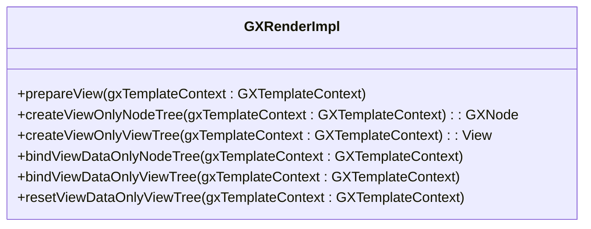
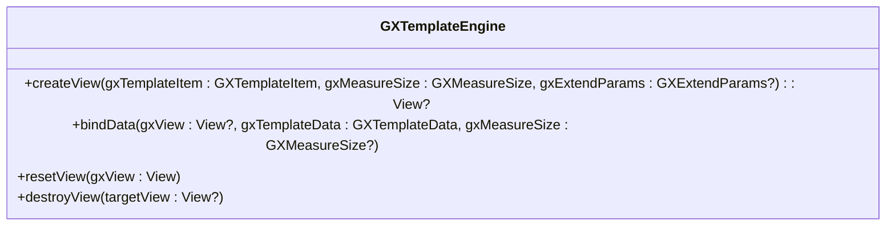
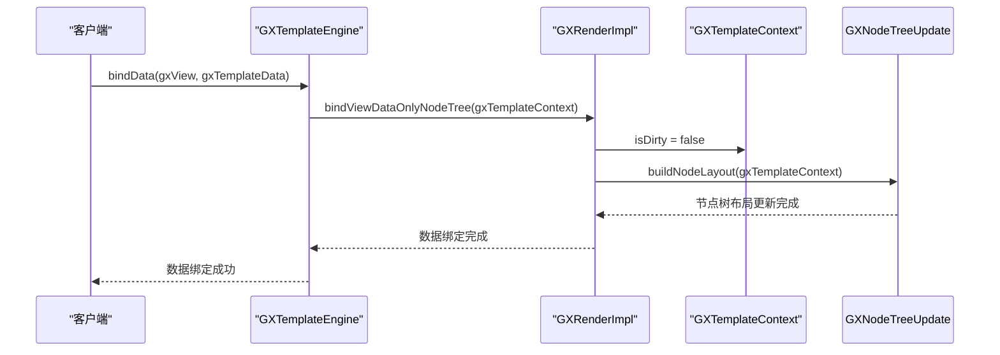
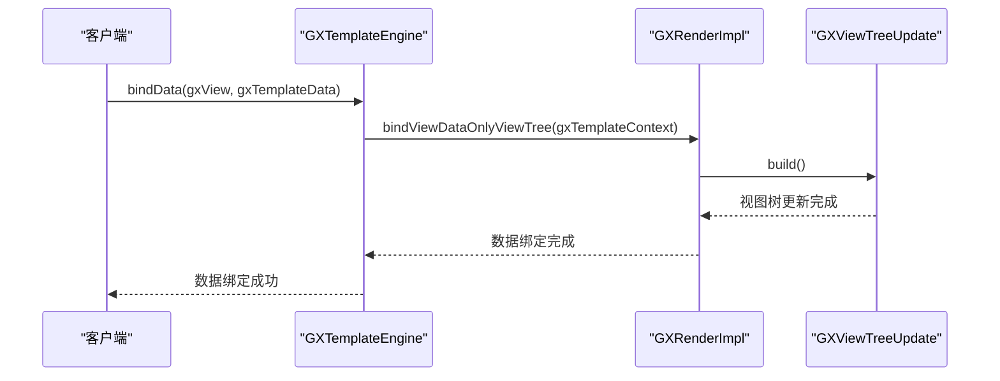

# 批量更新优化

<cite>
**本文档引用文件**   
- [GXRenderImpl.kt](file://GaiaXAndroid/src/main/kotlin/com/alibaba/gaiax/render/GXRenderImpl.kt)
- [GXTemplateEngine.kt](file://GaiaXAndroid/src/main/kotlin/com/alibaba/gaiax/GXTemplateEngine.kt)
- [GXTemplateContext.kt](file://GaiaXAndroid/src/main/kotlin/com/alibaba/gaiax/context/GXTemplateContext.kt)
- [GXNodeTreeUpdate.kt](file://GaiaXAndroid/src/main/kotlin/com/alibaba/gaiax/render/node/GXNodeTreeUpdate.kt)
- [GXViewTreeUpdate.kt](file://GaiaXAndroid/src/main/kotlin/com/alibaba/gaiax/render/view/GXViewTreeUpdate.kt)
</cite>

## 目录
1. [引言](#引言)
2. [批量更新机制概述](#批量更新机制概述)
3. [核心组件分析](#核心组件分析)
4. [变更收集与事务管理](#变更收集与事务管理)
5. [异步提交机制](#异步提交机制)
6. [初学者实践指南](#初学者实践指南)
7. [高级开发者技巧](#高级开发者技巧)
8. [复杂数据绑定场景优化](#复杂数据绑定场景优化)
9. [性能监控与对比](#性能监控与对比)
10. [结论](#结论)

## 引言
GaiaX框架的批量更新机制旨在通过合并属性更新操作来显著减少UI线程的压力，从而提升应用性能和用户体验。本技术文档深入分析了GXRenderImpl中批量更新的实现原理，包括变更收集、事务管理和异步提交机制。文档为初学者提供了合理使用批量更新API的基本实践，为高级开发者提供了自定义更新策略和优化更新粒度的进阶技巧。此外，文档详细说明了如何在复杂数据绑定场景中最大化批量更新效率，如何通过GXTemplateEngine的事务机制确保更新一致性，以及如何处理跨层级的批量更新问题。

## 批量更新机制概述
GaiaX框架的批量更新机制通过将多个属性更新操作合并为一个事务来减少UI线程的负担。这种机制在处理大量数据更新时尤为重要，因为它可以避免频繁的UI重绘和布局计算，从而提高应用的响应速度和流畅度。

批量更新的核心思想是延迟执行UI更新，直到所有必要的数据变更都已收集完毕。通过这种方式，框架可以在一个原子操作中应用所有变更，而不是为每个单独的变更触发一次UI更新。这不仅减少了UI线程的工作量，还确保了UI状态的一致性。

## 核心组件分析

### GXRenderImpl
GXRenderImpl是GaiaX框架中负责渲染的核心类。它提供了多个方法来处理视图的创建和数据绑定，包括`prepareView`、`createViewOnlyNodeTree`、`createViewOnlyViewTree`、`bindViewDataOnlyNodeTree`和`bindViewDataOnlyViewTree`。这些方法共同协作，实现了从模板到视图的完整渲染流程。

**图源**
- [GXRenderImpl.kt](file://GaiaXAndroid/src/main/kotlin/com/alibaba/gaiax/render/GXRenderImpl.kt)

### GXTemplateEngine
GXTemplateEngine是GaiaX框架的引擎类，负责管理模板的生命周期和数据绑定。它提供了`createView`、`bindData`、`resetView`和`destroyView`等方法，用于创建、更新和销毁模板视图。

**图源**
- [GXTemplateEngine.kt](file://GaiaXAndroid/src/main/kotlin/com/alibaba/gaiax/GXTemplateEngine.kt)

**节源**
- [GXTemplateEngine.kt](file://GaiaXAndroid/src/main/kotlin/com/alibaba/gaiax/GXTemplateEngine.kt)

## 变更收集与事务管理
变更收集是批量更新机制的第一步。当数据发生变化时，框架不会立即更新UI，而是将变更记录在一个事务中。事务管理确保了所有变更的原子性和一致性。

在GXTemplateContext中，`isDirty`标志用于跟踪模板是否需要更新。当数据绑定时，`bindViewDataOnlyNodeTree`方法会检查`isDirty`标志，并根据需要更新节点树的布局。

**图源**
- [GXRenderImpl.kt](file://GaiaXAndroid/src/main/kotlin/com/alibaba/gaiax/render/GXRenderImpl.kt)
- [GXNodeTreeUpdate.kt](file://GaiaXAndroid/src/main/kotlin/com/alibaba/gaiax/render/node/GXNodeTreeUpdate.kt)

**节源**
- [GXRenderImpl.kt](file://GaiaXAndroid/src/main/kotlin/com/alibaba/gaiax/render/GXRenderImpl.kt)
- [GXNodeTreeUpdate.kt](file://GaiaXAndroid/src/main/kotlin/com/alibaba/gaiax/render/node/GXNodeTreeUpdate.kt)

## 异步提交机制
异步提交机制是批量更新的最后一步。一旦所有变更都已收集并记录在事务中，框架会在适当的时机异步提交这些变更。这通常发生在UI线程空闲时，以避免阻塞主线程。

在GXViewTreeUpdate中，`build`方法负责将节点树的布局应用到实际的视图上。这个过程是异步的，确保了UI更新不会影响应用的响应性。

**图源**
- [GXRenderImpl.kt](file://GaiaXAndroid/src/main/kotlin/com/alibaba/gaiax/render/GXRenderImpl.kt)
- [GXViewTreeUpdate.kt](file://GaiaXAndroid/src/main/kotlin/com/alibaba/gaiax/render/view/GXViewTreeUpdate.kt)

**节源**
- [GXRenderImpl.kt](file://GaiaXAndroid/src/main/kotlin/com/alibaba/gaiax/render/GXRenderImpl.kt)
- [GXViewTreeUpdate.kt](file://GaiaXAndroid/src/main/kotlin/com/alibaba/gaiax/render/view/GXViewTreeUpdate.kt)

## 初学者实践指南
对于初学者来说，合理使用批量更新API是提升应用性能的关键。以下是一些基本实践：

1. **避免频繁单属性更新**：尽量将多个属性更新操作合并为一次批量更新，以减少UI线程的压力。
2. **使用`bindData`方法**：`bindData`方法是推荐的数据绑定方式，它可以确保所有变更在一个事务中完成。
3. **监控更新频率**：通过日志或性能监控工具，定期检查更新频率，确保没有不必要的更新操作。

## 高级开发者技巧
对于高级开发者，自定义更新策略和优化更新粒度可以进一步提升应用性能。以下是一些进阶技巧：

1. **自定义更新策略**：通过实现自定义的`GXIViewBindData`接口，可以控制视图的更新逻辑，实现更精细的更新控制。
2. **优化更新粒度**：根据应用的具体需求，调整更新的粒度。例如，对于频繁变化的数据，可以采用更细粒度的更新策略。
3. **利用缓存机制**：合理利用缓存机制，避免重复计算和布局，提高更新效率。

## 复杂数据绑定场景优化
在复杂数据绑定场景中，最大化批量更新效率至关重要。以下是一些优化建议：

1. **使用事务机制**：通过GXTemplateEngine的事务机制，确保数据更新的一致性和原子性。
2. **处理跨层级更新**：在处理跨层级的批量更新时，确保所有相关节点的更新都在同一个事务中完成。
3. **避免循环引用**：在数据绑定时，避免创建循环引用，以防止无限递归和内存泄漏。

## 性能监控与对比
为了评估批量更新机制的效果，可以通过性能监控工具对比更新前后的UI响应性能。以下是一些监控指标：

1. **更新耗时**：记录每次更新的耗时，分析是否存在性能瓶颈。
2. **UI响应时间**：测量UI响应时间，确保应用的流畅性。
3. **内存使用**：监控内存使用情况，避免内存泄漏和过度消耗。

## 结论
GaiaX框架的批量更新机制通过合并属性更新操作，显著减少了UI线程的压力，提升了应用的性能和用户体验。通过深入分析GXRenderImpl中的变更收集、事务管理和异步提交机制，我们可以更好地理解和利用这一机制。无论是初学者还是高级开发者，都可以通过合理使用批量更新API和优化更新策略，进一步提升应用的性能。