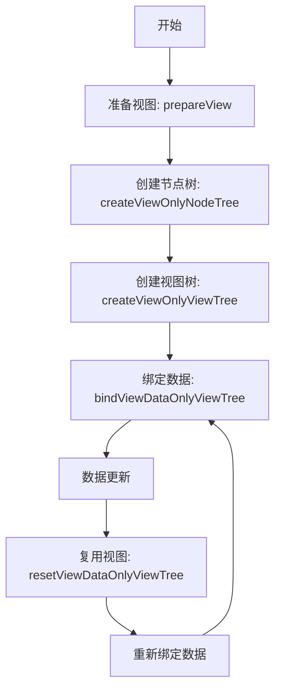
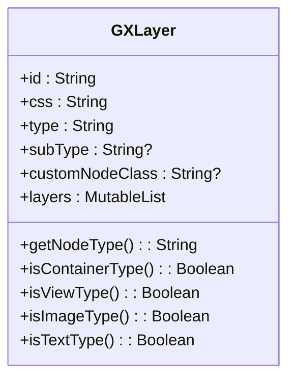
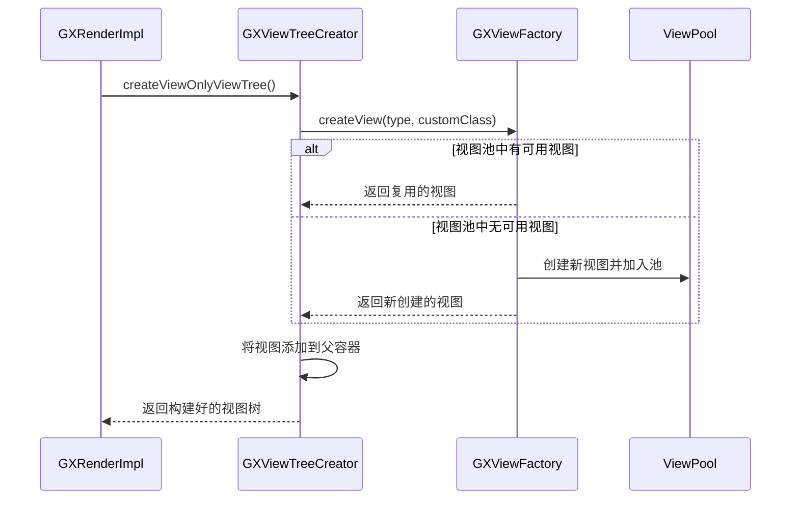
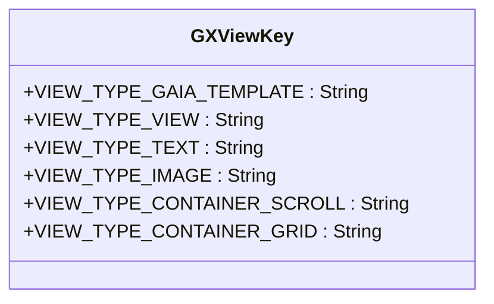

# 视图复用优化

<cite>
**本文档引用文件**  
- [GXRenderImpl.kt](file://GaiaXAndroid/src/main/kotlin/com/alibaba/gaiax/render/GXRenderImpl.kt)
- [GXLayer.kt](file://GaiaXAndroid/src/main/kotlin/com/alibaba/gaiax/template/GXLayer.kt)
- [GXViewTreeCreator.kt](file://GaiaXAndroid/src/main/kotlin/com/alibaba/gaiax/render/view/GXViewTreeCreator.kt)
- [GXNodeTreeCreator.kt](file://GaiaXAndroid/src/main/kotlin/com/alibaba/gaiax/render/node/GXNodeTreeCreator.kt)
- [GXViewFactory.kt](file://GaiaXAndroid/src/main/kotlin/com/alibaba/gaiax/render/view/GXViewFactory.kt)
- [GXViewTreeUpdate.kt](file://GaiaXAndroid/src/main/kotlin/com/alibaba/gaiax/render/view/GXViewTreeUpdate.kt)
- [GXNode.kt](file://GaiaXAndroid/src/main/kotlin/com/alibaba/gaiax/render/node/GXNode.kt)
- [GXViewKey.kt](file://GaiaXAndroid/src/main/kotlin/com/alibaba/gaiax/render/view/GXViewKey.kt)
</cite>

## 目录
1. [引言](#引言)
2. [视图复用机制概述](#视图复用机制概述)
3. [核心组件分析](#核心组件分析)
4. [视图复用实现原理](#视图复用实现原理)
5. [视图池管理与配置](#视图池管理与配置)
6. [滚动列表中的复用优化](#滚动列表中的复用优化)
7. [节点标识与复用正确性](#节点标识与复用正确性)
8. [高级复用策略](#高级复用策略)
9. [性能监控与评估](#性能监控与评估)
10. [总结](#总结)

## 引言
GaiaX框架通过高效的视图复用机制显著降低了UI渲染的性能开销。本技术文档深入剖析了框架中视图复用的核心实现，重点阐述了`GXRenderImpl`中视图复用的完整流程，包括视图类型识别、属性重置和状态管理等关键环节。文档旨在为开发者提供从基础配置到高级定制的全面指导，帮助在实际项目中最大化视图复用的效益。

## 视图复用机制概述
GaiaX框架的视图复用机制基于虚拟节点树（Virtual Node Tree）和真实视图树（View Tree）的分离设计。该机制通过预先创建和缓存视图对象，避免了在数据更新或滚动过程中频繁地创建和销毁视图，从而极大地提升了渲染性能。

视图复用的核心流程分为两个主要阶段：**节点树构建**和**视图树构建**。在`GXRenderImpl`中，`createViewOnlyNodeTree`方法负责创建虚拟节点树，而`createViewOnlyViewTree`方法则基于已构建的节点树来创建或复用真实的Android视图。这种分离设计使得布局计算（Layout）可以在不涉及昂贵的视图创建操作的情况下完成，为高效的复用奠定了基础。

**视图复用流程图**

**Diagram sources**
- [GXRenderImpl.kt](file://GaiaXAndroid/src/main/kotlin/com/alibaba/gaiax/render/GXRenderImpl.kt#L42-L104)

## 核心组件分析
视图复用机制由多个核心组件协同工作，每个组件承担着特定的职责。

### GXRenderImpl
`GXRenderImpl`是视图渲染的入口类，封装了视图创建和数据绑定的完整生命周期。其主要方法包括：
- `prepareView`: 准备阶段，进行布局计算。
- `createViewOnlyNodeTree`: 创建虚拟节点树。
- `createViewOnlyViewTree`: 创建真实视图树。
- `bindViewDataOnlyViewTree`: 将数据绑定到视图树。
- `resetViewDataOnlyViewTree`: 重置视图数据，为复用做准备。

该类通过协调`GXNodeTreeCreator`和`GXViewTreeCreator`等组件，实现了从模板数据到最终UI的转换。

**Section sources**
- [GXRenderImpl.kt](file://GaiaXAndroid/src/main/kotlin/com/alibaba/gaiax/render/GXRenderImpl.kt#L35-L104)

### GXLayer
`GXLayer`类定义了模板的层级结构，是视图类型识别的基础。它包含了节点的ID、类型（`type`）、子类型（`subType`）等关键信息。框架通过`GXLayer`中的类型信息来判断节点的性质，例如通过`isViewType()`、`isImageType()`等方法来区分视图、图片等不同类型的节点，从而决定如何进行复用。

**Diagram sources**
- [GXLayer.kt](file://GaiaXAndroid/src/main/kotlin/com/alibaba/gaiax/template/GXLayer.kt#L28-L309)

## 视图复用实现原理
视图复用的实现原理深植于`GXViewTreeCreator`和`GXViewTreeUpdate`两个类中，它们共同完成了视图的创建、更新和重用。

### 视图创建与复用流程
视图的创建并非在每次渲染时都从零开始。`GXViewTreeCreator`继承自`GXViewTreeMerger`，在`build`方法中遍历节点树，为每个节点创建或获取对应的视图。关键在于`withChildView`方法，它通过`GXViewFactory`来创建视图实例。

**Diagram sources**
- [GXViewTreeCreator.kt](file://GaiaXAndroid/src/main/kotlin/com/alibaba/gaiax/render/view/GXViewTreeCreator.kt#L29-L100)
- [GXViewFactory.kt](file://GaiaXAndroid/src/main/kotlin/com/alibaba/gaiax/render/view/GXViewFactory.kt#L30-L74)

### 属性重置与状态管理
当一个视图被复用时，其旧的状态和数据必须被清除，以避免显示错误。`GXNode`类中的`reset`方法负责这一关键任务。在`GXNodeTreeUpdate.resetView`被调用时，它会递归地重置整个节点树，将`layoutByBind`等布局信息置空，并调用`templateNode.reset()`来清理与数据绑定相关的状态。

此外，`GXNode`还持有对真实视图（`view`）的引用。在复用时，框架会直接使用这个已存在的视图引用，而不是创建新的视图对象，这正是性能提升的关键所在。`GXViewTreeUpdate`在更新视图时，会调用`GXViewLayoutParamsUtils.updateLayoutParams`来更新视图的布局参数，而不是重新创建视图。

**Section sources**
- [GXNode.kt](file://GaiaXAndroid/src/main/kotlin/com/alibaba/gaiax/render/node/GXNode.kt#L33-L220)
- [GXViewTreeUpdate.kt](file://GaiaXAndroid/src/main/kotlin/com/alibaba/gaiax/render/view/GXViewTreeUpdate.kt#L29-L81)

## 视图池管理与配置
虽然框架内部的视图池管理是自动的，但开发者可以通过合理的配置来优化其行为。

### 基础实践
对于初学者，最佳实践是确保模板结构的稳定性和可预测性。例如，在滚动列表中，应尽量保证每一项的视图结构相似，这样框架才能更高效地进行复用。避免在列表项中使用过于复杂或动态变化的布局，这会增加视图复用的难度。

合理配置视图复用池大小通常由框架自动管理，但开发者可以通过控制列表的预加载数量和可见项数量来间接影响池的大小。保持列表项的轻量化，减少单个视图的内存占用，可以使得视图池能够容纳更多实例，从而提高复用率。

## 滚动列表中的复用优化
滚动列表是视图复用最典型的应用场景。GaiaX通过`GXScrollView`和`GXGridView`等容器组件，结合`GXNode`的`scrollNodeCache`等缓存机制，实现了高效的列表滚动。

在滚动过程中，当一个视图滑出屏幕时，它并不会被销毁，而是被放入复用池。当新的视图需要显示在屏幕上时，框架会首先尝试从池中获取一个同类型的视图，然后将其内容更新为目标数据。这种“回收-重用”的模式是实现流畅滚动的核心。

为了最大化复用效率，开发者应确保列表项的`GXLayer`结构清晰，并为每个节点设置唯一的`id`。这有助于框架准确地识别和匹配可复用的视图。

**Section sources**
- [GXTemplateContext.kt](file://GaiaXAndroid/src/main/kotlin/com/alibaba/gaiax/context/GXTemplateContext.kt#L34-L251)

## 节点标识与复用正确性
`GXLayer`中的`id`字段是确保复用正确性的关键。框架通过节点的`id`和`type`来判断两个节点是否“类型相同”，从而决定是否可以进行复用。如果两个节点的`id`和`type`都相同，框架就会认为它们是同一种视图，可以安全地复用。

因此，为模板中的每个节点提供一个稳定且唯一的`id`至关重要。如果`id`动态变化，框架可能会错误地认为这是一个全新的视图，从而放弃复用，导致性能下降。`GXViewKey`常量类定义了所有支持的视图类型，如`VIEW_TYPE_VIEW`、`VIEW_TYPE_IMAGE`等，这些类型标识是进行类型匹配的依据。

**Diagram sources**
- [GXViewKey.kt](file://GaiaXAndroid/src/main/kotlin/com/alibaba/gaiax/render/view/GXViewKey.kt#L22-L49)

## 高级复用策略
对于高级开发者，可以通过扩展框架来实现更复杂的复用策略。

### 自定义视图复用
通过`GXRegisterCenter`注册自定义组件，可以实现对特定类型视图的精细化控制。例如，可以为一个复杂的自定义视图实现`GXIRelease`接口，在`release`方法中执行更彻底的资源清理，确保复用时不会残留旧状态。

### 扩展复用条件
虽然框架默认基于`id`和`type`进行匹配，但理论上可以通过修改`GXNodeTreeCreator`的创建逻辑或`GXViewFactory`的创建策略，来引入更复杂的复用条件判断。例如，可以根据节点的某些特定属性或数据特征来决定是否复用。

## 性能监控与评估
监控视图复用的效率是优化性能的重要环节。虽然文档中未直接提供监控API，但开发者可以通过以下方式间接评估：
1. **内存占用对比**：在启用和禁用复用（如果可能）的情况下，使用Android Profiler观察应用的内存占用情况。复用效率高时，内存峰值应显著降低。
2. **帧率（FPS）监控**：在滚动列表等场景下，使用系统工具监控帧率。高效的视图复用应能维持稳定的高帧率。
3. **日志分析**：`GXRenderImpl`中的`Log.runE`语句记录了关键方法的调用，通过分析这些日志的频率和耗时，可以推断出复用的活跃程度。

## 总结
GaiaX框架的视图复用机制是一个高效、可靠的性能优化方案。通过深入理解`GXRenderImpl`的工作流程、`GXLayer`的节点标识以及`GXNode`的状态管理，开发者可以充分利用这一机制。遵循为节点设置稳定ID、保持模板结构清晰等最佳实践，可以显著提升应用的流畅度。对于有更高需求的场景，框架也提供了通过扩展机制进行深度定制的可能性。