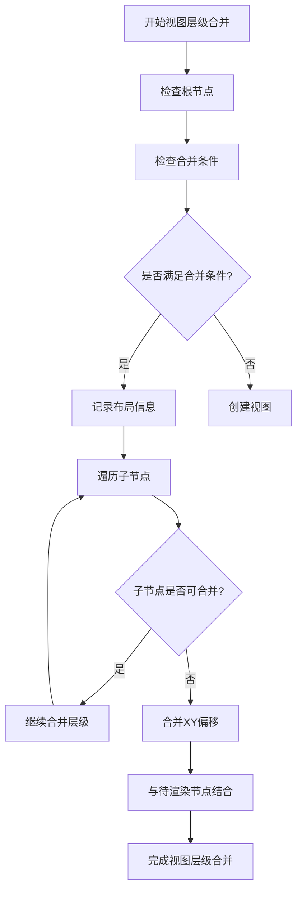
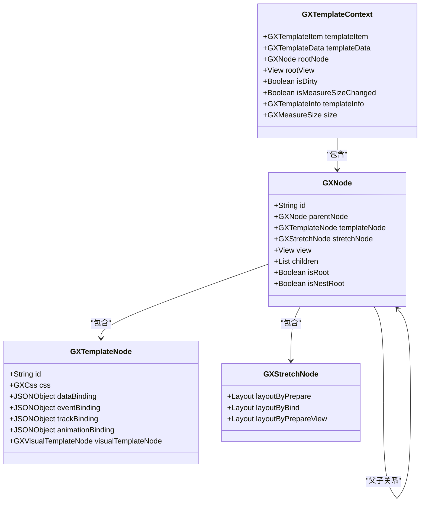
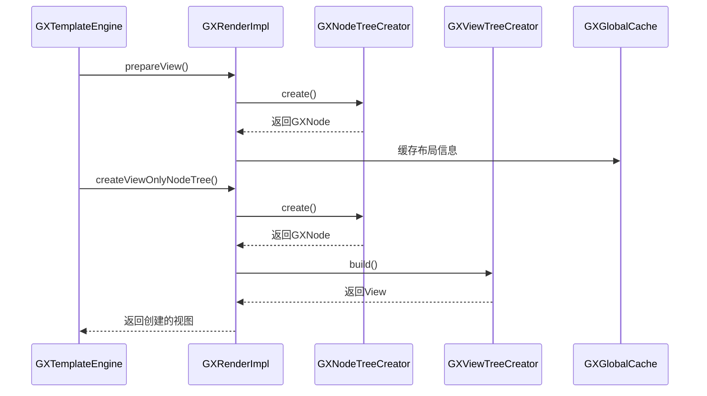
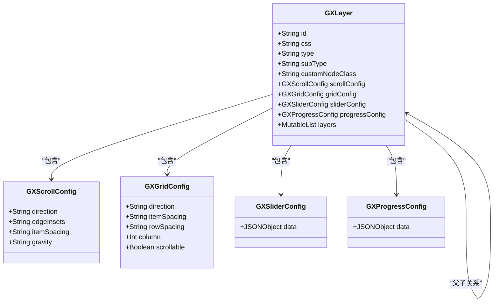
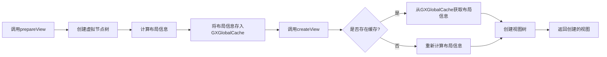
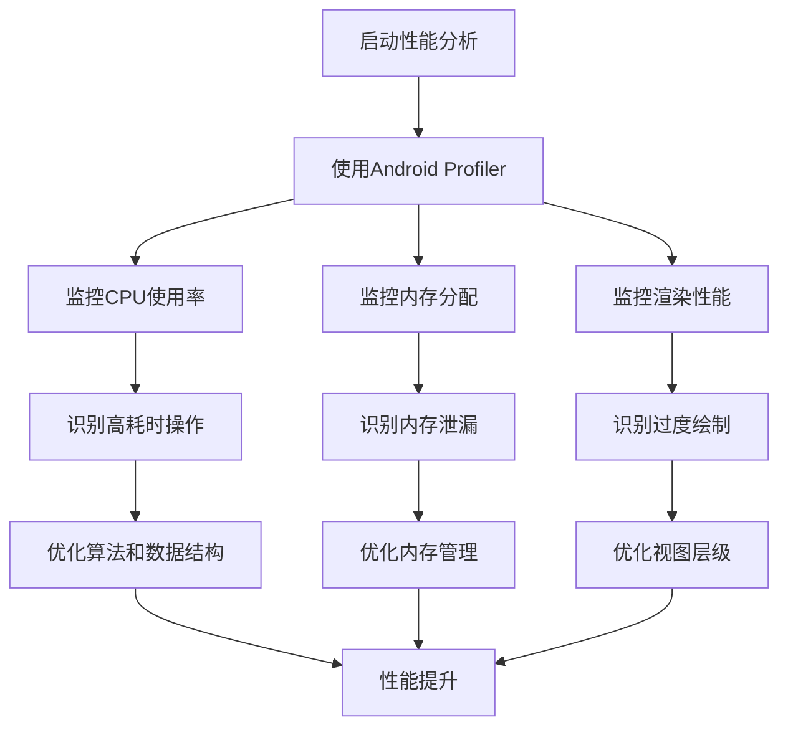

# 视图渲染优化

<cite>
**本文档中引用的文件**  
- [GXRenderImpl.kt](file://GaiaXAndroid/src/main/kotlin/com/alibaba/gaiax/render/GXRenderImpl.kt)
- [GXLayer.kt](file://GaiaXAndroid/src/main/kotlin/com/alibaba/gaiax/template/GXLayer.kt)
- [GXTemplateEngine.kt](file://GaiaXAndroid/src/main/kotlin/com/alibaba/gaiax/GXTemplateEngine.kt)
- [GXViewTreeMerger.kt](file://GaiaXAndroid/src/main/kotlin/com/alibaba/gaiax/render/view/GXViewTreeMerger.kt)
- [GXNodeTreeCreator.kt](file://GaiaXAndroid/src/main/kotlin/com/alibaba/gaiax/render/node/GXNodeTreeCreator.kt)
- [GXViewTreeCreator.kt](file://GaiaXAndroid/src/main/kotlin/com/alibaba/gaiax/render/view/GXViewTreeCreator.kt)
</cite>

## 目录
1. [简介](#简介)
2. [核心优化技术](#核心优化技术)
3. [视图层级合并](#视图层级合并)
4. [节点复用与脏区域更新](#节点复用与脏区域更新)
5. [模板解析与节点树创建优化](#模板解析与节点树创建优化)
6. [GXLayer层级管理与过度绘制优化](#gxlayer层级管理与过度绘制优化)
7. [GXTemplateEngine缓存机制](#gxtemplateengine缓存机制)
8. [性能分析与监控](#性能分析与监控)
9. [总结](#总结)

## 简介
GaiaX框架提供了一套完整的视图渲染解决方案，通过虚拟节点树与真实视图树的分离设计，实现了高效的模板渲染机制。本指南深入分析GXRenderImpl的实现原理，重点介绍视图创建开销优化和渲染效率提升的核心技术。针对不同层次的开发者，提供从基础到高级的优化策略，帮助开发者构建高性能的动态模板应用。

## 核心优化技术
GaiaX框架通过多层次的优化技术来提升视图渲染性能。核心优化技术包括视图层级合并、节点复用、脏区域更新、模板解析缓存等。这些技术协同工作，显著减少了视图创建的开销，提升了渲染效率。通过分析GXRenderImpl的实现，我们可以深入了解这些优化技术的具体应用。

**本节引用文件**
- [GXRenderImpl.kt](file://GaiaXAndroid/src/main/kotlin/com/alibaba/gaiax/render/GXRenderImpl.kt)

## 视图层级合并
视图层级合并是GaiaX框架中一项重要的性能优化技术，通过减少视图层级来降低过度绘制和布局计算开销。该技术基于虚拟节点树的分析，将符合条件的视图层级进行合并，从而减少实际创建的视图数量。

**图表来源**
- [GXViewTreeMerger.kt](file://GaiaXAndroid/src/main/kotlin/com/alibaba/gaiax/render/view/GXViewTreeMerger.kt)

**本节引用文件**
- [GXViewTreeMerger.kt](file://GaiaXAndroid/src/main/kotlin/com/alibaba/gaiax/render/view/GXViewTreeMerger.kt)

## 节点复用与脏区域更新
节点复用和脏区域更新是GaiaX框架中提高渲染效率的关键技术。通过复用已创建的节点和仅更新发生变化的区域，可以显著减少视图创建和布局计算的开销。

**图表来源**
- [GXRenderImpl.kt](file://GaiaXAndroid/src/main/kotlin/com/alibaba/gaiax/render/GXRenderImpl.kt)
- [GXNode.kt](file://GaiaXAndroid/src/main/kotlin/com/alibaba/gaiax/render/node/GXNode.kt)

**本节引用文件**
- [GXRenderImpl.kt](file://GaiaXAndroid/src/main/kotlin/com/alibaba/gaiax/render/GXRenderImpl.kt)

## 模板解析与节点树创建优化
模板解析后的节点树创建过程是视图渲染的关键环节。GaiaX框架通过优化节点树的创建流程，减少了不必要的计算和内存分配，从而提升了整体性能。

**图表来源**
- [GXTemplateEngine.kt](file://GaiaXAndroid/src/main/kotlin/com/alibaba/gaiax/GXTemplateEngine.kt)
- [GXNodeTreeCreator.kt](file://GaiaXAndroid/src/main/kotlin/com/alibaba/gaiax/render/node/GXNodeTreeCreator.kt)
- [GXViewTreeCreator.kt](file://GaiaXAndroid/src/main/kotlin/com/alibaba/gaiax/render/view/GXViewTreeCreator.kt)

**本节引用文件**
- [GXTemplateEngine.kt](file://GaiaXAndroid/src/main/kotlin/com/alibaba/gaiax/GXTemplateEngine.kt)
- [GXNodeTreeCreator.kt](file://GaiaXAndroid/src/main/kotlin/com/alibaba/gaiax/render/node/GXNodeTreeCreator.kt)
- [GXViewTreeCreator.kt](file://GaiaXAndroid/src/main/kotlin/com/alibaba/gaiax/render/view/GXViewTreeCreator.kt)

## GXLayer层级管理与过度绘制优化
GXLayer类负责管理节点的层级信息，通过合理的层级管理可以有效减少过度绘制，提升渲染性能。该类定义了节点的ID、样式、类型等关键属性，并提供了判断节点类型和容器类型的便捷方法。

**图表来源**
- [GXLayer.kt](file://GaiaXAndroid/src/main/kotlin/com/alibaba/gaiax/template/GXLayer.kt)

**本节引用文件**
- [GXLayer.kt](file://GaiaXAndroid/src/main/kotlin/com/alibaba/gaiax/template/GXLayer.kt)

## GXTemplateEngine缓存机制
GXTemplateEngine通过缓存机制避免重复解析模板，显著提升了渲染性能。该机制在prepareView阶段将布局信息缓存，在后续的createView操作中直接使用缓存的布局数据，避免了重复的布局计算。

**图表来源**
- [GXTemplateEngine.kt](file://GaiaXAndroid/src/main/kotlin/com/alibaba/gaiax/GXTemplateEngine.kt)
- [GXGlobalCache.kt](file://GaiaXAndroid/src/main/kotlin/com/alibaba/gaiax/utils/GXGlobalCache.kt)

**本节引用文件**
- [GXTemplateEngine.kt](file://GaiaXAndroid/src/main/kotlin/com/alibaba/gaiax/GXTemplateEngine.kt)

## 性能分析与监控
为了有效优化视图渲染性能，开发者需要使用适当的工具进行性能分析和监控。Android Profiler等工具可以帮助开发者识别性能瓶颈，监控内存使用情况和渲染性能。

**图表来源**
- [GXTemplateEngine.kt](file://GaiaXAndroid/src/main/kotlin/com/alibaba/gaiax/GXTemplateEngine.kt)

**本节引用文件**
- [GXTemplateEngine.kt](file://GaiaXAndroid/src/main/kotlin/com/alibaba/gaiax/GXTemplateEngine.kt)

## 总结
GaiaX框架通过一系列精心设计的优化技术，实现了高效的视图渲染性能。从视图层级合并到节点复用，从脏区域更新到缓存机制，每一项技术都在不同层面为性能提升做出了贡献。开发者应根据具体场景选择合适的优化策略，结合性能分析工具持续优化应用性能，为用户提供流畅的用户体验。