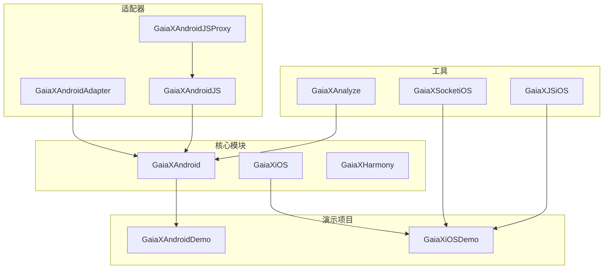
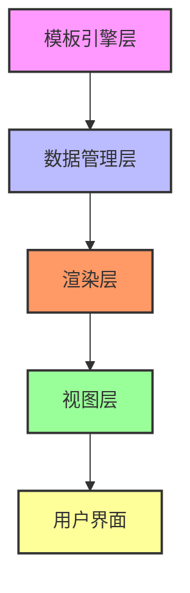
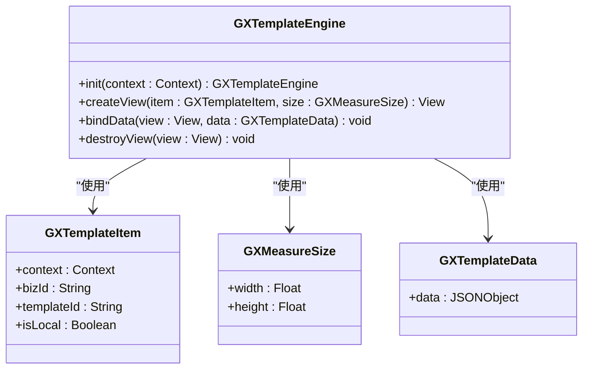
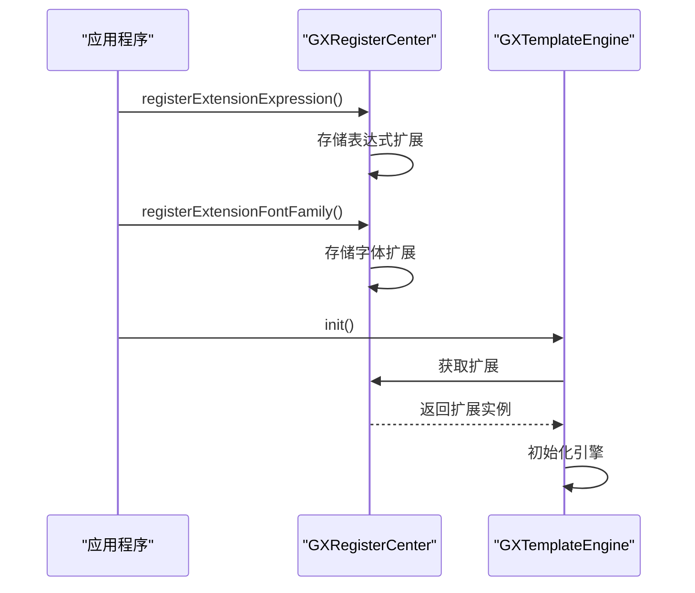
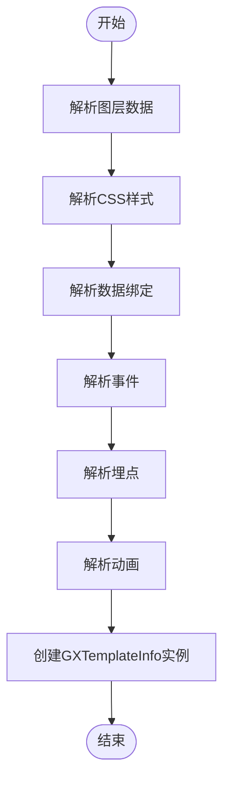
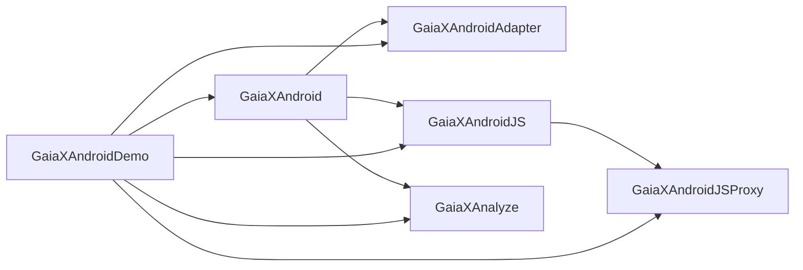

# 最佳实践

<cite>
**本文档引用的文件**   
- [GXTemplateEngine.kt](file://GaiaXAndroid/src/main/kotlin/com/alibaba/gaiax/GXTemplateEngine.kt)
- [GXRegisterCenter.kt](file://GaiaXAndroid/src/main/kotlin/com/alibaba/gaiax/GXRegisterCenter.kt)
- [GXTemplateInfo.kt](file://GaiaXAndroid/src/main/kotlin/com/alibaba/gaiax/template/GXTemplateInfo.kt)
- [GXTemplateKey.kt](file://GaiaXAndroid/src/main/kotlin/com/alibaba/gaiax/template/GXTemplateKey.kt)
- [GXStyleConvert.kt](file://GaiaXAndroid/src/main/kotlin/com/alibaba/gaiax/template/GXStyleConvert.kt)
- [MainActivity.kt](file://GaiaXAndroidDemo/app/src/main/kotlin/com/alibaba/gaiax/demo/MainActivity.kt)
- [NormalViewController.m](file://GaiaXiOSDemo/GaiaXiOSDemo/Render/NormalViewController.m)
- [GXTemplateEngine.h](file://GaiaXiOS/GaiaXiOS/Engine/GXTemplateEngine.h)
- [GXTemplateItem.h](file://GaiaXiOS/GaiaXiOS/Engine/GXTemplateItem.h)
- [README-EN.md](file://README-EN.md)
</cite>

## 目录
1. [简介](#简介)
2. [项目结构](#项目结构)
3. [核心组件](#核心组件)
4. [架构概述](#架构概述)
5. [详细组件分析](#详细组件分析)
6. [依赖分析](#依赖分析)
7. [性能考虑](#性能考虑)
8. [故障排除指南](#故障排除指南)
9. [结论](#结论)

## 简介
本文档旨在为GaiaX框架提供最佳实践指南，重点介绍模板设计、性能优化、错误处理和安全考虑等方面的经验总结。通过分析GaiaXAndroidDemo和GaiaXiOSDemo中的实现，提供具体的代码模式和设计建议。为初学者提供避免常见陷阱的指导，同时为经验丰富的开发者提供高级优化技巧。

## 项目结构
GaiaX框架包含多个模块，支持Android、iOS、HarmonyOS等多个平台。主要模块包括核心引擎、适配器、分析工具、演示项目等。

**Diagram sources**
- [GaiaXAndroid](file://GaiaXAndroid)
- [GaiaXiOS](file://GaiaXiOS)
- [GaiaXHarmony](file://GaiaXHarmony)
- [GaiaXAndroidAdapter](file://GaiaXAndroidAdapter)
- [GaiaXAndroidJS](file://GaiaXAndroidJS)
- [GaiaXAndroidJSProxy](file://GaiaXAndroidJSProxy)
- [GaiaXAndroidDemo](file://GaiaXAndroidDemo)
- [GaiaXiOSDemo](file://GaiaXiOSDemo)
- [GaiaXAnalyze](file://GaiaXAnalyze)
- [GaiaXSocketiOS](file://GaiaXSocketiOS)
- [GaiaXJSiOS](file://GaiaXJSiOS)

**Section sources**
- [GaiaXAndroid](file://GaiaXAndroid)
- [GaiaXiOS](file://GaiaXiOS)
- [GaiaXHarmony](file://GaiaXHarmony)

## 核心组件
GaiaX框架的核心组件包括模板引擎、注册中心、模板信息管理等。这些组件共同协作，实现动态模板的渲染和数据绑定。

**Section sources**
- [GXTemplateEngine.kt](file://GaiaXAndroid/src/main/kotlin/com/alibaba/gaiax/GXTemplateEngine.kt)
- [GXRegisterCenter.kt](file://GaiaXAndroid/src/main/kotlin/com/alibaba/gaiax/GXRegisterCenter.kt)
- [GXTemplateInfo.kt](file://GaiaXAndroid/src/main/kotlin/com/alibaba/gaiax/template/GXTemplateInfo.kt)

## 架构概述
GaiaX框架采用分层架构设计，主要包括模板引擎层、数据管理层、渲染层和视图层。各层之间通过清晰的接口进行通信，确保系统的可维护性和可扩展性。

**Diagram sources**
- [GXTemplateEngine.kt](file://GaiaXAndroid/src/main/kotlin/com/alibaba/gaiax/GXTemplateEngine.kt)
- [GXTemplateInfo.kt](file://GaiaXAndroid/src/main/kotlin/com/alibaba/gaiax/template/GXTemplateInfo.kt)

## 详细组件分析
### 模板引擎分析
模板引擎是GaiaX框架的核心，负责创建和管理模板视图。通过`GXTemplateEngine`类提供了一系列静态方法，用于初始化引擎、创建视图、绑定数据等。

#### 类图

**Diagram sources**
- [GXTemplateEngine.kt](file://GaiaXAndroid/src/main/kotlin/com/alibaba/gaiax/GXTemplateEngine.kt)
- [GXTemplateItem.kt](file://GaiaXAndroid/src/main/kotlin/com/alibaba/gaiax/GXTemplateEngine.kt#L418-L489)
- [GXMeasureSize.kt](file://GaiaXAndroid/src/main/kotlin/com/alibaba/gaiax/GXTemplateEngine.kt#L369-L373)
- [GXTemplateData.kt](file://GaiaXAndroid/src/main/kotlin/com/alibaba/gaiax/GXTemplateEngine.kt#L385-L413)

### 注册中心分析
注册中心负责管理各种扩展功能，如表达式、字体、颜色等。通过`GXRegisterCenter`类提供了一系列注册方法，允许开发者扩展框架功能。

#### 序列图

**Diagram sources**
- [GXRegisterCenter.kt](file://GaiaXAndroid/src/main/kotlin/com/alibaba/gaiax/GXRegisterCenter.kt)
- [GXTemplateEngine.kt](file://GaiaXAndroid/src/main/kotlin/com/alibaba/gaiax/GXTemplateEngine.kt#L887-L905)

### 模板信息分析
模板信息类负责解析和管理模板的元数据，包括样式、数据绑定、事件等。通过`GXTemplateInfo`类提供了一套完整的模板信息管理机制。

#### 流程图

**Diagram sources**
- [GXTemplateInfo.kt](file://GaiaXAndroid/src/main/kotlin/com/alibaba/gaiax/template/GXTemplateInfo.kt)

**Section sources**
- [GXTemplateEngine.kt](file://GaiaXAndroid/src/main/kotlin/com/alibaba/gaiax/GXTemplateEngine.kt)
- [GXRegisterCenter.kt](file://GaiaXAndroid/src/main/kotlin/com/alibaba/gaiax/GXRegisterCenter.kt)
- [GXTemplateInfo.kt](file://GaiaXAndroid/src/main/kotlin/com/alibaba/gaiax/template/GXTemplateInfo.kt)
- [GXTemplateKey.kt](file://GaiaXAndroid/src/main/kotlin/com/alibaba/gaiax/template/GXTemplateKey.kt)
- [GXStyleConvert.kt](file://GaiaXAndroid/src/main/kotlin/com/alibaba/gaiax/template/GXStyleConvert.kt)

## 依赖分析
GaiaX框架的各个模块之间存在明确的依赖关系。核心引擎依赖于数据管理和渲染模块，而演示项目则依赖于核心引擎和适配器模块。

**Diagram sources**
- [build.gradle](file://GaiaXAndroid/build.gradle)
- [build.gradle](file://GaiaXAndroidAdapter/build.gradle)
- [build.gradle](file://GaiaXAndroidJS/build.gradle)
- [build.gradle](file://GaiaXAndroidJSProxy/build.gradle)
- [build.gradle](file://GaiaXAnalyze/GXAnalyzeAndroid/build.gradle)
- [build.gradle](file://GaiaXAndroidDemo/build.gradle)

**Section sources**
- [GaiaXAndroid](file://GaiaXAndroid)
- [GaiaXAndroidAdapter](file://GaiaXAndroidAdapter)
- [GaiaXAndroidJS](file://GaiaXAndroidJS)
- [GaiaXAndroidJSProxy](file://GaiaXAndroidJSProxy)
- [GaiaXAnalyze](file://GaiaXAnalyze)
- [GaiaXAndroidDemo](file://GaiaXAndroidDemo)

## 性能考虑
在使用GaiaX框架时，需要注意以下性能优化点：
1. 合理使用`GXMeasureSize`，避免不必要的布局计算
2. 复用模板视图，减少创建和销毁开销
3. 优化数据绑定过程，避免频繁的UI更新
4. 使用缓存机制，减少重复的模板解析

## 故障排除指南
在开发过程中可能会遇到以下常见问题：
1. 模板无法正确渲染：检查模板文件路径和格式是否正确
2. 数据绑定失败：确认数据结构与模板定义匹配
3. 性能问题：使用性能分析工具定位瓶颈
4. 兼容性问题：确保目标平台版本支持所需功能

**Section sources**
- [GXTemplateEngine.kt](file://GaiaXAndroid/src/main/kotlin/com/alibaba/gaiax/GXTemplateEngine.kt)
- [GXRegisterCenter.kt](file://GaiaXAndroid/src/main/kotlin/com/alibaba/gaiax/GXRegisterCenter.kt)

## 结论
GaiaX框架提供了一套完整的动态模板解决方案，通过合理的架构设计和丰富的扩展机制，能够满足各种复杂的业务需求。开发者应遵循最佳实践，充分利用框架提供的功能，构建高性能、高质量的应用。