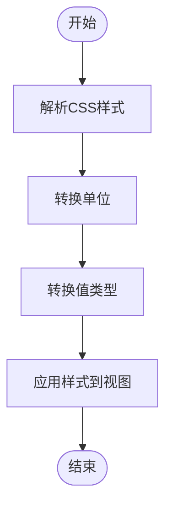
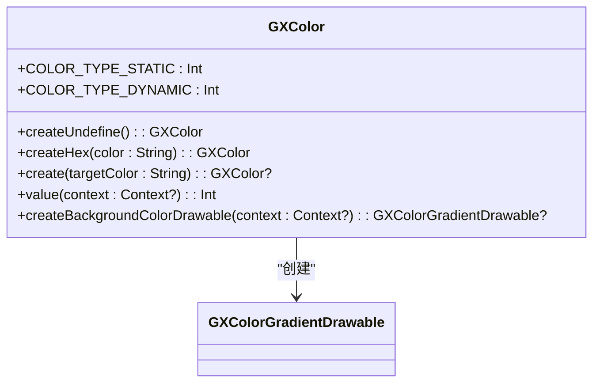
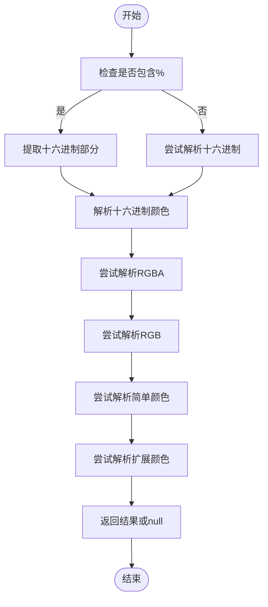
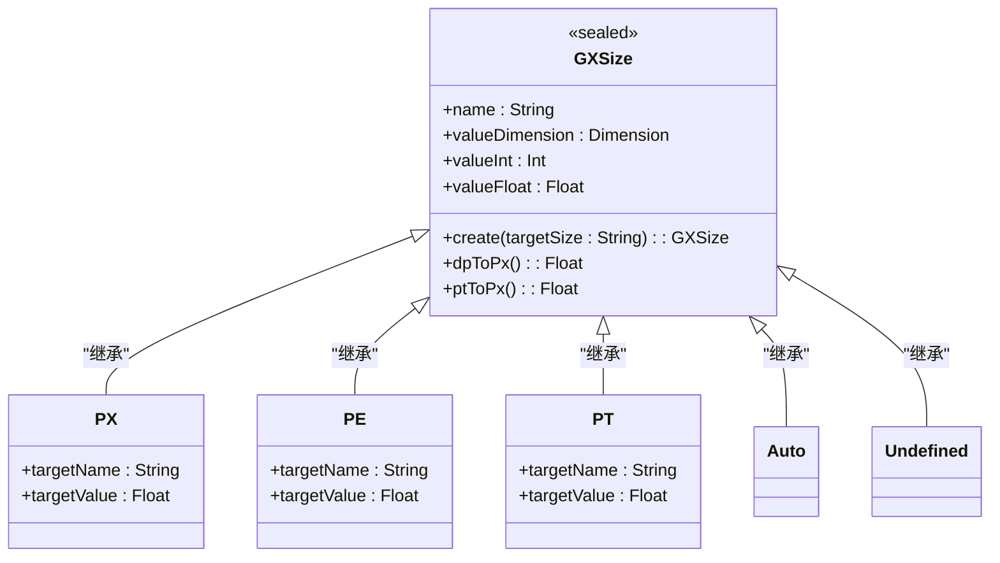
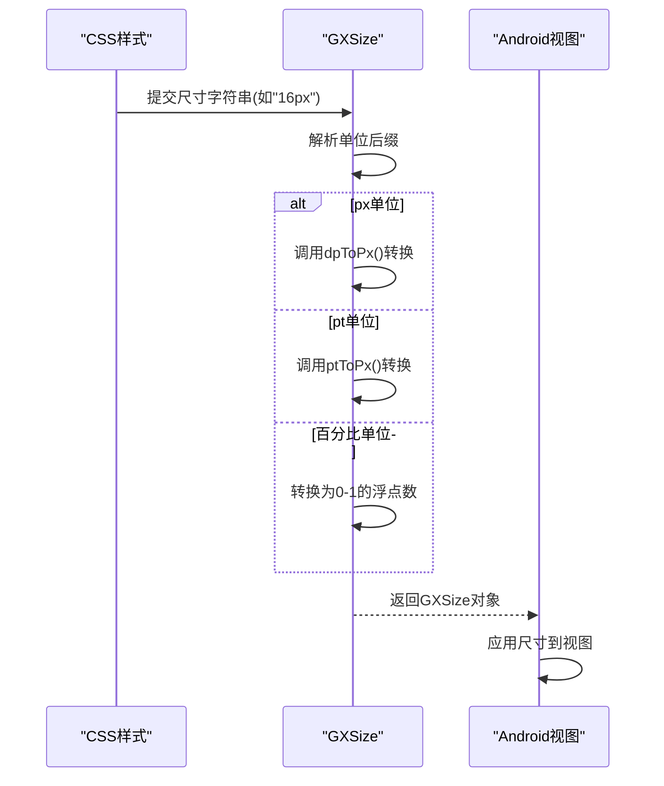
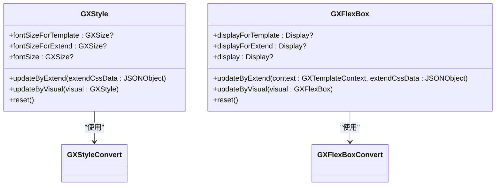
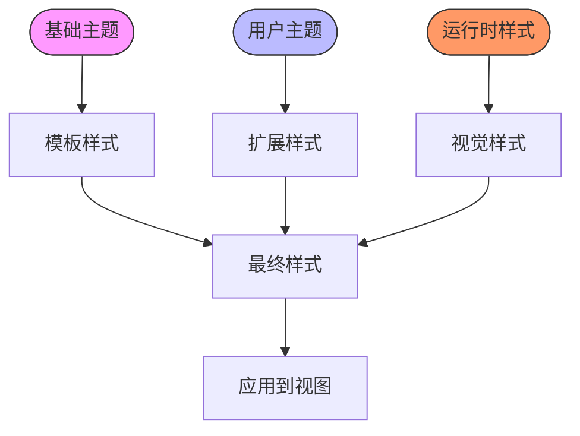
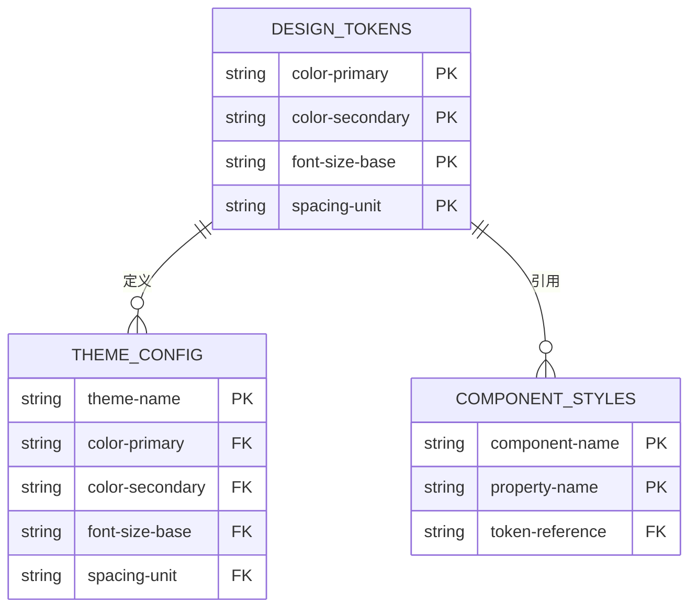
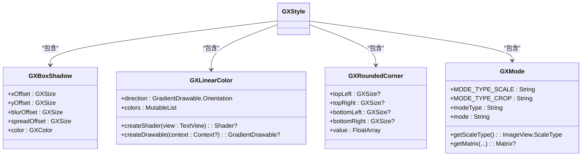

# 样式管理与主题设计

<cite>
**本文档引用文件**   
- [GXStyleConvert.kt](file://GaiaXAndroid/src/main/kotlin/com/alibaba/gaiax/template/GXStyleConvert.kt)
- [GXColor.kt](file://GaiaXAndroid/src/main/kotlin/com/alibaba/gaiax/template/GXColor.kt)
- [GXSize.kt](file://GaiaXAndroid/src/main/kotlin/com/alibaba/gaiax/template/GXSize.kt)
- [GXStyle.kt](file://GaiaXAndroid/src/main/kotlin/com/alibaba/gaiax/template/GXStyle.kt)
- [GXFlexBox.kt](file://GaiaXAndroid/src/main/kotlin/com/alibaba/gaiax/template/GXFlexBox.kt)
- [GXBoxShadow.kt](file://GaiaXAndroid/src/main/kotlin/com/alibaba/gaiax/template/GXBoxShadow.kt)
- [GXLinearColor.kt](file://GaiaXAndroid/src/main/kotlin/com/alibaba/gaiax/template/GXLinearColor.kt)
- [GXRoundedCorner.kt](file://GaiaXAndroid/src/main/kotlin/com/alibaba/gaiax/template/GXRoundedCorner.kt)
- [GXMode.kt](file://GaiaXAndroid/src/main/kotlin/com/alibaba/gaiax/template/GXMode.kt)
</cite>

## 目录
1. [简介](#简介)
2. [样式定义与转换流程](#样式定义与转换流程)
3. [颜色管理](#颜色管理)
4. [尺寸与单位转换](#尺寸与单位转换)
5. [样式继承与主题化设计](#样式继承与主题化设计)
6. [高级主题技巧](#高级主题技巧)
7. [样式冲突解决与最佳实践](#样式冲突解决与最佳实践)

## 简介
GaiaX框架提供了一套完整的样式管理与主题设计解决方案，通过GXStyleConvert、GXColor和GXSize等核心组件，实现了从CSS样式到原生视图样式的高效转换。本指南将深入解析样式定义、转换和应用的完整流程，帮助开发者构建美观且一致的用户界面。

## 样式定义与转换流程

GaiaX框架的样式管理基于CSS-like语法，通过GXStyleConvert类将CSS样式转换为Android原生样式。样式转换流程包括以下几个关键步骤：

1. **样式解析**：从JSON格式的CSS样式数据中提取各个样式属性
2. **单位转换**：将CSS单位（如px、pt、%）转换为Android设备独立像素
3. **值转换**：将CSS值转换为Android对应的枚举值或对象
4. **应用样式**：将转换后的样式应用到视图组件

**Diagram sources**
- [GXStyleConvert.kt](file://GaiaXAndroid/src/main/kotlin/com/alibaba/gaiax/template/GXStyleConvert.kt#L40-L505)

**Section sources**
- [GXStyleConvert.kt](file://GaiaXAndroid/src/main/kotlin/com/alibaba/gaiax/template/GXStyleConvert.kt#L40-L505)

## 颜色管理

### 颜色定义与解析
GXColor类是GaiaX框架中颜色管理的核心，支持多种颜色格式的解析和转换：

- 十六进制颜色（#RRGGBB, #AARRGGBB）
- RGB/RGBA颜色（rgb(r,g,b), rgba(r,g,b,a)）
- 预定义颜色名称（如BLACK, WHITE等）
- 动态颜色引用

**Diagram sources**
- [GXColor.kt](file://GaiaXAndroid/src/main/kotlin/com/alibaba/gaiax/template/GXColor.kt#L28-L185)

### 颜色转换流程
颜色转换流程如下：
1. 检查颜色字符串是否包含百分号（用于位置信息）
2. 依次尝试解析为十六进制、RGBA、RGB、简单颜色名称或扩展颜色
3. 返回对应的GXColor对象

**Diagram sources**
- [GXColor.kt](file://GaiaXAndroid/src/main/kotlin/com/alibaba/gaiax/template/GXColor.kt#L69-L85)

**Section sources**
- [GXColor.kt](file://GaiaXAndroid/src/main/kotlin/com/alibaba/gaiax/template/GXColor.kt#L28-L185)

## 尺寸与单位转换

### 尺寸单位支持
GXSize类支持多种尺寸单位的转换和管理：

- **px**：像素单位，直接转换为dp
- **pt**：点单位，基于基准屏幕尺寸进行缩放
- **%**：百分比单位，转换为相对比例
- **auto**：自动尺寸
- **undefined**：未定义尺寸

**Diagram sources**
- [GXSize.kt](file://GaiaXAndroid/src/main/kotlin/com/alibaba/gaiax/template/GXSize.kt#L29-L136)

### 单位转换逻辑
尺寸转换的核心逻辑包括：

1. **px转换**：使用TypedValue.applyDimension将dp转换为像素
2. **pt转换**：基于基准屏幕宽度（375dp）进行比例缩放
3. **百分比转换**：直接作为浮点数存储，表示相对比例

**Diagram sources**
- [GXSize.kt](file://GaiaXAndroid/src/main/kotlin/com/alibaba/gaiax/template/GXSize.kt#L33-L57)

**Section sources**
- [GXSize.kt](file://GaiaXAndroid/src/main/kotlin/com/alibaba/gaiax/template/GXSize.kt#L29-L136)

## 样式继承与主题化设计

### 样式优先级机制
GaiaX框架实现了灵活的样式继承机制，通过模板样式和扩展样式的优先级控制实现主题化设计：

**Diagram sources**
- [GXStyle.kt](file://GaiaXAndroid/src/main/kotlin/com/alibaba/gaiax/template/GXStyle.kt#L31-L565)
- [GXFlexBox.kt](file://GaiaXAndroid/src/main/kotlin/com/alibaba/gaiax/template/GXFlexBox.kt#L40-L946)

### 主题切换实现
主题化设计通过以下方式实现：

1. **模板样式**：定义在模板中的基础样式
2. **扩展样式**：运行时动态应用的样式，优先级高于模板样式
3. **视觉样式**：通过代码直接设置的样式，优先级最高

**Section sources**
- [GXStyle.kt](file://GaiaXAndroid/src/main/kotlin/com/alibaba/gaiax/template/GXStyle.kt#L31-L565)
- [GXFlexBox.kt](file://GaiaXAndroid/src/main/kotlin/com/alibaba/gaiax/template/GXFlexBox.kt#L40-L946)

## 高级主题技巧

### 设计令牌应用
通过设计令牌实现样式一致性：

### 复杂样式处理
GaiaX框架支持多种复杂样式的处理：

- **阴影效果**：通过GXBoxShadow类处理box-shadow属性
- **渐变背景**：通过GXLinearColor类处理线性渐变
- **圆角处理**：通过GXRoundedCorner类处理border-radius
- **图像模式**：通过GXMode类处理image的缩放模式

**Diagram sources**
- [GXBoxShadow.kt](file://GaiaXAndroid/src/main/kotlin/com/alibaba/gaiax/template/GXBoxShadow.kt#L22-L28)
- [GXLinearColor.kt](file://GaiaXAndroid/src/main/kotlin/com/alibaba/gaiax/template/GXLinearColor.kt#L28-L69)
- [GXRoundedCorner.kt](file://GaiaXAndroid/src/main/kotlin/com/alibaba/gaiax/template/GXRoundedCorner.kt#L22-L47)
- [GXMode.kt](file://GaiaXAndroid/src/main/kotlin/com/alibaba/gaiax/template/GXMode.kt#L25-L445)

**Section sources**
- [GXBoxShadow.kt](file://GaiaXAndroid/src/main/kotlin/com/alibaba/gaiax/template/GXBoxShadow.kt#L22-L28)
- [GXLinearColor.kt](file://GaiaXAndroid/src/main/kotlin/com/alibaba/gaiax/template/GXLinearColor.kt#L28-L69)
- [GXRoundedCorner.kt](file://GaiaXAndroid/src/main/kotlin/com/alibaba/gaiax/template/GXRoundedCorner.kt#L22-L47)
- [GXMode.kt](file://GaiaXAndroid/src/main/kotlin/com/alibaba/gaiax/template/GXMode.kt#L25-L445)

## 样式冲突解决与最佳实践

### 样式冲突解决策略
当多个样式源同时存在时，GaiaX框架采用以下优先级规则：

1. **视觉样式**：通过代码直接设置的样式，优先级最高
2. **扩展样式**：运行时动态应用的样式，优先级次之
3. **模板样式**：定义在模板中的基础样式，优先级最低

这种分层机制确保了主题切换的灵活性和可靠性。

### 性能优化建议
1. **缓存样式转换结果**：避免重复解析相同的样式字符串
2. **批量应用样式**：减少视图重绘次数
3. **合理使用动态样式**：避免频繁的主题切换导致性能下降
4. **预加载常用主题**：提高主题切换的响应速度

### 响应式设计考虑
通过pt单位实现响应式设计，pt单位基于基准屏幕尺寸进行缩放，确保在不同设备上保持一致的视觉效果。

### 可访问性考虑
1. **支持高对比度主题**：为视觉障碍用户提供更好的体验
2. **动态字体大小**：支持系统字体大小设置
3. **色彩无障碍**：确保颜色组合符合无障碍标准