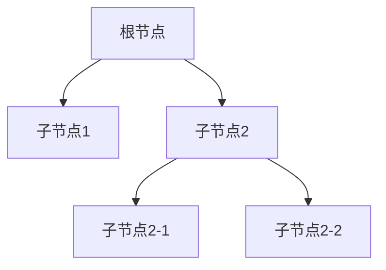

# 模板结构设计

<cite>
**本文档引用文件**   
- [GXTemplateInfo.kt](file://GaiaXAndroid/src/main/kotlin/com/alibaba/gaiax/template/GXTemplateInfo.kt)
- [GXLayer.kt](file://GaiaXAndroid/src/main/kotlin/com/alibaba/gaiax/template/GXLayer.kt)
- [GXTemplateNode.kt](file://GaiaXAndroid/src/main/kotlin/com/alibaba/gaiax/render/node/GXTemplateNode.kt)
- [GXTemplateEngine.kt](file://GaiaXAndroid/src/main/kotlin/com/alibaba/gaiax/GXTemplateEngine.kt)
</cite>

## 目录
1. [简介](#简介)
2. [核心组件](#核心组件)
3. [模板树形结构组织](#模板树形结构组织)
4. [根节点定义](#根节点定义)
5. [层级嵌套规则](#层级嵌套规则)
6. [节点类型管理](#节点类型管理)
7. [层级深度设计](#层级深度设计)
8. [性能优化策略](#性能优化策略)
9. [模板结构验证与调试](#模板结构验证与调试)
10. [性能评估指标](#性能评估指标)

## 简介
GaiaX框架提供了一套高效的模板结构设计体系，通过GXTemplateInfo和GXLayer的实现，构建清晰、高效的模板层级结构。本指南旨在为开发者提供从基础到高级的模板结构设计原则，帮助构建高质量的模板体系。

## 核心组件

GaiaX框架的模板结构设计主要依赖于以下几个核心组件：

- **GXTemplateInfo**: 模板信息类，包含模板的层级、样式、数据绑定等信息。
- **GXLayer**: 节点层级信息类，定义了节点的ID、样式ID、类型等属性。
- **GXTemplateNode**: 模板节点类，封装了节点的层级信息、样式信息、数据绑定信息等。

**Section sources**
- [GXTemplateInfo.kt](file://GaiaXAndroid/src/main/kotlin/com/alibaba/gaiax/template/GXTemplateInfo.kt#L32-L415)
- [GXLayer.kt](file://GaiaXAndroid/src/main/kotlin/com/alibaba/gaiax/template/GXLayer.kt#L28-L309)
- [GXTemplateNode.kt](file://GaiaXAndroid/src/main/kotlin/com/alibaba/gaiax/render/node/GXTemplateNode.kt#L40-L331)

## 模板树形结构组织

GaiaX框架中的模板结构采用树形结构进行组织，每个模板由一个根节点和多个子节点组成。根节点是模板的起点，子节点可以是普通节点或容器节点，容器节点可以包含更多的子节点，形成多层嵌套结构。



**Diagram sources**
- [GXTemplateInfo.kt](file://GaiaXAndroid/src/main/kotlin/com/alibaba/gaiax/template/GXTemplateInfo.kt#L33-L415)
- [GXLayer.kt](file://GaiaXAndroid/src/main/kotlin/com/alibaba/gaiax/template/GXLayer.kt#L28-L309)

## 根节点定义

根节点是模板的起点，通常是一个`gaia-template`类型的节点。根节点的定义需要包含以下属性：

- **id**: 节点的唯一标识符。
- **css**: 节点的样式ID。
- **type**: 节点类型，对于根节点，类型为`gaia-template`。
- **subType**: 子类型，可选，用于进一步定义节点类型。
- **customNodeClass**: 自定义View的渲染类型，可选。
- **scrollConfig**: 滚动配置，可选。
- **gridConfig**: 网格配置，可选。
- **sliderConfig**: 滑动配置，可选。
- **progressConfig**: 进度条配置，可选。
- **layers**: 子节点列表。

```kotlin
data class GXLayer constructor(
    val id: String,
    val css: String,
    val type: String,
    val subType: String? = null,
    val customNodeClass: String? = null,
    val scrollConfig: GXScrollConfig? = null,
    val gridConfig: GXGridConfig? = null,
    val sliderConfig: GXSliderConfig? = null,
    val progressConfig: GXProgressConfig? = null,
    val layers: MutableList<GXLayer> = mutableListOf()
)
```

**Section sources**
- [GXLayer.kt](file://GaiaXAndroid/src/main/kotlin/com/alibaba/gaiax/template/GXLayer.kt#L28-L309)

## 层级嵌套规则

GaiaX框架中的模板结构支持多层嵌套，但需要遵循一定的规则以确保结构的清晰性和高效性。主要规则包括：

- **容器节点**: 容器节点（如`scroll`、`grid`、`slider`）可以包含多个子节点，但子节点不能是容器节点。
- **普通节点**: 普通节点（如`view`、`image`、`richtext`）只能包含文本或图片等基本内容，不能包含其他节点。
- **嵌套子模板**: 嵌套子模板（`custom`类型）可以包含多个子节点，但这些子节点必须是普通节点或容器节点。

```kotlin
fun isContainerType(): Boolean {
    return isScrollType() || isGridType() || isSliderType()
}

fun isNestChildTemplateType(): Boolean {
    return type == GXViewKey.VIEW_TYPE_GAIA_TEMPLATE && subType == GXViewKey.VIEW_TYPE_CUSTOM && customNodeClass == null
}
```

**Section sources**
- [GXLayer.kt](file://GaiaXAndroid/src/main/kotlin/com/alibaba/gaiax/template/GXLayer.kt#L218-L245)

## 节点类型管理

GaiaX框架中的节点类型管理通过`GXLayer`类的`type`和`subType`属性来实现。不同的节点类型具有不同的功能和属性，开发者需要根据具体需求选择合适的节点类型。

- **视图类型**: `view`、`image`、`richtext`等，用于显示基本内容。
- **容器类型**: `scroll`、`grid`、`slider`等，用于组织和管理子节点。
- **自定义组件类型**: `custom`，用于实现特定功能的自定义组件。

```kotlin
fun isViewType(): Boolean =
    GXViewKey.VIEW_TYPE_VIEW == type || GXViewKey.VIEW_TYPE_GAIA_TEMPLATE == type && subType == null

fun isContainerType(): Boolean {
    return isScrollType() || isGridType() || isSliderType()
}

fun isCustomType(): Boolean {
    return type == GXViewKey.VIEW_TYPE_CUSTOM && customNodeClass != null
}
```

**Section sources**
- [GXLayer.kt](file://GaiaXAndroid/src/main/kotlin/com/alibaba/gaiax/template/GXLayer.kt#L267-L273)
- [GXLayer.kt](file://GaiaXAndroid/src/main/kotlin/com/alibaba/gaiax/template/GXLayer.kt#L218-L220)
- [GXLayer.kt](file://GaiaXAndroid/src/main/kotlin/com/alibaba/gaiax/template/GXLayer.kt#L250-L252)

## 层级深度设计

合理的层级深度设计对于提升模板的可读性和维护性至关重要。建议遵循以下原则：

- **避免过度嵌套**: 尽量减少层级深度，避免超过3层的嵌套。
- **合理使用容器节点**: 使用容器节点来组织和管理子节点，但不要过度使用。
- **模块化设计**: 将复杂的模板拆分为多个简单的子模板，提高复用性和可维护性。

```kotlin
fun isCanMergeType(): Boolean =
    !isContainerType() && (GXViewKey.VIEW_TYPE_VIEW == type || type == GXViewKey.VIEW_TYPE_GAIA_TEMPLATE)
```

**Section sources**
- [GXLayer.kt](file://GaiaXAndroid/src/main/kotlin/com/alibaba/gaiax/template/GXLayer.kt#L304-L306)

## 性能优化策略

为了提升模板的渲染性能，建议采取以下优化策略：

- **减少不必要的节点**: 删除不必要的节点，减少DOM树的复杂度。
- **优化样式计算**: 避免使用复杂的CSS选择器，减少样式计算的时间。
- **懒加载**: 对于长列表或大量数据的模板，使用懒加载技术，只加载可见区域的内容。
- **缓存机制**: 利用缓存机制，避免重复计算和渲染。

```kotlin
fun reset() {
    resetDataCache()
    layer.sliderConfig?.reset()
    layer.scrollConfig?.reset()
    layer.gridConfig?.reset()
    layer.progressConfig?.reset()
    css.style.reset()
    css.flexBox.reset()
    visualTemplateNode?.reset()
}
```

**Section sources**
- [GXTemplateNode.kt](file://GaiaXAndroid/src/main/kotlin/com/alibaba/gaiax/render/node/GXTemplateNode.kt#L99-L108)

## 模板结构验证与调试

在开发过程中，模板结构的验证和调试是非常重要的。建议使用以下方法：

- **静态分析**: 使用静态分析工具检查模板结构的正确性。
- **动态调试**: 在运行时通过日志和调试工具检查模板的渲染过程。
- **单元测试**: 编写单元测试，确保模板的各个部分都能正常工作。

```kotlin
fun findLayer(id: String): GXLayer? {
    return findLayerCache[id] ?: findLayer(id, layer)?.apply {
        findLayerCache[id] = this@apply
    }
}
```

**Section sources**
- [GXTemplateInfo.kt](file://GaiaXAndroid/src/main/kotlin/com/alibaba/gaiax/template/GXTemplateInfo.kt#L116-L119)

## 性能评估指标

为了评估模板的性能，可以使用以下指标：

- **渲染时间**: 测量模板从创建到完全渲染的时间。
- **内存占用**: 监控模板在运行时的内存占用情况。
- **CPU使用率**: 监控模板在运行时的CPU使用率。
- **FPS**: 测量模板在滚动或动画过程中的帧率。

```kotlin
fun createView(
    gxTemplateItem: GXTemplateItem,
    gxMeasureSize: GXMeasureSize,
    gxExtendParams: GXExtendParams? = null
): View? {
    Log.runE(TAG) { "createView" }
    return try {
        prepareView(gxTemplateItem, gxMeasureSize)
        val gxTemplateContext = createViewOnlyNodeTree(
            gxTemplateItem, gxMeasureSize, gxExtendParams
        )
        if (gxTemplateContext != null) {
            createViewOnlyViewTree(gxTemplateContext)
        } else {
            null
        }
    } catch (e: Exception) {
        if (GXExceptionHelper.isException()) {
            GXExceptionHelper.exception(e)
            null
        } else {
            throw e
        }
    }
}
```

**Section sources**
- [GXTemplateEngine.kt](file://GaiaXAndroid/src/main/kotlin/com/alibaba/gaiax/GXTemplateEngine.kt#L558-L583)