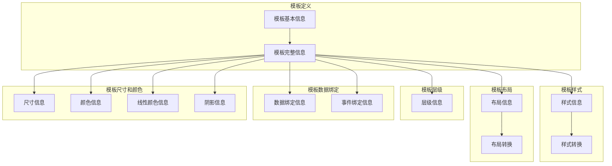
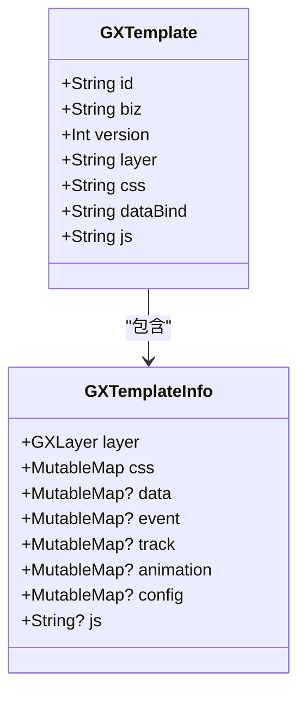
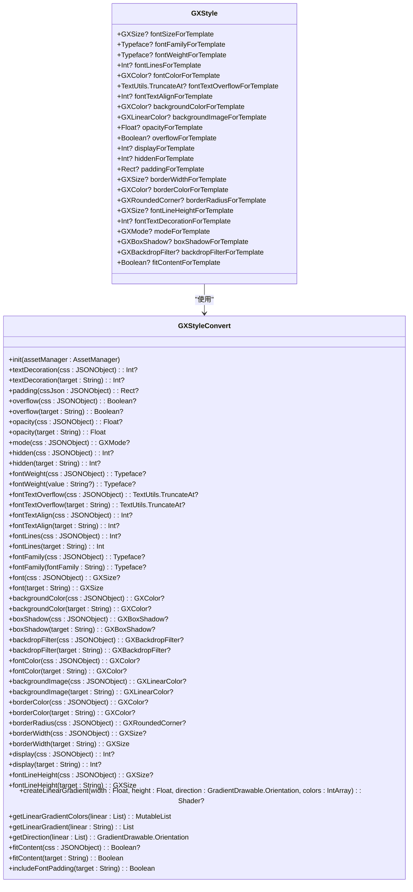
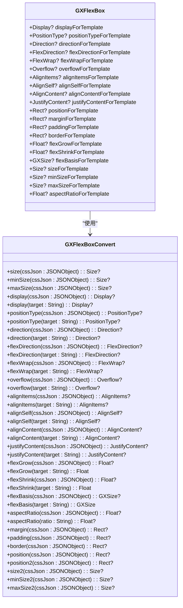
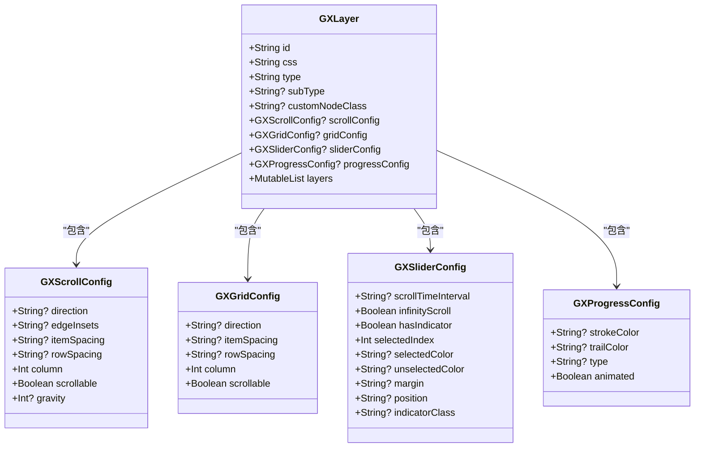
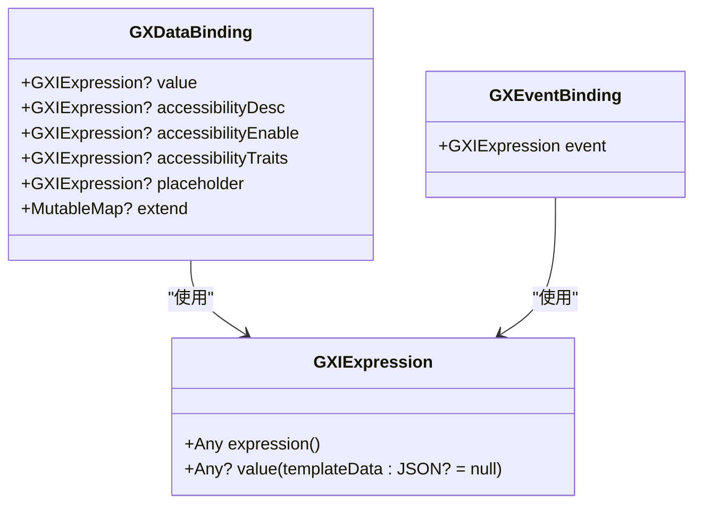
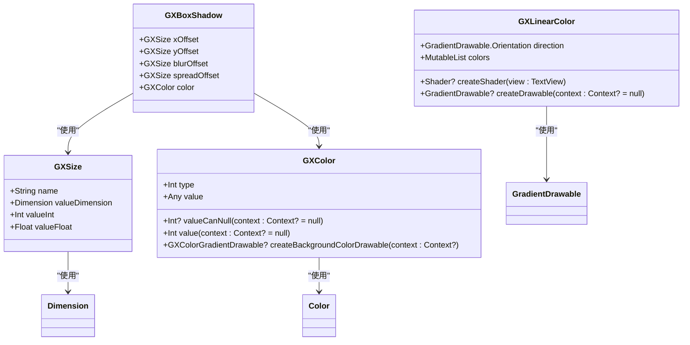
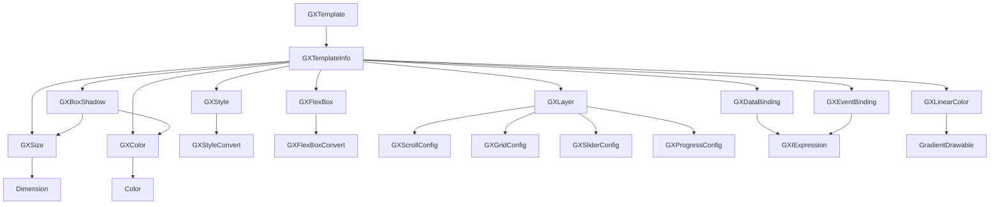

# 模板设计最佳实践

<cite>
**本文档引用文件**  
- [GXTemplate.kt](file://GaiaXAndroid/src/main/kotlin/com/alibaba/gaiax/template/GXTemplate.kt)
- [GXTemplateInfo.kt](file://GaiaXAndroid/src/main/kotlin/com/alibaba/gaiax/template/GXTemplateInfo.kt)
- [GXTemplateKey.kt](file://GaiaXAndroid/src/main/kotlin/com/alibaba/gaiax/template/GXTemplateKey.kt)
- [GXStyle.kt](file://GaiaXAndroid/src/main/kotlin/com/alibaba/gaiax/template/GXStyle.kt)
- [GXFlexBox.kt](file://GaiaXAndroid/src/main/kotlin/com/alibaba/gaiax/template/GXFlexBox.kt)
- [GXLayer.kt](file://GaiaXAndroid/src/main/kotlin/com/alibaba/gaiax/template/GXLayer.kt)
- [GXDataBinding.kt](file://GaiaXAndroid/src/main/kotlin/com/alibaba/gaiax/template/GXDataBinding.kt)
- [GXEventBinding.kt](file://GaiaXAndroid/src/main/kotlin/com/alibaba/gaiax/template/GXEventBinding.kt)
- [GXSize.kt](file://GaiaXAndroid/src/main/kotlin/com/alibaba/gaiax/template/GXSize.kt)
- [GXColor.kt](file://GaiaXAndroid/src/main/kotlin/com/alibaba/gaiax/template/GXColor.kt)
- [GXLinearColor.kt](file://GaiaXAndroid/src/main/kotlin/com/alibaba/gaiax/template/GXLinearColor.kt)
- [GXBoxShadow.kt](file://GaiaXAndroid/src/main/kotlin/com/alibaba/gaiax/template/GXBoxShadow.kt)
- [GXStyleConvert.kt](file://GaiaXAndroid/src/main/kotlin/com/alibaba/gaiax/template/GXStyleConvert.kt)
- [GXFlexBoxConvert.kt](file://GaiaXAndroid/src/main/kotlin/com/alibaba/gaiax/template/GXFlexBoxConvert.kt)
- [GXContainerConvert.kt](file://GaiaXAndroid/src/main/kotlin/com/alibaba/gaiax/template/GXContainerConvert.kt)
- [GXTemplateUtils.kt](file://GaiaXAndroid/src/main/kotlin/com/alibaba/gaiax/template/utils/GXTemplateUtils.kt)
- [GXTemplateItem.h](file://GaiaXiOS/GaiaXiOS/Engine/GXTemplateItem.h)
- [README.md](file://README.md)
</cite>

## 目录
1. [引言](#引言)
2. [项目结构](#项目结构)
3. [核心组件](#核心组件)
4. [架构概述](#架构概述)
5. [详细组件分析](#详细组件分析)
6. [依赖分析](#依赖分析)
7. [性能考虑](#性能考虑)
8. [故障排除指南](#故障排除指南)
9. [结论](#结论)

## 引言
GaiaX框架是一个轻量级的纯原生动态化卡片跨端解决方案，旨在保证原生体验与性能的同时，帮助客户端开发实现低代码。本指南基于实际代码库中的模板定义和使用模式，提供具体的模板组织建议和设计原则，为初学者和经验丰富的开发者提供最佳实践。

## 项目结构
GaiaX框架的项目结构清晰，主要分为以下几个部分：
- **GaiaXAndroid**: Android平台的实现
- **GaiaXiOS**: iOS平台的实现
- **GaiaXHarmony**: Harmony平台的实现
- **GaiaXStretch**: 布局引擎，基于Rust实现
- **GaiaXTaro**: Taro框架的适配器

每个平台的实现都包含了核心的模板解析、渲染和数据绑定功能。

## 核心组件

### 模板定义
模板定义是GaiaX框架的核心，主要包括以下几个部分：
- **GXTemplate**: 模板的基本信息，包括ID、业务ID、版本、层级、CSS、数据绑定和JS代码。
- **GXTemplateInfo**: 模板的完整信息，包括层级、样式、数据绑定、事件、跟踪、动画、配置和JS代码。

**Section sources**
- [GXTemplate.kt](file://GaiaXAndroid/src/main/kotlin/com/alibaba/gaiax/template/GXTemplate.kt#L1-L53)
- [GXTemplateInfo.kt](file://GaiaXAndroid/src/main/kotlin/com/alibaba/gaiax/template/GXTemplateInfo.kt#L1-L417)

### 模板样式
模板样式定义了模板的外观，包括字体、颜色、背景、边框、阴影等。主要类包括：
- **GXStyle**: 样式信息，包括字体大小、字体族、字体粗细、行数、颜色、背景、透明度、溢出、显示、隐藏、内边距、边框宽度、边框颜色、圆角、行高、文本装饰、模式、阴影、背景滤镜和自适应内容。
- **GXStyleConvert**: 将CSS中的值转换为Android中的样式值。

**Section sources**
- [GXStyle.kt](file://GaiaXAndroid/src/main/kotlin/com/alibaba/gaiax/template/GXStyle.kt#L1-L567)
- [GXStyleConvert.kt](file://GaiaXAndroid/src/main/kotlin/com/alibaba/gaiax/template/GXStyleConvert.kt#L1-L508)

### 模板布局
模板布局定义了模板的布局方式，包括弹性布局、方向、对齐方式等。主要类包括：
- **GXFlexBox**: 布局信息，包括显示、位置类型、方向、弹性方向、弹性换行、溢出、对齐项目、对齐自身、对齐内容、内容对齐、位置、外边距、内边距、边框、弹性增长、弹性收缩、弹性基础、大小、最小大小、最大大小和纵横比。
- **GXFlexBoxConvert**: 将CSS中的值转换为布局值。

**Section sources**
- [GXFlexBox.kt](file://GaiaXAndroid/src/main/kotlin/com/alibaba/gaiax/template/GXFlexBox.kt#L1-L800)
- [GXFlexBoxConvert.kt](file://GaiaXAndroid/src/main/kotlin/com/alibaba/gaiax/template/GXFlexBoxConvert.kt#L1-L372)

### 模板层级
模板层级定义了模板的结构，包括节点ID、样式ID、节点类型、子类型、自定义节点类、滚动配置、网格配置、滑块配置、进度配置和子节点。主要类包括：
- **GXLayer**: 层级信息，包括节点ID、样式ID、节点类型、子类型、自定义节点类、滚动配置、网格配置、滑块配置、进度配置和子节点。

**Section sources**
- [GXLayer.kt](file://GaiaXAndroid/src/main/kotlin/com/alibaba/gaiax/template/GXLayer.kt#L1-L312)

### 模板数据绑定
模板数据绑定定义了模板的数据绑定方式，包括值、无障碍描述、无障碍状态、无障碍特征、占位符和扩展数据。主要类包括：
- **GXDataBinding**: 数据绑定信息，包括值、无障碍描述、无障碍状态、无障碍特征、占位符和扩展数据。
- **GXEventBinding**: 事件绑定信息，包括事件。

**Section sources**
- [GXDataBinding.kt](file://GaiaXAndroid/src/main/kotlin/com/alibaba/gaiax/template/GXDataBinding.kt#L1-L106)
- [GXEventBinding.kt](file://GaiaXAndroid/src/main/kotlin/com/alibaba/gaiax/template/GXEventBinding.kt#L1-L22)

### 模板尺寸和颜色
模板尺寸和颜色定义了模板的尺寸和颜色，包括像素、点、百分比、自动和未定义。主要类包括：
- **GXSize**: 尺寸信息，包括像素、点、百分比、自动和未定义。
- **GXColor**: 颜色信息，包括静态颜色和动态颜色。
- **GXLinearColor**: 线性颜色信息，包括方向和颜色列表。
- **GXBoxShadow**: 阴影信息，包括X偏移、Y偏移、模糊偏移、扩展偏移和颜色。

**Section sources**
- [GXSize.kt](file://GaiaXAndroid/src/main/kotlin/com/alibaba/gaiax/template/GXSize.kt#L1-L138)
- [GXColor.kt](file://GaiaXAndroid/src/main/kotlin/com/alibaba/gaiax/template/GXColor.kt#L1-L187)
- [GXLinearColor.kt](file://GaiaXAndroid/src/main/kotlin/com/alibaba/gaiax/template/GXLinearColor.kt#L1-L71)
- [GXBoxShadow.kt](file://GaiaXAndroid/src/main/kotlin/com/alibaba/gaiax/template/GXBoxShadow.kt#L1-L28)

## 架构概述

**Diagram sources**
- [GXTemplate.kt](file://GaiaXAndroid/src/main/kotlin/com/alibaba/gaiax/template/GXTemplate.kt#L1-L53)
- [GXTemplateInfo.kt](file://GaiaXAndroid/src/main/kotlin/com/alibaba/gaiax/template/GXTemplateInfo.kt#L1-L417)
- [GXStyle.kt](file://GaiaXAndroid/src/main/kotlin/com/alibaba/gaiax/template/GXStyle.kt#L1-L567)
- [GXStyleConvert.kt](file://GaiaXAndroid/src/main/kotlin/com/alibaba/gaiax/template/GXStyleConvert.kt#L1-L508)
- [GXFlexBox.kt](file://GaiaXAndroid/src/main/kotlin/com/alibaba/gaiax/template/GXFlexBox.kt#L1-L800)
- [GXFlexBoxConvert.kt](file://GaiaXAndroid/src/main/kotlin/com/alibaba/gaiax/template/GXFlexBoxConvert.kt#L1-L372)
- [GXLayer.kt](file://GaiaXAndroid/src/main/kotlin/com/alibaba/gaiax/template/GXLayer.kt#L1-L312)
- [GXDataBinding.kt](file://GaiaXAndroid/src/main/kotlin/com/alibaba/gaiax/template/GXDataBinding.kt#L1-L106)
- [GXEventBinding.kt](file://GaiaXAndroid/src/main/kotlin/com/alibaba/gaiax/template/GXEventBinding.kt#L1-L22)
- [GXSize.kt](file://GaiaXAndroid/src/main/kotlin/com/alibaba/gaiax/template/GXSize.kt#L1-L138)
- [GXColor.kt](file://GaiaXAndroid/src/main/kotlin/com/alibaba/gaiax/template/GXColor.kt#L1-L187)
- [GXLinearColor.kt](file://GaiaXAndroid/src/main/kotlin/com/alibaba/gaiax/template/GXLinearColor.kt#L1-L71)
- [GXBoxShadow.kt](file://GaiaXAndroid/src/main/kotlin/com/alibaba/gaiax/template/GXBoxShadow.kt#L1-L28)

## 详细组件分析

### 模板定义分析
模板定义是GaiaX框架的核心，通过`GXTemplate`和`GXTemplateInfo`类来实现。`GXTemplate`类定义了模板的基本信息，包括ID、业务ID、版本、层级、CSS、数据绑定和JS代码。`GXTemplateInfo`类则包含了模板的完整信息，包括层级、样式、数据绑定、事件、跟踪、动画、配置和JS代码。

#### 模板定义类图

**Diagram sources**
- [GXTemplate.kt](file://GaiaXAndroid/src/main/kotlin/com/alibaba/gaiax/template/GXTemplate.kt#L1-L53)
- [GXTemplateInfo.kt](file://GaiaXAndroid/src/main/kotlin/com/alibaba/gaiax/template/GXTemplateInfo.kt#L1-L417)

### 模板样式分析
模板样式通过`GXStyle`和`GXStyleConvert`类来实现。`GXStyle`类定义了模板的样式信息，包括字体大小、字体族、字体粗细、行数、颜色、背景、透明度、溢出、显示、隐藏、内边距、边框宽度、边框颜色、圆角、行高、文本装饰、模式、阴影、背景滤镜和自适应内容。`GXStyleConvert`类则负责将CSS中的值转换为Android中的样式值。

#### 模板样式类图

**Diagram sources**
- [GXStyle.kt](file://GaiaXAndroid/src/main/kotlin/com/alibaba/gaiax/template/GXStyle.kt#L1-L567)
- [GXStyleConvert.kt](file://GaiaXAndroid/src/main/kotlin/com/alibaba/gaiax/template/GXStyleConvert.kt#L1-L508)

### 模板布局分析
模板布局通过`GXFlexBox`和`GXFlexBoxConvert`类来实现。`GXFlexBox`类定义了模板的布局信息，包括显示、位置类型、方向、弹性方向、弹性换行、溢出、对齐项目、对齐自身、对齐内容、内容对齐、位置、外边距、内边距、边框、弹性增长、弹性收缩、弹性基础、大小、最小大小、最大大小和纵横比。`GXFlexBoxConvert`类则负责将CSS中的值转换为布局值。

#### 模板布局类图

**Diagram sources**
- [GXFlexBox.kt](file://GaiaXAndroid/src/main/kotlin/com/alibaba/gaiax/template/GXFlexBox.kt#L1-L800)
- [GXFlexBoxConvert.kt](file://GaiaXAndroid/src/main/kotlin/com/alibaba/gaiax/template/GXFlexBoxConvert.kt#L1-L372)

### 模板层级分析
模板层级通过`GXLayer`类来实现。`GXLayer`类定义了模板的层级信息，包括节点ID、样式ID、节点类型、子类型、自定义节点类、滚动配置、网格配置、滑块配置、进度配置和子节点。

#### 模板层级类图

**Diagram sources**
- [GXLayer.kt](file://GaiaXAndroid/src/main/kotlin/com/alibaba/gaiax/template/GXLayer.kt#L1-L312)

### 模板数据绑定分析
模板数据绑定通过`GXDataBinding`和`GXEventBinding`类来实现。`GXDataBinding`类定义了模板的数据绑定信息，包括值、无障碍描述、无障碍状态、无障碍特征、占位符和扩展数据。`GXEventBinding`类则定义了事件绑定信息，包括事件。

#### 模板数据绑定类图

**Diagram sources**
- [GXDataBinding.kt](file://GaiaXAndroid/src/main/kotlin/com/alibaba/gaiax/template/GXDataBinding.kt#L1-L106)
- [GXEventBinding.kt](file://GaiaXAndroid/src/main/kotlin/com/alibaba/gaiax/template/GXEventBinding.kt#L1-L22)
- [GXIExpression.kt](file://GaiaXAndroid/src/main/kotlin/com/alibaba/gaiax/template/GXIExpression.kt#L1-L29)

### 模板尺寸和颜色分析
模板尺寸和颜色通过`GXSize`、`GXColor`、`GXLinearColor`和`GXBoxShadow`类来实现。`GXSize`类定义了模板的尺寸信息，包括像素、点、百分比、自动和未定义。`GXColor`类定义了颜色信息，包括静态颜色和动态颜色。`GXLinearColor`类定义了线性颜色信息，包括方向和颜色列表。`GXBoxShadow`类定义了阴影信息，包括X偏移、Y偏移、模糊偏移、扩展偏移和颜色。

#### 模板尺寸和颜色类图

**Diagram sources**
- [GXSize.kt](file://GaiaXAndroid/src/main/kotlin/com/alibaba/gaiax/template/GXSize.kt#L1-L138)
- [GXColor.kt](file://GaiaXAndroid/src/main/kotlin/com/alibaba/gaiax/template/GXColor.kt#L1-L187)
- [GXLinearColor.kt](file://GaiaXAndroid/src/main/kotlin/com/alibaba/gaiax/template/GXLinearColor.kt#L1-L71)
- [GXBoxShadow.kt](file://GaiaXAndroid/src/main/kotlin/com/alibaba/gaiax/template/GXBoxShadow.kt#L1-L28)

## 依赖分析

**Diagram sources**
- [GXTemplate.kt](file://GaiaXAndroid/src/main/kotlin/com/alibaba/gaiax/template/GXTemplate.kt#L1-L53)
- [GXTemplateInfo.kt](file://GaiaXAndroid/src/main/kotlin/com/alibaba/gaiax/template/GXTemplateInfo.kt#L1-L417)
- [GXStyle.kt](file://GaiaXAndroid/src/main/kotlin/com/alibaba/gaiax/template/GXStyle.kt#L1-L567)
- [GXStyleConvert.kt](file://GaiaXAndroid/src/main/kotlin/com/alibaba/gaiax/template/GXStyleConvert.kt#L1-L508)
- [GXFlexBox.kt](file://GaiaXAndroid/src/main/kotlin/com/alibaba/gaiax/template/GXFlexBox.kt#L1-L800)
- [GXFlexBoxConvert.kt](file://GaiaXAndroid/src/main/kotlin/com/alibaba/gaiax/template/GXFlexBoxConvert.kt#L1-L372)
- [GXLayer.kt](file://GaiaXAndroid/src/main/kotlin/com/alibaba/gaiax/template/GXLayer.kt#L1-L312)
- [GXDataBinding.kt](file://GaiaXAndroid/src/main/kotlin/com/alibaba/gaiax/template/GXDataBinding.kt#L1-L106)
- [GXEventBinding.kt](file://GaiaXAndroid/src/main/kotlin/com/alibaba/gaiax/template/GXEventBinding.kt#L1-L22)
- [GXSize.kt](file://GaiaXAndroid/src/main/kotlin/com/alibaba/gaiax/template/GXSize.kt#L1-L138)
- [GXColor.kt](file://GaiaXAndroid/src/main/kotlin/com/alibaba/gaiax/template/GXColor.kt#L1-L187)
- [GXLinearColor.kt](file://GaiaXAndroid/src/main/kotlin/com/alibaba/gaiax/template/GXLinearColor.kt#L1-L71)
- [GXBoxShadow.kt](file://GaiaXAndroid/src/main/kotlin/com/alibaba/gaiax/template/GXBoxShadow.kt#L1-L28)

## 性能考虑
在设计模板时，应考虑以下性能因素：
- **减少不必要的重绘**：通过合理使用`GXStyle`和`GXFlexBox`的缓存机制，减少不必要的重绘。
- **优化数据绑定**：通过`GXDataBinding`的`getData`方法，确保数据绑定的高效性。
- **避免过度嵌套**：通过合理设计模板层级，避免过度嵌套导致的性能问题。
- **使用合适的尺寸单位**：通过`GXSize`类，合理使用像素、点、百分比等尺寸单位，确保布局的灵活性和性能。

## 故障排除指南
在使用GaiaX框架时，可能会遇到以下常见问题：
- **模板加载失败**：检查模板文件路径是否正确，确保模板文件存在于指定路径。
- **样式不生效**：检查`GXStyle`和`GXStyleConvert`的配置是否正确，确保样式值的转换正确。
- **布局错乱**：检查`GXFlexBox`和`GXFlexBoxConvert`的配置是否正确，确保布局值的转换正确。
- **数据绑定失败**：检查`GXDataBinding`和`GXEventBinding`的配置是否正确，确保数据绑定和事件绑定的正确性。

## 结论
GaiaX框架提供了一套完整的模板设计和实现方案，通过合理的模板定义、样式、布局、层级、数据绑定、尺寸和颜色管理，可以构建高效、可维护的模板系统。开发者应遵循最佳实践，合理组织模板结构，确保模板的跨平台一致性和性能。