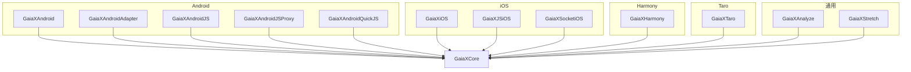
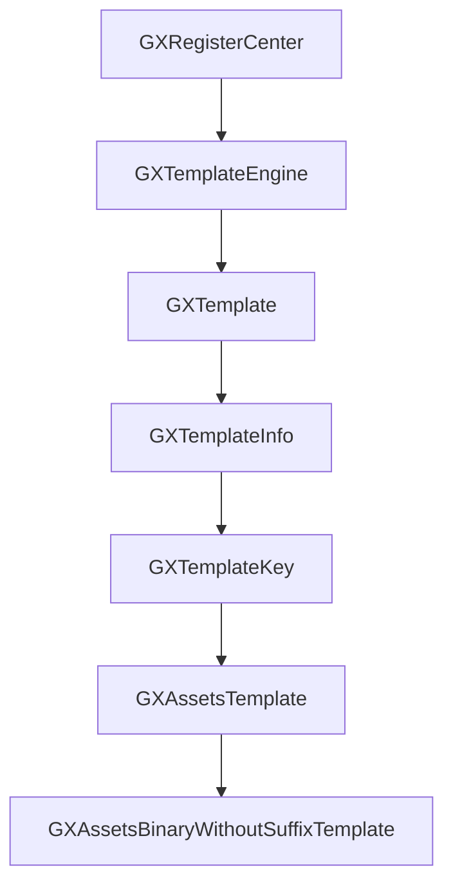
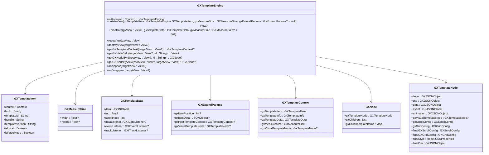
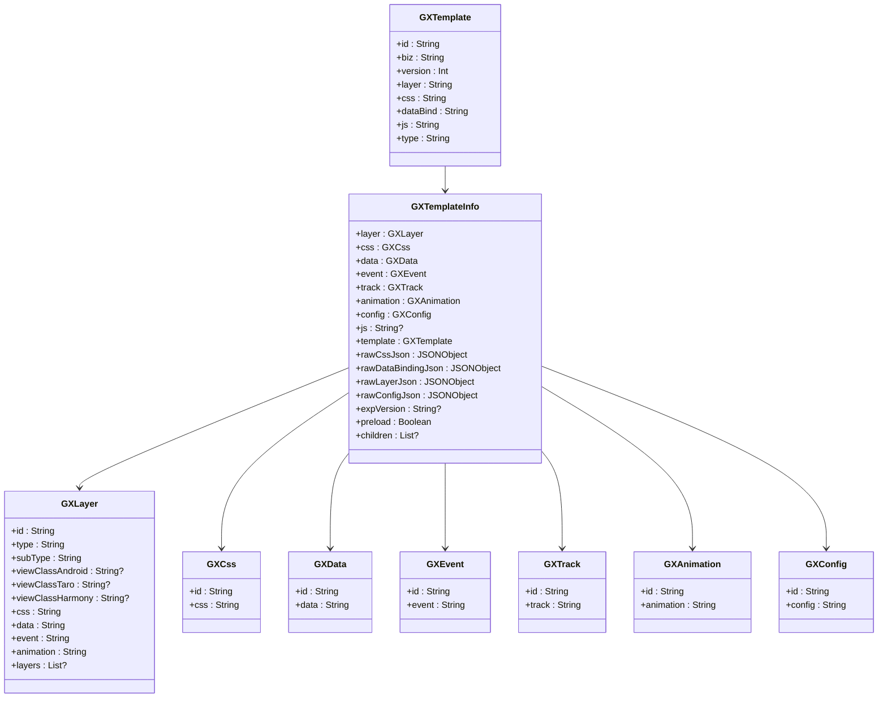
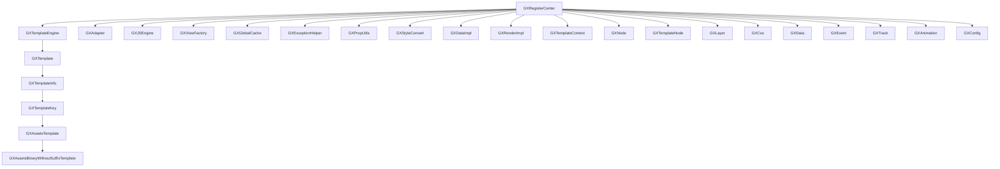

```mermaid
classDiagram
class GXTemplateKey {
+STYLE_BOX_SHADOW : String
+STYLE_FONT_SIZE : String
+STYLE_FONT_FAMILY : String
+STYLE_FONT_COLOR : String
+STYLE_FONT_WEIGHT : String
+STYLE_BACKGROUND_COLOR : String
+STYLE_HIDDEN : String
+STYLE_BACKGROUND_IMAGE : String
+STYLE_FONT_LINES : String
+STYLE_FONT_TEXT_OVERFLOW : String
+STYLE_FONT_TEXT_ALIGN : String
+STYLE_MODE : String
+STYLE_MODE_TYPE : String
+STYLE_BORDER_RADIUS : String
+STYLE_BORDER_BOTTOM_LEFT_RADIUS : String
+STYLE_BORDER_BOTTOM_RIGHT_RADIUS : String
+STYLE_BORDER_TOP_LEFT_RADIUS : String
+STYLE_BORDER_TOP_RIGHT_RADIUS : String
+STYLE_BORDER_WIDTH : String
+STYLE_BORDER_COLOR : String
+STYLE_OPACITY : String
+STYLE_FONT_LINE_HEIGHT : String
+STYLE_FONT_TEXT_DECORATION : String
+STYLE_FIT_CONTENT : String
+FLEXBOX_DISPLAY : String
+FLEXBOX_DIRECTION : String
+FLEXBOX_FLEX_DIRECTION : String
+FLEXBOX_FLEX_WRAP : String
+FLEXBOX_OVERFLOW : String
+FLEXBOX_ALIGN_ITEMS : String
+FLEXBOX_ALIGN_SELF : String
+FLEXBOX_ALIGN_CONTENT : String
+FLEXBOX_JUSTIFY_CONTENT : String
+FLEXBOX_POSITION_TYPE : String
+FLEXBOX_POSITION_LEFT : String
+FLEXBOX_POSITION_RIGHT : String
+FLEXBOX_POSITION_TOP : String
+FLEXBOX_POSITION_BOTTOM : String
+FLEXBOX_MARGIN : String
+FLEXBOX_MARGIN_LEFT : String
+FLEXBOX_MARGIN_RIGHT : String
+FLEXBOX_MARGIN_TOP : String
+FLEXBOX_MARGIN_BOTTOM : String
+FLEXBOX_PADDING : String
+FLEXBOX_PADDING_LEFT : String
+FLEXBOX_PADDING_RIGHT : String
+FLEXBOX_PADDING_TOP : String
+FLEXBOX_PADDING_BOTTOM : String
+FLEXBOX_BORDER : String
+FLEXBOX_BORDER_LEFT : String
+FLEXBOX_BORDER_RIGHT : String
+FLEXBOX_BORDER_TOP : String
+FLEXBOX_BORDER_BOTTOM : String
+FLEXBOX_FLEX_GROW : String
+FLEXBOX_FLEX_SHRINK : String
+FLEXBOX_FLEX_BASIS : String
+FLEXBOX_SIZE : String
+FLEXBOX_MIN_SIZE : String
+FLEXBOX_MAX_SIZE : String
+FLEXBOX_SIZE_WIDTH : String
+FLEXBOX_SIZE_HEIGHT : String
+FLEXBOX_MIN_WIDTH : String
+FLEXBOX_MIN_HEIGHT : String
+FLEXBOX_MAX_WIDTH : String
+FLEXBOX_MAX_HEIGHT : String
+FLEXBOX_ASPECT_RATIO : String
+GAIAX_DATA : String
+GAIAX_EVENT : String
+GAIAX_TRACK : String
+GAIAX_CONFIG : String
+GAIAX_ANIMATION : String
+GAIAX_LAYER_EDGE_INSETS : String
+GAIAX_LAYER_LINE_SPACING : String
+GAIAX_LAYER_INTERITEM_SPACING : String
+GAIAX_LAYER_ITEM_SPACING : String
+GAIAX_LAYER_ROW_SPACING : String
+GAIAX_LAYER_COLUMN : String
+GAIAX_LAYER_SCROLL_ENABLE : String
+GAIAX_LAYER_GRAVITY : String
+GAIAX_LAYER_ID : String
+GAIAX_LAYERS : String
+GAIAX_LAYER_TYPE : String
+GAIAX_LAYER_SUB_TYPE : String
+GAIAX_LAYER_CUSTOM_VIEW_CLASS : String
+GAIAX_LAYER_CLASS : String
+GAIAX_PX : String
+GAIAX_PT : String
+GAIAX_PE : String
+GAIAX_AUTO : String
+GAIAX_LAYER_DIRECTION : String
+GAIAX_HORIZONTAL : String
+GAIAX_VERTICAL : String
+GAIAX_HIGHLIGHT_REGEX : String
+GAIAX_HIGHLIGHT_COLOR : String
+GAIAX_HIGHLIGHT_FONT_WEIGHT : String
+GAIAX_HIGHLIGHT_FONT_SIZE : String
+GAIAX_HIGHLIGHT_FONT_FAMILY : String
+GAIAX_HIGHLIGHT_TAG : String
+GAIAX_VALUE : String
+GAIAX_ACCESSIBILITY_DESC : String
+GAIAX_ACCESSIBILITY_ENABLE : String
+GAIAX_ACCESSIBILITY_TRAITS : String
+GAIAX_PLACEHOLDER : String
+GAIAX_EXTEND : String
+GAIAX_LAYER : String
+GAIAX_DATABINDING : String
+GAIAX_CSS : String
+GAIAX_JS : String
+GAIAX_INDEX_DATABINDING : String
+GAIAX_INDEX_CSS : String
+GAIAX_INDEX_JSON : String
+GAIAX_INDEX_JS : String
+GAIAX_INDEX_MOCK : String
+GAIAX_TEMPLATE_ID : String
+GAIAX_TEMPLATE_VERSION : String
+GAIAX_TEMPLATE_BIZ : String
+GAIAX_TEMPLATE_TYPE : String
+GAIAX_GESTURE_TYPE : String
+GAIAX_GESTURE_TYPE_TAP : String
+GAIAX_GESTURE_TYPE_JS_TAP : String
+GAIAX_GESTURE_TYPE_LONGPRESS : String
+GAIAX_ENABLE : String
+GAIAX_CUSTOM_PROPERTY_VIEW_PORT_WIDTH : String
+GAIAX_CUSTOM_PROPERTY_GRID_COMPUTE_CONTAINER_HEIGHT : String
+GAIAX_CUSTOM_PROPERTY_SCROLL_COMPUTE_CONTAINER_HEIGHT : String
+GAIAX_ICONFONT_FONT_FAMILY_DEFAULT_NAME : String
+GAIAX_DATABINDING_HOLDING_OFFSET : String
+GAIAX_SCROLL_POSITION : String
+GAIAX_SCROLL_INDEX : String
+GAIAX_SCROLL_ANIMATED : String
+GAIAX_DATABINDING_ITEM_TYPE : String
+GAIAX_DATABINDING_ITEM_TYPE_PATH : String
+GAIAX_DATABINDING_ITEM_TYPE_CONFIG : String
+GAIAX_CONTAINER_FOOTER : String
+GAIAX_CONTAINER_HAS_MORE : String
+GAIAX_ANIMATION_TYPE_LOTTIE : String
+GAIAX_ANIMATION_TYPE_PROP : String
+GAIAX_LAYER_SLIDER_SCROLL_TIME_INTERVAL : String
+GAIAX_LAYER_SLIDER_INFINITY_SCROLL : String
+GAIAX_LAYER_SLIDER_HAS_INDICATOR : String
+GAIAX_LAYER_SLIDER_SELECTED_INDEX : String
+GAIAX_LAYER_SLIDER_INDICATOR_SELECTED_COLOR : String
+GAIAX_LAYER_SLIDER_INDICATOR_UNSELECTED_COLOR : String
+GAIAX_LAYER_SLIDER_INDICATOR_MARGIN : String
+GAIAX_LAYER_SLIDER_INDICATOR_POSITION : String
+GAIAX_LAYER_SLIDER_INDICATOR_CLASS : String
+GAIAX_LAYER_PROGRESS_STROKE_COLOR : String
+GAIAX_LAYER_PROGRESS_TRAIL_COLOR : String
+GAIAX_LAYER_PROGRESS_TYPE : String
+GAIAX_LAYER_PROGRESS_ANIMATED : String
}
```

# 组件复用与模块化

<cite>
**本文档引用的文件**   
- [GXRegisterCenter.kt](file://GaiaXAndroid/src/main/kotlin/com/alibaba/gaiax/GXRegisterCenter.kt)
- [GXTemplateEngine.kt](file://GaiaXAndroid/src/main/kotlin/com/alibaba/gaiax/GXTemplateEngine.kt)
- [GXTemplate.kt](file://GaiaXAndroid/src/main/kotlin/com/alibaba/gaiax/template/GXTemplate.kt)
- [GXTemplateKey.kt](file://GaiaXAndroid/src/main/kotlin/com/alibaba/gaiax/template/GXTemplateKey.kt)
- [GXTemplateInfo.kt](file://GaiaXAndroid/src/main/kotlin/com/alibaba/gaiax/template/GXTemplateInfo.kt)
- [GXAssetsTemplate.kt](file://GaiaXAndroid/src/main/kotlin/com/alibaba/gaiax/data/assets/GXAssetsTemplate.kt)
- [GXAssetsBinaryWithoutSuffixTemplate.kt](file://GaiaXAndroid/src/main/kotlin/com/alibaba/gaiax/data/assets/GXAssetsBinaryWithoutSuffixTemplate.kt)
- [GXTemplateNode.tsx](file://GaiaXTaro/packages/gaiax-taro/src/gaiax/GXTemplateNode.tsx)
- [GXTemplate.tsx](file://GaiaXTaro/packages/gaiax-taro/src/gaiax/GXTemplate.tsx)
- [GXTemplateInfo.tsx](file://GaiaXTaro/packages/gaiax-taro/src/gaiax/GXTemplateInfo.tsx)
- [GXRegisterCenter.tsx](file://GaiaXTaro/packages/gaiax-taro/src/gaiax/GXRegisterCenter.tsx)
- [GXTemplateContext.ets](file://GaiaXHarmony/GaiaXCore/GaiaX/src/main/ets/context/GXTemplateContext.ets)
</cite>

## 目录
1. [引言](#引言)
2. [项目结构](#项目结构)
3. [核心组件](#核心组件)
4. [架构概述](#架构概述)
5. [详细组件分析](#详细组件分析)
6. [依赖分析](#依赖分析)
7. [性能考虑](#性能考虑)
8. [故障排除指南](#故障排除指南)
9. [结论](#结论)
10. [附录](#附录) (如有必要)

## 引言
GaiaX框架是一个轻量级的跨平台纯原生动态卡片解决方案，旨在确保原生体验和性能的同时，帮助客户端实现低代码开发。本指南将深入探讨如何通过GXRegisterCenter的扩展机制创建可复用的模板组件和模块化设计模式，涵盖组件生命周期管理、属性定义、事件处理以及组件版本管理、命名规范和测试策略，帮助开发者构建可维护的组件库。

## 项目结构
GaiaX框架的项目结构清晰地划分了不同平台的实现，包括Android、iOS、HarmonyOS和Taro。每个平台都有其特定的实现文件，但核心概念和接口保持一致，确保了跨平台的一致性和可复用性。



**Diagram sources**
- [GaiaXAndroid](file://GaiaXAndroid)
- [GaiaXiOS](file://GaiaXiOS)
- [GaiaXHarmony](file://GaiaXHarmony)
- [GaiaXTaro](file://GaiaXTaro)

**Section sources**
- [GaiaXAndroid](file://GaiaXAndroid)
- [GaiaXiOS](file://GaiaXiOS)
- [GaiaXHarmony](file://GaiaXHarmony)
- [GaiaXTaro](file://GaiaXTaro)

## 核心组件
GaiaX框架的核心组件包括GXRegisterCenter、GXTemplateEngine、GXTemplate、GXTemplateKey和GXTemplateInfo。这些组件共同构成了框架的基础，支持组件的注册、模板的创建和管理、样式和数据的绑定等关键功能。

**Section sources**
- [GXRegisterCenter.kt](file://GaiaXAndroid/src/main/kotlin/com/alibaba/gaiax/GXRegisterCenter.kt)
- [GXTemplateEngine.kt](file://GaiaXAndroid/src/main/kotlin/com/alibaba/gaiax/GXTemplateEngine.kt)
- [GXTemplate.kt](file://GaiaXAndroid/src/main/kotlin/com/alibaba/gaiax/template/GXTemplate.kt)
- [GXTemplateKey.kt](file://GaiaXAndroid/src/main/kotlin/com/alibaba/gaiax/template/GXTemplateKey.kt)
- [GXTemplateInfo.kt](file://GaiaXAndroid/src/main/kotlin/com/alibaba/gaiax/template/GXTemplateInfo.kt)

## 架构概述
GaiaX框架的架构设计遵循模块化和可扩展的原则，通过GXRegisterCenter实现组件的注册和管理，通过GXTemplateEngine处理模板的创建和渲染，通过GXTemplate和GXTemplateInfo管理模板的元数据和内容。



**Diagram sources**
- [GXRegisterCenter.kt](file://GaiaXAndroid/src/main/kotlin/com/alibaba/gaiax/GXRegisterCenter.kt)
- [GXTemplateEngine.kt](file://GaiaXAndroid/src/main/kotlin/com/alibaba/gaiax/GXTemplateEngine.kt)
- [GXTemplate.kt](file://GaiaXAndroid/src/main/kotlin/com/alibaba/gaiax/template/GXTemplate.kt)
- [GXTemplateInfo.kt](file://GaiaXAndroid/src/main/kotlin/com/alibaba/gaiax/template/GXTemplateInfo.kt)
- [GXTemplateKey.kt](file://GaiaXAndroid/src/main/kotlin/com/alibaba/gaiax/template/GXTemplateKey.kt)
- [GXAssetsTemplate.kt](file://GaiaXAndroid/src/main/kotlin/com/alibaba/gaiax/data/assets/GXAssetsTemplate.kt)
- [GXAssetsBinaryWithoutSuffixTemplate.kt](file://GaiaXAndroid/src/main/kotlin/com/alibaba/gaiax/data/assets/GXAssetsBinaryWithoutSuffixTemplate.kt)

## 详细组件分析
### GXRegisterCenter 分析
GXRegisterCenter是GaiaX框架的核心注册中心，负责管理所有可扩展的功能，如Lottie动画、表达式、视图支持等。通过注册中心，开发者可以轻松地扩展框架的功能，实现自定义组件的注册和使用。

#### 接口定义
```mermaid
classDiagram
class GXRegisterCenter {
+registerExtensionLottieAnimation(extension : GXIExtensionLottieAnimation) : GXRegisterCenter
+registerExtensionExpression(extension : GXIExtensionExpression) : GXRegisterCenter
+registerExtensionViewSupport(viewType : String, viewCreator : (Context) -> View) : GXRegisterCenter
+registerExtensionTemplateSource(source : GXIExtensionTemplateSource, priority : Int = 0) : GXRegisterCenter
+registerExtensionTemplateInfoSource(source : GXIExtensionTemplateInfoSource, priority : Int = 0) : GXRegisterCenter
+registerExtensionDataBinding(databindingExtensionDataBinding : GXIExtensionDataBinding) : GXRegisterCenter
+registerExtensionColor(extensionColor : GXIExtensionColor) : GXRegisterCenter
+registerExtensionSize(extensionSize : GXIExtensionSize) : GXRegisterCenter
+registerExtensionDynamicProperty(extensionDynamicProperty : GXIExtensionDynamicProperty) : GXRegisterCenter
+registerExtensionStaticProperty(extensionStaticProperty : GXIExtensionStaticProperty) : GXRegisterCenter
+registerExtensionGrid(extensionGrid : GXIExtensionGrid) : GXRegisterCenter
+registerExtensionScroll(extensionScroll : GXIExtensionScroll) : GXRegisterCenter
+registerExtensionException(extensionException : GXIExtensionException) : GXRegisterCenter
+registerExtensionItemViewLifecycleListener(extension : GXIItemViewLifecycleListener) : GXRegisterCenter
+registerExtensionPageItemViewLifecycleListener(extension : GXIPageItemViewLifecycleListener) : GXRegisterCenter
}
class GXIExtensionLottieAnimation {
+create() : GXLottieAnimation?
}
class GXIExtensionExpression {
+create(expVersion : String?, key : String?, value : Any) : GXIExpression
+isTrue(expVersion : String?, key : String?, value : Any?) : Boolean
}
class GXIExtensionViewSupport {
+viewType : String
+viewCreator : (Context) -> View
}
class GXIExtensionTemplateSource {
+getTemplate(gxTemplateItem : GXTemplateEngine.GXTemplateItem) : GXTemplate?
}
class GXIExtensionTemplateInfoSource {
+getTemplateInfo(gxTemplateItem : GXTemplateEngine.GXTemplateItem) : GXTemplateInfo?
}
class GXIExtensionDataBinding {
+create(expVersion : String?, value : Any) : GXDataBinding?
}
class GXIExtensionColor {
+convert(context : Context?, value : String) : Int?
}
class GXIExtensionSize {
+create(value : String) : Float?
+convert(value : Float) : Float?
}
class GXIExtensionDynamicProperty {
+convert(params : GXParams) : Any?
}
class GXIExtensionStaticProperty {
+convert(params : GXParams) : Any?
}
class GXIExtensionGrid {
+convert(propertyName : String, gxTemplateContext : GXTemplateContext, gridConfig : GXGridConfig) : Any?
}
class GXIExtensionScroll {
+convert(propertyName : String, gxTemplateContext : GXTemplateContext, scrollConfig : GXScrollConfig) : Any? = null
+scrollIndex(gxTemplateContext : GXTemplateContext, container : GXContainer, extend : JSONObject?) {}
}
class GXIExtensionException {
+exception(exception : Exception)
}
class GXIItemViewLifecycleListener {
+onCreate(gxView : View?)
+onReuse(gxView : View?)
+onStart(gxView : View?, gxTemplateData : GXTemplateEngine.GXTemplateData)
+onStarted(gxView : View?)
+onVisible(gxView : View?)
+onInvisible(gxView : View?)
+onDestroy(gxView : View?)
}
class GXIPageItemViewLifecycleListener : GXIItemViewLifecycleListener {
+onStart(gxView : View?, gxTemplateData : GXTemplateEngine.GXTemplateData)
+onStarted(gxView : View?)
+onCreate(gxView : View?)
+onVisible(gxView : View?)
+onInvisible(gxView : View?)
+onReuse(gxView : View?)
+onDestroy(gxView : View?)
}
GXRegisterCenter --> GXIExtensionLottieAnimation
GXRegisterCenter --> GXIExtensionExpression
GXRegisterCenter --> GXIExtensionViewSupport
GXRegisterCenter --> GXIExtensionTemplateSource
GXRegisterCenter --> GXIExtensionTemplateInfoSource
GXRegisterCenter --> GXIExtensionDataBinding
GXRegisterCenter --> GXIExtensionColor
GXRegisterCenter --> GXIExtensionSize
GXRegisterCenter --> GXIExtensionDynamicProperty
GXRegisterCenter --> GXIExtensionStaticProperty
GXRegisterCenter --> GXIExtensionGrid
GXRegisterCenter --> GXIExtensionScroll
GXRegisterCenter --> GXIExtensionException
GXRegisterCenter --> GXIItemViewLifecycleListener
GXRegisterCenter --> GXIPageItemViewLifecycleListener
```

**Diagram sources**
- [GXRegisterCenter.kt](file://GaiaXAndroid/src/main/kotlin/com/alibaba/gaiax/GXRegisterCenter.kt)

**Section sources**
- [GXRegisterCenter.kt](file://GaiaXAndroid/src/main/kotlin/com/alibaba/gaiax/GXRegisterCenter.kt)

### GXTemplateEngine 分析
GXTemplateEngine是GaiaX框架的模板引擎，负责处理模板的创建、渲染和数据绑定。通过模板引擎，开发者可以轻松地创建和管理动态模板，实现高效的UI渲染。

#### 接口定义


**Diagram sources**
- [GXTemplateEngine.kt](file://GaiaXAndroid/src/main/kotlin/com/alibaba/gaiax/GXTemplateEngine.kt)

**Section sources**
- [GXTemplateEngine.kt](file://GaiaXAndroid/src/main/kotlin/com/alibaba/gaiax/GXTemplateEngine.kt)

### GXTemplate 分析
GXTemplate是GaiaX框架中模板的核心数据结构，包含了模板的ID、业务ID、版本、层级、样式、数据绑定和JS代码等内容。通过模板，开发者可以定义和管理动态UI的结构和样式。

#### 接口定义


**Diagram sources**
- [GXTemplate.kt](file://GaiaXAndroid/src/main/kotlin/com/alibaba/gaiax/template/GXTemplate.kt)
- [GXTemplateInfo.kt](file://GaiaXAndroid/src/main/kotlin/com/alibaba/gaiax/template/GXTemplateInfo.kt)

**Section sources**
- [GXTemplate.kt](file://GaiaXAndroid/src/main/kotlin/com/alibaba/gaiax/template/GXTemplate.kt)
- [GXTemplateInfo.kt](file://GaiaXAndroid/src/main/kotlin/com/alibaba/gaiax/template/GXTemplateInfo.kt)

### GXTemplateKey 分析
GXTemplateKey是GaiaX框架中用于定义模板属性和样式的常量类，包含了各种CSS属性、Flexbox属性、数据绑定属性等。通过这些常量，开发者可以方便地引用和管理模板的属性和样式。

#### 接口定义


**Diagram sources**
- [GXTemplateKey.kt](file://GaiaXAndroid/src/main/kotlin/com/alibaba/gaiax/template/GXTemplateKey.kt)

**Section sources**
- [GXTemplateKey.kt](file://GaiaXAndroid/src/main/kotlin/com/alibaba/gaiax/template/GXTemplateKey.kt)

## 依赖分析
GaiaX框架的依赖关系清晰，核心组件通过接口和抽象类进行解耦，确保了模块的独立性和可扩展性。通过GXRegisterCenter，开发者可以轻松地注册和管理各种扩展功能，实现组件的复用和模块化设计。



**Diagram sources**
- [GXRegisterCenter.kt](file://GaiaXAndroid/src/main/kotlin/com/alibaba/gaiax/GXRegisterCenter.kt)
- [GXTemplateEngine.kt](file://GaiaXAndroid/src/main/kotlin/com/alibaba/gaiax/GXTemplateEngine.kt)
- [GXTemplate.kt](file://GaiaXAndroid/src/main/kotlin/com/alibaba/gaiax/template/GXTemplate.kt)
- [GXTemplateInfo.kt](file://GaiaXAndroid/src/main/kotlin/com/alibaba/gaiax/template/GXTemplateInfo.kt)
- [GXTemplateKey.kt](file://GaiaXAndroid/src/main/kotlin/com/alibaba/gaiax/template/GXTemplateKey.kt)
- [GXAssetsTemplate.kt](file://GaiaXAndroid/src/main/kotlin/com/alibaba/gaiax/data/assets/GXAssetsTemplate.kt)
- [GXAssetsBinaryWithoutSuffixTemplate.kt](file://GaiaXAndroid/src/main/kotlin/com/alibaba/gaiax/data/assets/GXAssetsBinaryWithoutSuffixTemplate.kt)

**Section sources**
- [GXRegisterCenter.kt](file://GaiaXAndroid/src/main/kotlin/com/alibaba/gaiax/GXRegisterCenter.kt)
- [GXTemplateEngine.kt](file://GaiaXAndroid/src/main/kotlin/com/alibaba/gaiax/GXTemplateEngine.kt)
- [GXTemplate.kt](file://GaiaXAndroid/src/main/kotlin/com/alibaba/gaiax/template/GXTemplate.kt)
- [GXTemplateInfo.kt](file://GaiaXAndroid/src/main/kotlin/com/alibaba/gaiax/template/GXTemplateInfo.kt)
- [GXTemplateKey.kt](file://GaiaXAndroid/src/main/kotlin/com/alibaba/gaiax/template/GXTemplateKey.kt)
- [GXAssetsTemplate.kt](file://GaiaXAndroid/src/main/kotlin/com/alibaba/gaiax/data/assets/GXAssetsTemplate.kt)
- [GXAssetsBinaryWithoutSuffixTemplate.kt](file://GaiaXAndroid/src/main/kotlin/com/alibaba/gaiax/data/assets/GXAssetsBinaryWithoutSuffixTemplate.kt)

## 性能考虑
在使用GaiaX框架时，性能是一个重要的考虑因素。通过合理的组件复用和模块化设计，可以显著提升应用的性能。以下是一些性能优化的建议：
- **组件复用**：通过GXRegisterCenter注册和管理可复用的组件，减少重复创建和销毁的开销。
- **数据绑定**：合理使用数据绑定，避免不必要的数据更新和UI重绘。
- **缓存机制**：利用GXGlobalCache等缓存机制，减少重复计算和数据加载的开销。
- **异步处理**：对于耗时的操作，如网络请求和文件读取，使用异步处理，避免阻塞主线程。

## 故障排除指南
在使用GaiaX框架时，可能会遇到一些常见的问题。以下是一些故障排除的建议：
- **组件注册失败**：检查GXRegisterCenter的注册方法是否正确调用，确保扩展功能的接口实现正确。
- **模板加载失败**：检查模板文件的路径和格式是否正确，确保模板文件存在于指定的目录中。
- **数据绑定失败**：检查数据绑定的路径和格式是否正确，确保数据源和模板的匹配。
- **性能问题**：使用性能分析工具，如Trace，定位性能瓶颈，优化代码和数据处理逻辑。

**Section sources**
- [GXRegisterCenter.kt](file://GaiaXAndroid/src/main/kotlin/com/alibaba/gaiax/GXRegisterCenter.kt)
- [GXTemplateEngine.kt](file://GaiaXAndroid/src/main/kotlin/com/alibaba/gaiax/GXTemplateEngine.kt)
- [GXTemplate.kt](file://GaiaXAndroid/src/main/kotlin/com/alibaba/gaiax/template/GXTemplate.kt)
- [GXTemplateInfo.kt](file://GaiaXAndroid/src/main/kotlin/com/alibaba/gaiax/template/GXTemplateInfo.kt)
- [GXTemplateKey.kt](file://GaiaXAndroid/src/main/kotlin/com/alibaba/gaiax/template/GXTemplateKey.kt)

## 结论
GaiaX框架通过GXRegisterCenter的扩展机制，提供了强大的组件复用和模块化设计能力。通过详细的组件分析和架构概述，开发者可以更好地理解和使用框架，构建高效、可维护的动态UI。希望本指南能帮助开发者在实际项目中充分发挥GaiaX框架的优势。

## 附录
### 组件版本管理
- **版本号**：每个组件应有明确的版本号，便于管理和追踪。
- **版本兼容性**：确保新版本的组件与旧版本的组件兼容，避免破坏现有功能。

### 命名规范
- **组件命名**：组件名称应简洁明了，反映组件的功能和用途。
- **属性命名**：属性名称应遵循驼峰命名法，确保代码的可读性和一致性。

### 测试策略
- **单元测试**：为每个组件编写单元测试，确保组件的正确性和稳定性。
- **集成测试**：进行集成测试，验证组件之间的交互和整体功能。
- **性能测试**：进行性能测试，确保组件在高负载下的表现。