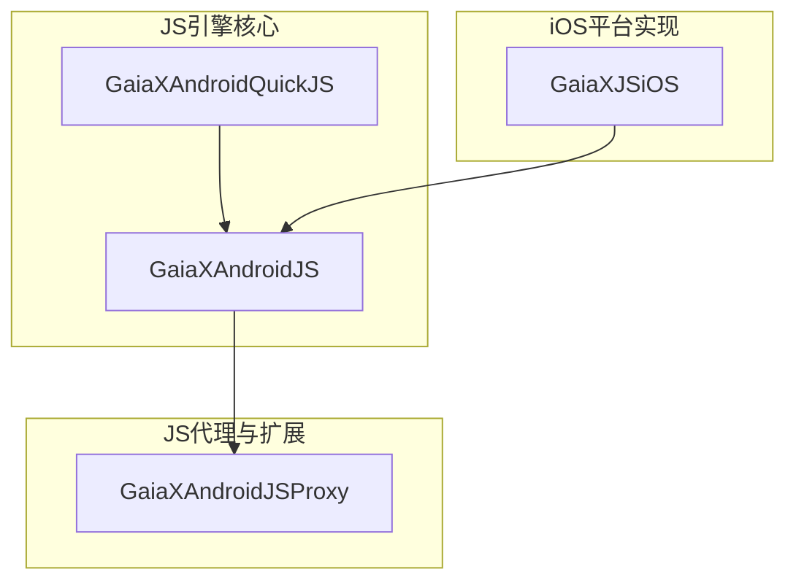
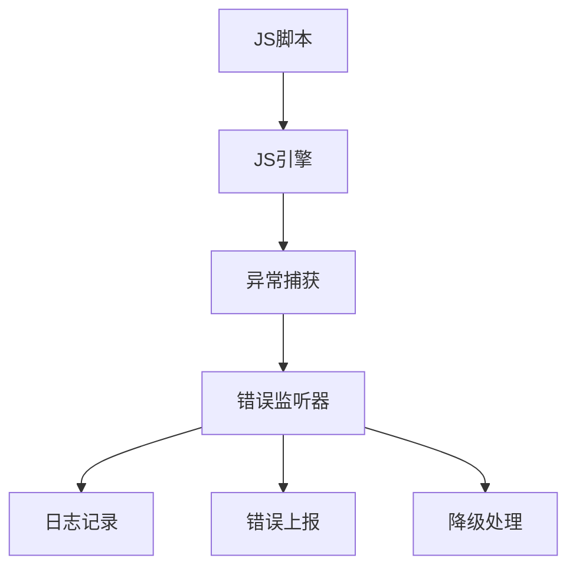
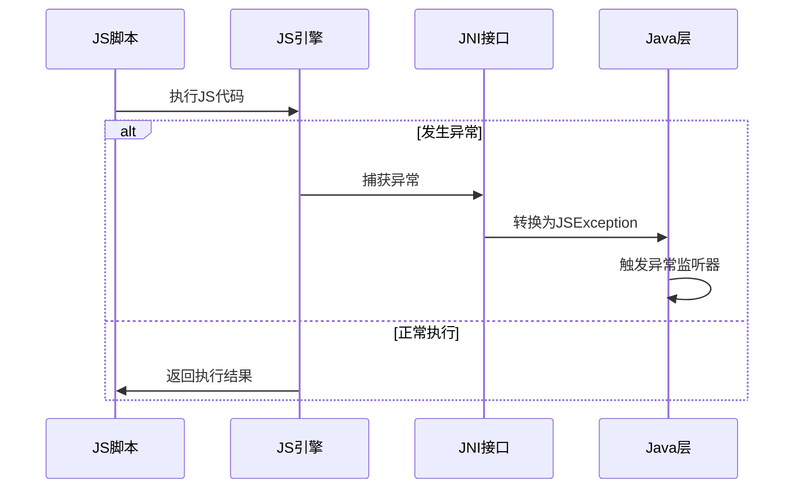
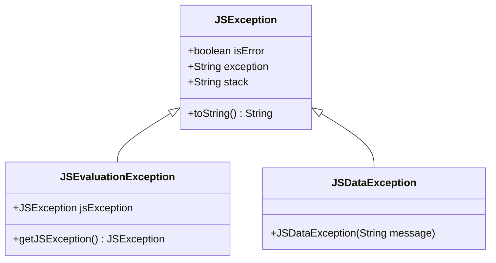
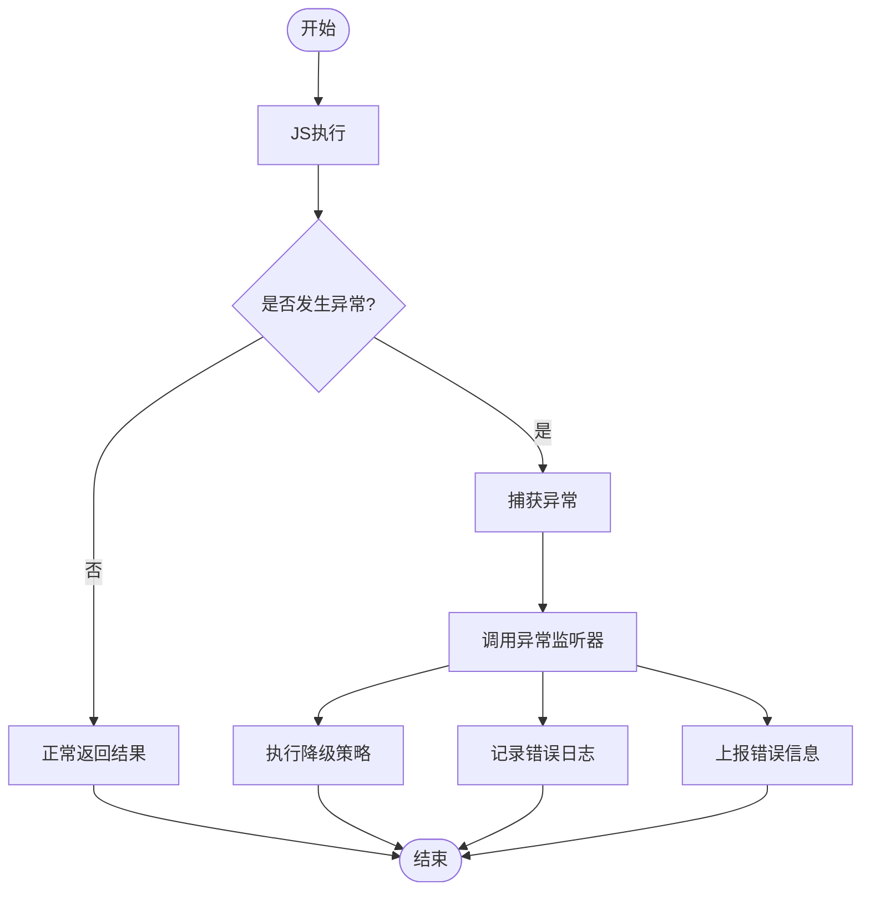
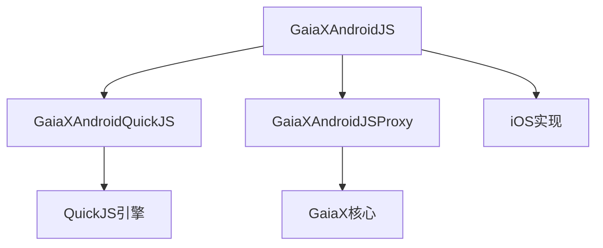

# JS执行异常处理

<cite>
**本文档引用的文件**   
- [GXJSEngine.kt](file://GaiaXAndroidJS/src/main/kotlin/com/alibaba/gaiax/js/GXJSEngine.kt)
- [GXJSEngineProxy.kt](file://GaiaXAndroidJSProxy/src/main/java/com/alibaba/gaiax/js/proxy/GXJSEngineProxy.kt)
- [JSException.java](file://GaiaXAndroidQuickJS/src/main/java/com/alibaba/gaiax/quickjs/JSException.java)
- [JSEvaluationException.java](file://GaiaXAndroidQuickJS/src/main/java/com/alibaba/gaiax/quickjs/JSEvaluationException.java)
- [JSDataException.java](file://GaiaXAndroidQuickJS/src/main/java/com/alibaba/gaiax/quickjs/JSDataException.java)
- [quickjs-jni.c](file://GaiaXAndroidQuickJS/src/main/c/quickjs-jni.c)
- [GaiaXJSHandler.m](file://GaiaXJSiOS/GaiaXJS/src/GaiaXJSHandler.m)
- [GaiaXJSHandler.h](file://GaiaXJSiOS/GaiaXJS/src/GaiaXJSHandler.h)
- [GXHostEngine.kt](file://GaiaXAndroidJS/src/main/kotlin/com/alibaba/gaiax/js/engine/GXHostEngine.kt)
- [GXHostRuntime.kt](file://GaiaXAndroidJS/src/main/kotlin/com/alibaba/gaiax/js/engine/GXHostRuntime.kt)
</cite>

## 目录
1. [简介](#简介)
2. [项目结构](#项目结构)
3. [核心组件](#核心组件)
4. [架构概述](#架构概述)
5. [详细组件分析](#详细组件分析)
6. [依赖分析](#依赖分析)
7. [性能考虑](#性能考虑)
8. [故障排除指南](#故障排除指南)
9. [结论](#结论)

## 简介
本指南详细介绍了GaiaX框架中JS执行异常处理的实现机制。重点涵盖JS脚本执行过程中可能出现的语法错误、运行时错误、超时异常等异常情况的捕获与处理方案。基于实际代码库中的JS引擎实现，为初学者提供基本的JS错误排查方法，同时为经验丰富的开发者提供高级的JS沙箱保护和性能监控策略。

## 项目结构
GaiaX框架的JS执行异常处理主要分布在以下几个模块中：

**图示来源**
- [GXJSEngine.kt](file://GaiaXAndroidJS/src/main/kotlin/com/alibaba/gaiax/js/GXJSEngine.kt)
- [GXJSEngineProxy.kt](file://GaiaXAndroidJSProxy/src/main/java/com/alibaba/gaiax/js/proxy/GXJSEngineProxy.kt)
- [JSException.java](file://GaiaXAndroidQuickJS/src/main/java/com/alibaba/gaiax/quickjs/JSException.java)

**本节来源**
- [GXJSEngine.kt](file://GaiaXAndroidJS/src/main/kotlin/com/alibaba/gaiax/js/GXJSEngine.kt)
- [GXJSEngineProxy.kt](file://GaiaXAndroidJSProxy/src/main/java/com/alibaba/gaiax/js/proxy/GXJSEngineProxy.kt)

## 核心组件
GaiaX框架的JS执行异常处理系统由多个核心组件构成，包括JS引擎、异常捕获机制、错误监听器等。这些组件协同工作，确保JS脚本执行的稳定性和安全性。

**本节来源**
- [GXJSEngine.kt](file://GaiaXAndroidJS/src/main/kotlin/com/alibaba/gaiax/js/GXJSEngine.kt)
- [JSException.java](file://GaiaXAndroidQuickJS/src/main/java/com/alibaba/gaiax/quickjs/JSException.java)

## 架构概述
GaiaX框架的JS执行异常处理采用分层架构设计，从底层的JS引擎到上层的应用逻辑，每一层都有相应的异常处理机制。

**图示来源**
- [GXJSEngine.kt](file://GaiaXAndroidJS/src/main/kotlin/com/alibaba/gaiax/js/GXJSEngine.kt)
- [quickjs-jni.c](file://GaiaXAndroidQuickJS/src/main/c/quickjs-jni.c)

## 详细组件分析

### JS引擎异常处理
GaiaX框架使用QuickJS作为JS引擎，通过JNI接口与Java层进行交互。当JS执行发生异常时，引擎会捕获异常并将其转换为Java异常。

**图示来源**
- [quickjs-jni.c](file://GaiaXAndroidQuickJS/src/main/c/quickjs-jni.c)
- [JSException.java](file://GaiaXAndroidQuickJS/src/main/java/com/alibaba/gaiax/quickjs/JSException.java)

**本节来源**
- [quickjs-jni.c](file://GaiaXAndroidQuickJS/src/main/c/quickjs-jni.c)
- [JSException.java](file://GaiaXAndroidQuickJS/src/main/java/com/alibaba/gaiax/quickjs/JSException.java)

### 异常类型与处理
GaiaX框架定义了多种JS异常类型，每种异常都有相应的处理策略。

**图示来源**
- [JSException.java](file://GaiaXAndroidQuickJS/src/main/java/com/alibaba/gaiax/quickjs/JSException.java)
- [JSEvaluationException.java](file://GaiaXAndroidQuickJS/src/main/java/com/alibaba/gaiax/quickjs/JSEvaluationException.java)
- [JSDataException.java](file://GaiaXAndroidQuickJS/src/main/java/com/alibaba/gaiax/quickjs/JSDataException.java)

**本节来源**
- [JSException.java](file://GaiaXAndroidQuickJS/src/main/java/com/alibaba/gaiax/quickjs/JSException.java)
- [JSEvaluationException.java](file://GaiaXAndroidQuickJS/src/main/java/com/alibaba/gaiax/quickjs/JSEvaluationException.java)
- [JSDataException.java](file://GaiaXAndroidQuickJS/src/main/java/com/alibaba/gaiax/quickjs/JSDataException.java)

### 异常监听与上报
GaiaX框架提供了异常监听器接口，允许开发者自定义异常处理逻辑。

**图示来源**
- [GXJSEngine.kt](file://GaiaXAndroidJS/src/main/kotlin/com/alibaba/gaiax/js/GXJSEngine.kt)
- [GXJSEngineProxy.kt](file://GaiaXAndroidJSProxy/src/main/java/com/alibaba/gaiax/js/proxy/GXJSEngineProxy.kt)

**本节来源**
- [GXJSEngine.kt](file://GaiaXAndroidJS/src/main/kotlin/com/alibaba/gaiax/js/GXJSEngine.kt)
- [GXJSEngineProxy.kt](file://GaiaXAndroidJSProxy/src/main/java/com/alibaba/gaiax/js/proxy/GXJSEngineProxy.kt)

## 依赖分析
GaiaX框架的JS执行异常处理依赖于多个组件和库，这些依赖关系确保了异常处理机制的完整性和可靠性。

**图示来源**
- [GXJSEngine.kt](file://GaiaXAndroidJS/src/main/kotlin/com/alibaba/gaiax/js/GXJSEngine.kt)
- [GXHostEngine.kt](file://GaiaXAndroidJS/src/main/kotlin/com/alibaba/gaiax/js/engine/GXHostEngine.kt)
- [GXHostRuntime.kt](file://GaiaXAndroidJS/src/main/kotlin/com/alibaba/gaiax/js/engine/GXHostRuntime.kt)

**本节来源**
- [GXJSEngine.kt](file://GaiaXAndroidJS/src/main/kotlin/com/alibaba/gaiax/js/GXJSEngine.kt)
- [GXHostEngine.kt](file://GaiaXAndroidJS/src/main/kotlin/com/alibaba/gaiax/js/engine/GXHostEngine.kt)
- [GXHostRuntime.kt](file://GaiaXAndroidJS/src/main/kotlin/com/alibaba/gaiax/js/engine/GXHostRuntime.kt)

## 性能考虑
在处理JS执行异常时，需要考虑性能影响，避免因异常处理机制本身导致性能下降。

**本节来源**
- [quickjs-jni.c](file://GaiaXAndroidQuickJS/src/main/c/quickjs-jni.c)
- [GXJSEngine.kt](file://GaiaXAndroidJS/src/main/kotlin/com/alibaba/gaiax/js/GXJSEngine.kt)

## 故障排除指南
当遇到JS执行异常时，可以按照以下步骤进行排查：

1. 检查JS脚本语法是否正确
2. 查看错误堆栈信息
3. 检查异常监听器是否正确配置
4. 验证JS引擎状态
5. 检查内存使用情况

**本节来源**
- [GXJSEngine.kt](file://GaiaXAndroidJS/src/main/kotlin/com/alibaba/gaiax/js/GXJSEngine.kt)
- [JSException.java](file://GaiaXAndroidQuickJS/src/main/java/com/alibaba/gaiax/quickjs/JSException.java)

## 结论
GaiaX框架提供了完整的JS执行异常处理解决方案，通过分层架构设计和多种异常处理机制，确保了JS脚本执行的稳定性和安全性。开发者可以根据实际需求，灵活配置异常处理策略，提高应用的健壮性。