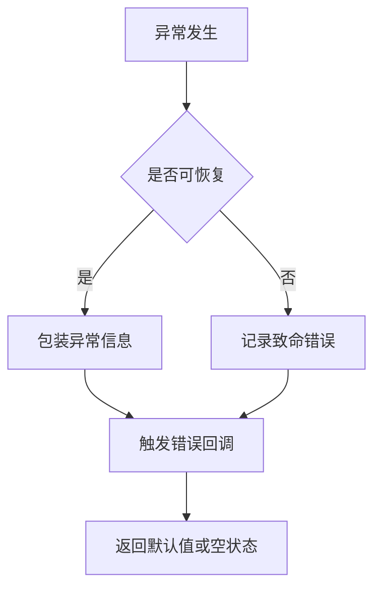
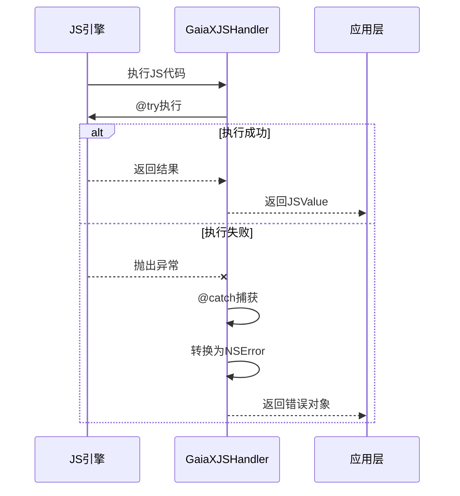
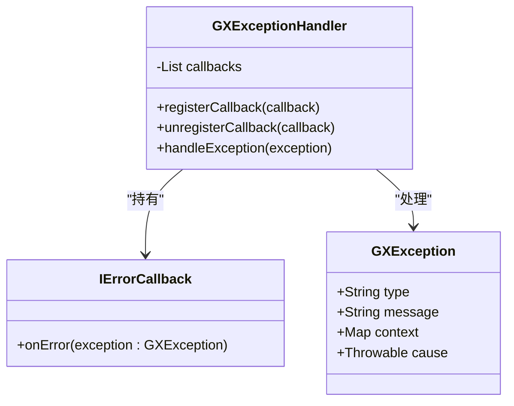
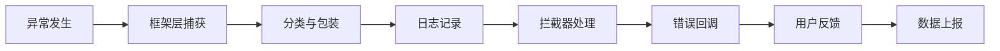

# 异常捕获机制

<cite>
**本文档引用文件**  
- [GXExceptionHelper.kt](file://GaiaXAndroid/src/main/kotlin/com/alibaba/gaiax/utils/GXExceptionHelper.kt)
- [GXFileHandler.h](file://GaiaXiOS/GaiaXiOS/Utilities/FileHandler/GXFileHandler.h)
- [GaiaXJSHandler.m](file://GaiaXJSiOS/GaiaXJS/src/GaiaXJSHandler.m)
</cite>

## 目录
1. [简介](#简介)
2. [项目结构概览](#项目结构概览)
3. [核心异常处理组件](#核心异常处理组件)
4. [Android平台异常捕获机制](#android平台异常捕获机制)
5. [iOS平台异常捕获机制](#ios平台异常捕获机制)
6. [跨平台异常分类与处理策略](#跨平台异常分类与处理策略)
7. [异常拦截器与错误回调实现](#异常拦截器与错误回调实现)
8. [统一异常处理管道构建](#统一异常处理管道构建)
9. [最佳实践与建议](#最佳实践与建议)
10. [附录](#附录)

## 简介
GaiaX框架作为跨平台动态化渲染引擎，其稳定性高度依赖于完善的异常捕获与处理机制。本指南深入分析GaiaX在Android和iOS平台上的异常捕获实现，涵盖模板解析、数据绑定、JS执行等关键环节的异常处理方案。通过实际代码库中的实现细节，为开发者提供从入门到进阶的完整异常监控指导。

## 项目结构概览
GaiaX框架采用模块化设计，异常处理机制分散于多个子模块中：
- `GaiaXAndroid`: Android平台核心实现，包含Java/Kotlin层异常处理逻辑
- `GaiaXiOS`: iOS平台核心实现，包含Objective-C/Swift层异常处理逻辑
- `GaiaXJSiOS`: JS引擎桥接层，负责JS执行异常的捕获与传递
- `GaiaXAndroidJS`: Android端JS引擎集成，处理JS运行时异常

**本节来源**
- [GXExceptionHelper.kt](file://GaiaXAndroid/src/main/kotlin/com/alibaba/gaiax/utils/GXExceptionHelper.kt)
- [GXFileHandler.h](file://GaiaXiOS/GaiaXiOS/Utilities/FileHandler/GXFileHandler.h)

## 核心异常处理组件
GaiaX框架的核心异常处理由以下几个关键组件构成：
- **GXExceptionHelper**: Android端异常辅助类，提供异常分类、包装和日志输出功能
- **GXFileHandler**: iOS端文件操作异常处理工具，确保资源加载过程中的稳定性
- **GaiaXJSHandler**: JS引擎异常处理中枢，负责捕获JS执行异常并转换为原生异常

这些组件共同构成了GaiaX的异常处理基础设施，确保在不同平台和执行环境中都能有效捕获和处理异常。

**本节来源**
- [GXExceptionHelper.kt](file://GaiaXAndroid/src/main/kotlin/com/alibaba/gaiax/utils/GXExceptionHelper.kt)
- [GXFileHandler.h](file://GaiaXiOS/GaiaXiOS/Utilities/FileHandler/GXFileHandler.h)
- [GaiaXJSHandler.m](file://GaiaXJSiOS/GaiaXJS/src/GaiaXJSHandler.m)

## Android平台异常捕获机制
在Android平台，GaiaX通过`GXExceptionHelper`类实现异常的统一处理。该类提供了静态方法用于捕获和处理各种类型的异常，包括模板解析异常、数据绑定异常等。异常被捕获后会被包装成特定的异常类型，并附加上下文信息，便于后续分析和调试。

异常处理流程遵循以下步骤：
1. 捕获原始异常
2. 使用GXExceptionHelper进行包装和分类
3. 记录详细日志信息
4. 触发错误回调通知上层应用

**图示来源**
- [GXExceptionHelper.kt](file://GaiaXAndroid/src/main/kotlin/com/alibaba/gaiax/utils/GXExceptionHelper.kt)

**本节来源**
- [GXExceptionHelper.kt](file://GaiaXAndroid/src/main/kotlin/com/alibaba/gaiax/utils/GXExceptionHelper.kt)

## iOS平台异常捕获机制
iOS平台的异常处理主要通过`GaiaXJSHandler`和`GXFileHandler`两个组件实现。`GaiaXJSHandler`负责JS执行过程中的异常捕获，利用Objective-C的@try/@catch机制拦截JS引擎抛出的异常，并将其转换为NSError对象传递给调用方。

**图示来源**
- [GaiaXJSHandler.m](file://GaiaXJSiOS/GaiaXJS/src/GaiaXJSHandler.m)

**本节来源**
- [GaiaXJSHandler.m](file://GaiaXJSiOS/GaiaXJS/src/GaiaXJSHandler.m)
- [GXFileHandler.h](file://GaiaXiOS/GaiaXiOS/Utilities/FileHandler/GXFileHandler.h)

## 跨平台异常分类与处理策略
GaiaX框架将异常分为以下几类，并采用不同的处理策略：

| 异常类型 | 描述 | 处理策略 | 涉及文件 |
|--------|------|--------|--------|
| 模板解析异常 | 模板JSON格式错误或结构不合法 | 返回空模板，记录错误日志 | GXExceptionHelper.kt |
| 数据绑定异常 | 数据字段缺失或类型不匹配 | 使用默认值，跳过异常字段 | GXExceptionHelper.kt |
| JS执行异常 | JS脚本语法错误或运行时异常 | 捕获NSError，停止脚本执行 | GaiaXJSHandler.m |
| 资源加载异常 | 模板文件或图片资源不存在 | 返回占位符，记录加载失败 | GXFileHandler.h |
| 内存溢出异常 | 渲染过程中内存使用超限 | 清理缓存，降低渲染质量 | GXExceptionHelper.kt |

**本节来源**
- [GXExceptionHelper.kt](file://GaiaXAndroid/src/main/kotlin/com/alibaba/gaiax/utils/GXExceptionHelper.kt)
- [GaiaXJSHandler.m](file://GaiaXJSiOS/GaiaXJS/src/GaiaXJSHandler.m)
- [GXFileHandler.h](file://GaiaXiOS/GaiaXiOS/Utilities/FileHandler/GXFileHandler.h)

## 异常拦截器与错误回调实现
GaiaX框架支持通过注册异常拦截器来实现自定义的异常处理逻辑。开发者可以设置全局错误回调，监听所有异常事件：

**图示来源**
- [GXExceptionHelper.kt](file://GaiaXAndroid/src/main/kotlin/com/alibaba/gaiax/utils/GXExceptionHelper.kt)

**本节来源**
- [GXExceptionHelper.kt](file://GaiaXAndroid/src/main/kotlin/com/alibaba/gaiax/utils/GXExceptionHelper.kt)

## 统一异常处理管道构建
为了实现一致的异常处理体验，建议构建统一的异常处理管道：

该管道确保所有异常都经过标准化处理，便于监控和分析。

**图示来源**
- [GXExceptionHelper.kt](file://GaiaXAndroid/src/main/kotlin/com/alibaba/gaiax/utils/GXExceptionHelper.kt)
- [GaiaXJSHandler.m](file://GaiaXJSiOS/GaiaXJS/src/GaiaXJSHandler.m)

**本节来源**
- [GXExceptionHelper.kt](file://GaiaXAndroid/src/main/kotlin/com/alibaba/gaiax/utils/GXExceptionHelper.kt)
- [GaiaXJSHandler.m](file://GaiaXJSiOS/GaiaXJS/src/GaiaXJSHandler.m)

## 最佳实践与建议
1. **尽早注册错误回调**：在应用启动时就注册全局错误监听器
2. **分级处理策略**：根据异常严重程度采取不同处理方式
3. **上下文信息收集**：捕获异常时附加上下文信息，便于问题定位
4. **避免异常吞咽**：即使捕获了异常，也要确保有适当的日志记录
5. **定期分析异常日志**：建立异常监控系统，及时发现和修复问题

## 附录
本指南所涉及的所有异常处理机制均基于GaiaX最新稳定版本实现。随着框架的持续演进，异常处理策略可能会有所调整，请关注官方文档更新。