# 数据绑定异常处理

<cite>
**本文档引用文件**   
- [GXTemplateEngine.kt](file://GaiaXAndroid/src/main/kotlin/com/alibaba/gaiax/GXTemplateEngine.kt)
- [GXExceptionHelper.kt](file://GaiaXAndroid/src/main/kotlin/com/alibaba/gaiax/utils/GXExceptionHelper.kt)
- [GXDataImpl.kt](file://GaiaXAndroid/src/main/kotlin/com/alibaba/gaiax/data/GXDataImpl.kt)
- [GXRenderImpl.kt](file://GaiaXAndroid/src/main/kotlin/com/alibaba/gaiax/render/GXRenderImpl.kt)
- [GXTemplateContext.kt](file://GaiaXAndroid/src/main/kotlin/com/alibaba/gaiax/context/GXTemplateContext.kt)
- [GXNodeTreeUpdate.kt](file://GaiaXAndroid/src/main/kotlin/com/alibaba/gaiax/render/node/GXNodeTreeUpdate.kt)
- [GXViewTreeUpdate.kt](file://GaiaXAndroid/src/main/kotlin/com/alibaba/gaiax/render/view/GXViewTreeUpdate.kt)
- [GXTemplateInfo.kt](file://GaiaXAndroid/src/main/kotlin/com/alibaba/gaiax/template/GXTemplateInfo.kt)
</cite>

## 目录
1. [简介](#简介)
2. [项目结构](#项目结构)
3. [核心组件](#核心组件)
4. [架构概述](#架构概述)
5. [详细组件分析](#详细组件分析)
6. [依赖分析](#依赖分析)
7. [性能考虑](#性能考虑)
8. [故障排除指南](#故障排除指南)
9. [结论](#结论)

## 简介
本指南旨在为GaiaX框架的数据绑定异常处理提供全面的指导。重点介绍在数据绑定过程中可能出现的数据类型不匹配、路径不存在、空值引用等异常情况。基于实际代码库中的数据绑定实现，提供完整的异常捕获和处理方案。为初学者提供基本的数据绑定错误排查方法，同时为经验丰富的开发者提供高级的数据校验和容错机制。详细说明如何捕获数据绑定异常、如何处理动态数据更新失败、如何实现数据降级和默认值填充，以及如何构建数据质量监控体系。包含数据校验规则、错误处理策略和性能优化的最佳实践，帮助开发者确保数据绑定的稳定性和可靠性。

## 项目结构
GaiaX框架是一个跨平台的动态模板引擎，主要由Android、iOS和Taro等多个平台的实现组成。核心功能集中在`GaiaXAndroid`模块中，该模块包含了模板引擎、数据绑定、渲染等核心组件。

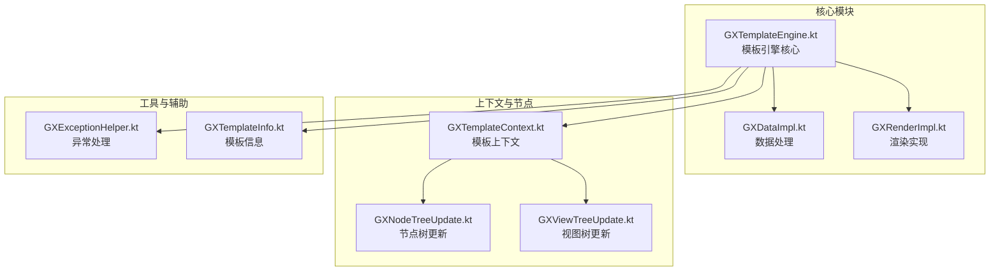

**图源**
- [GXTemplateEngine.kt](file://GaiaXAndroid/src/main/kotlin/com/alibaba/gaiax/GXTemplateEngine.kt)
- [GXDataImpl.kt](file://GaiaXAndroid/src/main/kotlin/com/alibaba/gaiax/data/GXDataImpl.kt)
- [GXRenderImpl.kt](file://GaiaXAndroid/src/main/kotlin/com/alibaba/gaiax/render/GXRenderImpl.kt)
- [GXTemplateContext.kt](file://GaiaXAndroid/src/main/kotlin/com/alibaba/gaiax/context/GXTemplateContext.kt)
- [GXNodeTreeUpdate.kt](file://GaiaXAndroid/src/main/kotlin/com/alibaba/gaiax/render/node/GXNodeTreeUpdate.kt)
- [GXViewTreeUpdate.kt](file://GaiaXAndroid/src/main/kotlin/com/alibaba/gaiax/render/view/GXViewTreeUpdate.kt)
- [GXTemplateInfo.kt](file://GaiaXAndroid/src/main/kotlin/com/alibaba/gaiax/template/GXTemplateInfo.kt)

**章节源**
- [GXTemplateEngine.kt](file://GaiaXAndroid/src/main/kotlin/com/alibaba/gaiax/GXTemplateEngine.kt#L77-L927)

## 核心组件
GaiaX框架的核心组件包括模板引擎、数据处理、渲染实现和异常处理等部分。这些组件协同工作，确保数据绑定的稳定性和可靠性。

**章节源**
- [GXTemplateEngine.kt](file://GaiaXAndroid/src/main/kotlin/com/alibaba/gaiax/GXTemplateEngine.kt#L77-L927)
- [GXDataImpl.kt](file://GaiaXAndroid/src/main/kotlin/com/alibaba/gaiax/data/GXDataImpl.kt#L29-L168)
- [GXRenderImpl.kt](file://GaiaXAndroid/src/main/kotlin/com/alibaba/gaiax/render/GXRenderImpl.kt#L35-L105)

## 架构概述
GaiaX框架的架构设计遵循模块化和分层的原则，确保各组件之间的低耦合和高内聚。模板引擎负责协调数据处理和渲染过程，数据处理模块负责解析和验证数据，渲染模块负责生成和更新视图。

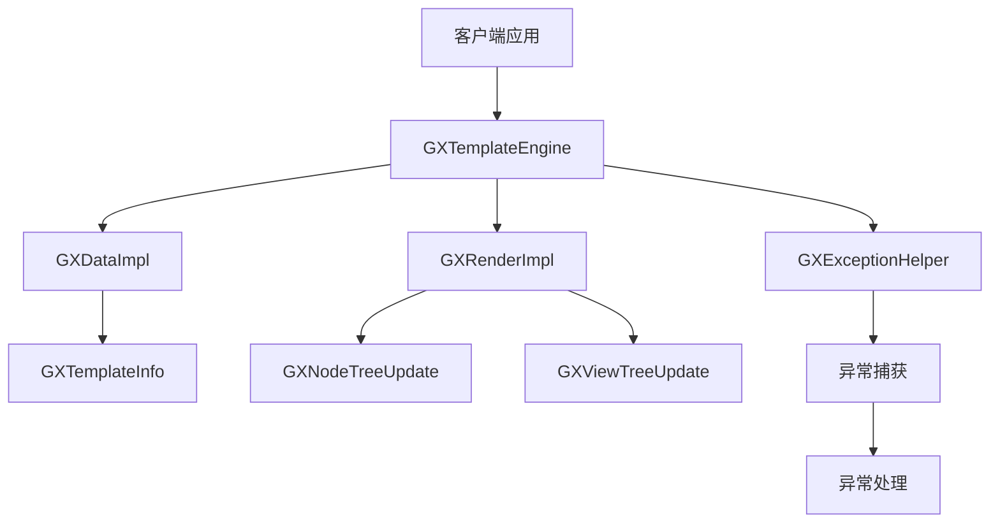

**图源**
- [GXTemplateEngine.kt](file://GaiaXAndroid/src/main/kotlin/com/alibaba/gaiax/GXTemplateEngine.kt)
- [GXDataImpl.kt](file://GaiaXAndroid/src/main/kotlin/com/alibaba/gaiax/data/GXDataImpl.kt)
- [GXRenderImpl.kt](file://GaiaXAndroid/src/main/kotlin/com/alibaba/gaiax/render/GXRenderImpl.kt)
- [GXTemplateInfo.kt](file://GaiaXAndroid/src/main/kotlin/com/alibaba/gaiax/template/GXTemplateInfo.kt)
- [GXNodeTreeUpdate.kt](file://GaiaXAndroid/src/main/kotlin/com/alibaba/gaiax/render/node/GXNodeTreeUpdate.kt)
- [GXViewTreeUpdate.kt](file://GaiaXAndroid/src/main/kotlin/com/alibaba/gaiax/render/view/GXViewTreeUpdate.kt)
- [GXExceptionHelper.kt](file://GaiaXAndroid/src/main/kotlin/com/alibaba/gaiax/utils/GXExceptionHelper.kt)

## 详细组件分析
### 模板引擎分析
模板引擎是GaiaX框架的核心，负责协调数据处理和渲染过程。它提供了创建模板、绑定数据、更新视图等关键功能。

#### 模板引擎类图
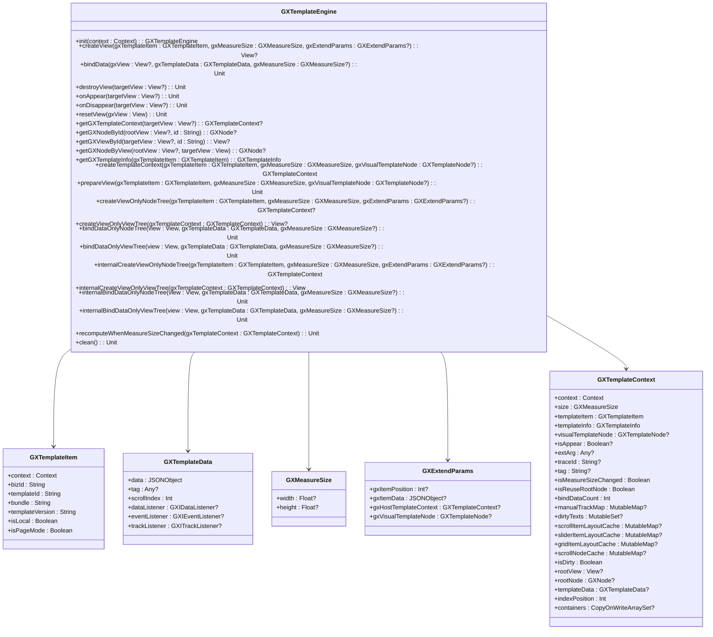

**图源**
- [GXTemplateEngine.kt](file://GaiaXAndroid/src/main/kotlin/com/alibaba/gaiax/GXTemplateEngine.kt#L77-L927)

#### 模板引擎序列图
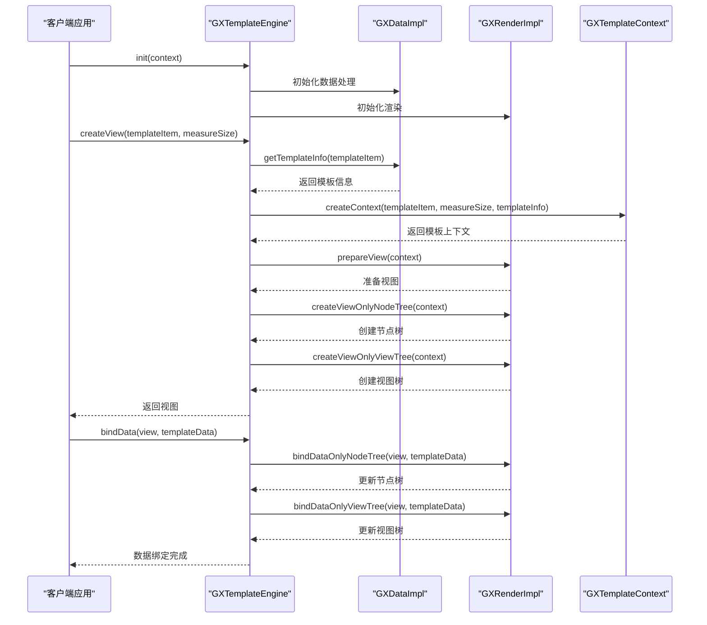

**图源**
- [GXTemplateEngine.kt](file://GaiaXAndroid/src/main/kotlin/com/alibaba/gaiax/GXTemplateEngine.kt#L77-L927)
- [GXDataImpl.kt](file://GaiaXAndroid/src/main/kotlin/com/alibaba/gaiax/data/GXDataImpl.kt#L29-L168)
- [GXRenderImpl.kt](file://GaiaXAndroid/src/main/kotlin/com/alibaba/gaiax/render/GXRenderImpl.kt#L35-L105)
- [GXTemplateContext.kt](file://GaiaXAndroid/src/main/kotlin/com/alibaba/gaiax/context/GXTemplateContext.kt#L35-L253)

**章节源**
- [GXTemplateEngine.kt](file://GaiaXAndroid/src/main/kotlin/com/alibaba/gaiax/GXTemplateEngine.kt#L77-L927)

### 数据处理分析
数据处理模块负责解析和验证数据，确保数据的正确性和完整性。它提供了数据绑定、数据校验和数据转换等功能。

#### 数据处理类图
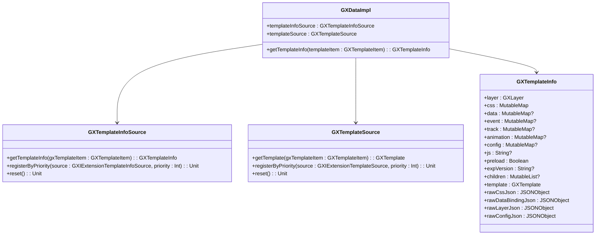

**图源**
- [GXDataImpl.kt](file://GaiaXAndroid/src/main/kotlin/com/alibaba/gaiax/data/GXDataImpl.kt#L29-L168)
- [GXTemplateInfoSource.kt](file://GaiaXAndroid/src/main/kotlin/com/alibaba/gaiax/data/GXDataImpl.kt#L113-L168)
- [GXTemplateSource.kt](file://GaiaXAndroid/src/main/kotlin/com/alibaba/gaiax/data/GXDataImpl.kt#L49-L108)
- [GXTemplateInfo.kt](file://GaiaXAndroid/src/main/kotlin/com/alibaba/gaiax/template/GXTemplateInfo.kt#L32-L417)

#### 数据处理序列图
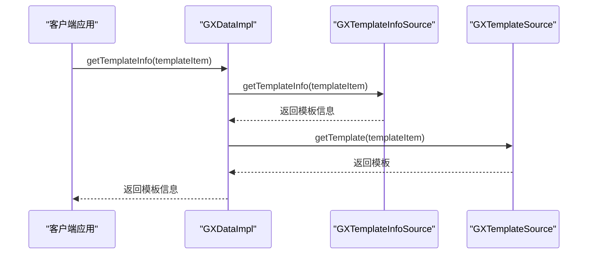

**图源**
- [GXDataImpl.kt](file://GaiaXAndroid/src/main/kotlin/com/alibaba/gaiax/data/GXDataImpl.kt#L29-L168)
- [GXTemplateInfoSource.kt](file://GaiaXAndroid/src/main/kotlin/com/alibaba/gaiax/data/GXDataImpl.kt#L113-L168)
- [GXTemplateSource.kt](file://GaiaXAndroid/src/main/kotlin/com/alibaba/gaiax/data/GXDataImpl.kt#L49-L108)

**章节源**
- [GXDataImpl.kt](file://GaiaXAndroid/src/main/kotlin/com/alibaba/gaiax/data/GXDataImpl.kt#L29-L168)

### 渲染实现分析
渲染实现模块负责生成和更新视图，确保视图的正确性和性能。它提供了视图创建、视图更新和视图销毁等功能。

#### 渲染实现类图
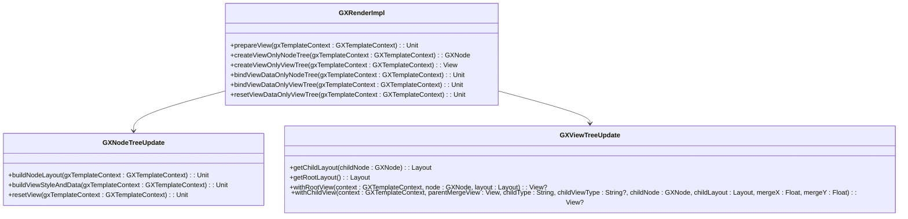

**图源**
- [GXRenderImpl.kt](file://GaiaXAndroid/src/main/kotlin/com/alibaba/gaiax/render/GXRenderImpl.kt#L35-L105)
- [GXNodeTreeUpdate.kt](file://GaiaXAndroid/src/main/kotlin/com/alibaba/gaiax/render/node/GXNodeTreeUpdate.kt#L74-L1324)
- [GXViewTreeUpdate.kt](file://GaiaXAndroid/src/main/kotlin/com/alibaba/gaiax/render/view/GXViewTreeUpdate.kt#L29-L83)

#### 渲染实现序列图
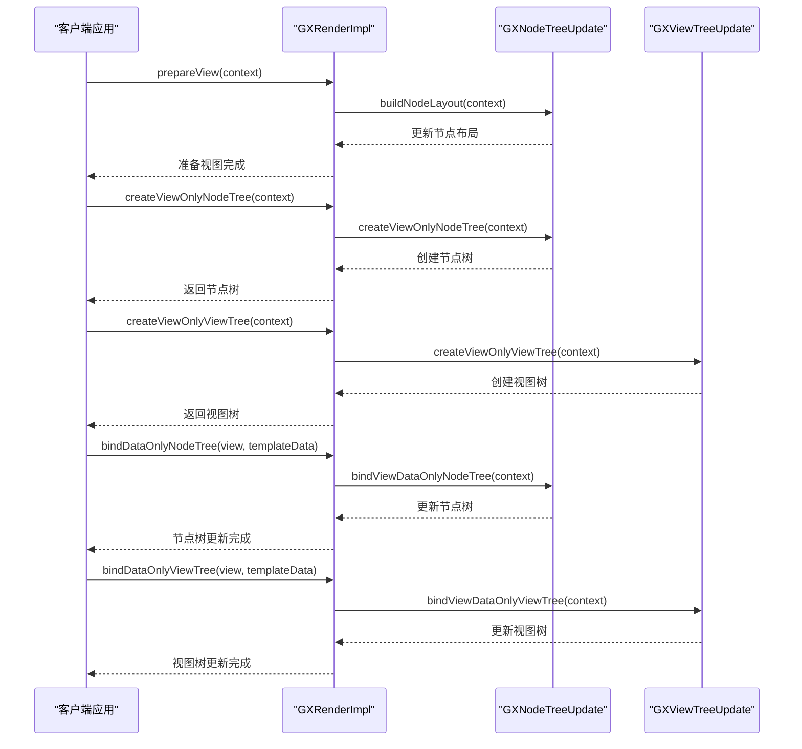

**图源**
- [GXRenderImpl.kt](file://GaiaXAndroid/src/main/kotlin/com/alibaba/gaiax/render/GXRenderImpl.kt#L35-L105)
- [GXNodeTreeUpdate.kt](file://GaiaXAndroid/src/main/kotlin/com/alibaba/gaiax/render/node/GXNodeTreeUpdate.kt#L74-L1324)
- [GXViewTreeUpdate.kt](file://GaiaXAndroid/src/main/kotlin/com/alibaba/gaiax/render/view/GXViewTreeUpdate.kt#L29-L83)

**章节源**
- [GXRenderImpl.kt](file://GaiaXAndroid/src/main/kotlin/com/alibaba/gaiax/render/GXRenderImpl.kt#L35-L105)

### 异常处理分析
异常处理模块负责捕获和处理数据绑定过程中的异常，确保系统的稳定性和可靠性。它提供了异常捕获、异常处理和异常日志记录等功能。

#### 异常处理类图
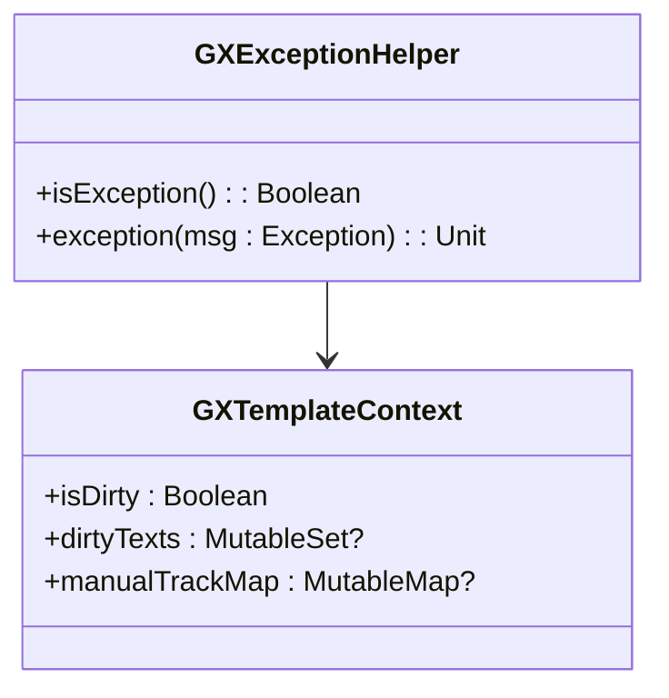

**图源**
- [GXExceptionHelper.kt](file://GaiaXAndroid/src/main/kotlin/com/alibaba/gaiax/utils/GXExceptionHelper.kt#L5-L17)
- [GXTemplateContext.kt](file://GaiaXAndroid/src/main/kotlin/com/alibaba/gaiax/context/GXTemplateContext.kt#L35-L253)

#### 异常处理序列图
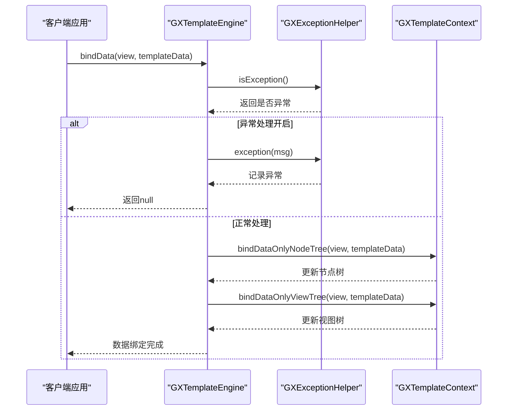

**图源**
- [GXExceptionHelper.kt](file://GaiaXAndroid/src/main/kotlin/com/alibaba/gaiax/utils/GXExceptionHelper.kt#L5-L17)
- [GXTemplateEngine.kt](file://GaiaXAndroid/src/main/kotlin/com/alibaba/gaiax/GXTemplateEngine.kt#L77-L927)
- [GXTemplateContext.kt](file://GaiaXAndroid/src/main/kotlin/com/alibaba/gaiax/context/GXTemplateContext.kt#L35-L253)

**章节源**
- [GXExceptionHelper.kt](file://GaiaXAndroid/src/main/kotlin/com/alibaba/gaiax/utils/GXExceptionHelper.kt#L5-L17)

## 依赖分析
GaiaX框架的各个组件之间存在明确的依赖关系，确保系统的模块化和可维护性。

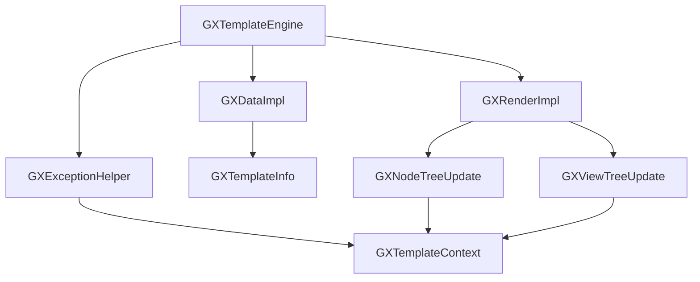

**图源**
- [GXTemplateEngine.kt](file://GaiaXAndroid/src/main/kotlin/com/alibaba/gaiax/GXTemplateEngine.kt)
- [GXDataImpl.kt](file://GaiaXAndroid/src/main/kotlin/com/alibaba/gaiax/data/GXDataImpl.kt)
- [GXRenderImpl.kt](file://GaiaXAndroid/src/main/kotlin/com/alibaba/gaiax/render/GXRenderImpl.kt)
- [GXExceptionHelper.kt](file://GaiaXAndroid/src/main/kotlin/com/alibaba/gaiax/utils/GXExceptionHelper.kt)
- [GXTemplateInfo.kt](file://GaiaXAndroid/src/main/kotlin/com/alibaba/gaiax/template/GXTemplateInfo.kt)
- [GXNodeTreeUpdate.kt](file://GaiaXAndroid/src/main/kotlin/com/alibaba/gaiax/render/node/GXNodeTreeUpdate.kt)
- [GXViewTreeUpdate.kt](file://GaiaXAndroid/src/main/kotlin/com/alibaba/gaiax/render/view/GXViewTreeUpdate.kt)
- [GXTemplateContext.kt](file://GaiaXAndroid/src/main/kotlin/com/alibaba/gaiax/context/GXTemplateContext.kt)

**章节源**
- [GXTemplateEngine.kt](file://GaiaXAndroid/src/main/kotlin/com/alibaba/gaiax/GXTemplateEngine.kt#L77-L927)
- [GXDataImpl.kt](file://GaiaXAndroid/src/main/kotlin/com/alibaba/gaiax/data/GXDataImpl.kt#L29-L168)
- [GXRenderImpl.kt](file://GaiaXAndroid/src/main/kotlin/com/alibaba/gaiax/render/GXRenderImpl.kt#L35-L105)
- [GXExceptionHelper.kt](file://GaiaXAndroid/src/main/kotlin/com/alibaba/gaiax/utils/GXExceptionHelper.kt#L5-L17)
- [GXTemplateInfo.kt](file://GaiaXAndroid/src/main/kotlin/com/alibaba/gaiax/template/GXTemplateInfo.kt#L32-L417)
- [GXNodeTreeUpdate.kt](file://GaiaXAndroid/src/main/kotlin/com/alibaba/gaiax/render/node/GXNodeTreeUpdate.kt#L74-L1324)
- [GXViewTreeUpdate.kt](file://GaiaXAndroid/src/main/kotlin/com/alibaba/gaiax/render/view/GXViewTreeUpdate.kt#L29-L83)
- [GXTemplateContext.kt](file://GaiaXAndroid/src/main/kotlin/com/alibaba/gaiax/context/GXTemplateContext.kt#L35-L253)

## 性能考虑
为了确保数据绑定的高性能，GaiaX框架采用了多种优化策略，包括缓存机制、异步处理和懒加载等。

- **缓存机制**：通过`GXGlobalCache`和`GXTemplateInfoSource`等组件，缓存模板信息和布局结果，减少重复计算。
- **异步处理**：在数据绑定和视图更新过程中，使用异步处理避免阻塞主线程。
- **懒加载**：对于复杂的模板和数据，采用懒加载策略，按需加载和渲染。

**章节源**
- [GXTemplateEngine.kt](file://GaiaXAndroid/src/main/kotlin/com/alibaba/gaiax/GXTemplateEngine.kt#L77-L927)
- [GXDataImpl.kt](file://GaiaXAndroid/src/main/kotlin/com/alibaba/gaiax/data/GXDataImpl.kt#L29-L168)
- [GXRenderImpl.kt](file://GaiaXAndroid/src/main/kotlin/com/alibaba/gaiax/render/GXRenderImpl.kt#L35-L105)
- [GXTemplateInfo.kt](file://GaiaXAndroid/src/main/kotlin/com/alibaba/gaiax/template/GXTemplateInfo.kt#L32-L417)

## 故障排除指南
### 常见问题及解决方案
1. **数据类型不匹配**：确保数据绑定的路径和类型正确，使用`GXExpressionFactory`进行数据类型转换。
2. **路径不存在**：检查数据绑定路径是否正确，确保路径中的每个节点都存在。
3. **空值引用**：在数据绑定前，检查数据是否为空，使用默认值填充空值。
4. **性能问题**：使用缓存机制和异步处理，避免阻塞主线程。

### 调试技巧
- **日志记录**：启用日志记录，查看数据绑定过程中的详细信息。
- **断点调试**：在关键方法上设置断点，逐步调试数据绑定过程。
- **性能分析**：使用性能分析工具，检测数据绑定和视图更新的性能瓶颈。

**章节源**
- [GXTemplateEngine.kt](file://GaiaXAndroid/src/main/kotlin/com/alibaba/gaiax/GXTemplateEngine.kt#L77-L927)
- [GXDataImpl.kt](file://GaiaXAndroid/src/main/kotlin/com/alibaba/gaiax/data/GXDataImpl.kt#L29-L168)
- [GXRenderImpl.kt](file://GaiaXAndroid/src/main/kotlin/com/alibaba/gaiax/render/GXRenderImpl.kt#L35-L105)
- [GXExceptionHelper.kt](file://GaiaXAndroid/src/main/kotlin/com/alibaba/gaiax/utils/GXExceptionHelper.kt#L5-L17)

## 结论
本指南详细介绍了GaiaX框架的数据绑定异常处理机制，涵盖了数据类型不匹配、路径不存在、空值引用等常见问题的解决方案。通过合理的异常捕获和处理策略，结合性能优化的最佳实践，可以确保数据绑定的稳定性和可靠性。希望本指南能帮助开发者更好地理解和使用GaiaX框架，提升开发效率和应用质量。