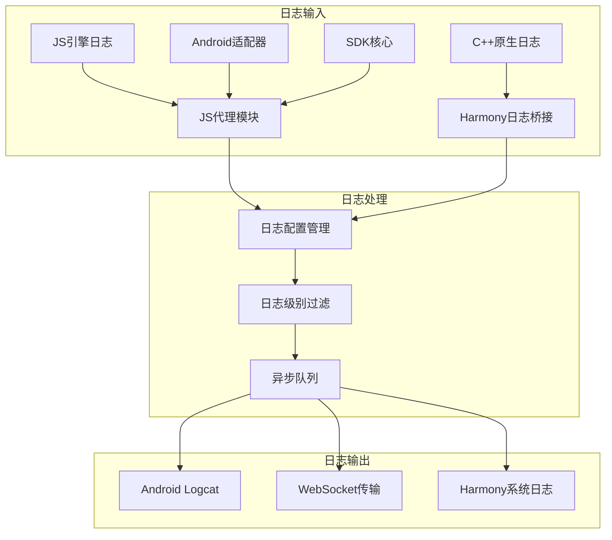
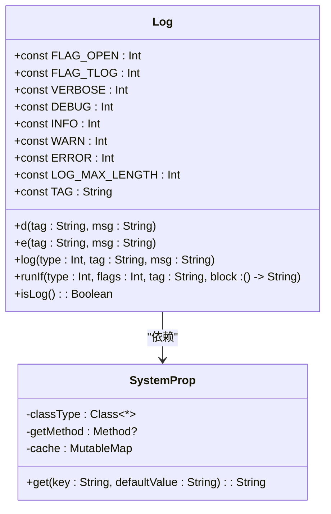
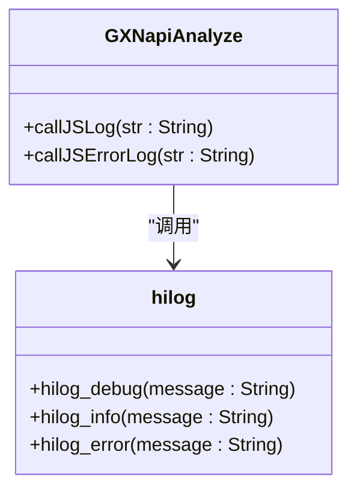
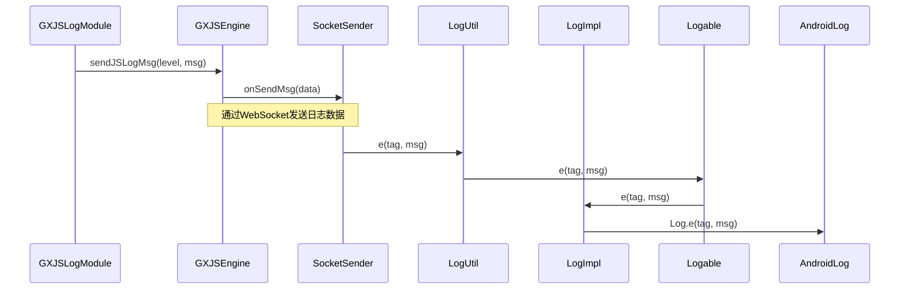
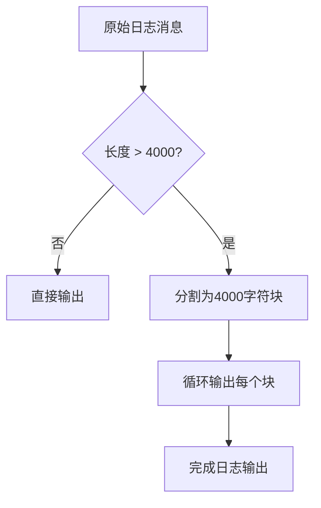
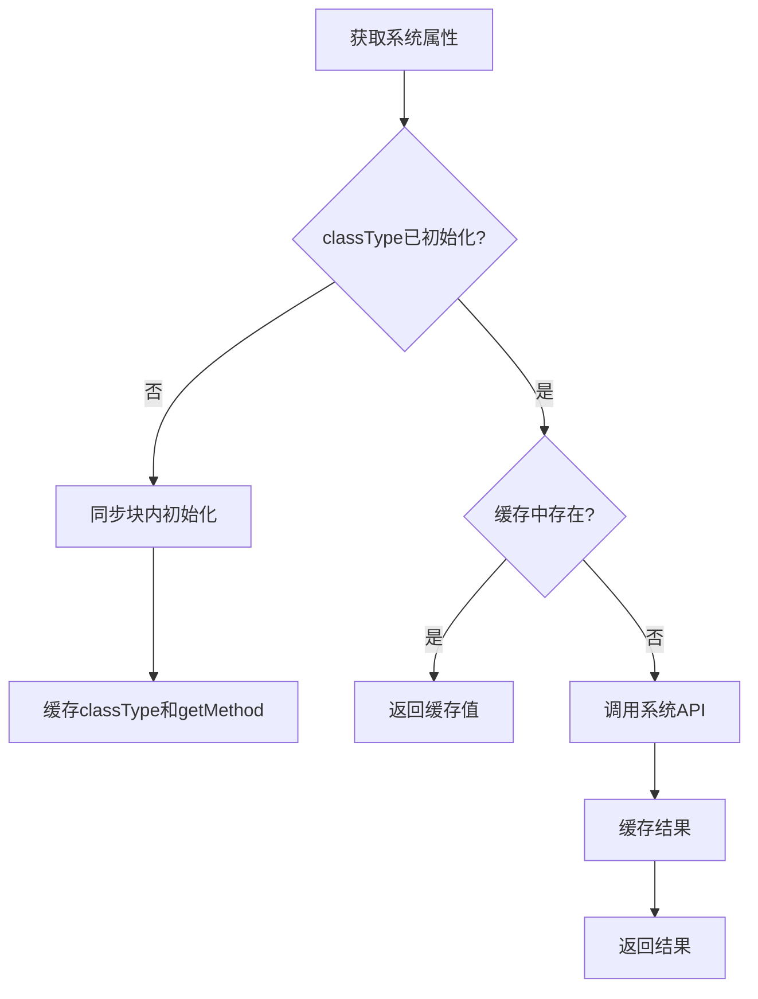
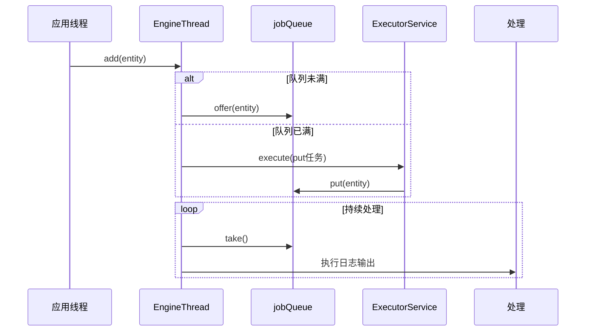
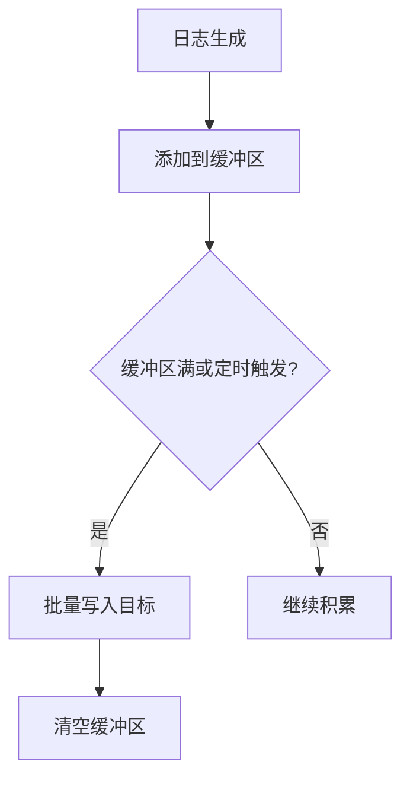

# 日志性能优化

<cite>
**本文档引用文件**  
- [Log.kt](file://GaiaXAndroidJS/src/main/kotlin/com/alibaba/gaiax/js/utils/Log.kt)
- [Log.kt](file://GaiaXAndroidAdapter/src/main/java/com/alibaba/gaiax/adapter/Log.kt)
- [Log.kt](file://GaiaXAndroidJSProxy/src/main/java/com/alibaba/gaiax/js/proxy/Log.kt)
- [Log.kt](file://GaiaXAndroid/src/main/kotlin/com/alibaba/gaiax/utils/Log.kt)
- [LogImpl.java](file://GaiaXAndroidClientToStudio/src/main/java/com/alibaba/gaiax/studio/third/socket/websocket/util/LogImpl.java)
- [LogUtil.java](file://GaiaXAndroidClientToStudio/src/main/java/com/alibaba/gaiax/studio/third/socket/websocket/util/LogUtil.java)
- [Logable.java](file://GaiaXAndroidClientToStudio/src/main/java/com/alibaba/gaiax/studio/third/socket/websocket/util/Logable.java)
- [Log.h](file://GaiaXAndroidQuickJS/src/main/c/Log.h)
- [hilog.cpp](file://GaiaXHarmony/GXStretchBinding/GXStretch/src/main/cpp/hilog.cpp)
- [hilog.h](file://GaiaXHarmony/GXStretchBinding/GXStretch/src/main/cpp/hilog.h)
- [GXJSLogModule.kt](file://GaiaXAndroidJSProxy/src/main/java/com/alibaba/gaiax/js/proxy/modules/GXJSLogModule.kt)
- [EngineThread.java](file://GaiaXAndroidClientToStudio/src/main/java/com/alibaba/gaiax/studio/third/socket/websocket/dispatcher/EngineThread.java)
- [ResponseProcessEngine.java](file://GaiaXAndroidClientToStudio/src/main/java/com/alibaba/gaiax/studio/third/socket/websocket/dispatcher/ResponseProcessEngine.java)
</cite>

## 目录
1. [引言](#引言)
2. [日志系统架构](#日志系统架构)
3. [核心日志组件分析](#核心日志组件分析)
4. [性能优化策略](#性能优化策略)
5. [异步日志处理机制](#异步日志处理机制)
6. [日志批量处理](#日志批量处理)
7. [性能测试与监控](#性能测试与监控)
8. [最佳实践指南](#最佳实践指南)
9. [故障排查](#故障排查)
10. [结论](#结论)

## 引言
GaiaX框架中的日志系统在调试和问题排查中起着至关重要的作用。然而，不当的日志记录方式可能导致严重的性能问题，特别是在高频调用场景下。本文档深入分析日志记录对应用性能的影响，提供一系列优化策略，帮助开发者在调试信息丰富性和运行时性能之间取得平衡。

## 日志系统架构



**图表来源**
- [Log.kt](file://GaiaXAndroidJS/src/main/kotlin/com/alibaba/gaiax/js/utils/Log.kt)
- [Log.kt](file://GaiaXAndroidAdapter/src/main/java/com/alibaba/gaiax/adapter/Log.kt)
- [Log.kt](file://GaiaXAndroidJSProxy/src/main/java/com/alibaba/gaiax/js/proxy/Log.kt)
- [hilog.cpp](file://GaiaXHarmony/GXStretchBinding/GXStretch/src/main/cpp/hilog.cpp)

## 核心日志组件分析

### Android日志组件
GaiaX框架在多个模块中实现了统一的日志接口，包括JS引擎、适配器、代理和SDK核心模块。这些组件都遵循相似的设计模式，使用`Log`对象作为日志门面。



**图表来源**
- [Log.kt](file://GaiaXAndroidJS/src/main/kotlin/com/alibaba/gaiax/js/utils/Log.kt)
- [Log.kt](file://GaiaXAndroidAdapter/src/main/java/com/alibaba/gaiax/adapter/Log.kt)
- [Log.kt](file://GaiaXAndroidJSProxy/src/main/java/com/alibaba/gaiax/js/proxy/Log.kt)
- [Log.kt](file://GaiaXAndroid/src/main/kotlin/com/alibaba/gaiax/utils/Log.kt)

**章节来源**
- [Log.kt](file://GaiaXAndroidJS/src/main/kotlin/com/alibaba/gaiax/js/utils/Log.kt#L1-L135)
- [Log.kt](file://GaiaXAndroidAdapter/src/main/java/com/alibaba/gaiax/adapter/Log.kt#L1-L121)
- [Log.kt](file://GaiaXAndroidJSProxy/src/main/java/com/alibaba/gaiax/js/proxy/Log.kt#L1-L121)
- [Log.kt](file://GaiaXAndroid/src/main/kotlin/com/alibaba/gaiax/utils/Log.kt#L1-L144)

### Harmony日志组件
Harmony平台使用C++实现的日志系统，通过JNI桥接与上层应用通信。



**图表来源**
- [hilog.cpp](file://GaiaXHarmony/GXStretchBinding/GXStretch/src/main/cpp/hilog.cpp#L1-L15)
- [GXNapiAnalyze.cpp](file://GaiaXHarmony/GaiaXAnalyze/GaiaXAnalyzeHarmony/GaiaXAnalyze/src/main/cpp/GXNapiAnalyze.cpp#L1-L29)

### WebSocket日志传输
日志可以通过WebSocket传输到开发工具，实现远程调试功能。



**图表来源**
- [GXJSLogModule.kt](file://GaiaXAndroidJSProxy/src/main/java/com/alibaba/gaiax/js/proxy/modules/GXJSLogModule.kt#L1-L45)
- [LogUtil.java](file://GaiaXAndroidClientToStudio/src/main/java/com/alibaba/gaiax/studio/third/socket/websocket/util/LogUtil.java#L1-L59)
- [LogImpl.java](file://GaiaXAndroidClientToStudio/src/main/java/com/alibaba/gaiax/studio/third/socket/websocket/util/LogImpl.java#L1-L71)

**章节来源**
- [GXJSLogModule.kt](file://GaiaXAndroidJSProxy/src/main/java/com/alibaba/gaiax/js/proxy/modules/GXJSLogModule.kt#L1-L45)
- [LogUtil.java](file://GaiaXAndroidClientToStudio/src/main/java/com/alibaba/gaiax/studio/third/socket/websocket/util/LogUtil.java#L1-L59)
- [LogImpl.java](file://GaiaXAndroidClientToStudio/src/main/java/com/alibaba/gaiax/studio/third/socket/websocket/util/LogImpl.java#L1-L71)

## 性能优化策略

### 日志分割处理
为避免Android系统对单条日志长度的限制（通常为4000字符），所有日志实现都采用了分段处理机制。



**图表来源**
- [Log.kt](file://GaiaXAndroidJS/src/main/kotlin/com/alibaba/gaiax/js/utils/Log.kt#L40-L53)
- [Log.kt](file://GaiaXAndroidAdapter/src/main/java/com/alibaba/gaiax/adapter/Log.kt#L33-L45)
- [Log.kt](file://GaiaXAndroidJSProxy/src/main/java/com/alibaba/gaiax/js/proxy/Log.kt#L33-L45)

### 系统属性缓存
为提高性能，系统属性访问采用了双重检查锁定和缓存机制。



**图表来源**
- [Log.kt](file://GaiaXAndroidJS/src/main/kotlin/com/alibaba/gaiax/js/utils/Log.kt#L90-L134)
- [Log.kt](file://GaiaXAndroidAdapter/src/main/java/com/alibaba/gaiax/adapter/Log.kt#L76-L120)
- [Log.kt](file://GaiaXAndroidJSProxy/src/main/java/com/alibaba/gaiax/js/proxy/Log.kt#L76-L120)

**章节来源**
- [Log.kt](file://GaiaXAndroidJS/src/main/kotlin/com/alibaba/gaiax/js/utils/Log.kt#L90-L134)
- [Log.kt](file://GaiaXAndroidAdapter/src/main/java/com/alibaba/gaiax/adapter/Log.kt#L76-L120)
- [Log.kt](file://GaiaXAndroidJSProxy/src/main/java/com/alibaba/gaiax/js/proxy/Log.kt#L76-L120)

## 异步日志处理机制

### 异步处理队列
通过独立线程处理日志输出，避免阻塞主线程。



**图表来源**
- [EngineThread.java](file://GaiaXAndroidClientToStudio/src/main/java/com/alibaba/gaiax/studio/third/socket/websocket/dispatcher/EngineThread.java#L1-L90)
- [ResponseProcessEngine.java](file://GaiaXAndroidClientToStudio/src/main/java/com/alibaba/gaiax/studio/third/socket/websocket/dispatcher/ResponseProcessEngine.java#L1-L75)

**章节来源**
- [EngineThread.java](file://GaiaXAndroidClientToStudio/src/main/java/com/alibaba/gaiax/studio/third/socket/websocket/dispatcher/EngineThread.java#L1-L90)
- [ResponseProcessEngine.java](file://GaiaXAndroidClientToStudio/src/main/java/com/alibaba/gaiax/studio/third/socket/websocket/dispatcher/ResponseProcessEngine.java#L1-L75)

## 日志批量处理
批量处理机制可以显著减少I/O操作次数，提高日志系统整体性能。



## 性能测试与监控

### 监控指标
建立全面的日志系统监控体系，关键指标包括：

| 指标 | 描述 | 目标值 |
|------|------|--------|
| 日志延迟 | 从生成到输出的时间 | < 100ms |
| CPU占用 | 日志系统CPU使用率 | < 5% |
| 内存占用 | 日志缓冲区内存使用 | < 1MB |
| I/O频率 | 每秒日志写入次数 | < 100次/秒 |
| 队列长度 | 待处理日志数量 | < 100条 |

### 测试方法
1. **压力测试**：模拟高频日志生成场景
2. **内存分析**：监控日志相关对象的内存分配
3. **CPU分析**：评估日志操作的CPU开销
4. **UI流畅度**：测量日志对UI帧率的影响

## 最佳实践指南

### 合理使用日志级别
- **ERROR**：严重错误，需要立即关注
- **WARN**：潜在问题，需要关注
- **INFO**：重要业务流程信息
- **DEBUG**：调试信息，仅在开发环境启用
- **VERBOSE**：详细调试信息，谨慎使用

### 条件日志记录
使用`runIf`等条件日志方法，避免不必要的字符串拼接开销。

```kotlin
Log.runE("tag") {
    "复杂字符串拼接结果: ${expensiveOperation()}"
}
```

### 避免内存泄漏
- 及时关闭不必要的日志输出
- 避免在循环中创建大量日志对象
- 使用对象池管理日志实体

## 故障排查

### 常见问题
1. **UI卡顿**：检查是否在主线程进行大量日志输出
2. **内存泄漏**：检查日志缓冲区是否无限增长
3. **日志丢失**：检查异步队列是否溢出
4. **性能下降**：检查日志级别设置是否过于详细

### 调试工具
- Android Studio Logcat
- Memory Profiler
- CPU Profiler
- Network Profiler（用于WebSocket日志传输）

**章节来源**
- [Log.kt](file://GaiaXAndroidJS/src/main/kotlin/com/alibaba/gaiax/js/utils/Log.kt)
- [Log.kt](file://GaiaXAndroidAdapter/src/main/java/com/alibaba/gaiax/adapter/Log.kt)
- [Log.kt](file://GaiaXAndroidJSProxy/src/main/java/com/alibaba/gaiax/js/proxy/Log.kt)

## 结论
GaiaX框架的日志系统通过分段处理、异步队列、缓存优化等多种技术手段，有效平衡了调试需求和性能要求。开发者应根据实际场景合理配置日志级别，避免过度日志导致的性能问题。通过本文档提供的优化策略和最佳实践，可以显著提升应用的运行效率和用户体验。