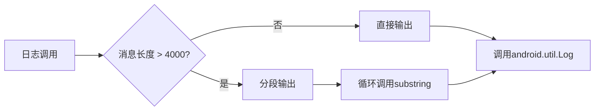

# 日志级别配置

<cite>
**本文档中引用的文件**  
- [Log.kt](file://GaiaXAndroidAdapter/src/main/java/com/alibaba/gaiax/adapter/Log.kt)
- [Log.kt](file://GaiaXAndroidJSProxy/src/main/java/com/alibaba/gaiax/js/proxy/Log.kt)
- [Log.kt](file://GaiaXAndroidJS/src/main/kotlin/com/alibaba/gaiax/js/utils/Log.kt)
- [Log.kt](file://GaiaXAndroid/src/main/kotlin/com/alibaba/gaiax/utils/Log.kt)
</cite>

## 目录
1. [简介](#简介)
2. [日志级别定义与作用](#日志级别定义与作用)
3. [日志配置机制](#日志配置机制)
4. [不同环境下的最佳实践](#不同环境下的最佳实践)
5. [动态调整日志级别](#动态调整日志级别)
6. [通过配置文件或运行时参数控制日志](#通过配置文件或运行时参数控制日志)
7. [自定义日志级别](#自定义日志级别)
8. [日志输出的精确性与可读性优化](#日志输出的精确性与可读性优化)
9. [总结](#总结)

## 简介
GaiaX框架为Android平台提供了强大的模板渲染能力，其内部通过多个模块（如Adapter、JS Proxy、JS Engine等）协同工作。为了便于开发者调试和监控运行状态，框架内置了统一的日志系统。本文档基于`Log.kt`的实现，详细说明如何配置和管理日志级别（DEBUG、INFO、WARN、ERROR），并提供在不同环境中的最佳配置策略。

**日志级别配置的核心目标**是确保开发过程中信息充分，生产环境中性能最优且不泄露敏感信息。GaiaX通过系统属性（SystemProperties）控制日志开关，支持细粒度的日志控制。

## 日志级别定义与作用
在GaiaX框架中，所有`Log.kt`文件均定义了统一的日志级别常量，具体如下：

| 日志级别 | 值 | 用途说明 |
|----------|----|----------|
| VERBOSE | 2 | 最详细的日志，用于追踪每一步操作，通常仅在深度调试时启用 |
| DEBUG | 3 | 调试信息，用于开发阶段定位问题，包含变量值、流程分支等 |
| INFO | 4 | 一般信息，记录关键流程的开始、结束或状态变更 |
| WARN | 5 | 警告信息，表示潜在问题，但不影响程序继续运行 |
| ERROR | 6 | 错误信息，表示发生了异常或错误，可能导致功能失效 |

这些级别通过`android.util.Log`的对应方法（如`Log.d`、`Log.e`）输出到Android日志系统。

**Section sources**
- [Log.kt](file://GaiaXAndroidAdapter/src/main/java/com/alibaba/gaiax/adapter/Log.kt#L15-L19)
- [Log.kt](file://GaiaXAndroidJSProxy/src/main/java/com/alibaba/gaiax/js/proxy/Log.kt#L15-L19)
- [Log.kt](file://GaiaXAndroidJS/src/main/kotlin/com/alibaba/gaiax/js/utils/Log.kt#L15-L19)
- [Log.kt](file://GaiaXAndroid/src/main/kotlin/com/alibaba/gaiax/utils/Log.kt#L15-L19)

## 日志配置机制
GaiaX的日志系统通过`SystemProp`对象读取Android系统属性来决定是否开启日志输出。其核心逻辑如下：

1. **默认日志开关**：通过`val defaultLog by lazy`定义，检查特定的系统属性是否被设置为"1"。
2. **属性名称**：每个模块使用不同的属性名，例如：
   - `debug.com.alibaba.gaiax.sdk.log`：控制SDK核心日志
   - `debug.com.alibaba.gaiax.adapter.log`：控制Adapter模块日志
   - `debug.com.alibaba.gaiax.js.proxy.log`：控制JS Proxy模块日志
   - `debug.com.alibaba.gaiax.all.log`：全局开关，开启后所有模块日志生效
3. **线程安全与缓存**：`SystemProp`使用双重检查锁和缓存机制，确保多线程环境下高效、安全地读取系统属性。

```mermaid
flowchart TD
A[应用启动] --> B{检查系统属性}
B --> |属性存在且值为"1"| C[启用日志]
B --> |属性不存在或值不为"1"| D[禁用日志]
C --> E[调用android.util.Log输出]
D --> F[跳过日志输出]
```

**Diagram sources**
- [Log.kt](file://GaiaXAndroidAdapter/src/main/java/com/alibaba/gaiax/adapter/Log.kt#L56-L58)
- [Log.kt](file://GaiaXAndroidJSProxy/src/main/java/com/alibaba/gaiax/js/proxy/Log.kt#L56-L58)
- [Log.kt](file://GaiaXAndroidJS/src/main/kotlin/com/alibaba/gaiax/js/utils/Log.kt#L70-L72)
- [Log.kt](file://GaiaXAndroid/src/main/kotlin/com/alibaba/gaiax/utils/Log.kt#L79-L81)

**Section sources**
- [Log.kt](file://GaiaXAndroidAdapter/src/main/java/com/alibaba/gaiax/adapter/Log.kt#L56-L121)
- [Log.kt](file://GaiaXAndroidJSProxy/src/main/java/com/alibaba/gaiax/js/proxy/Log.kt#L56-L121)
- [Log.kt](file://GaiaXAndroidJS/src/main/kotlin/com/alibaba/gaiax/js/utils/Log.kt#L69-L135)
- [Log.kt](file://GaiaXAndroid/src/main/kotlin/com/alibaba/gaiax/utils/Log.kt#L79-L144)

## 不同环境下的最佳实践
根据运行环境的不同，应采用不同的日志配置策略：

### 开发环境
- **推荐配置**：启用`debug.com.alibaba.gaiax.all.log=1`或模块特定属性
- **目的**：获取最详细的调试信息，快速定位问题
- **命令示例**：
  ```bash
  adb shell setprop debug.com.alibaba.gaiax.all.log 1
  adb logcat | grep GaiaX
  ```

### 测试环境
- **推荐配置**：根据测试需求启用特定模块日志，如`debug.com.alibaba.gaiax.sdk.log=1`
- **目的**：平衡信息量与性能，便于问题复现和分析
- **建议**：结合自动化测试脚本动态开启/关闭日志

### 生产环境
- **推荐配置**：所有日志属性保持默认值（"0"）
- **目的**：避免性能损耗和敏感信息泄露
- **例外**：在紧急问题排查时，可通过热更新或远程配置临时开启WARN/ERROR级别日志

**Section sources**
- [Log.kt](file://GaiaXAndroidAdapter/src/main/java/com/alibaba/gaiax/adapter/Log.kt#L57)
- [Log.kt](file://GaiaXAndroidJSProxy/src/main/java/com/alibaba/gaiax/js/proxy/Log.kt#L57)
- [Log.kt](file://GaiaXAndroidJS/src/main/kotlin/com/alibaba/gaiax/js/utils/Log.kt#L71)
- [Log.kt](file://GaiaXAndroid/src/main/kotlin/com/alibaba/gaiax/utils/Log.kt#L80)

## 动态调整日志级别
GaiaX的日志级别主要通过系统属性在运行时前配置，但也可以在运行时动态调整。虽然`Log.kt`本身不提供运行时切换级别的API，但可以通过以下方式实现：

1. **重新初始化日志系统**：在应用内提供一个调试界面，允许用户修改`SystemProp`的缓存或重新读取系统属性。
2. **条件日志输出**：使用`runIf`函数结合运行时标志位，实现条件性日志输出。

```kotlin
// 示例：动态控制日志输出
fun dynamicLog(tag: String, msg: () -> String) {
    if (isDebugMode()) { // 自定义的调试模式判断
        Log.runIf(Log.DEBUG, Log.FLAG_OPEN, tag, msg)
    }
}
```

**Section sources**
- [Log.kt](file://GaiaXAndroidAdapter/src/main/java/com/alibaba/gaiax/adapter/Log.kt#L49-L53)
- [Log.kt](file://GaiaXAndroidJSProxy/src/main/java/com/alibaba/gaiax/js/proxy/Log.kt#L49-L53)
- [Log.kt](file://GaiaXAndroidJS/src/main/kotlin/com/alibaba/gaiax/js/utils/Log.kt#L56-L60)
- [Log.kt](file://GaiaXAndroid/src/main/kotlin/com/alibaba/gaiax/utils/Log.kt#L62-L66)

## 通过配置文件或运行时参数控制日志
GaiaX目前主要依赖Android系统属性进行日志控制，但可以扩展支持配置文件或运行时参数：

### 配置文件方式
- 在`assets`目录下添加`gaiax_config.json`，包含日志级别配置
- 应用启动时读取该文件，设置内部标志位
- 示例配置：
  ```json
  {
    "log": {
      "level": "DEBUG",
      "modules": {
        "adapter": true,
        "js": false
      }
    }
  }
  ```

### 运行时参数
- 通过启动Intent传递日志级别参数
- 或在应用设置中提供日志级别选择器

虽然这些方式未在现有`Log.kt`中直接实现，但可通过封装`Log`对象来支持。

## 自定义日志级别
GaiaX的`Log.kt`设计允许一定程度的自定义。开发者可以通过以下方式扩展：

1. **添加新的日志级别**：在`Log`对象中定义新的常量，如`const val TRACE = 1`。
2. **自定义日志标签**：通过`tag`参数为不同模块或功能设置专属标签，便于过滤。
3. **扩展日志功能**：继承或包装`Log`对象，添加文件输出、网络上报等功能。

```kotlin
// 示例：自定义日志包装器
object CustomLog {
    fun trace(tag: String, msg: String) {
        if (isTraceEnabled()) {
            Log.log(1, tag, msg) // 假设TRACE级别为1
        }
    }
}
```

**Section sources**
- [Log.kt](file://GaiaXAndroidAdapter/src/main/java/com/alibaba/gaiax/adapter/Log.kt#L9-L20)
- [Log.kt](file://GaiaXAndroidJSProxy/src/main/java/com/alibaba/gaiax/js/proxy/Log.kt#L9-L20)
- [Log.kt](file://GaiaXAndroidJS/src/main/kotlin/com/alibaba/gaiax/js/utils/Log.kt#L9-L20)
- [Log.kt](file://GaiaXAndroid/src/main/kotlin/com/alibaba/gaiax/utils/Log.kt#L9-L20)

## 日志输出的精确性与可读性优化
为确保日志信息的精确性和可读性，建议遵循以下最佳实践：

1. **合理使用日志级别**：避免在生产代码中使用VERBOSE或DEBUG级别输出大量无关信息。
2. **提供上下文信息**：在日志消息中包含关键变量、状态码等，便于问题定位。
3. **处理长日志**：`Log.kt`已内置分段输出逻辑（`LOG_MAX_LENGTH=4000`），避免单条日志过长被截断。
4. **统一标签格式**：使用`TAG`常量确保日志标签的一致性，如`GaiaX.Adapter`、`GaiaX.JS.Proxy`。



**Diagram sources**
- [Log.kt](file://GaiaXAndroidAdapter/src/main/java/com/alibaba/gaiax/adapter/Log.kt#L33-L47)
- [Log.kt](file://GaiaXAndroidJSProxy/src/main/java/com/alibaba/gaiax/js/proxy/Log.kt#L33-L47)
- [Log.kt](file://GaiaXAndroidJS/src/main/kotlin/com/alibaba/gaiax/js/utils/Log.kt#L40-L54)
- [Log.kt](file://GaiaXAndroid/src/main/kotlin/com/alibaba/gaiax/utils/Log.kt#L46-L59)

**Section sources**
- [Log.kt](file://GaiaXAndroidAdapter/src/main/java/com/alibaba/gaiax/adapter/Log.kt#L21-L47)
- [Log.kt](file://GaiaXAndroidJSProxy/src/main/java/com/alibaba/gaiax/js/proxy/Log.kt#L21-L47)
- [Log.kt](file://GaiaXAndroidJS/src/main/kotlin/com/alibaba/gaiax/js/utils/Log.kt#L21-L54)
- [Log.kt](file://GaiaXAndroid/src/main/kotlin/com/alibaba/gaiax/utils/Log.kt#L21-L59)

## 总结
GaiaX框架的日志系统通过简洁而有效的设计，实现了跨模块的统一日志管理。通过系统属性控制日志开关，既保证了灵活性，又避免了运行时性能开销。开发者应根据环境选择合适的日志配置策略，并可通过扩展`Log`对象来满足特定需求。合理使用日志级别和优化日志内容，将极大提升开发效率和问题排查能力。