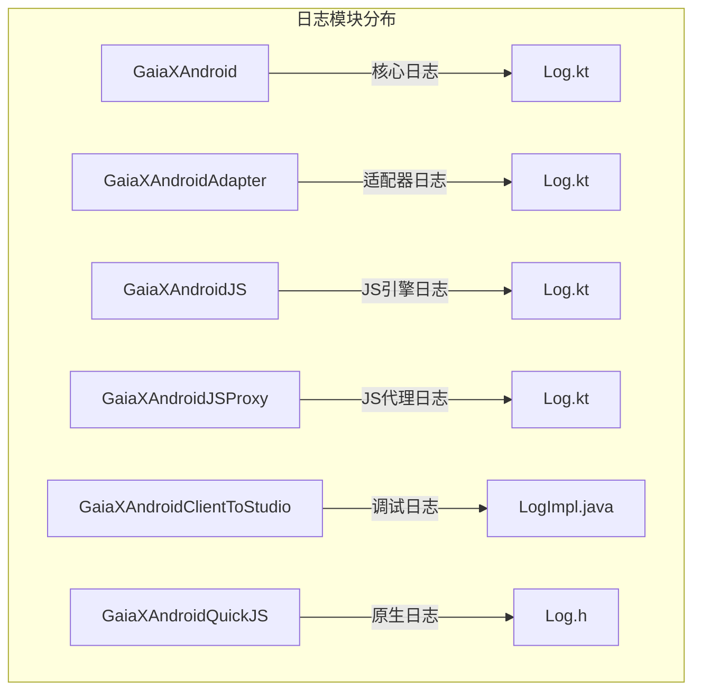
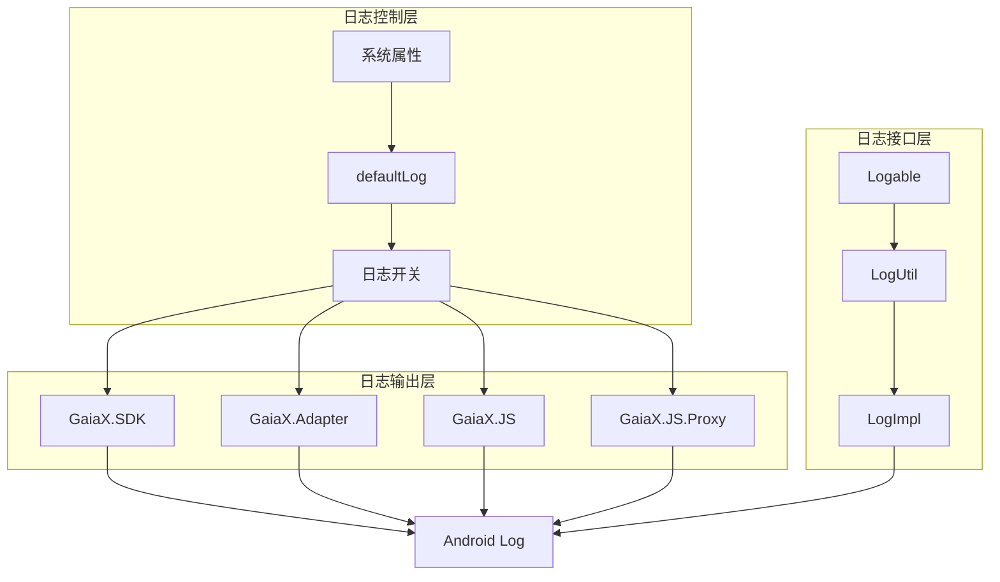
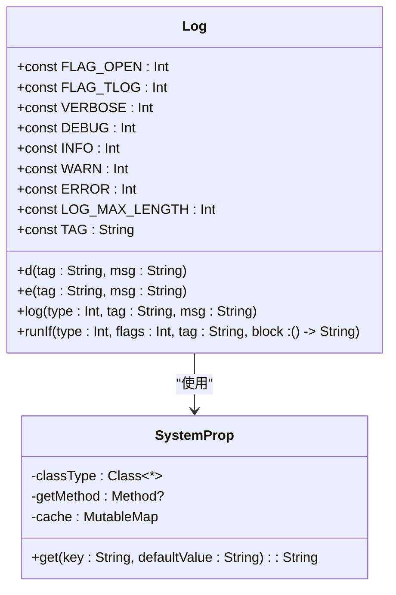
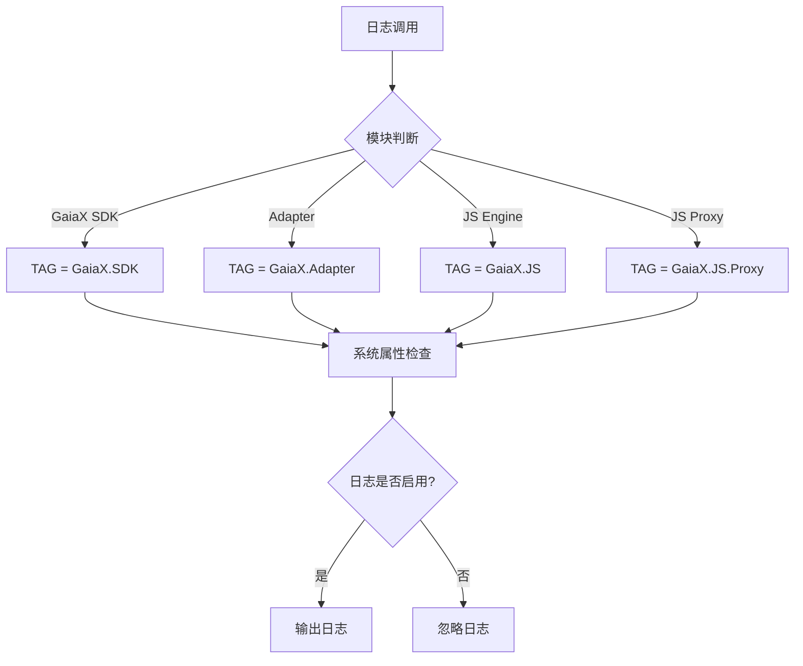
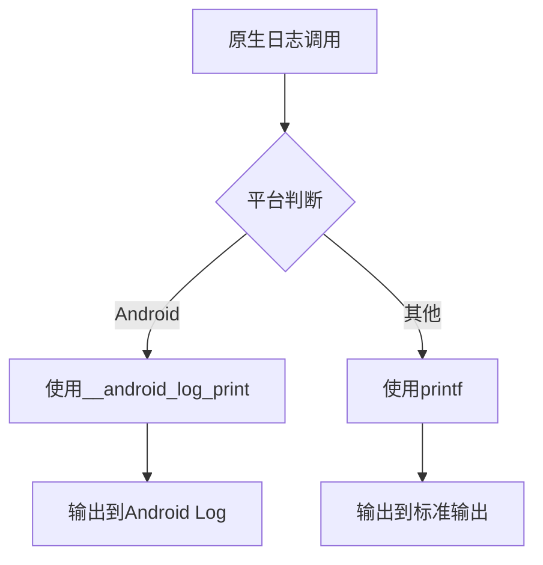
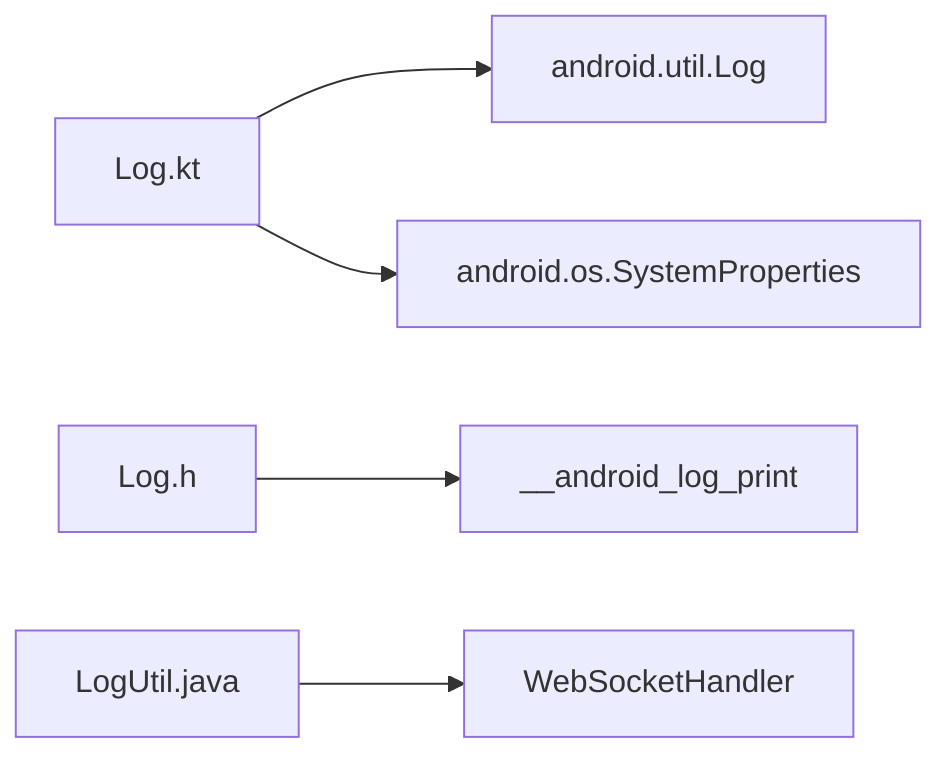

# 日志记录与管理

<cite>
**本文档引用的文件**
- [Log.kt](file://GaiaXAndroid/src/main/kotlin/com/alibaba/gaiax/utils/Log.kt)
- [Log.kt](file://GaiaXAndroidAdapter/src/main/java/com/alibaba/gaiax/adapter/Log.kt)
- [Log.kt](file://GaiaXAndroidJS/src/main/kotlin/com/alibaba/gaiax/js/utils/Log.kt)
- [Log.kt](file://GaiaXAndroidJSProxy/src/main/java/com/alibaba/gaiax/js/proxy/Log.kt)
- [LogImpl.java](file://GaiaXAndroidClientToStudio/src/main/java/com/alibaba/gaiax/studio/third/socket/websocket/util/LogImpl.java)
- [LogUtil.java](file://GaiaXAndroidClientToStudio/src/main/java/com/alibaba/gaiax/studio/third/socket/websocket/util/LogUtil.java)
- [Logable.java](file://GaiaXAndroidClientToStudio/src/main/java/com/alibaba/gaiax/studio/third/socket/websocket/util/Logable.java)
- [Log.h](file://GaiaXAndroidQuickJS/src/main/c/Log.h)
</cite>

## 目录
1. [简介](#简介)
2. [项目结构](#项目结构)
3. [核心组件](#核心组件)
4. [架构概述](#架构概述)
5. [详细组件分析](#详细组件分析)
6. [依赖分析](#依赖分析)
7. [性能考虑](#性能考虑)
8. [故障排除指南](#故障排除指南)
9. [结论](#结论)

## 简介
本指南旨在为GaiaX框架提供全面的日志记录与管理最佳实践。通过分析框架中实际的日志实现机制，为开发者提供从基础日志输出到高级监控策略的完整解决方案。文档涵盖日志级别配置、日志过滤、输出格式管理、第三方日志系统集成等关键主题，并提供日志分类、存储策略和性能优化的实用建议，帮助开发者高效地调试和监控应用。

## 项目结构
GaiaX框架的日志功能分布在多个模块中，每个模块根据其职责提供独立的日志记录能力。主要日志实现位于核心Android模块、适配器模块、JS引擎模块及其代理模块中。此外，调试工具和原生层也提供了相应的日志支持。



**图示来源**
- [Log.kt](file://GaiaXAndroid/src/main/kotlin/com/alibaba/gaiax/utils/Log.kt)
- [Log.kt](file://GaiaXAndroidAdapter/src/main/java/com/alibaba/gaiax/adapter/Log.kt)
- [Log.kt](file://GaiaXAndroidJS/src/main/kotlin/com/alibaba/gaiax/js/utils/Log.kt)
- [Log.kt](file://GaiaXAndroidJSProxy/src/main/java/com/alibaba/gaiax/js/proxy/Log.kt)
- [LogImpl.java](file://GaiaXAndroidClientToStudio/src/main/java/com/alibaba/gaiax/studio/third/socket/websocket/util/LogImpl.java)
- [Log.h](file://GaiaXAndroidQuickJS/src/main/c/Log.h)

**本节来源**
- [Log.kt](file://GaiaXAndroid/src/main/kotlin/com/alibaba/gaiax/utils/Log.kt)
- [Log.kt](file://GaiaXAndroidAdapter/src/main/java/com/alibaba/gaiax/adapter/Log.kt)

## 核心组件
GaiaX框架的日志系统由多个核心组件构成，包括日志级别管理、条件日志输出、系统属性读取和日志分割机制。这些组件共同工作，确保日志信息的有效性和可管理性。

**本节来源**
- [Log.kt](file://GaiaXAndroid/src/main/kotlin/com/alibaba/gaiax/utils/Log.kt)
- [Log.kt](file://GaiaXAndroidJS/src/main/kotlin/com/alibaba/gaiax/js/utils/Log.kt)

## 架构概述
GaiaX日志系统采用分层架构设计，各模块拥有独立的日志标签和控制机制，同时共享统一的日志基础设施。系统通过系统属性控制日志开关，支持按模块启用或禁用日志输出。



**图示来源**
- [Log.kt](file://GaiaXAndroid/src/main/kotlin/com/alibaba/gaiax/utils/Log.kt)
- [Logable.java](file://GaiaXAndroidClientToStudio/src/main/java/com/alibaba/gaiax/studio/third/socket/websocket/util/Logable.java)
- [LogUtil.java](file://GaiaXAndroidClientToStudio/src/main/java/com/alibaba/gaiax/studio/third/socket/websocket/util/LogUtil.java)
- [LogImpl.java](file://GaiaXAndroidClientToStudio/src/main/java/com/alibaba/gaiax/studio/third/socket/websocket/util/LogImpl.java)

## 详细组件分析

### 日志级别与输出格式
GaiaX框架定义了标准的日志级别（VERBOSE、DEBUG、INFO、WARN、ERROR），并采用统一的输出格式。所有日志输出都会根据4000字符的限制进行分割，确保长日志消息能够完整显示。



**图示来源**
- [Log.kt](file://GaiaXAndroid/src/main/kotlin/com/alibaba/gaiax/utils/Log.kt)
- [SystemProp](file://GaiaXAndroid/src/main/kotlin/com/alibaba/gaiax/utils/Log.kt#L89-L144)

**本节来源**
- [Log.kt](file://GaiaXAndroid/src/main/kotlin/com/alibaba/gaiax/utils/Log.kt)

### 模块化日志管理
不同模块使用不同的日志标签，便于在调试时过滤和识别日志来源。每个模块都有独立的系统属性控制其日志输出。



**图示来源**
- [Log.kt](file://GaiaXAndroid/src/main/kotlin/com/alibaba/gaiax/utils/Log.kt)
- [Log.kt](file://GaiaXAndroidAdapter/src/main/java/com/alibaba/gaiax/adapter/Log.kt)
- [Log.kt](file://GaiaXAndroidJS/src/main/kotlin/com/alibaba/gaiax/js/utils/Log.kt)
- [Log.kt](file://GaiaXAndroidJSProxy/src/main/java/com/alibaba/gaiax/js/proxy/Log.kt)

**本节来源**
- [Log.kt](file://GaiaXAndroid/src/main/kotlin/com/alibaba/gaiax/utils/Log.kt)
- [Log.kt](file://GaiaXAndroidJS/src/main/kotlin/com/alibaba/gaiax/js/utils/Log.kt)

### 调试工具日志集成
调试工具模块通过接口抽象日志实现，支持灵活的日志后端替换。这种设计允许在不同环境下使用不同的日志策略。

```mermaid
classDiagram
interface Logable {
+v(tag : String, msg : String)
+d(tag : String, text : String)
+i(tag : String, text : String)
+e(tag : String, text : String)
+w(tag : String, tr : Throwable)
+wtf(tag : String, msg : String)
}
class LogImpl {
+v(tag : String, msg : String)
+d(tag : String, text : String)
+i(tag : String, text : String)
+e(tag : String, text : String)
+w(tag : String, tr : Throwable)
+wtf(tag : String, msg : String)
}
class LogUtil {
+v(tag : String, msg : String)
+d(tag : String, text : String)
+i(tag : String, text : String)
+e(tag : String, text : String)
+w(tag : String, tr : Throwable)
+wtf(tag : String, msg : String)
}
LogImpl --> Logable : "实现"
LogUtil --> Logable : "使用"
```

**图示来源**
- [Logable.java](file://GaiaXAndroidClientToStudio/src/main/java/com/alibaba/gaiax/studio/third/socket/websocket/util/Logable.java)
- [LogImpl.java](file://GaiaXAndroidClientToStudio/src/main/java/com/alibaba/gaiax/studio/third/socket/websocket/util/LogImpl.java)
- [LogUtil.java](file://GaiaXAndroidClientToStudio/src/main/java/com/alibaba/gaiax/studio/third/socket/websocket/util/LogUtil.java)

**本节来源**
- [Logable.java](file://GaiaXAndroidClientToStudio/src/main/java/com/alibaba/gaiax/studio/third/socket/websocket/util/Logable.java)
- [LogImpl.java](file://GaiaXAndroidClientToStudio/src/main/java/com/alibaba/gaiax/studio/third/socket/websocket/util/LogImpl.java)

### 原生日志支持
JS引擎的原生层通过条件编译支持Android和非Android平台的日志输出，确保跨平台一致性。



**图示来源**
- [Log.h](file://GaiaXAndroidQuickJS/src/main/c/Log.h)

**本节来源**
- [Log.h](file://GaiaXAndroidQuickJS/src/main/c/Log.h)

## 依赖分析
GaiaX日志系统依赖于Android系统的`android.util.Log`类进行实际的日志输出。同时，通过反射机制访问`android.os.SystemProperties`类来读取系统属性，实现运行时日志开关控制。



**图示来源**
- [Log.kt](file://GaiaXAndroid/src/main/kotlin/com/alibaba/gaiax/utils/Log.kt)
- [Log.h](file://GaiaXAndroidQuickJS/src/main/c/Log.h)
- [LogUtil.java](file://GaiaXAndroidClientToStudio/src/main/java/com/alibaba/gaiax/studio/third/socket/websocket/util/LogUtil.java)

**本节来源**
- [Log.kt](file://GaiaXAndroid/src/main/kotlin/com/alibaba/gaiax/utils/Log.kt)
- [Log.h](file://GaiaXAndroidQuickJS/src/main/c/Log.h)

## 性能考虑
日志系统在设计时考虑了性能影响，通过多种机制减少性能开销：

1. **延迟初始化**：`defaultLog`使用`lazy`委托，仅在首次访问时计算
2. **缓存机制**：`SystemProp`使用HashMap缓存已读取的系统属性
3. **条件执行**：`runIf`函数确保只有在日志启用时才执行日志生成代码
4. **线程安全**：使用双重检查锁定模式确保多线程环境下的安全初始化

这些优化确保日志系统在生产环境中不会对应用性能造成显著影响。

## 故障排除指南
当遇到日志相关问题时，可以按照以下步骤进行排查：

1. **检查日志开关**：确认相应的系统属性已正确设置
2. **验证日志标签**：确保日志过滤器包含正确的TAG
3. **检查模块依赖**：确认相关模块已正确集成
4. **查看原生日志**：对于JS相关问题，检查原生层日志输出

**本节来源**
- [Log.kt](file://GaiaXAndroid/src/main/kotlin/com/alibaba/gaiax/utils/Log.kt)
- [Log.h](file://GaiaXAndroidQuickJS/src/main/c/Log.h)

## 结论
GaiaX框架提供了全面且灵活的日志记录与管理方案。通过模块化的日志设计、统一的控制机制和性能优化，开发者可以有效地监控和调试应用。建议在开发阶段启用详细日志，在生产环境中关闭不必要的日志输出，以平衡调试需求和性能要求。